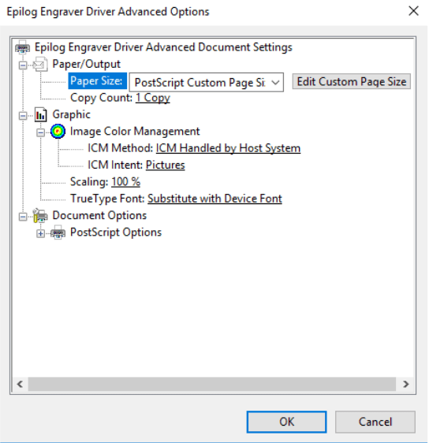
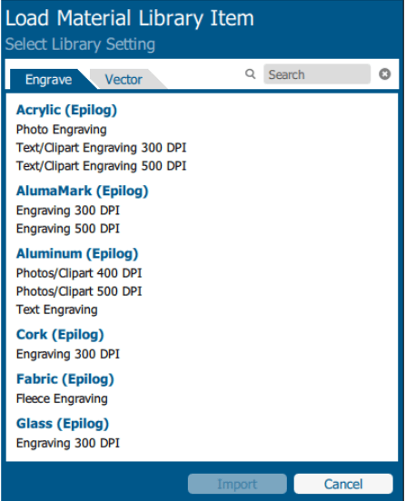
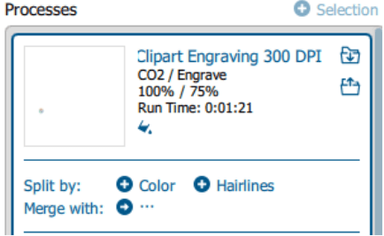

# Epliog Fusion Pro 48

<!-- Compleation Badge

Done - https://img.shields.io/badge/progress-done!-success?style=flat-square
Pending - https://img.shields.io/badge/progress-pending%20completion-yellow?style=flat-square
Halted - https://img.shields.io/badge/progress-halted-critical?style=flat-square
Constantly Updating - https://img.shields.io/badge/progress-constantly%20updating-informational?style=flat-square
-->

## Machine Manual

    <iframe src="https://drive.google.com/file/d/1Uh_irO-Hn7QCUaXMZCdzbgddoy2A34wz/preview" width="100%" height="480px" allow="autoplay"></iframe>

## Machine Workflow

**Written by [Kai Vincent](https://fabacademy.org/2019/labs/charlotte/students/kai-vincent/) (a colleague of mine) and I in 2020**

### Importing Files from CorelDRAW to Epilog Dashboard, and preparing for the printer-

- Open your .CDR file in CorelDRAW on the pc connected to the Fusion Pro
- Print your file using Ctrl + P
- Select Epilog Engraver under the Printer options 
- Select “Use printer default (Custom, Landscape)” under the Page options

{width="90%"}

- Check your Preferences by going on to     
Preferences < Advanced < Paper Size has to pe “PostScript Custom Page Size”

{width="50%"}

Then Click ok until your back to the Print page

- Click on the Color tab at the top of the Print page
- Set the Color to RGB

{width="50%"}

- Click on the PostScript tab at the top of the Print page
- Make sure that “Convert True Type to Type 1” is NOT checked

{width="50%"}

- Click Apply on the bottom of the Print page
- Click Print on the bottom of the Print page, this will pull up the Epilog Dashboard with your file 
- Before doing anything else, properly align the Two integrated FusionPro cameras by selecting the on machines Touch Interface (see Icons on the FusionPro Touch Interface) NOTE: The camera video feed will not appear accurately if the machine is not focused for the material on the bed. This is a critical step for EVERY single print job.

- Jog < Then Jog the machines lens to somewhere on your material

{width="200"}

        
- Click the Auto Focus button and wait until the FusionPro is done
- Then Click the Park Axis Button 
- If your design isn't centered/positioned how you want it to be, Click on your design and drag and drop in into the correct position (you will have video feed coming in from the FusionPro to help with design placement)

{width="90%"}

- Alternatively, while you have your design selected, you can use the blue bar on the left of the window to position your design using X & Y values in correspondence to a point on the workplane
- Here you can also rotate and scale your design to fit your needs
- Go to the Right side of the window
- As long as you have jogged and focused using the machine’s touchscreen, you can turn off Auto Focus in the Epilog Dashboard menu.

### Setting up your Material settings -

- Select your Material and Put in into the FusionPro
- On the Right side of the window under the Auto Focus tab, you have your Processes
- Make sure your Processes view is set to combined, unless planning on just Vectoring or just Engraving
- Click on the Process you intend on cutting
 -Under Process Type, Select Engrave or Vector depending on which you intend that process to be (the Off Process Type can be used in that specific process does not need to be sent to the printer, this is just like clicking “don’t print” in corel)
- Next, Click the file folder with the down arrow next to the Process name, to Import the Material Settings

{width="40%"}

- Find the Right Material and Resolution, Click it, and It will be used on that Process

{width="47.5%"}
{width="47%"}

- Alternatively, you can Color Map your design by clicking on the process you want to Color Map, and then selecting Color under the Split By setting

{width="40%"}

- Then Repeat all steps under the “Setting up your Material settings” for any remaining Processes

### Sending Prints to Job Manager and the FusionPro-

- At the very top of the Epilog Dashboard, you can select how the FusionPro is connected
- If the FusionPro is plugged into the PC via a USB cord, you can select USB Connection
- If Not, or if having problems with wired connection, select Web Connection under the same dropdown
- Under that bar you have the ability to change the file name before you send it to the laser, if wanted
- When your File is Prepared, and your Material settings are correct, click “Send to JM” and then “Print” in the bottom left hand corner, this will send the File from Dashboard to Job Manager, save your settings in Job Manager, and then to the FusionPro

### Icons on the FusionPro Touch Interface-

{width="90%"}

### Starting your Cut on the FusionPro-

- If you are ever in doubt of where the FusionPro is going to cut your design, click the Trace icon on the Touch Interface and the laser will trace an outline of the area of the work surface
- Check to Make sure that all Blower switches are on before proceeding
- Check to make sure that your material is aligned correctly
 -On the Touch Interface, click on the job menu, and then select your Print (the most recent file is always at the top) the file chosen will be highlighted in blue
- Then click the Play button to the left of the joystick to start your print
- The FusionPro will show all of your settings set on the Touch Interface, as well as a ETA while printing

### FusionPro Safety Precautions-

- Check to Make sure that all Blower switches are on before proceeding with your print
- Stay with the laser, Never operate the laser system while unattended
- Use Air Assist, Always use the system’s Air Assist feature when vector cutting. Ensure that the sweep air assist (the air assist that comes out of the metal nozzle next to the laser) is always on for all vector cuts. The small switch over the nozzle should be facing the front of the machine for the air assist to be on

{width="47.2%"}
{width="47%"}

- If you are ever in doubt of where the FusionPro is going to cut your design, click the Trace icon on the Touch Interface and the laser will trace an outline of the area of the work surface
- Clean the laser. A buildup of cutting and engraving residue and debris is dangerous and can create a fire hazard in its own right
- **DO NOT** Run the Laser Unvented Never operate the machine without a properly operating vent to the outside or to a filtration unit, Most material will only produce an irritating smoke when engraved Some materials, including but not limited to paint, varnish, composition board and plastics, produce compounds that can be harmful if concentrated
- Never engrave or cut any material containing PVC or Vinyl
- There is a red button above the FusionPro Touch Interface labeled Emergency Stop that should be pressed if any Hazards or Errors occur during the operation of the laser

|Term |  Definition         |  |
|---|-----------------------|---------|
| Focus |The distance between the lens that focuses the laser beam and the position where the beam has its smallest diameter. It is where the beam has its highest concentration of energy. |[Source](https://www.spilasers.com/application-cutting/laser-cutting-a-definition-and-jargon-buster/)|
| Power |The laser output/ how intense the laser is per unit area (1-100), frequently measured by watts per square centimeter (W/cm^2) |[Source](https://www.spilasers.com/application-cutting/laser-cutting-a-definition-and-jargon-buster/)| 
| Speed |The rate at which the laser moves. Depending on the material settings, the laser may be required to move slowly for thicker materials while other materials like cardboard can be easily cut at high speed. |[Source](https://makerfreedom.com/laser-cutter-speed-vs-power-find-the-perfect-settings/)|
| Rate  |Cutting rate (also known as production rate) is the rate at which is the frequency of the laser hitting the material. Some materials (like wood or cardboard) require low frequencies while others (such as acrylic) require higher cutting rates.    |[Source](https://en.wikipedia.org/wiki/Laser_cutting#Production_and_cutting_rates)|
| Kerf  |The width of the cutting area or the laser. Its properties are dependent on the laser properties, the thickness of the workpiece, and the type of material being used, and the width ranges from around .08mm to 1mm. In other words, this is the amount of material that the laser burns away. |[Source](http://www.cutlasercut.com/resources/tips-and-advice/what-is-laser-kerf)|

|Operation |  1/8" Plywood  | 1/8" Cardboard |
|---|-----------------------|---------|
| Focus | 0.456 mm | 0.396 mm |
| Power | 100% | 70% | 
| Speed | 50% | 65% |
| Rate  | 85% | 85% |
| Kerf (When Focused)  | 0.05" | 0.05" |
