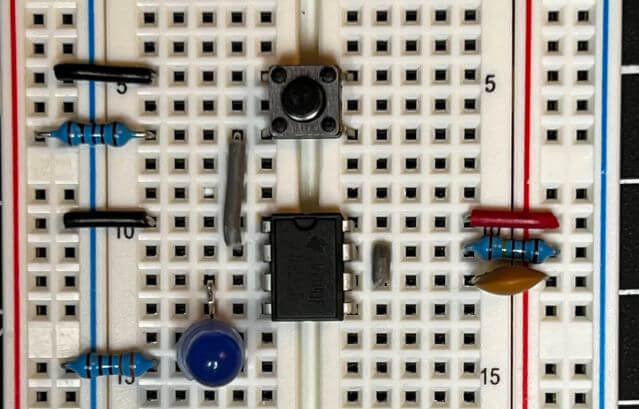
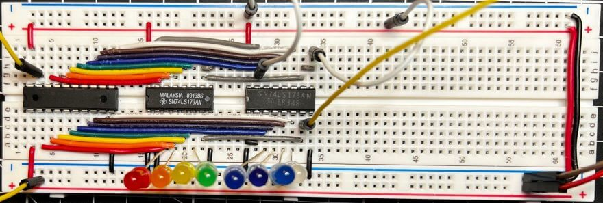
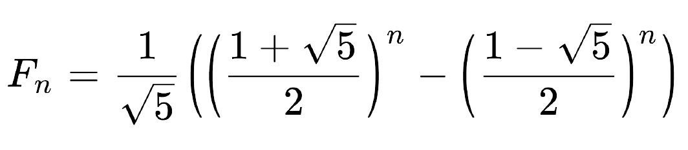

<head>
  <meta charset="UTF-8">
  <meta name="viewport" content="width=device-width, initial-scale=1.0">
  
  <!-- Primary Meta Tags -->
  <meta name="title" content="8-bit Breadboard Computer - Teddy Warner">
  <meta name="description" content="A dive into computer logic and processor workings through building an 8-bit computer from scratch using breadboards and basic logic gates. Based on Ben Eater's design.">
  <meta name="keywords" content="8-bit computer, Breadboard computer, Computer logic, Digital electronics, Ben Eater, Logic gates, Computer architecture, Digital circuits, Hardware engineering, Electronics projects, DIY computer, Processor design, Digital logic, Computer engineering, Hardware development">
  <meta name="author" content="Teddy Warner">
  <meta name="robots" content="index, follow">
  
  <!-- Open Graph / Facebook -->
  <meta property="og:type" content="website">
  <meta property="og:url" content="https://teddywarner.org/Projects/8-bit/">
  <meta property="og:title" content="8-bit Breadboard Computer - Teddy Warner">
  <meta property="og:description" content="A dive into computer logic, and processor workings.">
  <meta property="og:image" content="https://teddywarner.org/assets/images/thumb.png">
  <meta property="og:image:type" content="image/png">
  <meta property="og:image:width" content="1200">
  <meta property="og:image:height" content="630">

  <!-- Twitter -->
  <meta property="twitter:card" content="summary_large_image">
  <meta property="twitter:url" content="https://teddywarner.org/Projects/8-bit/">
  <meta property="twitter:title" content="8-bit Breadboard Computer - Teddy Warner">
  <meta property="twitter:description" content="A dive into computer logic, and processor workings.">
  <meta property="twitter:image" content="https://teddywarner.org/assets/images/thumb.png">

  <!-- Existing resource links -->
  
  <link rel="preconnect" href="https://fonts.googleapis.com">
  <link rel="preconnect" href="https://fonts.gstatic.com" crossorigin>
  <link href="https://fonts.googleapis.com/css2?family=Crimson+Pro:ital,wght@0,200..900;1,200..900&display=swap" rel="stylesheet">
  <link href="https://fonts.googleapis.com/css2?family=Crimson+Pro:ital,wght@0,200..900;1,200..900&family=JetBrains+Mono:ital,wght@0,100..800;1,100..800&display=swap" rel="stylesheet">
  <link rel="stylesheet" href="../../assets/css/projects/project.css">
  <link rel="stylesheet" href="../../assets/css/header.css">

  
</head>

  <nav class="main-navigation">
    <ul>
      <li><a class="home" href="https://teddywarner.com">01 Home</a></li>
      <li><a class="proj" href="https://teddywarner.com/proj/">02 Projects</a></li>
      <li><a class="writ" href="https://teddywarner.com/writ/">03 Writing</a></li>
    </ul>
  </nav>
  
  

  

<a href="https://teddywarner.org/proj"><i class="fa-solid fa-arrow-left-long"></i> Project Feed</a>

# 8-bit Breadboard Computer - Build Log

  <a href="https://x.com/WarnerTeddy"> Teddy Warner</a>| 2021-2022 | <i class="far fa-clock"></i> X-X minutes
  
  <a class="fb" title="Share on Facebook" href="https://www.facebook.com/sharer/sharer.php?u=https://teddywarner.org/Projects/8-bit/"><i class="fa-brands fa-facebook"></i></a>
  <a class="twitter" title="Share on Twitter" href="https://twitter.com/intent/tweet?url=https://teddywarner.org/Projects/8-bit/&text=Check%20Out%20the%208-bit%20Breadboard%20Computer%20(Ben%20Eater%20Build%20Log)%20on"><i class="fa-brands fa-x-twitter"></i></a>
  <a class="pin" title="Share on Pinterest" href="https://pinterest.com/pin/create/button/?url=https://teddywarner.org/Projects/8-bit/&media=&description=Check%20Out%20the%208-bit%20Breadboard%20Computer%20(Ben%20Eater%20Build%20Log)%20on%20https://teddywarner.org/Projects/8-bit/%20!"><i class="fa-brands fa-pinterest"></i></a>
  <a class="ln" title="Share on LinkedIn" href="https://www.linkedin.com/shareArticle?mini=true&url=https://teddywarner.org/Projects/8-bit/"><i class="fab fa-linkedin"></i></a>
  <a class="email" title="Share via Email" href="mailto:info@example.com?&subject=&cc=&bcc=&body=Check%20Out%20the%208-bit%20Breadboard%20Computer%20(Ben%20Eater%20Build%20Log)%20on%20https://teddywarner.org/Projects/8-bit/%20!"><i class="fa-solid fa-paper-plane"></i></a>
  

---

I've used microcontrollers in most of my past projects. IC data sheets are super helpful in board design with their pinouts, but I've noticed much of the contents have been pretty foreign to me. Every once in a while, the youtube algorithm recommended one of [Ben Eater's](https://eater.net) computer concept videos to me, which provide a great explanation of the simplistic logic and proofs in computers. I ended up watching his entire [8-bit Breadboard Computer](https://eater.net/8bit) series (embedded below) over the fall of 2021, to try to get a bit of a better idea of the workings of a microcontroller. The computer is an "as simple as possible"[^1] take on an 8-bit computer, using only simple logic to create an 8-bit computer on breadboards. The computer is built-in sectioned modules and then interfaced together, making each section a bit easier to swallow.

!!! abstract "Documentation Style"

    This page is a bit different than my other project pages, as it is a build log for my take on this [8-bit Breadboard Computer](https://eater.net/8bit). Instead of outlining project development (as Mr. Eaters' videos do an amazing job with that), this page will be a collection of media behind each of my computer modules, as well as some final programs ran on the computer.

<iframe loading=lazy width="100%" height="450" src="https://www.youtube.com/embed/videoseries?list=PLowKtXNTBypGqImE405J2565dvjafglHU" title="YouTube video player" frameborder="0" allow="autoplay; encrypted-media" allowfullscreen></iframe>

<figure markdown="1">

## Bill of Materials

|Qty.|Description                                                                                                                                                                           ||Cost  |URL                                                                                                                                                                                                                                                                                                                                                                                            |
|----|--------------------------------------------------------------------------------------------------------------------------------------------------------------------------------------||------|-----------------------------------------------------------------------------------------------------------------------------------------------------------------------------------------------------------------------------------------------------------------------------------------------------------------------------------------------------------------------------------------------|
|14  |Breadboard                                                                                                                                                                            ||$112  |[link](https://www.amazon.com/gp/product/B0040Z4QN8/ref=as_li_tl?ie=UTF8&tag=beneater-20&camp=1789&creative=9325&linkCode=as2&creativeASIN=B0040Z4QN8&linkId=32ebed06d70737d48f7dff50892868b2)                                                                                                                                                                                                 |
|10  |1kΩ resistor                                                                                                                                                                          ||      |:material-arrow-down-thin:                                                                                                                                                                                                                                                                                                                                                                     |
|9   |10kΩ resistor                                                                                                                                                                         ||      |:material-arrow-down-thin:                                                                                                                                                                                                                                                                                                                                                                     |
|1   |100kΩ resistor                                                                                                                                                                        ||      |:material-arrow-down-thin:                                                                                                                                                                                                                                                                                                                                                                     |
|24  |470Ω resistor                                                                                                                                                                         ||      |:material-arrow-down-thin:                                                                                                                                                                                                                                                                                                                                                                     |
|1   |1MΩ resistor                                                                                                                                                                          ||$16.99|[link](https://www.amazon.com/gp/product/B00E3JGGF2/ref=as_li_tl?ie=UTF8&tag=beneater-20&camp=1789&creative=9325&linkCode=as2&creativeASIN=B00E3JGGF2&linkId=37bccc3872a0e7c701200d3f8a46f841)                                                                                                                                                                                                 |
|1   |1MΩ potentiometer                                                                                                                                                                     ||$1.39 |[link](https://www.jameco.com/webapp/wcs/stores/servlet/ProductDisplay?storeId=10001&langId=-1&catalogId=10001&productId=2161422&avad=234285_b24a928cd&source=Avantlink)                                                                                                                                                                                                                       |
|6   |0.01µF capacitor                                                                                                                                                                      ||$1.20 |[link](https://www.jameco.com/webapp/wcs/stores/servlet/ProductDisplay?storeId=10001&langId=-1&catalogId=10001&productId=15229&avad=234285_e24a83cb1&source=Avantlink)                                                                                                                                                                                                                         |
|16  |0.1µF capacitor                                                                                                                                                                       ||$3.00 |[link](https://www.jameco.com/webapp/wcs/stores/servlet/ProductDisplay?storeId=10001&langId=-1&catalogId=10001&productId=151116&avad=234285_f24a7e1b9&source=Avantlink)                                                                                                                                                                                                                        |
|1   |1µF capacitor                                                                                                                                                                         ||$0.15 |[link](https://www.jameco.com/webapp/wcs/stores/servlet/ProductDisplay?storeId=10001&langId=-1&catalogId=10001&productId=330431&avad=234285_c24a8fac5&source=Avantlink)                                                                                                                                                                                                                        |
|4   |555 timer IC                                                                                                                                                                          ||$0.63 |[link](https://www.aliexpress.com/item/32823042746.html?spm=a2g0o.productlist.0.0.2786782fopOSRM&algo_pvid=96d0349a-68b7-4336-988d-4738811be810&algo_exp_id=96d0349a-68b7-4336-988d-4738811be810-0&pdp_ext_f=%7B%22sku_id%22%3A%2264903037377%22%7D)                                                                                                                                           |
|2   |74LS00 (Quad NAND gate)                                                                                                                                                               ||$0.76 |[link](https://www.aliexpress.com/item/1005003103565042.html?spm=a2g0o.productlist.0.0.3a184f8baiaLU3&algo_pvid=07ae07c6-5f66-4969-989e-1b63359f0b36&algo_exp_id=07ae07c6-5f66-4969-989e-1b63359f0b36-0&pdp_ext_f=%7B%22sku_id%22%3A%2212000024102730486%22%7D)                                                                                                                                |
|1   |74LS02 (Quad NOR gate)                                                                                                                                                                ||$0.76 |[link](https://www.aliexpress.com/item/1005003103565042.html?spm=a2g0o.productlist.0.0.3a184f8baiaLU3&algo_pvid=07ae07c6-5f66-4969-989e-1b63359f0b36&algo_exp_id=07ae07c6-5f66-4969-989e-1b63359f0b36-0&pdp_ext_f=%7B%22sku_id%22%3A%2212000024102730486%22%7D)                                                                                                                                |
|5   |74LS04 (Hex inverter)                                                                                                                                                                 ||$0.87 |[link](https://www.aliexpress.com/item/1005003103565042.html?spm=a2g0o.productlist.0.0.3a184f8baiaLU3&algo_pvid=07ae07c6-5f66-4969-989e-1b63359f0b36&algo_exp_id=07ae07c6-5f66-4969-989e-1b63359f0b36-0&pdp_ext_f=%7B%22sku_id%22%3A%2212000024102730486%22%7D)                                                                                                                                |
|3   |74LS08 (Quad AND gate)                                                                                                                                                                ||$0.72 |[link](https://www.aliexpress.com/item/1005003103565042.html?spm=a2g0o.cart.0.0.faec3c00RQNoMs&mp=1)                                                                                                                                                                                                                                                                                           |
|1   |74LS32 (Quad OR gate)                                                                                                                                                                 ||$0.89 |[link](https://www.aliexpress.com/item/1005003103565042.html?spm=a2g0o.cart.0.0.faec3c00RQNoMs&mp=1)                                                                                                                                                                                                                                                                                           |
|1   |74LS107 (Dual JK flip-flop) Note: The videos use the 74LS76 which is extremely difficult to find. The 74LS107 is functionally equivalent but be careful: it has a different pinout.||$1.58 |[link](https://www.aliexpress.com/item/32837207073.html?spm=a2g0o.productlist.0.0.207015cbIMimMw&algo_pvid=c81f15db-70af-4c8a-b7f0-f3ad2aefd724&algo_exp_id=c81f15db-70af-4c8a-b7f0-f3ad2aefd724-0&pdp_ext_f=%7B%22sku_id%22%3A%2212000021439605652%22%7D)                                                                                                                                     |
|2   |74LS86 (Quad XOR gate)                                                                                                                                                                ||$1.11 |[link](https://www.aliexpress.com/item/1005003103565042.html?spm=a2g0o.cart.0.0.faec3c00RQNoMs&mp=1)                                                                                                                                                                                                                                                                                           |
|1   |74LS138 (3-to-8 line decoder)                                                                                                                                                         ||$0.80 |[link](https://www.aliexpress.com/item/1005003102981081.html?spm=a2g0o.productlist.0.0.7d5673d7KhGF0Y&algo_pvid=c8b19dec-d621-4c22-9ff8-5dee7269a3cb&algo_exp_id=c8b19dec-d621-4c22-9ff8-5dee7269a3cb-0&pdp_ext_f=%7B%22sku_id%22%3A%2212000024100200959%22%7D)                                                                                                                                |
|1   |74LS139 (Dual 2-line to 4-line decoder)                                                                                                                                               ||$1.55 |[link](https://www.aliexpress.com/item/32835244421.html?spm=a2g0o.productlist.0.0.3122402fsGGTYE&algo_pvid=3748f071-9375-479f-b6c5-85001b10ac54&algo_exp_id=3748f071-9375-479f-b6c5-85001b10ac54-0&pdp_ext_f=%7B%22sku_id%22%3A%2265146220182%22%7D)                                                                                                                                           |
|4   |74LS157 (Quad 2-to-1 line data selector)                                                                                                                                              ||$1.58 |[link](http://link/)                                                                                                                                                                                                                                                                                                                                                                           |
|2   |74LS161 (4-bit synchronous binary counter)                                                                                                                                            ||$1.95 |[link](https://www.aliexpress.com/item/33020267124.html?spm=a2g0o.productlist.0.0.1677721es4x1SK&algo_pvid=d2780b90-5738-4546-b5de-5d6bb2d811c9&algo_exp_id=d2780b90-5738-4546-b5de-5d6bb2d811c9-1&pdp_ext_f=%7B%22sku_id%22%3A%2212000021439709306%22%7D)                                                                                                                                     |
|8   |74LS173 (4-bit D-type register)                                                                                                                                                       ||$1.45 |[link](https://www.aliexpress.com/item/33018650807.html?spm=a2g0o.productlist.0.0.14e742d1pRCGVb&algo_pvid=8a07540f-898b-486a-8838-56f791cd0250&algo_exp_id=8a07540f-898b-486a-8838-56f791cd0250-1&pdp_ext_f=%7B%22sku_id%22%3A%2267178993411%22%7D)                                                                                                                                           |
|2   |74189 (64-bit random access memory)                                                                                                                                                   ||$9.90 |[link](https://www.jameco.com/webapp/wcs/stores/servlet/ProductDisplay?storeId=10001&langId=-1&catalogId=10001&productId=49883&avad=234285_e24a84fe5&source=Avantlink)                                                                                                                                                                                                                         |
|6   |74LS245 (Octal bus transceiver)                                                                                                                                                       ||$1.26 |[link](https://www.aliexpress.com/item/1005001437010289.html?spm=a2g0o.productlist.0.0.2a9464edzJi9rC&algo_pvid=8b6dcbac-4a44-40e8-9cf1-13b00ce0ea20&algo_exp_id=8b6dcbac-4a44-40e8-9cf1-13b00ce0ea20-1&pdp_ext_f=%7B%22sku_id%22%3A%2212000016109356828%22%7D)                                                                                                                                |
|1   |74LS273 (Octal D flip-flop)                                                                                                                                                           ||$1.99 |[link](https://www.aliexpress.com/item/32904754683.html?spm=a2g0o.productlist.0.0.103f6a156A0dsq&algo_pvid=a4d9d0cb-9b2a-49b2-aad8-2dc4b3f1ecc3&algo_exp_id=a4d9d0cb-9b2a-49b2-aad8-2dc4b3f1ecc3-1&pdp_ext_f=%7B%22sku_id%22%3A%2265797111425%22%7D)                                                                                                                                           |
|2   |74LS283 (4-bit binary full adder)                                                                                                                                                     ||$1.38 |[link](https://www.aliexpress.com/item/32903704766.html?spm=a2g0o.productlist.0.0.5be92163FIwyiz&algo_pvid=4123097d-3bbb-4234-b315-ca930c2e2f42&algo_exp_id=4123097d-3bbb-4234-b315-ca930c2e2f42-0&pdp_ext_f=%7B%22sku_id%22%3A%2212000021439617925%22%7D)                                                                                                                                     |
|3   |28C16 EEPROM                                                                                                                                                                          ||$11.85|[link](https://www.jameco.com/webapp/wcs/stores/servlet/ProductDisplay?storeId=10001&langId=-1&catalogId=10001&productId=74691&avad=234285_b24a93fbd&source=Avantlink)                                                                                                                                                                                                                         |
|3   |Double-throw toggle switch                                                                                                                                                            ||$2.97 |[link](https://www.jameco.com/webapp/wcs/stores/servlet/ProductDisplay?history=&catalogId=10001&langId=-1&freeText=2258831&storeId=10001&productId=2258831&avad=234285_f24a7f961&source=Avantlink)                                                                                                                                                                                             |
|3   |Momentary 6mm tact switch                                                                                                                                                             ||$1.05 |[link](https://www.jameco.com/webapp/wcs/stores/servlet/ProductDisplay?storeId=10001&langId=-1&catalogId=10001&productId=149948&avad=234285_b24a94221&source=Avantlink)                                                                                                                                                                                                                        |
|1   |8-position DIP switch                                                                                                                                                                 ||$0.79 |[link](https://www.jameco.com/webapp/wcs/stores/servlet/ProductDisplay?storeId=10001&langId=-1&catalogId=10001&productId=38842&avad=234285_f24a7fa49&source=Avantlink)                                                                                                                                                                                                                         |
|1   |4-position DIP switch                                                                                                                                                                 ||$0.79 |[link](https://www.jameco.com/webapp/wcs/stores/servlet/ProductDisplay?storeId=10001&langId=-1&catalogId=10001&productId=38820&avad=234285_e24a855bd&source=Avantlink)                                                                                                                                                                                                                         |
|44  |Red LED                                                                                                                                                                               ||      |:material-arrow-down-thin:                                                                                                                                                                                                                                                                                                                                                                     |
|8   |Yellow LED                                                                                                                                                                            ||      |:material-arrow-down-thin:                                                                                                                                                                                                                                                                                                                                                                     |
|12  |Green LED                                                                                                                                                                             ||      |:material-arrow-down-thin:                                                                                                                                                                                                                                                                                                                                                                     |
|21  |Blue LED                                                                                                                                                                              ||$12.99|[link](https://www.amazon.com/DiCUNO-450pcs-Colors-Emitting-Assorted/dp/B073QMYKDM/ref=sr_1_7?dchild=1&keywords=5mm+LED+pack&qid=1635892042&qsid=143-4488646-5725765&sr=8-7&sres=B07T8H6V37%2CB07PG84V17%2CB07N2H23DC%2CB086JM3WMM%2CB073QMYKDM%2CB01AKPKC84%2CB01AUI4VSI%2CB07PVVL2S6%2CB06XPV4CSH%2CB093GL1FFH%2CB01LX8JVG7%2CB01C3ZZT2I%2CB08L5T37N8%2CB08ZXK5WMZ%2CB07WNMNS9P%2CB097RMK592)|
|4   |Common cathode 7-segment display                                                                                                                                                      ||$4.36 |[link](https://www.jameco.com/z/UA5651-11-R-Jameco-Valuepro-LED-Display-7-Segment-Red-0-56-Inch-Common-Anode-RHDP-0-8mcd_335090.html?CID=MERCH)                                                                                                                                                                                                                                                |
|1   |22 AWG Solid Tinned-Copper Hook-Up Wire                                                                                                                                               ||$29.95|[link](https://www.adafruit.com/product/3174?gclid=Cj0KCQjww4OMBhCUARIsAILndv4TcRmMF-8TiYvh74DqYKzl6-iRXDQZRWgg_geBEG7LG3p2uWDhGiQaAlhYEALw_wcB)                                                                                                                                                                                                                                               |

--- Total Cost - **$228.66** ---
</figure>

## Clock Module

<iframe loading=lazy src="https://drive.google.com/file/d/1-FyllkfmhpjOUVsky30Y7QNn7lpM8d4w/preview" width="100%" height="480" allow="autoplay"></iframe>

<figure markdown="1">
{ width="80%" alt="Setup of astable  circuit"}
</figure>

<iframe loading=lazy width="100%" height="450" src="https://www.youtube.com/embed/HKCb6LxuJ04" title="YouTube video player" frameborder="0" allow="autoplay; encrypted-media" allowfullscreen></iframe>

<figure markdown="1">
{ width="100%" alt="Oscilloscope display showing clock vs capacitor waveforms"}
  <figcaption>Clock vs Capacitor</figcaption>
</figure>

<figure markdown="1">
{ width="80%" alt="Variable astable multivibrator circuit setup"}
</figure>

<iframe loading=lazy width="100%" height="450" src="https://www.youtube.com/embed/gXsm1pPk73Y" title="YouTube video player" frameborder="0" allow="autoplay; encrypted-media" allowfullscreen></iframe>

<figure markdown="1">
{ width="80%" alt="Monostable multivibrator circuit setup"}
</figure>

<iframe loading=lazy width="100%" height="450" src="https://www.youtube.com/embed/oZreQbS1mkw" title="YouTube video player" frameborder="0" allow="autoplay; encrypted-media" allowfullscreen></iframe>

<iframe loading=lazy src="https://drive.google.com/file/d/1Oac8LGzgeLtf9SuPbXrGJICCNPeRC6Yi/preview" width="100%" height="480" allow="autoplay"></iframe>

<iframe loading=lazy src="https://drive.google.com/file/d/1v-PXHRJIt_JFhhysesvn4DHJBXGagMT8/preview" width="100%" height="480" allow="autoplay"></iframe>

<iframe loading=lazy src="https://drive.google.com/file/d/1-R9MkHobL7_UnY4A5ClBVB-B3Wk5GqkO/preview" width="100%" height="480" allow="autoplay"></iframe>

<figure markdown="1">
{ width="100%" alt="Completed clock module assembly"}
</figure>

<iframe loading=lazy width="100%" height="450" src="https://www.youtube.com/embed/Hz7vxBx9ODE" title="YouTube video player" frameborder="0" allow="autoplay; encrypted-media" allowfullscreen></iframe>

## Registers

<iframe loading=lazy src="https://drive.google.com/file/d/1uJpgZQP0e2EXK5hfRB6coKhc2ShjMrcj/preview" width="100%" height="480" allow="autoplay"></iframe>

<iframe loading=lazy src="https://drive.google.com/file/d/1n3osGqqPa9fuIrJvKPaofTcG2bQKnvha/preview" width="100%" height="480" allow="autoplay"></iframe>

<figure markdown="1">
{ width="100%" alt="8-bit register module assembly"}
</figure>

<iframe loading=lazy width="100%" height="450" src="https://www.youtube.com/embed/2IVVtewC8cs" title="YouTube video player" frameborder="0" allow="autoplay; encrypted-media" allowfullscreen></iframe>

<iframe loading=lazy width="100%" height="450" src="https://www.youtube.com/embed/qDIzbADgvDE" title="YouTube video player" frameborder="0" allow="autoplay; encrypted-media" allowfullscreen></iframe>

## Arithmetic Logic Unit (ALU)

<iframe loading=lazy src="https://drive.google.com/file/d/1fDhpvg5gEuUKsYtYsU6lxuNsiWBIBEjm/preview" width="100%" height="480" allow="autoplay"></iframe>

<iframe loading=lazy src="https://drive.google.com/file/d/1Oe01zt6FAccC8DMF8wXAVJUvqXoZCyE6/preview" width="100%" height="480" allow="autoplay"></iframe>

<iframe loading=lazy src="https://drive.google.com/file/d/1KcwJAkapqJXq_c77yfLfU5jG_NE3ln8Y/preview" width="100%" height="480" allow="autoplay"></iframe>

## Random Access Memory Module (RAM)

<iframe loading=lazy src="https://drive.google.com/file/d/1Zz5f_ewaGAkknyZdfxSy3q6TZO5UZlBy/preview" width="100%" height="480" allow="autoplay"></iframe>

<iframe loading=lazy src="https://drive.google.com/file/d/15Va5pgG0nNBNrbOHh1z8KNSZW08ksQ_h/preview" width="100%" height="480" allow="autoplay"></iframe>

<iframe loading=lazy src="https://drive.google.com/file/d/1sCDVjSXc1LlmeylG8YtIt1QfR0yr3EoV/preview" width="100%" height="480" allow="autoplay"></iframe>

## Program Counter

<iframe loading=lazy src="https://drive.google.com/file/d/1rPiMCjodmKJnFNQy5eRH-btih6BPmHsX/preview" width="100%" height="480" allow="autoplay"></iframe>

## Output Register

<iframe loading=lazy src="https://drive.google.com/file/d/1A3FqvTOU6llJ6SaJntDV3CHkvV7lSEYa/preview" width="100%" height="480" allow="autoplay"></iframe>

<iframe loading=lazy src="https://drive.google.com/file/d/1taC9UxK-zJkyK4z_zXrvudsRHVezncjc/preview" width="100%" height="480" allow="autoplay"></iframe>

<iframe loading=lazy src="https://drive.google.com/file/d/17Ukjvyc5lZlTp-99clvhrcItOpABu2YB/preview" width="100%" height="480" allow="autoplay"></iframe>

<iframe loading=lazy src="https://drive.google.com/file/d/1MbF2w-6krd2oQ-XTgWfJeP68hqdEirVI/preview" width="100%" height="480" allow="autoplay"></iframe>

## Module Meshing

## CPU Control Logic

### Fibonacci Sequence

<iframe loading=lazy width="100%" height="500" src="https://www.youtube.com/embed/1Jj-sJ78O6M" title="YouTube video player" frameborder="0" allow="autoplay; encrypted-media" allowfullscreen></iframe>

<figure markdown="1">
{ width="60%" alt="Visual representation of Fibonacci sequence spiral"}
</figure>

<figure markdown="1">
{ width="80%" alt="Mathematical equation for Fibonacci sequence"}
</figure>

<figure markdown="1">
**First 12 Numberes in the Fibonacci Sequence**

| n  | Fibonacci Number |
|----|------------------|
| 0  | 0                |
| 1  | 1                |
| 2  | 1                |
| 3  | 2                |
| 4  | 3                |
| 5  | 5                |
| 6  | 8                |
| 7  | 13               |
| 8  | 21               |
| 9  | 34               |
| 10 | 55               |
| 11 | 89               |
</figure>

[^1]: https://eater.net/8bit

*[FDM]: Fused Deposition Modeling
*[CNC]: Computerized Numerical Control
*[MPCNC]: Mostly Printed Computerized Numerical Control - https://docs.v1engineering.com/mpcnc/intro/
*[SSH]: Secure Shell
*[GPIO]: General-Purpose Input/Output
*[USB]: Universal Serial Bus
*[ETA]: Estimated Time of Arrival
*[ISO]: International Organization for Standardization
*[UPDI]: Unified Program and Debug Interface
*[AVR]: A Family of microcontrollers developed since 1996 by Atmel
*[JTAG]: Joint Test Action Group
*[IDE]: Integrated Development Environment
*[Rx]: Receiving Signal
*[Tx]: Transmitting Signal
*[VCC]: Voltage Common Collector (+)
*[GND]: Ground / Common Drain (-)
*[IC]: Integrated Circuit
*[LED]: Light-Emitting Diode
*[Cap]: Capacitor
*[SPST]: Single Pole Single Throw Switch
*[SPDT]: Single Pole Double Throw Switch
*[DPST]: Double Pole Single Throw Switch
*[DPDT]: Double Pole Double Throw Switch
*[EEPROM]: Electrically Erasable Programmable Read-Only Memory
*[PCB]: Printed Circuit Board
*[PWM]: Pulse Width Modulation
*[SPI]: Serial Peripheral Interface
*[I2C]: Inter-Integrated Circuit
*[UART]: Universal Asynchronous Receiver/Transmitter
*[ADC]: Analog-to-Digital Converter
*[DAC]: Digital-to-Analog Converter
*[MCU]: Microcontroller Unit
*[FPGA]: Field-Programmable Gate Array
*[SLA]: Stereolithography
*[DLP]: Digital Light Processing 
*[SLS]: Selective Laser Sintering
*[PLA]: Polylactic Acid 
*[ABS]: Acrylonitrile Butadiene Styrene 
*[PETG]: Polyethylene Terephthalate Glycol 
*[CAD]: Computer-Aided Design
*[CAM]: Computer-Aided Manufacturing
*[G-code]: A language for controlling CNC machines
*[PID]: Proportional-Integral-Derivative (control loop feedback mechanism)
*[MOSFET]: Metal-Oxide-Semiconductor Field-Effect Transistor
*[BJT]: Bipolar Junction Transistor
*[SMD]: Surface-Mount Device
*[THT]: Through-Hole Technology
*[DIP]: Dual In-line Package
*[ESC]: Electronic Speed Controller
*[BEC]: Battery Eliminator Circuit
*[LiPo]: Lithium Polymer 
*[NiMH]: Nickel-Metal Hydride 
*[EMI]: Electromagnetic Interference
*[ESD]: Electrostatic Discharge