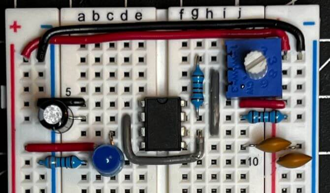

# 8-bit Breadboard Computer - Build Log (Junior Year - 2021)

<!-- Compleation Badge

Done - https://img.shields.io/badge/progress-done!-success?style=flat-square
Pending - https://img.shields.io/badge/progress-pending%20completion-yellow?style=flat-square
Halted - https://img.shields.io/badge/progress-halted-critical?style=flat-square
Constantly Updating - https://img.shields.io/badge/progress-constantly%20updating-informational?style=flat-square
-->

<!--- Social Links

HTML Link Generator - https://www.websiteplanet.com/webtools/sharelink/

<a class="fb" title="Share on Facebook" href="FACEBOOK-URL"><i class="fab fa-facebook-square"></i></a>
<a class="twitter" title="Share on Twitter" href="TWITTER-URL"><i class="fab fa-twitter"></i></a>
<a class="pin" title="Share on Pinterest" href="PINTEREST-URL"><i class="fab fa-pinterest"></i></a>
<a class="ln" title="Share on LinkedIn" href="LINKEDIN-URL"><i class="fab fa-linkedin"></i></a>
<a class="email" title="Share via Email" href="EMAIL-URL"><i class="fas fa-paper-plane"></i></a>

-->

**X-X minutes :material-book-open-page-variant:**

<a class="fb" title="Share on Facebook" href="https://www.facebook.com/sharer/sharer.php?u=https://teddywarner.org/Projects/8-bit/"><i class="fab fa-facebook-square"></i></a>
<a class="twitter" title="Share on Twitter" href="https://twitter.com/intent/tweet?url=https://teddywarner.org/Projects/8-bit/&text=Check%20Out%20the%208-bit%20Breadboard%20Computer%20(Ben%20Eater%20Build%20Log)%20on"><i class="fab fa-twitter"></i></a>
<a class="pin" title="Share on Pinterest" href="https://pinterest.com/pin/create/button/?url=https://teddywarner.org/Projects/8-bit/&media=&description=Check%20Out%20the%208-bit%20Breadboard%20Computer%20(Ben%20Eater%20Build%20Log)%20on%20https://teddywarner.org/Projects/8-bit/%20!"><i class="fab fa-pinterest"></i></a>
<a class="ln" title="Share on LinkedIn" href="https://www.linkedin.com/shareArticle?mini=true&url=https://teddywarner.org/Projects/8-bit/"><i class="fab fa-linkedin"></i></a>
<a class="email" title="Share via Email" href="mailto:info@example.com?&subject=&cc=&bcc=&body=Check%20Out%20the%208-bit%20Breadboard%20Computer%20(Ben%20Eater%20Build%20Log)%20on%20https://teddywarner.org/Projects/8-bit/%20!"><i class="fas fa-paper-plane"></i></a>

I've used microcontrollers in most of my past projects. IC data sheets are super helpful in board design with their pinouts, but I've noticed much of the contents have been pretty foreign to me. Every once in a while, the youtube algorithm recommended one of [Ben Eater's](https://eater.net) computer concept videos to me, which provide a great explanation of the simplistic logic and proofs in computers. I ended up watching his entire [8-bit Breadboard Computer](https://eater.net/8bit) series (embedded below) over the fall of 2021, to try to get a bit of a better idea of the workings of a microcontroller. The computer is an "as simple as possible" take on an 8-bit computer, using only simple logic to create an 8-bit computer on breadboards. The computer is built-in sectioned modules and then interfaced together, making each section a bit easier to swallow.

This page is a bit different than my other project pages, as it is a build log for my take on this [8-bit Breadboard Computer](https://eater.net/8bit). Instead of outlining project development (as Mr. Eaters' videos do an amazing job with that), this page will be a collection of media behind each of my computer modules, as well as some final programs ran on the computer.

<iframe width="100%" height="450" src="https://www.youtube.com/embed/videoseries?list=PLowKtXNTBypGqImE405J2565dvjafglHU" title="YouTube video player" frameborder="0" allow="accelerometer; autoplay; clipboard-write; encrypted-media; gyroscope; picture-in-picture" allowfullscreen></iframe>

## Bill of Materials

<iframe width="100%" height="500" src="https://docs.google.com/spreadsheets/d/e/2PACX-1vSVxIR5ghw9VY7MbgtRnjQO2AxHPF-69OgxBI2QbuQ8tX-gyORepdxhZFWp6qwiHnvjcczT8cA5ACIs/pubhtml?gid=0&amp;single=true&amp;widget=true&amp;headers=false"></iframe>

## Clock Module

<iframe src="https://drive.google.com/file/d/1-FyllkfmhpjOUVsky30Y7QNn7lpM8d4w/preview" width="100%" height="480" allow="autoplay"></iframe>

{ width="80%"}

<iframe width="100%" height="450" src="https://www.youtube.com/embed/HKCb6LxuJ04" title="YouTube video player" frameborder="0" allow="accelerometer; autoplay; clipboard-write; encrypted-media; gyroscope; picture-in-picture" allowfullscreen></iframe>

{ width="100%"}
  <figcaption>Clock vs Capacitor</figcaption>

{ width="80%"}

<iframe width="100%" height="450" src="https://www.youtube.com/embed/gXsm1pPk73Y" title="YouTube video player" frameborder="0" allow="accelerometer; autoplay; clipboard-write; encrypted-media; gyroscope; picture-in-picture" allowfullscreen></iframe>

{ width="80%"}

<iframe width="100%" height="450" src="https://www.youtube.com/embed/oZreQbS1mkw" title="YouTube video player" frameborder="0" allow="accelerometer; autoplay; clipboard-write; encrypted-media; gyroscope; picture-in-picture" allowfullscreen></iframe>

<iframe src="https://drive.google.com/file/d/1Oac8LGzgeLtf9SuPbXrGJICCNPeRC6Yi/preview" width="100%" height="480" allow="autoplay"></iframe>

<iframe src="https://drive.google.com/file/d/1v-PXHRJIt_JFhhysesvn4DHJBXGagMT8/preview" width="100%" height="480" allow="autoplay"></iframe>

<iframe src="https://drive.google.com/file/d/1-R9MkHobL7_UnY4A5ClBVB-B3Wk5GqkO/preview" width="100%" height="480" allow="autoplay"></iframe>

{ width="100%"}

<iframe width="100%" height="450" src="https://www.youtube.com/embed/QxKCNCJNMlg" title="YouTube video player" frameborder="0" allow="accelerometer; autoplay; clipboard-write; encrypted-media; gyroscope; picture-in-picture" allowfullscreen></iframe>

## Registers

<iframe src="https://drive.google.com/file/d/1uJpgZQP0e2EXK5hfRB6coKhc2ShjMrcj/preview" width="100%" height="480" allow="autoplay"></iframe>

<iframe src="https://drive.google.com/file/d/1n3osGqqPa9fuIrJvKPaofTcG2bQKnvha/preview" width="100%" height="480" allow="autoplay"></iframe>

## Arithmetic Logic Unit (ALU)

<iframe src="https://drive.google.com/file/d/1fDhpvg5gEuUKsYtYsU6lxuNsiWBIBEjm/preview" width="100%" height="480" allow="autoplay"></iframe>

<iframe src="https://drive.google.com/file/d/1Oe01zt6FAccC8DMF8wXAVJUvqXoZCyE6/preview" width="100%" height="480" allow="autoplay"></iframe>

<iframe src="https://drive.google.com/file/d/1KcwJAkapqJXq_c77yfLfU5jG_NE3ln8Y/preview" width="100%" height="480" allow="autoplay"></iframe>

## Random Access Memory Module (RAM)

<iframe src="https://drive.google.com/file/d/1Zz5f_ewaGAkknyZdfxSy3q6TZO5UZlBy/preview" width="100%" height="480" allow="autoplay"></iframe>

<iframe src="https://drive.google.com/file/d/15Va5pgG0nNBNrbOHh1z8KNSZW08ksQ_h/preview" width="100%" height="480" allow="autoplay"></iframe>

<iframe src="https://drive.google.com/file/d/1sCDVjSXc1LlmeylG8YtIt1QfR0yr3EoV/preview" width="100%" height="480" allow="autoplay"></iframe>

## Program Counter

<iframe src="https://drive.google.com/file/d/1rPiMCjodmKJnFNQy5eRH-btih6BPmHsX/preview" width="100%" height="480" allow="autoplay"></iframe>

## Output Register

<iframe src="https://drive.google.com/file/d/1A3FqvTOU6llJ6SaJntDV3CHkvV7lSEYa/preview" width="100%" height="480" allow="autoplay"></iframe>

<iframe src="https://drive.google.com/file/d/1taC9UxK-zJkyK4z_zXrvudsRHVezncjc/preview" width="100%" height="480" allow="autoplay"></iframe>

<iframe src="https://drive.google.com/file/d/17Ukjvyc5lZlTp-99clvhrcItOpABu2YB/preview" width="100%" height="480" allow="autoplay"></iframe>

<iframe src="https://drive.google.com/file/d/1MbF2w-6krd2oQ-XTgWfJeP68hqdEirVI/preview" width="100%" height="480" allow="autoplay"></iframe>

## Module Meshing

## CPU Control Logic

### Fibonacci Sequence

<iframe width="100%" height="500" src="https://www.youtube.com/embed/1Jj-sJ78O6M" title="YouTube video player" frameborder="0" allow="accelerometer; autoplay; clipboard-write; encrypted-media; gyroscope; picture-in-picture" allowfullscreen></iframe>

{ width="60%"}

{ width="80%"}

**First 12 Numberes in the Fibonacci Sequence**

| n  | Fibonacci Number |
|----|------------------|
| 0  | 0                |
| 1  | 1                |
| 2  | 1                |
| 3  | 2                |
| 4  | 3                |
| 5  | 5                |
| 6  | 8                |
| 7  | 13               |
| 8  | 21               |
| 9  | 34               |
| 10 | 55               |
| 11 | 89               |

<!-- begin wwww.htmlcommentbox.com -->
 
<a href="http://www.htmlcommentbox.com">Comment Form</a> is loading comments...

 <link rel="stylesheet" type="text/css" href="https://www.htmlcommentbox.com/static/skins/bootstrap/twitter-bootstrap.css?v=0" />
 
<!-- end www.htmlcommentbox.com -->