<head>
  <meta charset="UTF-8">
  <meta name="viewport" content="width=device-width, initial-scale=1.0">

  <script src="https://kit.fontawesome.com/79ff35ecec.js" crossorigin="anonymous"></script>

  <link rel="preconnect" href="https://fonts.googleapis.com">
  <link rel="preconnect" href="https://fonts.gstatic.com" crossorigin>
  <link href="https://fonts.googleapis.com/css2?family=Crimson+Pro:ital,wght@0,200..900;1,200..900&display=swap" rel="stylesheet">
  <link href="https://fonts.googleapis.com/css2?family=Crimson+Pro:ital,wght@0,200..900;1,200..900&family=JetBrains+Mono:ital,wght@0,100..800;1,100..800&display=swap" rel="stylesheet">

  <link rel="stylesheet" href="../../assets/css/projects/project.css">
</head>

  <nav class="main-navigation">
    <ul>
      <li><a class="home" href="http://teddywarner.com"><span class="navnum">01</span> Home</a></li>
      <li><a class="proj" href="http://teddywarner.com/proj/"><span class="navnum">02</span> Projects</a></li>
      <li><a class="writ" href="http://teddywarner.com/writ/"><span class="navnum">03</span> Writing</a></li>
    </ul>
  </nav>

<div class="return2feed"><a href="http://teddywarner.com/proj"><i class="fa-solid fa-arrow-left-long"></i> Project Feed</a></div>


# Adaptable Aquaponics

<div style="margin-top: -0.8em;">
  <span class="abtlinks"><a href="https://x.com/WarnerTeddy"><span class="abt" id="name"> Teddy Warner</a><span class="abt" style="font-weight: 300; padding-left: 6px;"><span class="year">| Summer, 2022 </span>| <span class="readTime"><i class="far fa-clock"></i> 18-23 minutes</span></span></span></span>
  <span class="share" style=" color: inherit;">
  <a class="fb" title="Share on Facebook" href="https://www.facebook.com/sharer/sharer.php?u=https://teddywarner.org/Projects/AdaptableAquaponics/"><i class="fa-brands fa-facebook"></i></a>
  <a class="twitter" title="Share on Twitter" href="https://twitter.com/intent/tweet?url=https://teddywarner.org/Projects/AdaptableAquaponics/&text=Check%20out%20Adaptable%20Aquaponics%20on%20teddywarner.org!"><i class="fa-brands fa-x-twitter"></i></a>
  <a class="pin" title="Share on Pinterest" href="https://pinterest.com/pin/create/button/?url=https://teddywarner.org/Projects/AdaptableAquaponics/&media=&description=Check%20out%20Adaptable%20Aquaponics%20on%20teddywarner.org!"><i class="fa-brands fa-pinterest"></i></a>
  <a class="ln" title="Share on LinkedIn" href="https://www.linkedin.com/shareArticle?mini=true&url=https://teddywarner.org/Projects/AdaptableAquaponics/"><i class="fab fa-linkedin"></i></a>
  <a class="email" title="Share via Email" href="mailto:info@example.com?&subject=&cc=&bcc=&body=https://teddywarner.org/Projects/AdaptableAquaponics/%0ACheck%20out%20Adaptable%20Aquaponics%20on%20teddywarner.org!"><i class="fa-solid fa-paper-plane"></i></a>
  </span>
</div>

---

<center>

<div style="position:relative;padding-bottom:56.25%;">
  <iframe width="100%" height="100" style="width:100%;height:100%;position:absolute;left:0px;top:0px;" src="https://www.youtube.com/embed/hvQVoDwjI9o" title="Adaptable Aquaponics | USC Iovine and Young Academy Pitch" frameborder="0" allow="accelerometer; autoplay; clipboard-write; encrypted-media; gyroscope; picture-in-picture" allowfullscreen></iframe>
</div>

**A Theoretical Confrontation to Contemporary Farming Challenges.**

</center>

Paralleling the growth of the global human population, the increased strain is placed on ever-expanding food production. Following current population growth trends, the [United Nation's](https://www.un.org/en/global-issues/food) *Food and Agricultural Organization (FAO)* predicts a required **70% growth** in food production by 2050 to adequately match global needs.[^1] As of 2020, 9.9% of the present human population faced undernourishment with an estimated **720 and 811 million humans** going hungry. Continued reliance on current insufficient North American Agriculture practices will bolster inadequate access to nutrition. [Seedstock.com](http://seedstock.com/2012/04/18/five-major-challenges-facing-north-american-agriculture/) divides problems with contemporary agricultural practices into categories including ...

  - Resource Depletion - The Costs of Industrial Agriculture
  - Land Management - Degrading and Undervaluing Farmland
  - Food Waste - Compromising Food Security
  - Demographic Changes - A Disconnected Public

Addressing the developing demand for food requires a direct confrontation with each of these four challenges and opens the door for sustainable alternatives to classic agricultural practices - massive potential for entrepreneurial pursuit. Aquaponics offers the potential to address the problems of contemporary agricultural practices whilst demonstrating scientific principles and modeling biological cycles for the education of a local community. "Aquaponics is a form of agriculture that combines raising fish in tanks (recirculating aquaculture) with soilless plant culture (hydroponics). In aquaponics, the nutrient-rich water from raising fish provides a natural fertilizer for the plants and the plants help to purify the water for the fish", and this is a sustainable method to both raise fish and grow crops.[^2]

<center>

{width="48.5%"}
{width="48%"}
  <figcaption>Aquaponics System Diagrams</figcaption>

</center>

**Adaptable Aquaponics** serves as a theoretical successor to my [Assistive Aquaponics Fish Tank](https://teddywarner.org/Projects/AssistiveAquaponics/), a small-scale, self-sustaining ecosystem, with the hopes ofexpanding the accessibility of successful & thriving aquaponics ecosystems to individuals. While the [Assistive Aquaponics Fish Tank](https://teddywarner.org/Projects/AssistiveAquaponics/) is equipped to enable access to aquaponics at an individual level, economic optimization of the project came second to maintaining a sleek design hoping to catalyze in-house acceptance of the product. Adaptable Aquaponics offers some contrasting design choices with the goal of addressing all four categories of contemporary agricultural challenges and addressing the current bottlenecks of global nutrition.

<center>

<iframe src="https://drive.google.com/file/d/17ZRh_nJaD14jlilojXagtxzkvMNsfbKp/preview" width="48%" height="560" allow="autoplay"></iframe>
<iframe src="https://drive.google.com/file/d/1V4c95IvMIKZ6uJWCMnuZz_JyM3h4mPto/preview" width="48%" height="560" allow="autoplay"></iframe>

</center>

Both the Fusion 360 model and the prototyping mesh & SVG files for this project can be accessed via the button below. These files can be used and altered with attribution, as stated and enforced by my project license. In addition to the files included in this downloads folder, please note that Fusion 360 source files can be accessed with the Open in Fusion 360 button in the bottom right-hand corner of each of the embedded designs on this page. The renders of my Adaptable Aquaponics model utilize the [Ulmer Muenster](https://polyhaven.com/a/ulmer_muenster) HDRI from [polyhaven.com](https://polyhaven.com/) in their environment. Additionally, this model's [Solar Panels](https://grabcad.com/library/solar-panel-86), [Water Pump](https://www.cadblocksfree.com/en/catalogsearch/result/?q=clean+water+pump&amnoroute) & [Casters](https://gallery.autodesk.com/fusion360/projects/50197/caster-wheel-3) are altered files from CAD libraries.

<center>

[Adaptable Aquaponics Files :fontawesome-solid-download:](https://drive.google.com/file/d/1_D22L8d_AXw41mTjiqi8GC2dSMdzqQIH/view?usp=sharing){ .md-button .md-button--primary}

</center>

!!! Success "Make it Modular"

    {: align=left height="4em"}

     Adaptive Aquaponics is the scaled successor to my <a href="https://teddywarner.org/Projects/AssistiveAquaponics/">Assistive Aquaponics Fish Tank</a> & my winning entry into Autodesk Instructable's <a href="https://www.instructables.com/contest/makeitmodular2022/">Make It Modular</a> student design challenge receiving the Autodesk Construction Solutions Scholarship Award. Be sure to check [Adaptable Aquaponics](https://www.instructables.com/Adaptable-Aquaponics/) out on instructables!

## CAD - Fusion 360

Being the theoretical successor to my [Assistive Aquaponics Fish Tank](https://teddywarner.org/Projects/AssistiveAquaponics/), the CAD for Adaptable Aquaponics utilizes the same "skeleton" of a closed-loop water circulation system, incorporating a remixed version of my [Assistive Aquaponics Fish Tank's](https://teddywarner.org/Projects/AssistiveAquaponics/) plant box. Each "Aquaponics Cell" in Adaptable Aquaponics (I'll touch on the distinction of these mentioned modules later in this section) contains eight individual plant boxes, each with a volume over two times as great as the smaller plant box of my [Assistive Aquaponics Fish Tank](https://teddywarner.org/Projects/AssistiveAquaponics/). These up-scaled cells have been altered to ensure proper water flow at a larger scale, and are linked in series via several pipes to a *Biofilter* housed on the "Aquaponics Rack". Unlike in a small-scale ecosystem such as my [Assistive Aquaponics Fish Tank](https://teddywarner.org/Projects/AssistiveAquaponics/), a biofilter is an essential component of a large-scale aquaponics setup. The filter expands the surface area of your system, providing ample space for the nitrogen cycle to occur.

Following the [Assistive Aquaponics Fish Tank](https://teddywarner.org/Projects/AssistiveAquaponics/) once more, Adaptable Aquaponics is a cross between a Nutrient Film & Media Bed aquaponics system. As water is pumped into each plant box from the biofilter, it continuously flows along the sloping profile of the plant box's bed, passing through the plant roots, before exiting the plant box through a waterfall-esk exit slit & draining into the fish tank below. Plant beds & fish tanks are placed in an eight-to-one ratio in each "Aquaponics Cell", a stack in contrast to the small tank and one-to-one ratio of the [Assistive Aquaponics Fish Tank](https://teddywarner.org/Projects/AssistiveAquaponics/). Opting for a larger fish tank increases the output efficiency of an aquaponics farm. Instead of being restrained to small-scale aquaculture (such as goldfish in my [Assistive Aquaponics Fish Tank](https://teddywarner.org/Projects/AssistiveAquaponics/)), hardier fish such as Tilapia & Catfish can be farmed - making the food output of the farms even more efficient. Water is pumped out through a drain pipe at the bottom of each tank, flowing through a sediment tank located on the "Aquaponics Rack" before into the water pump & then back into the biofilter. Parraling the system's inclusion of a larger tank for larger fish, a sediment tank is a must to free the system of excessive fish waste, allowing for maintained water clarity. Heavy waste carried in by the stream of water in the system will sink to the bottom of the sediment tank under conditions of low flow.

The principle behind my design work on Adaptable Aquaponics parallels the "circles of progress" model, where you begin by achieving the core minimum viable product, and expanding the diameter of your "circle", inflating your project with more layers of progress. Though this isn't my suggested approach to CAD, I found using the "circles of progress" mindset useful while thinking of the modularity scales in my file.

<center>

<iframe src="https://myhub.autodesk360.com/ue2cecd93/shares/public/SH9285eQTcf875d3c539ddd19a76c3a2aabc?mode=embed" width="95%" height="480" allowfullscreen="true" webkitallowfullscreen="true" mozallowfullscreen="true"  frameborder="0"></iframe>
  <figcaption>Aquaponics Cell</figcaption>

<iframe src="https://myhub.autodesk360.com/ue2cecd93/shares/public/SH9285eQTcf875d3c5393e438155042c7857?mode=embed" width="95%" height="480" allowfullscreen="true" webkitallowfullscreen="true" mozallowfullscreen="true"  frameborder="0"></iframe>
  <figcaption>Adaptable Aquaponics System</figcaption>

</center>

Adaptable Aquaponics is constructed with layered modularity, a distinction highlighted by the component layering in my Fusion browser. 

<center>

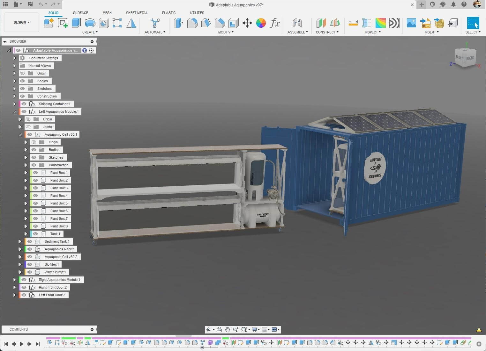{width="100%"}

</center>

Eight Individual plant boxes make up a single aquaponics cell, two aquaponics cells make up a single aquaponics rack, and two aquaponics racks are housed inside of a single shipping container. The scaling of modularity allows for application scaling to be applied to Adaptable Aquaponics. A single plant box could be used in the form factor of my [Assistive Aquaponics Fish Tank](https://teddywarner.org/Projects/AssistiveAquaponics/), or multiple Adaptable Aquaponic Shipping Containers could be housed in parallel to allow for large-scale farming. **Modularity in the case of Adaptable Aquaponics not only enables future iteration & reconfiguration but also the scaling of the ecosystem itself - meeting the needs of any potential consumers - ranging from individual to community.**

### Computational Design

Shifting to an analysis of the CAD work behind Adaptable Aquaponics, I was super stoked to get to experiment with Fusion 360's new Automated Modeling tool! I used automated modeling to generate an optimized vertical support structure for my systems aquaponics rack, as well as for the angled mounts for adaptable aquaponics solar panels. The tool can be found under the *Automate* menu in the toolbar. 

<center>

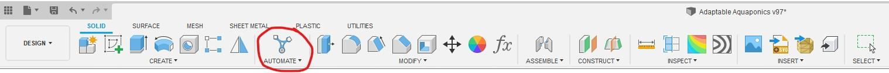{width="100%"}

</center>

Automated modeling is about as intuitive as you can get, requiring only three inputs to generate a body - *Faces to Connect*, *Bodies to Avoid* & *Operation* type. I began the computational design work of my aquaponics rack outside of the automated modeling tool itself, but instead by creating both the top and bottom plates of my Aquaponics rack & attaching 6 mounting points to each sheet. Then, working around the prepositioned Aquaponics Cells, biofilter & sediment tank, I created shelves to hold the content of the racks, unattached to support. I then opened the automated modeling tool and selected the previously created mounting points on both the top and bottom plates as well as each shelf with the *Faces to Connect* selection tool. Note, that there are three individual vertical supports on each Aquaponics rack, so I selected a corresponding set of 1/3 of the total created faces for each automated operation. I moved on to the *Bodies to Avoid* selection tool, highlighting the components of each Aquaponics Cell, the biofilter & the sediment tank closest to the selected points of connection. I was careful here to only select crucial bodies to avoid, not all in the model - the fewer input selections, the faster computation time. With these selected inputs, I generated a design with a *New Body* operation.

<center>

{width="100%"}
  <figcaption>Bodies to Avoid are highlighted red, while Faces to Connect are highlighted in blue</figcaption>

</center>

 After ~10 Mins, the Automated Modeling menu presented me with 6 generated bodies under the *Alternatives* menu. You can click through these generated bodies to see them in the workspace, before finalizing your selection with the *Ok* button. I repeated this generation for the two other vertical supports on the Aquaponics Rack, choosing a visually similar generation between all three to keep consistency to the rack. Computationally designed bodies can also be seen in the solar panel mounts located on the roof of Adaptable Aquaponics. These bodies followed a similar workflow, where I connected the back face of each solar panel to pre-created mounting points.

### 3D Plumbing

The complex spatial routing of Adaptable Aquaponics plumbing required the use of Fusion 360's ability to sketch non-planar line sand splines. To enable this feature, click on your user icon in the top right of the window & navigate to ...

```
Preferences < Design < Allow 3D sketching of lines and splines
```

... and toggle this option on. Be sure to click *Apply* in the bottom right-hand corner of the *Preferences* menu before exiting.

<center>

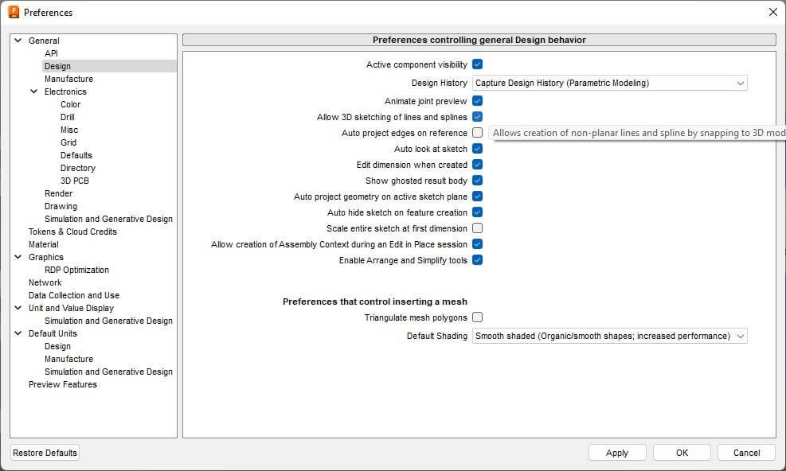{width="100%"}

</center>

 Fusion 360's non-planar sketching allows spline points to be removed from their initial sketch plane and routed to other planes. Once a point is placed on a 3D spline, Fusion allows for the alteration of direction in three dimensions before you place the next point. 
 
<center>

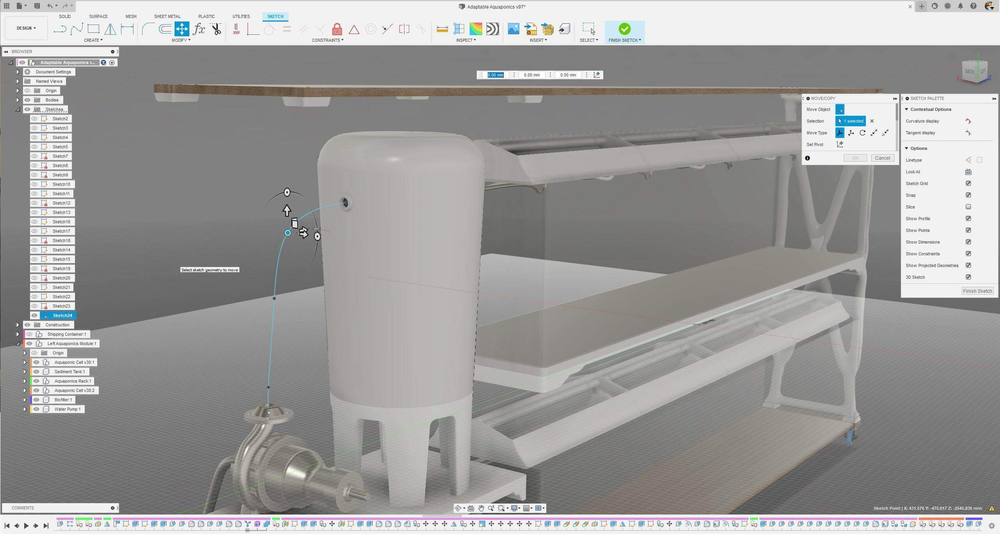{width="100%"}

</center>
 
 Beginning from the intake valve of each plant box, I routed a spline to a t-connector before using the *Pipe* tool with each routed spline as a reference - leaving me with all of the plant boxes in a given Aquaponics Cell routed in series. Additionally, 3D splines were used to route the plumbing from each fish tank to the sediment tank, from the sediment tank to the water pump, from the water pump to the biofilter, and from the biofilter back to the plant boxes.

<center>

<iframe src="https://drive.google.com/file/d/1PuYRUSErvemOdngKzQ81tDWOU6TEt5cc/preview" width="95%" height="560" allow="autoplay"></iframe>

</center>

## Rendering - Fusion 360

Once Adaptable Aquaponics was finalized - *the 95th iteration ... phew* - I continued to Fusion 360's rendering workspace.

<center>

{width="55%"}

</center>

 I began by setting up the renders scene by navigating to ...

```
Setup < Scene Settings < Environment Library
```

... where I chose to upload a custom HDRI backdrop. 

<center>

{width="76.8%"}
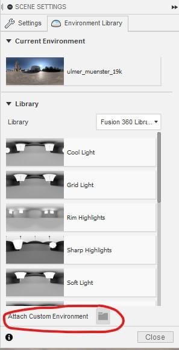{width="21%"}

</center>

As mentioned earlier on this page, I chose the [Ulmer Muenster](https://polyhaven.com/a/ulmer_muenster) HDRI from [polyhaven.com](https://polyhaven.com/) as my backdrop, as the scene offers a compromise of beauty and urban (not that those are mutually exclusive) - preserving the largest of my envisioned use cases for Adaptable Aquaponics, urban farming (stay tuned for the next section!). Once my HDRI backdrop was uploaded, I navigated back to ...

```
Setup < Scene Settings
```

... where I took a trial and error approach to tune the renders Environment, Ground & Camera settings until I was left with some nice looking renders! *Check them out below!*

<center>

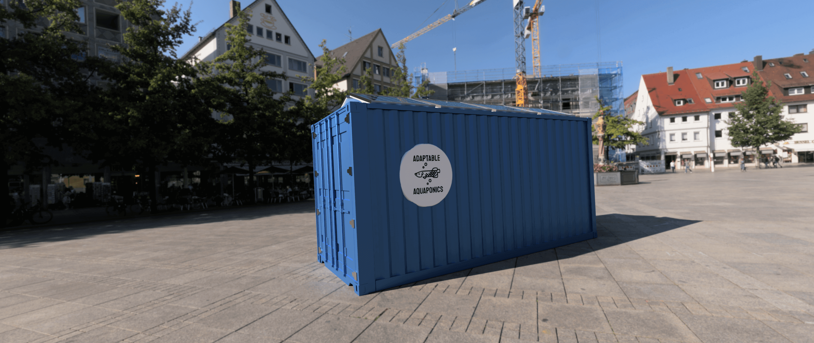{width="63%"}
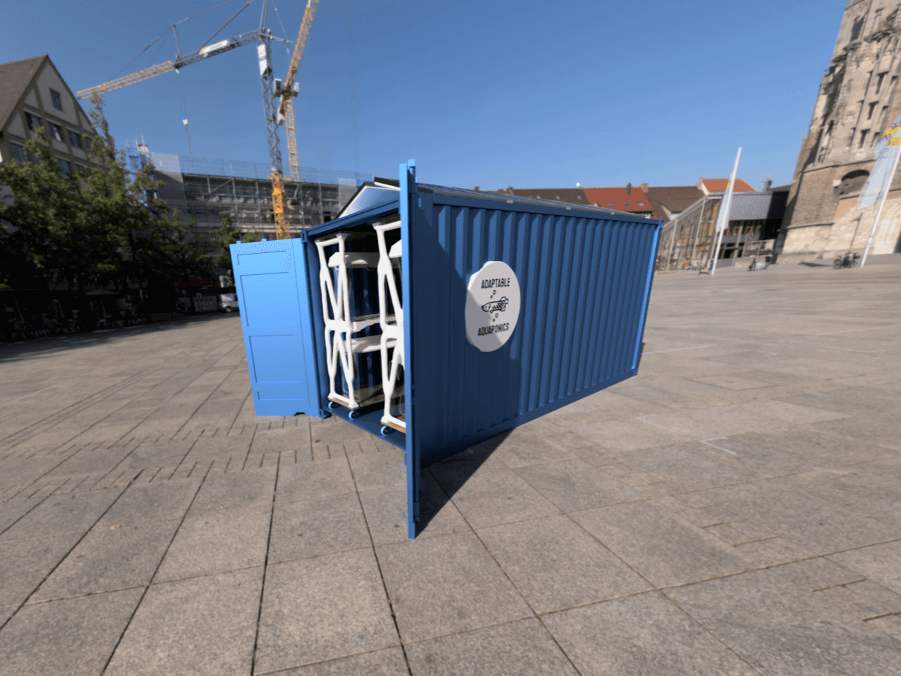{width="35.5%"}
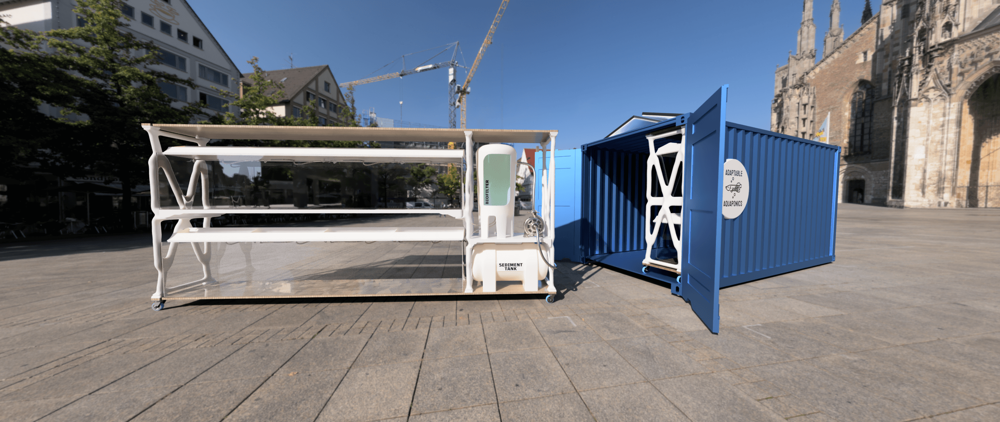{width="99.25%"}

</center>

## Addressing the Current Bottlenecks of Global Nutrition

### Resource Depletion - The Costs of Industrial Agriculture

Contemporary agriculture is completely dependent on non-renewable materials. Dependence on fossil fuels is not only not a sustainable practice that is damaging our planet but jeopardizes the future of our agricultural stability. With rigid dependence, how do we expect to handle the extinction of a non-renewable? Adaptable Aquaponics offers a solar-powered solution, completely independent of any non-renewables & costly electric bills that hinder access in communities facing a scarcity of access. Though the elimination of dependencies is crucial to making Adaptable Aquaponics a sustainable solution to contemporary farming challenges, the vertical integration of the system offers a Carnegie-esk entrepreneurial venture, ensuring freedom from the potentially binding agreement for resources.

Data from the US Geological Society shows rainfall patterns "may become less predictable and dependable", while the amount of groundwater "drawn for use in irrigation has tripled since the 1950s".[^3] Though, unlike fossil fuels, water is a renewable resource, freshwater has its limits. Considering nearly 70% of all freshwater used by humans is used in agriculture, addressing water usage is a warranted concern. When compared to standard agricultural practices, Aquaponics requires 90 to 99% less water.[^4] Similar to the potential lack of electricity access, Adaptive Aquaponics offers communities with a shortage or imposition in access to water a sustainable agricultural alternative, while also offering entrepreneurs another opportunity to continue to vertically integrate.

### Land Management - Degrading and Undervaluing Farmland

Faulty land management techniques have stripped soil from its nutrients, requiring fertilizers to aid plant growth. The nature of aquaponics replaces any dependency on soil with nutrients from the nitrogen cycle - a naturally occurring ecosystem that can run independently from fertilizers. Adaptive Aquaponics' cross between a Nutrient Film & Media Bed aquaponics system preserves the dirt-free nature of hydroponics, whilst maintaining a small, modular structure of its plant boxes. The modular nature of adaptive aquaponics allows the system to potentially thrive regardless of scale and location, opening the door for urban farming!

### Food Waste & Demographic Changes

The UN estimates that 1/3 "of the world’s food goes to waste, either during agricultural production, post-harvest handling, and storage, processing, distribution, or consumption".[^3] The modular nature of Adaptive Aquaponics ensures adequate scaling of agriculture in a given population. The compacted form factor and potential for urban or harsh environment farming enable the growth of food locally to a population. Instead of depending on agricultural preservation, processing, storage, and distribution, providing a community with Adaptable Aquaponics enables full control over food production, ensuring neither over nor under production. Interaction with agriculture at a community scale may remove the barrier between farming communities and consumers and hopefully, will catalyze a shift from to favor "conservation over convenience" thus regulating agriculture to ensure adequate food is provided.[^3]

## Scale Prototyping

As has seemingly become a trend across my work, I attempted to use a plethora of digital fabrication in the creation of my scale model. My model is a 2.3% scale prototype of Adaptable Aquaponics, fabricated with both additive and subtractive processes. Shout out to [@taimakestuff](https://www.instagram.com/taimakestuff/) who was my lab buddy [@makerspaceCharlotte](https://www.instagram.com/makerspacecharlotte/) while I ground out this project's post-processing :)

Computationally designed elements utilize organic surveys to ensure optimal geometry for both strength and efficiency, thus the perfect partner for additive manufacturing. I opted to 3D print all elements of my scale model that utilized Fusion 360's Automated Modeling, including the shipping container with its solar panel mounts & Aquaponics Rack with its vertical supports. I also printed the contents of each aquaponics rack to achieve the highest accuracy to the draft angles and plumbing locations on the bodies. All parts for this project were printed on my Prusa I3 MK3S+ with a 0.4mm nozzle at a 0.3mm layer height. I chose a white PETG, along with a pretty aggressive layer height to allow for ease of post-processing & painting of the model.

<center>

{width="53%"}
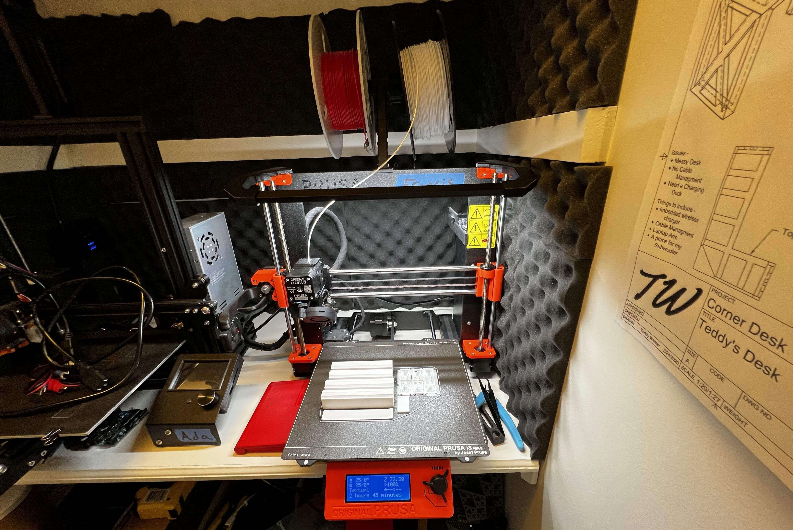{width="44.5%"}
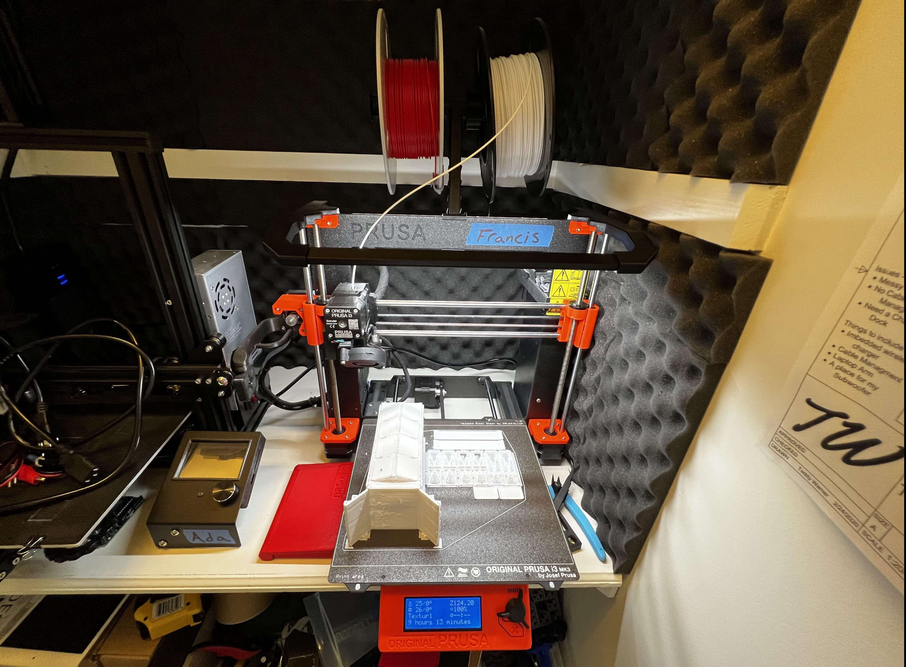{width="48%"}
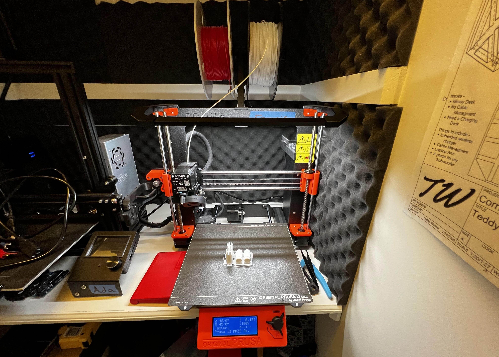{width="49.4%"}

</center>

PETG is my go-to generic 3D printing material, however, it really shines when faced with post-processing. PETG takes well to sanding and is overall rather easy to clean up. One of my favorite tricks is taking hot air from a hair-dryer to a PETG printed part. The hot air shrivels any stringing or surface defects into masses that fall off after rubbing your finger over the surface.

<center>

<iframe width="98%" height="560" src="https://www.youtube.com/embed/-e6EYHS1u_c" title="YouTube video player" frameborder="0" allow="accelerometer; autoplay; clipboard-write; encrypted-media; gyroscope; picture-in-picture" allowfullscreen></iframe>

{width="98%"}

</center>

I was lucky enough to stumble across some gloss black acrylic in the scrap bin [@makerspaceCharlotte](https://www.instagram.com/makerspacecharlotte/), which I used to create Adaptable Aquaponic's solar panels. This was my first time using the lasers [@makerspaceCharlotte](https://www.instagram.com/makerspacecharlotte/), and the machine that I was on ran a different wattage than the lasers at the [Charlotte Latin Fab Lab](https://www.instagram.com/clsfablab/) (my school's lab & my workplace) so I began with a bit of research into optimal cut settings. After altering the laser focus to achieve the desired (slightly thickened beam) effect, I began batch cutting the model solar panels.

<iframe width="98%" height="560" src="https://www.youtube.com/embed/jXAlMzxqgno" title="YouTube video player" frameborder="0" allow="accelerometer; autoplay; clipboard-write; encrypted-media; gyroscope; picture-in-picture" allowfullscreen></iframe>

*Note the other test cuts on the stock material above. Though for the sake of focusing on Adaptable Aquaponics and not the prototyping process I've chosen to not mention much of the prototyping behind this physical model. I usually include ample prototyping content in my articles, so it felt necessary to call attention to the test cuts here :)*

I cleaned up the final cut parts with some soap and water, before continuing to attach each solar panel to its 3D printed mount & then to the roof of the Adaptable Aquaponics shipping container.

<center>

{width="60%"}
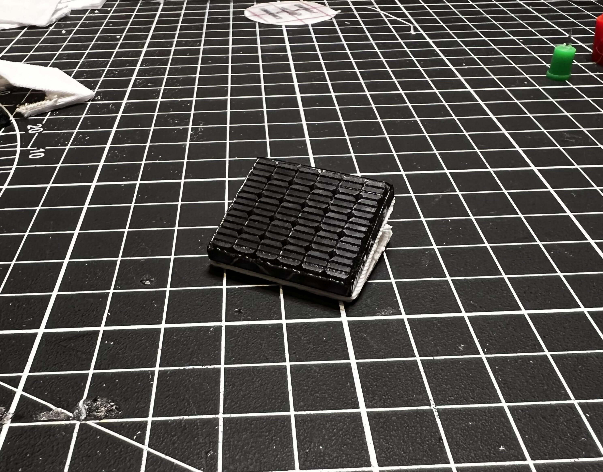{width="39%"}

<iframe width="99%" height="560" src="https://www.youtube.com/embed/RmUPD9cld18" title="YouTube video player" frameborder="0" allow="accelerometer; autoplay; clipboard-write; encrypted-media; gyroscope; picture-in-picture" allowfullscreen></iframe>

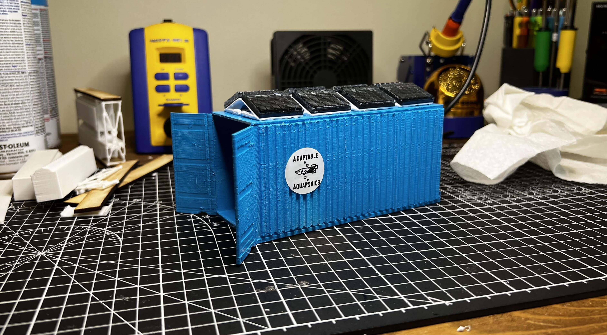{width="99%"}

</center>

I followed up my acrylic cutting with the wooden base and top to each Aquaponics Rack. Unfortunately, I didn't have access to any 1/8" ply, so I had to do some prep work with a piece of 1/4" plywood stock. I planned the surface of my stock material on a drum-sander until down to just below 1/8". I then focused the laser to this stock & cut all four planks.

The glue up of these shelves was a bit finicky, as my fingers just seem to be a super glue magnet - but eventually, I got both Aquaponics Racks complete with their plants, vertical support, shelves, Aquaponics Cells, biofilter & sediment tank, and then installed them inside the shipping container.

<center>

<iframe width="97.5%" height="560" src="https://www.youtube.com/embed/_TvLxb7OKS4" title="YouTube video player" frameborder="0" allow="accelerometer; autoplay; clipboard-write; encrypted-media; gyroscope; picture-in-picture" allowfullscreen></iframe>

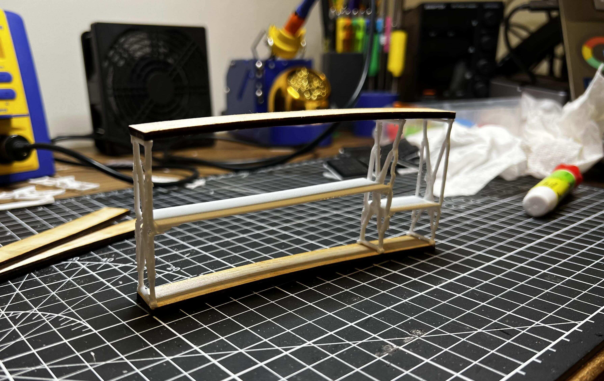{width="48%"}
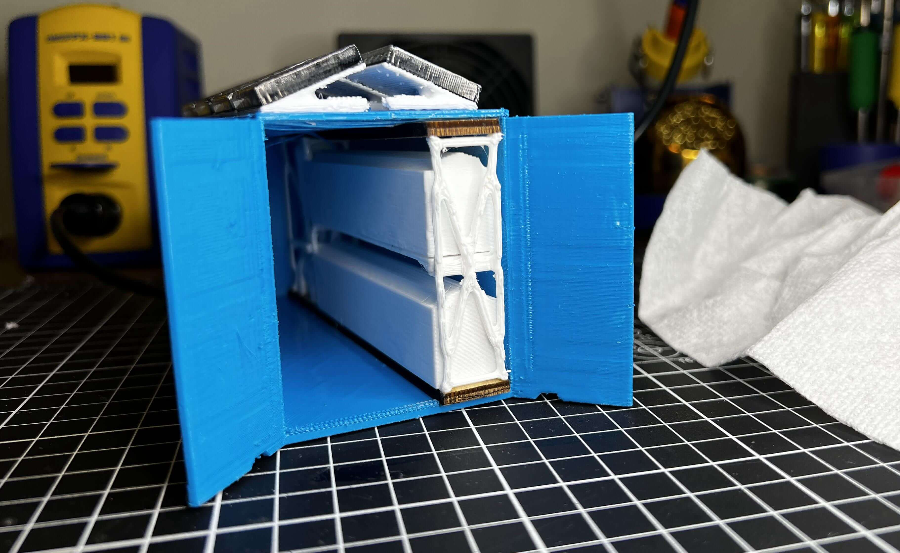{width="49%"}
{width="97.5%"}

</center>

As a finishing touch, I used a [Cricut Explore Air 2](https://cricut.com/en-us/cutting-machines/cricut-explore/cricut-explore-air-2) to cut the sign attached to the side of Adaptable Aquaponics from vinyl. Though I've made dozens upon dozens of stickers with the same workflow, the scale of this logo proved to be a bit of a challenge. I not only had difficulties weeding the cut vinyl at such a small scale, but the machine itself was ripping up parts of the design upon retraction. I ended up altering the cut settings to a custom array as suggested by [sofontsy.com](https://sofontsy.com/blogs/tutorials/tips-for-cutting-intricate-designs-with-cricut-maker-explore), using the Washi Sheet default with a pressure set to More. With these settings, I was able to get a clean enough cut that I could weed the sticker, layer the two colors, and then apply to the side of the Adaptable Aquaponics model.

<center>

<iframe width="98%" height="560" src="https://www.youtube.com/embed/bYOHFo1ECQ4" title="YouTube video player" frameborder="0" allow="accelerometer; autoplay; clipboard-write; encrypted-media; gyroscope; picture-in-picture" allowfullscreen></iframe>

{width="98%"}

</center>

## Glory Shots


<center>

{width="49.5%"}
{width="47%"}
{width="97%"}

</center>

With the design and prototyping completed, I headed out to my local strip mall for a photo op, only getting a couple of strange looks from shoppers wondering what the boy in the old-navy pajama pants was doing taking pictures of a miniature in the middle of the parking lot. But it was worth it! As opposed to settling for a diorama background, or just pictures of my model on my workbench, I highlighted a legitimate potential environment for such a product, and I promise you, when Adaptable Aquaponics hits full scale in a parking lot, the shoppers won't be blown away by my magnificent fashion choices, but instead by the wonders of Aquaponics!

[^1]: https://www.un.org/en/global-issues/food
[^2]: https://aquaponics.com/
[^3]: http://seedstock.com/2012/04/18/five-major-challenges-facing-north-american-agriculture/
[^4]: https://earth.org/data_visualization/aquaponics-a-solution-to-food-insecurity/

*[FDM]: Fused Deposition Modeling
*[CNC]: Computerized Numerical Control
*[MPCNC]: Mostly Printed Computerized Numerical Control - https://docs.v1engineering.com/mpcnc/intro/
*[SSH]: Secure Shell
*[GPIO]: General-Purpose Input/Output
*[USB]: Universal Serial Bus
*[ETA]: Estimated Time of Arrival
*[ISO]: International Organization for Standardization
*[UPDI]: Unified Program and Debug Interface
*[AVR]: A Family of microcontrollers developed since 1996 by Atmel
*[JTAG]: Joint Test Action Group
*[IDE]: Integrated Development Environment
*[Rx]: Receiving Signal
*[Tx]: Transmitting Signal
*[VCC]: Voltage Common Collector (+)
*[GND]: Ground / Common Drain (-)
*[IC]: Integrated Circuit
*[LED]: Light-Emitting Diode
*[Cap]: Capacitor
*[SPST]: Single Pole Single Throw Switch
*[SPDT]: Single Pole Double Throw Switch
*[DPST]: Double Pole Single Throw Switch
*[DPDT]: Double Pole Double Throw Switch
*[EEPROM]: Electrically Erasable Programmable Read-Only Memory
*[PCB]: Printed Circuit Board
*[PWM]: Pulse Width Modulation
*[SPI]: Serial Peripheral Interface
*[I2C]: Inter-Integrated Circuit
*[UART]: Universal Asynchronous Receiver/Transmitter
*[ADC]: Analog-to-Digital Converter
*[DAC]: Digital-to-Analog Converter
*[MCU]: Microcontroller Unit
*[FPGA]: Field-Programmable Gate Array
*[SLA]: Stereolithography
*[DLP]: Digital Light Processing 
*[SLS]: Selective Laser Sintering
*[PLA]: Polylactic Acid 
*[ABS]: Acrylonitrile Butadiene Styrene 
*[PETG]: Polyethylene Terephthalate Glycol 
*[CAD]: Computer-Aided Design
*[CAM]: Computer-Aided Manufacturing
*[G-code]: A language for controlling CNC machines
*[PID]: Proportional-Integral-Derivative (control loop feedback mechanism)
*[MOSFET]: Metal-Oxide-Semiconductor Field-Effect Transistor
*[BJT]: Bipolar Junction Transistor
*[SMD]: Surface-Mount Device
*[THT]: Through-Hole Technology
*[DIP]: Dual In-line Package
*[ESC]: Electronic Speed Controller
*[BEC]: Battery Eliminator Circuit
*[LiPo]: Lithium Polymer 
*[NiMH]: Nickel-Metal Hydride 
*[EMI]: Electromagnetic Interference
*[ESD]: Electrostatic Discharge