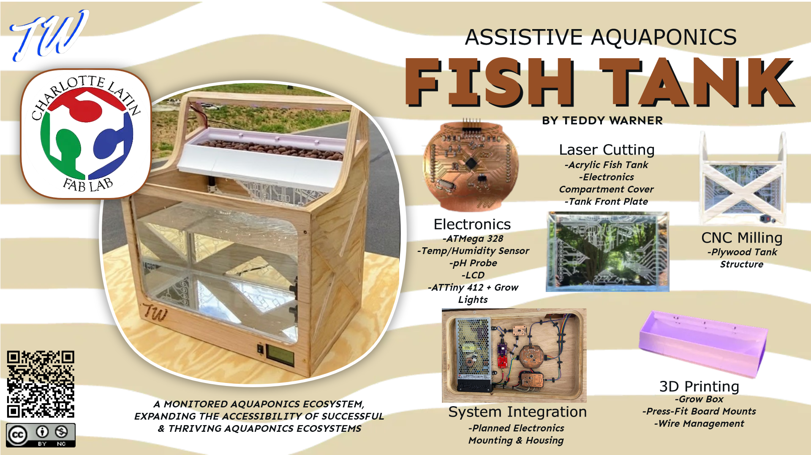

<head>
  <meta charset="UTF-8">
  <meta name="viewport" content="width=device-width, initial-scale=1.0">
  
  <!-- Primary Meta Tags -->
  <meta name="title" content="Assistive Aquaponics Fish Tank - Teddy Warner">
  <meta name="description" content="Expanding the accessibility of successful & thriving aquaponics ecosystems.">
  <meta name="keywords" content="Aquaponics, Assistive technology, Digital fabrication, 3D printing, CNC milling, PCB design, Sustainable farming, Fish tank, Fab Academy, Maker project, Smart agriculture, IoT farming, Accessible design, Educational aquaponics, DIY aquaponics">
  <meta name="author" content="Teddy Warner">
  <meta name="robots" content="index, follow">
  
  <!-- Open Graph / Facebook -->
  <meta property="og:type" content="website">
  <meta property="og:url" content="https://teddywarner.org/Projects/AssistiveAquaponics/">
  <meta property="og:title" content="Assistive Aquaponics Fish Tank - Teddy Warner">
  <meta property="og:description" content="Expanding the accessibility of successful & thriving aquaponics ecosystems.">
  <meta property="og:image" content="https://teddywarner.org/assets/images/thumb.png?foo=bar">
  <meta property="og:image:type" content="image/png">
  <meta property="og:image:width" content="1200">
  <meta property="og:image:height" content="630">

  <!-- Twitter -->
  <meta property="twitter:card" content="summary_large_image">
  <meta property="twitter:url" content="https://teddywarner.org/Projects/AssistiveAquaponics/">
  <meta property="twitter:title" content="Assistive Aquaponics Fish Tank - Teddy Warner">
  <meta property="twitter:description" content="Expanding the accessibility of successful & thriving aquaponics ecosystems.">
  <meta property="twitter:image" content="https://teddywarner.org/assets/images/thumb.png?foo=bar">

  <!-- Existing resource links -->
  
  <link rel="preconnect" href="https://fonts.googleapis.com">
  <link rel="preconnect" href="https://fonts.gstatic.com" crossorigin>
  <link href="https://fonts.googleapis.com/css2?family=Crimson+Pro:ital,wght@0,200..900;1,200..900&display=swap" rel="stylesheet">
  <link href="https://fonts.googleapis.com/css2?family=Crimson+Pro:ital,wght@0,200..900;1,200..900&family=JetBrains+Mono:ital,wght@0,100..800;1,100..800&display=swap" rel="stylesheet">
  <link rel="stylesheet" href="../../assets/css/projects/project.css">
</head>

  <nav class="main-navigation">
    <ul>
      <li><a class="home" href="https://teddywarner.com">01 Home</a></li>
      <li><a class="proj" href="https://teddywarner.com/proj/">02 Projects</a></li>
      <li><a class="writ" href="https://teddywarner.com/writ/">03 Writing</a></li>
    </ul>
  </nav>

<a href="https://teddywarner.org/proj"><i class="fa-solid fa-arrow-left-long"></i> Project Feed</a>

# Assistive Aquaponics Fish Tank

  <a href="https://x.com/WarnerTeddy"> Teddy Warner</a>|  Winter & Spring, 2021 | <i class="far fa-clock"></i> 1-2 minutes
  
  <a class="fb" title="Share on Facebook" href="https://www.facebook.com/sharer/sharer.php?u=https://fabacademy.org/2021/labs/charlotte/students/theodore-warner/Final%2520Project/final-project/"><i class="fa-brands fa-facebook"></i></a>
  <a class="twitter" title="Share on Twitter" href="https://twitter.com/intent/tweet?url=https://fabacademy.org/2021/labs/charlotte/students/theodore-warner/Final%2520Project/final-project/&text=Check%20Out%20the%20Assistive%20Aquaponics%20Fish%20Tank%20on"><i class="fa-brands fa-x-twitter"></i></a>
  <a class="pin" title="Share on Pinterest" href="https://pinterest.com/pin/create/button/?url=https://fabacademy.org/2021/labs/charlotte/students/theodore-warner/Final%2520Project/final-project/&media=&description=Check%20Out%20the%20Assistive%20Aquaponics%20Fish%20Tank%20on%20https://fabacademy.org/2021/labs/charlotte/students/theodore-warner/Final%2520Project/final-project/%20!"><i class="fa-brands fa-pinterest"></i></a>
  <a class="ln" title="Share on LinkedIn" href="https://www.linkedin.com/shareArticle?mini=true&url=https://fabacademy.org/2021/labs/charlotte/students/theodore-warner/Final%2520Project/final-project/"><i class="fab fa-linkedin"></i></a>
  <a class="email" title="Share via Email" href="mailto:info@example.com?&subject=&cc=&bcc=&body=Check%20Out%20the%20Assistive%20Aquaponics%20Fish%20Tank%20on%20https://fabacademy.org/2021/labs/charlotte/students/theodore-warner/Final%2520Project/final-project/"><i class="fa-solid fa-paper-plane"></i></a>
  

---

The Assistive Aquaponics Fish Tank was my final project masterpiece during my cycle in [Fab Academy](https://fabacademy.org/). The tank is made with a combination of digital fabrication tools and modern fabrication mediums including

 - [x] 3D Printing
 - [x] CNC Milling
 - [x] Laser Cutting/Engraving
 - [x] PCB Design & Milling
 - [x] SMD Soldering
 - [x] And Lots and Lots of CAD Design

!!! note "Compleate Project Documentation" 

    In an attempt to save some repo space, only a presentation slide and video of my Assistive Aquaponics Fish Tank are displayed on this page, however, a complete documentation of this project can be read on my Fab Academy site linked in the button below, as well as in the header of this site. 

[Fab Academy 2021 - Assistive Aquaponics Fish Tank :fontawesome-solid-earth-americas:](http://fabacademy.org/2021/labs/charlotte/students/theodore-warner/Final%20Project/final-project/){ .md-button .md-button--primary }

 alt="Presentation slide showing Assistive Aquaponics project overview"

<iframe width="100%" height="550" src="https://www.youtube.com/embed/YuM9sASTiBI" title="Assistive Aquaponics Fish Tank Project Video" frameborder="0" allow="accelerometer; autoplay; clipboard-write; encrypted-media; gyroscope; picture-in-picture" allowfullscreen></iframe>

*[FDM]: Fused Deposition Modeling
*[CNC]: Computerized Numerical Control
*[MPCNC]: Mostly Printed Computerized Numerical Control - https://docs.v1engineering.com/mpcnc/intro/
*[SSH]: Secure Shell
*[GPIO]: General-Purpose Input/Output
*[USB]: Universal Serial Bus
*[ETA]: Estimated Time of Arrival
*[ISO]: International Organization for Standardization
*[UPDI]: Unified Program and Debug Interface
*[AVR]: A Family of microcontrollers developed since 1996 by Atmel
*[JTAG]: Joint Test Action Group
*[IDE]: Integrated Development Environment
*[Rx]: Receiving Signal
*[Tx]: Transmitting Signal
*[VCC]: Voltage Common Collector (+)
*[GND]: Ground / Common Drain (-)
*[IC]: Integrated Circuit
*[LED]: Light-Emitting Diode
*[Cap]: Capacitor
*[SPST]: Single Pole Single Throw Switch
*[SPDT]: Single Pole Double Throw Switch
*[DPST]: Double Pole Single Throw Switch
*[DPDT]: Double Pole Double Throw Switch
*[EEPROM]: Electrically Erasable Programmable Read-Only Memory
*[PCB]: Printed Circuit Board
*[PWM]: Pulse Width Modulation
*[SPI]: Serial Peripheral Interface
*[I2C]: Inter-Integrated Circuit
*[UART]: Universal Asynchronous Receiver/Transmitter
*[ADC]: Analog-to-Digital Converter
*[DAC]: Digital-to-Analog Converter
*[MCU]: Microcontroller Unit
*[FPGA]: Field-Programmable Gate Array
*[SLA]: Stereolithography
*[DLP]: Digital Light Processing 
*[SLS]: Selective Laser Sintering
*[PLA]: Polylactic Acid 
*[ABS]: Acrylonitrile Butadiene Styrene 
*[PETG]: Polyethylene Terephthalate Glycol 
*[CAD]: Computer-Aided Design
*[CAM]: Computer-Aided Manufacturing
*[G-code]: A language for controlling CNC machines
*[PID]: Proportional-Integral-Derivative (control loop feedback mechanism)
*[MOSFET]: Metal-Oxide-Semiconductor Field-Effect Transistor
*[BJT]: Bipolar Junction Transistor
*[SMD]: Surface-Mount Device
*[THT]: Through-Hole Technology
*[DIP]: Dual In-line Package
*[ESC]: Electronic Speed Controller
*[BEC]: Battery Eliminator Circuit
*[LiPo]: Lithium Polymer 
*[NiMH]: Nickel-Metal Hydride 
*[EMI]: Electromagnetic Interference
*[ESD]: Electrostatic Discharge