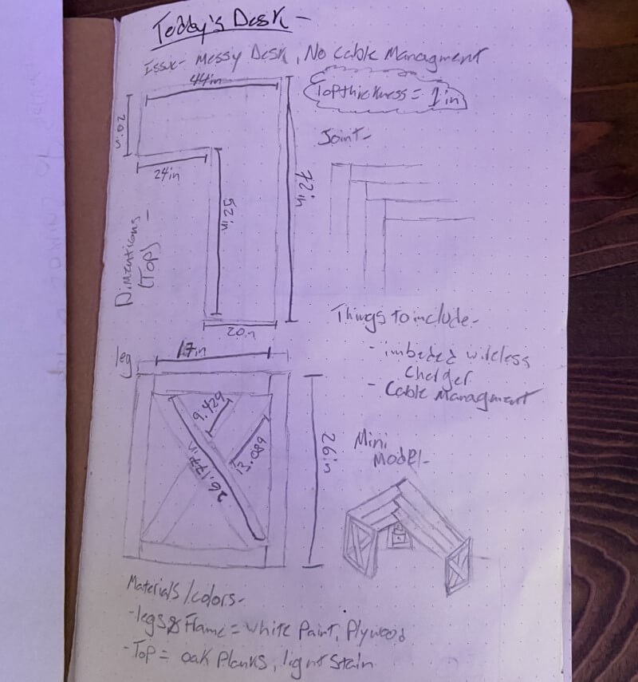
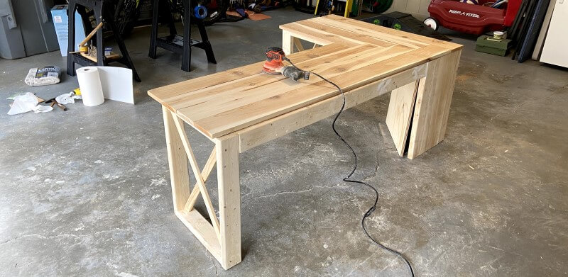
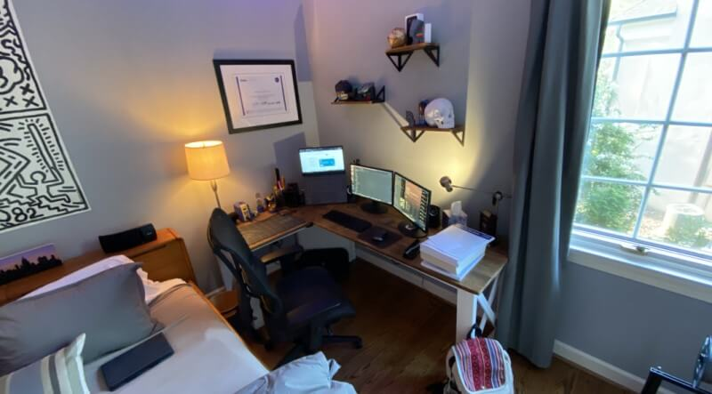

<head>
  <meta charset="UTF-8">
  <meta name="viewport" content="width=device-width, initial-scale=1.0">
  
  <!-- Primary Meta Tags -->
  <meta name="title" content="Cable Managed Corner Desk - Teddy Warner">
  <meta name="description" content="Explore the design and construction of a modern cable-managed corner desk, combining functionality and aesthetics for an ideal home office setup.">
  <meta name="keywords" content="Cable management, Corner desk, DIY desk, Fusion 360, CAD design, Home office setup, Pandemic project, Woodworking, Desk construction, Modern furniture, Workspace organization">
  <meta name="author" content="Teddy Warner">
  <meta name="robots" content="index, follow">
  
  <!-- Open Graph / Facebook -->
  <meta property="og:type" content="website">
  <meta property="og:url" content="https://teddywarner.org/Projects/CornerDesk/">
  <meta property="og:title" content="Cable Managed Corner Desk - Teddy Warner">
  <meta property="og:description" content="A clean modern corner desk.">
  <meta property="og:image" content="https://teddywarner.org/assets/images/CornerDesk/hero.png">
  <meta property="og:image:type" content="image/png">
  <meta property="og:image:width" content="1200">
  <meta property="og:image:height" content="630">

  <!-- Twitter -->
  <meta property="twitter:card" content="summary_large_image">
  <meta property="twitter:url" content="https://teddywarner.org/Projects/CornerDesk/">
  <meta property="twitter:title" content="Cable Managed Corner Desk - Teddy Warner">
  <meta property="twitter:description" content="A clean modern corner desk.">
  <meta property="twitter:image" content="https://teddywarner.org/assets/images/CornerDesk/hero.png">

  <!-- Existing resource links -->
  
  <link rel="preconnect" href="https://fonts.googleapis.com">
  <link rel="preconnect" href="https://fonts.gstatic.com" crossorigin>
  <link href="https://fonts.googleapis.com/css2?family=Crimson+Pro:ital,wght@0,200..900;1,200..900&display=swap" rel="stylesheet">
  <link href="https://fonts.googleapis.com/css2?family=Crimson+Pro:ital,wght@0,200..900;1,200..900&family=JetBrains+Mono:ital,wght@0,100..800;1,100..800&display=swap" rel="stylesheet">
  <link rel="stylesheet" href="../../assets/css/projects/project.css">
  <link rel="stylesheet" href="../../assets/css/header.css">
</head>

  <nav class="main-navigation">
    <ul>
      <li><a class="home" href="https://teddywarner.com">01 Home</a></li>
      <li><a class="proj" href="https://teddywarner.com/proj/">02 Projects</a></li>
      <li><a class="writ" href="https://teddywarner.com/writ/">03 Writing</a></li>
    </ul>
  </nav>
  
  

  

<a href="https://teddywarner.org/proj"><i class="fa-solid fa-arrow-left-long"></i> Project Feed</a>

# Cable Managed Corner Desk

  <a href="https://x.com/WarnerTeddy"> Teddy Warner</a>| Spring, 2020 | <i class="far fa-clock"></i> 6-8 minutes
  
  <a class="fb" title="Share on Facebook" href="https://www.facebook.com/sharer/sharer.php?u=https://teddywarner.org/Projects/CornerDesk/"><i class="fa-brands fa-facebook"></i></a>
  <a class="twitter" title="Share on Twitter" href="https://twitter.com/intent/tweet?url=https://teddywarner.org/Projects/CornerDesk/&text=Check%20Out%20the%20Cable-Managed%20Corner%20Desk%20on"><i class="fa-brands fa-x-twitter"></i></a>
  <a class="pin" title="Share on Pinterest" href="https://pinterest.com/pin/create/button/?url=https://teddywarner.org/Projects/CornerDesk/&media=&description=Check%20Out%20the%20Cable-Managed%20Corner%20Desk%20on%20https://teddywarner.org/Projects/CornerDesk/%20!"><i class="fa-brands fa-pinterest"></i></a>
  <a class="ln" title="Share on LinkedIn" href="https://www.linkedin.com/shareArticle?mini=true&url=https://teddywarner.org/Projects/CornerDesk/"><i class="fab fa-linkedin"></i></a>
  <a class="email" title="Share via Email" href="mailto:info@example.com?&subject=&cc=&bcc=&body=Check%20Out%20the%20Cable-Managed%20Corner%20Desk%20on%20https://teddywarner.org/Projects/CornerDesk/"><i class="fa-solid fa-paper-plane"></i></a>
  

---

This start of the Pandemic project stemmed from my freshman year engineering capstone project. At the start of 8th grade I had an issue, I was a couple of months into learning Fusion360 and I decided to upgrade my setup from an old janky pc to a brand new laptop and some 20-inch monitors to go along with it, which was great and all but gave me a whole tone of issues to sort out. I had this great desk in the corner of my room, that my great grandfather built and that had been passed down to me, however, there was one huge flaw using that desk with my brand new setup and that was cable management. Below are some plans draw out for the desk.

{width="95%" alt="Initial design sketches and measurements for corner desk"}
{width="60%" alt="Additional design notes and calculations for desk"}

## CAD

So I set off in Fusion to design a desk that fit all of my needs. My goals were to have a desk measured to fit perfectly in the corner of my room, with plenty of legroom so I would never hit my knees on it, and the best cable management imaginable. And after a couple of different iterations, I came up with this Model.

<iframe src="https://myhub.autodesk360.com/ue2cecd93/shares/public/SH56a43QTfd62c1cd9688b189f2a177d3618?mode=embed" width="100%" height="500" allowfullscreen="true" webkitallowfullscreen="true" mozallowfullscreen="true"  frameborder="0"></iframe>

<iframe src="https://myhub.autodesk360.com/ue2cecd93/shares/public/SH56a43QTfd62c1cd968f6f9f92e8cbe6137?mode=embed" width="100%" height="500" allowfullscreen="true" webkitallowfullscreen="true" mozallowfullscreen="true"  frameborder="0"></iframe>

## Lowes Trip and New Tool

However shortly after finishing up the CAD aspect of this project, Covid-19 caused our school to resort to online learning, cutting me off from our school's lab equipment, however, I happen to have a lot of the tools we have in our lab in my little workshop at my house, and I was pretty determined to finish the desk, so just before everything closed down I took a trip to lowes to pick up some lumber and supplies. I settled on a frame and cabinet of 2x4s and some plywood that was painted white pretty quickly, but the top took some more thought. Eventually, I decided to make the top out of cedar planks that were stained with Provincial to match the stain of the floor in my room. Also at lowes, I picked up a Kreg-Jig to drill pocket holes for the desk, as I didn't like the idea of screws being visible. It was my first time using a Kreg-Jig but it went super well as it's a relatively simple jig to use.

{width="100%" alt="Kreg Jig setup for pocket hole joinery"}

## Building Process

A couple of days after getting the wood, I finally started assembling the desk, starting by laying down the frame, making sure the front 2x4 was flat and the back was upright (to give more leg space) and I was pretty excited to get the whole thing together. Maybe a little too excited because even though you can't tell from the pictures above, I built the whole desk wrong, putting the corner on the wrong side. This was a huge setback to fix as it meant that I would have to take the entire desk apart, use wood filler on all of the newly exposed holes, and build it back up the right way. I was even considering just leave the desk as is, and rearrange my room to match the flaw, however, I wanted my desk to be perfect and that meant fixing it according to my CAD model. So I did the laborious tasks listed above and finished the frame of the desk the right way late that night. The next day I was ready to do some more on of the desk, so I decided to start throwing together the top. I spent that whole day sawing, planning, and sanding the cedar before I put the top together using the Kreg-Jig the next morning. And this time I didn't make a single mistake, and I'm really happy with the result.

{width="100%" alt="Initial layout of desk frame components"}
{width="100%" alt="Assembled base frame of the desk"}
{width="100%" alt="Completed wood assembly before finishing"}

## Painting and Staining

I spent the next two days painting the frame with three coats of white paint and staining the cedar with Provincial. 

<iframe width="100%" height="450" src="https://www.youtube.com/embed/Ur2js0Qi-xc" title="YouTube video player" frameborder="0" allow="accelerometer; autoplay; clipboard-write; encrypted-media; gyroscope; picture-in-picture" allowfullscreen></iframe>

<iframe width="100%" height="450" src="https://www.youtube.com/embed/ipKd49bhELs" title="YouTube video player" frameborder="0" allow="accelerometer; autoplay; clipboard-write; encrypted-media; gyroscope; picture-in-picture" allowfullscreen></iframe>

{width="100%" alt="Cedar desktop after staining with Provincial finish"}
  <figcaption>Stained Desktop</figcaption>

## Assembling the Desk

As I said earlier the choice of wood for the surface of the desk took some thought, but I'm super glad I went the cedar route. Originally I was planning on using oak, but the cost scared me away to a much better smelling and looking cedar. My only concern with this type of wood was how much it expands and contracts. I was concerned that screwing a cedar top to my frame would just wiggle itself loose over time and cause issues. So I came up with a workaround. Instead of attaching the Cedar top directly to the frame, it's held by 3d Printed mounts that allow the top to expand and contract a whole lot more without becoming loose. I'm super happy I took the time to figure this one out as it's going to save me trouble with using cedar in the long run.

{width="100%" alt="Installed laptop mounting arm with cable management"}

## Cable Management

This is a huge part of the project as it's one of the reasons I decided to even build a new desk in the first place. After attaching the top of the desk to the frame, I threw on this great air spring laptop mount that routs all of the cables from my laptop through a grommet in the top on the table, down to the corner cabinet. The cabinet is designed with a false top that hides all of the cables (except for two going to the subwoofer on a lower shelf) from inside the cabinet. Then the cables are routed through a hole in the back and ran through 3d printed cable clips on the back of the desk. The cable clips are exactly as long as the trim of our floor is, so they don't push the desk off the wall any more than it needs to be. All of the cables are then ran to where their needed (i.e monitors, speakers, keyboard, google home, etc.). Finally, all of the power cables are ran back into the top of that corner cabinet and plugged into a built-in power strip, which plugs into a wall socket directly to the left of the cabinet, hiding all the cables from view.

{width="100%" alt="3D printed cable management clips on desk back"}

## Final Thoughts

I love how my desk came out, It solves all of my annoying cable issues and fits perfectly in the right corner of my room. Eventually, I'm planning on wall mounting my monitors to give me even more desk space, however, the little corner piece gives me a perfect location to use a pen and some paper and write things out. Putting the desk in its place, I realized that there was way too much space above it and after some browsing, I found some shelves on amazon that use the same stain and match perfectly, so I ordered and installed those over the desk. This project we surprisingly smoothly in the face of the current Pandemic, and even with my building setbacks came out well.

{width="100%" alt="Final beauty shot of completed corner desk installation"}
  <figcaption>Final Desk Beauty Shot</figcaption>

*[FDM]: Fused Deposition Modeling
*[CNC]: Computerized Numerical Control
*[MPCNC]: Mostly Printed Computerized Numerical Control - https://docs.v1engineering.com/mpcnc/intro/
*[SSH]: Secure Shell
*[GPIO]: General-Purpose Input/Output
*[USB]: Universal Serial Bus
*[ETA]: Estimated Time of Arrival
*[ISO]: International Organization for Standardization
*[UPDI]: Unified Program and Debug Interface
*[AVR]: A Family of microcontrollers developed since 1996 by Atmel
*[JTAG]: Joint Test Action Group
*[IDE]: Integrated Development Environment
*[Rx]: Receiving Signal
*[Tx]: Transmitting Signal
*[VCC]: Voltage Common Collector (+)
*[GND]: Ground / Common Drain (-)
*[IC]: Integrated Circuit
*[LED]: Light-Emitting Diode
*[Cap]: Capacitor
*[SPST]: Single Pole Single Throw Switch
*[SPDT]: Single Pole Double Throw Switch
*[DPST]: Double Pole Single Throw Switch
*[DPDT]: Double Pole Double Throw Switch
*[EEPROM]: Electrically Erasable Programmable Read-Only Memory
*[PCB]: Printed Circuit Board
*[PWM]: Pulse Width Modulation
*[SPI]: Serial Peripheral Interface
*[I2C]: Inter-Integrated Circuit
*[UART]: Universal Asynchronous Receiver/Transmitter
*[ADC]: Analog-to-Digital Converter
*[DAC]: Digital-to-Analog Converter
*[MCU]: Microcontroller Unit
*[FPGA]: Field-Programmable Gate Array
*[SLA]: Stereolithography
*[DLP]: Digital Light Processing 
*[SLS]: Selective Laser Sintering
*[PLA]: Polylactic Acid 
*[ABS]: Acrylonitrile Butadiene Styrene 
*[PETG]: Polyethylene Terephthalate Glycol 
*[CAD]: Computer-Aided Design
*[CAM]: Computer-Aided Manufacturing
*[G-code]: A language for controlling CNC machines
*[PID]: Proportional-Integral-Derivative (control loop feedback mechanism)
*[MOSFET]: Metal-Oxide-Semiconductor Field-Effect Transistor
*[BJT]: Bipolar Junction Transistor
*[SMD]: Surface-Mount Device
*[THT]: Through-Hole Technology
*[DIP]: Dual In-line Package
*[ESC]: Electronic Speed Controller
*[BEC]: Battery Eliminator Circuit
*[LiPo]: Lithium Polymer 
*[NiMH]: Nickel-Metal Hydride 
*[EMI]: Electromagnetic Interference
*[ESD]: Electrostatic Discharge