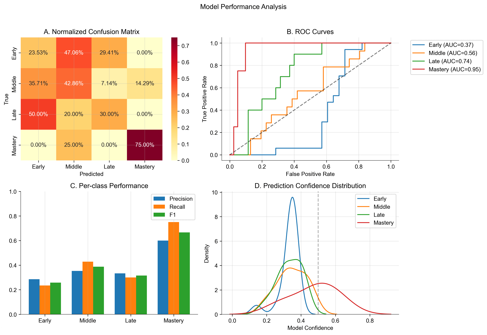

<head>
  <meta charset="UTF-8">
  <meta name="viewport" content="width=device-width, initial-scale=1.0">
  
  <!-- Primary Meta Tags -->
  <meta name="title" content="Learned Spectrum - Teddy Warner">
  <meta name="description" content="Towards temporal understanding in AI through fMRI learning stage classification.">
  <meta name="keywords" content="fMRI, AI, Temporal Understanding">
  <meta name="author" content="Teddy Warner">
  <meta name="robots" content="index, follow">
  
  <!-- Open Graph / Facebook -->
  <meta property="og:type" content="website">
  <meta property="og:url" content="https://teddywarner.org/Projects/LearnedSpectrum/">
  <meta property="og:title" content="Learned Spectrum - Teddy Warner">
  <meta property="og:description" content="Towards temporal understanding in AI through fMRI learning stage classification.">
  <meta property="og:image" content="https://teddywarner.org/assets/images/learnedSpec/hero.png">
  <meta property="og:image:type" content="image/png">
  <meta property="og:image:width" content="1200">
  <meta property="og:image:height" content="630">

  <!-- Twitter -->
  <meta property="twitter:card" content="summary_large_image">
  <meta property="twitter:url" content="https://teddywarner.org/Projects/LearnedSpectrum/">
  <meta property="twitter:title" content="Learned Spectrum - Teddy Warner">
  <meta property="twitter:description" content="Towards temporal understanding in AI through fMRI learning stage classification.">
  <meta property="twitter:image" content="https://teddywarner.org/assets/images/learnedSpec/hero.png">

  <!-- Existing resource links -->
  
  <link rel="preconnect" href="https://fonts.googleapis.com">
  <link rel="preconnect" href="https://fonts.gstatic.com" crossorigin>
  <link href="https://fonts.googleapis.com/css2?family=Crimson+Pro:ital,wght@0,200..900;1,200..900&display=swap" rel="stylesheet">
  <link href="https://fonts.googleapis.com/css2?family=Crimson+Pro:ital,wght@0,200..900;1,200..900&family=JetBrains+Mono:ital,wght@0,100..800;1,100..800&display=swap" rel="stylesheet">
  <link rel="stylesheet" href="../../assets/css/projects/project.css">
  <link rel="stylesheet" href="../../assets/css/projects/vnp.css">
  <link rel="stylesheet" href="../../assets/css/header.css">
</head>

  <nav class="main-navigation">
    <ul>
      <li><a class="home" href="https://teddywarner.com">01 Home</a></li>
      <li><a class="proj" href="https://teddywarner.com/proj/">02 Projects</a></li>
      <li><a class="writ" href="https://teddywarner.com/writ/">03 Writing</a></li>
    </ul>
  </nav>
  
  

  

<a href="https://teddywarner.org/proj"><i class="fa-solid fa-arrow-left-long"></i> Project Feed</a>

# Learned Spectrum

  <a href="https://x.com/WarnerTeddy"> Teddy Warner</a>| Fall-Winter 2024 | <i class="far fa-clock"></i> 18–22 minutes
  
  <a class="fb" title="Share on Facebook" href="https://www.facebook.com/sharer/sharer.php?u=https://teddywarner.org/Projects/LearnedSpectrum"><i class="fa-brands fa-facebook"></i></a>
  <a class="twitter" title="Share on Twitter" href="https://twitter.com/intent/tweet?url=https://teddywarner.org/Projects/LearnedSpectrum&text="><i class="fa-brands fa-x-twitter"></i></a>
  <a class="pin" title="Share on Pinterest" href="https://pinterest.com/pin/create/button/?url=https://teddywarner.org/Projects/LearnedSpectrum&media=&description="><i class="fa-brands fa-pinterest"></i></a>
  <a class="ln" title="Share on LinkedIn" href="https://www.linkedin.com/shareArticle?mini=true&url=https://teddywarner.org/Projects/LearnedSpectrum"><i class="fab fa-linkedin"></i></a>
  <a class="email" title="Share via Email" href="mailto:info@example.com?&subject=&cc=&bcc=&body=https://teddywarner.org/Projects/LearnedSpectrum%0A"><i class="fa-solid fa-paper-plane"></i></a>
  

---

*Towards temporal understanding in AI through fMRI learning stage classification.*

Learned Spectrum was the first research step I took when starting my venture, [Intempus](https://intempus.org). The full preprint may be accessed [here](../assets/misc/Learned_Spectrum.pdf).

!!! abstract "Intempus's Thesis"

    World models cannot truly gain a comprehensive temporal understanding based solely on data collected from robots or purely external observations. 

    *Temporal understanding cannot be trained from data that goes from A -> C. World models must be trained on data that goes from A -> B -> C.*

    The collection of physiological state data may provide insight into man's temporal understanding, and thus how to train a neural network to understand cause and effect.

    Current efforts in world model development often rely heavily on data collected from robotic systems or external observations that we humans can describe (i.e. see chair thrown -> move backward). These observations forgo the subconscious response integral to a human's actions (i.e. see chair thrown -> physiological state change -> move backward).

    If we acknowledge that current AI systems lack a subjective understanding of time, why do we primarily use data from these systems to try to instill temporal understanding?

    Data collected from human subjects could provide a window into how humans subjectively experience time, potentially leading to more sophisticated and human-like temporal reasoning in AI systems.

## Abstract

This research presents a novel approach to understanding temporal cognition through the application of Vision Transformers to functional Magnetic Resonance Imaging (fMRI) data analysis. While current artificial intelligence approaches to world modeling rely heavily on absolute temporal markers and timestamps, human perception of time operates as a fundamentally subjective experience that adapts with cognitive state and learning progress. We demonstrate that neural activation patterns captured during learning through fMRI contain rich temporal information that can inform more nuanced approaches to temporal processing in AI systems. 

Our implementation achieves significant accuracy in learning stage classification through three key technical innovations: 

1. A systematic channel reduction network that efficiently processes high-dimensional fMRI data while preserving critical spatial and temporal patterns.
2. Specialized temporal processing networks that incorporate hemodynamic response characteristics and causal attention mechanisms.
3. Progressive dropout strategies that maintain signal fidelity while encouraging robust feature learning. 

By analyzing these temporal patterns across multiple learning stages and tasks, we demonstrate the feasibility of developing AI systems capable of processing time as a relative rather than absolute construct. This work represents an important step toward artificial intelligence systems that can reason about time in ways that more closely mirror human cognitive processes.

## Introduction

The development of artificial intelligence world models faces a fundamental constraint in temporal processing. While current systems effectively handle timestamp data and sequential predictions, they lack the ability to process time as a subjective, relative construct - a core component of human cognition and learning.

Training world models exclusively on robot-collected data proves insufficient for developing true temporal understanding. We propose that biometric data, specifically neural activation patterns from fMRI, provides essential insights into subjective time perception during learning processes.

This work implements a Vision Transformer architecture optimized for learning stage classification from fMRI data. While fMRI presents known limitations in its reliance on blood-oxygen-level-dependent (BOLD) signals, deep learning architectures can extract temporal patterns that traditional analysis methods miss.

## Theoretical Framework

Our implementation builds on three foundational principles that bridge neuroscience and artificial intelligence:

- Time perception functions as an inherently subjective experience that varies with cognitive state and learning progress
- Effective world models must incorporate mechanisms for understanding and adapting to subjective temporal experiences
- Biometric data, particularly fMRI, provides a unique window into how biological systems process temporal information

Traditional approaches to AI world models process time as a simple progression of timestamped events. However, human cognition demonstrates that temporal perception is deeply integrated with learning states, emotional conditions, and physiological factors. This integration proves essential for causal reasoning and adaptive learning. Our architecture incorporates these principles through specialized temporal processing networks and attention mechanisms that can adapt their temporal processing based on context.

## Background

As we've discussed, current artificial intelligence approaches to world modeling rely heavily on absolute temporal markers and timestamps, human perception of time operates as a fundamentally subjective experience that adapts with cognitive state and learning progress. We've utlized publically avalible fMRI data to demonstrate that neural activation patterns contain rich temporal information that can inform more nuanced approaches to temporal processing in AI systems. 

This work implements a Vision Transformer architecture [^1] [^14] optimized for learning stage classification from fMRI data. While fMRI presents known limitations in its reliance on blood-oxygen-level-dependent (BOLD) signals [^15], deep learning architectures may be able to extract temporal patterns that traditional analysis methods miss.

### Neural Bases of Learning Stages

Human learning progresses through distinct stages characterized by shifting patterns of neural activation [^11]. These transitions are particularly evident in the striatum and medial temporal lobe regions [^12]. Our architecture's design mirrors these biological principles through its progressive processing stages and attention mechanisms.

fMRI captures these learning stages through blood-oxygen-level-dependent (BOLD) signals, providing an indirect but reliable measure of neural activity [^15]. While this indirect measurement presents certain limitations, research has demonstrated correlations between BOLD signal temporal patterns and learning progression [^16]. The robust test-retest reliability of fMRI in classification learning tasks [^10] provides a stable foundation for extracting temporal patterns relevant to learning stages.

## Methods

Our implementation addresses two core challenges: extracting meaningful patterns from complex fMRI data [^16] and developing architectures capable of learning from these patterns [^10]. This section outlines our approach in three parts: data preprocessing implementation, fMRI-specific augmentation strategies, and temporal-aware transformer architecture design [^1] [^14].

### Data Collection and Processing

The implementation utilizes four complementary classification learning datasets from OpenFMRI. Each dataset provides specific insights into temporal learning aspects [^11]. The primary dataset (ds000002) contains data from 17 right-handed subjects performing probabilistic and deterministic classification tasks [^12]. Task structure includes:

- Pure blocks: 10 cycles of 5 classification trials followed by 3 baseline trials
- Mixed blocks: 100 stimuli split equally between probabilistic and deterministic trials

Data acquisition specifications:

- Scanner: 3T Siemens Allegra MRI
- Parameters: TR = 2s, 180 functional T2*-weighted echoplanar images per session
- Resolution: 2mm slice thickness, 2x2mm in-plane resolution
- Enhancement: Multiband acceleration factor of 4

Three additional datasets complement the primary collection:

- ds000011: 14 subjects, single/dual-task classification for attention-modulated learning analysis [^12]
- ds000017: 8 subjects, classification with stop-signal tasks for inhibitory control examination [^10]
- ds000052: Classification with reward contingency reversal for adaptive learning mechanism investigation [^11]

### Preprocessing Pipeline

Our implementation uses a three-stage preprocessing approach based on established neuroimaging practices [^16] with optimizations for temporal pattern preservation. The pipeline integrates spatial normalization and temporal alignment to maintain both anatomical accuracy and temporal fidelity. The complete preprocessing pipeline follows:

\begin{equation}
    x_{\text{processed}} = \mathcal{N}(\mathcal{R}(\mathcal{V}(x)))
\end{equation}

Where $\mathcal{V}$ performs dimension validation, $\mathcal{R}$ applies spatial resizing, and $\mathcal{N}$ implements intensity normalization.

#### Dimension Validation

fMRI acquisitions vary in dimensionality [^16]. Our validation ensures consistent dimensionality while preserving temporal information:

\begin{equation}
    \mathcal{V}(x) = \begin{cases}
        x & \text{if } x \in \mathbb{R}^{H \times W \times D \times T} \\
        x[..., \text{newaxis}] & \text{if } x \in \mathbb{R}^{H \times W \times D} \\
        \text{undefined} & \text{otherwise}
    \end{cases}
\end{equation}

This validation maintains spatial integrity while ensuring proper temporal dimension handling [^15]. Single-volume inputs receive an added temporal dimension for consistent processing.

#### Spatial Resizing

The implementation standardizes spatial dimensions while maintaining anatomical proportions [^16] through trilinear interpolation:

\begin{equation}
    \mathcal{R}(x) = \text{zoom}(x, [\frac{H_t}{H}, \frac{W_t}{W}, \frac{D_t}{D}, 1])
\end{equation}

Target dimensions $(H_t, W_t, D_t) = (64, 64, 30)$ balance spatial resolution and computational efficiency [^10]. The temporal dimension scaling factor of 1 preserves original temporal resolution.

#### Intensity Normalization<

Following fMRI preprocessing protocols [^16], we implement temporal-aware normalization accounting for BOLD signal dynamics:

\begin{equation}
    \mathcal{N}(x_t) = \frac{x_t - \mu_t}{\sigma_t + \epsilon} \;\; \forall t \in T
\end{equation}

Where $\mu_t$ and $\sigma_t$ represent mean and standard deviation at timepoint $t$ and $\epsilon = 1e\text{-}6$ prevents division by zero.

This normalization preserves temporal dynamics while standardizing signal intensity across sessions and subjects [^15]. Independent timepoint normalization maintains relative temporal patterns crucial for learning stage classification.

### Data Augmentation Strategies

Our implementation includes a comprehensive suite of domain-specific augmentation techniques designed to enhance model robustness while respecting the unique characteristics of fMRI data. These techniques are validated through neuroimaging research and carefully adapted for deep learning applications:

#### Temporal Masking

We implement an adaptive temporal dropout mechanism that helps the model learn robust temporal features despite potential signal interruptions or artifacts. The masking strategy:

- Applies random-length masks (1-5 timepoints) to simulate temporal dropouts
- Maintains temporal coherence through continuous masking windows
- Varies mask duration to ensure robustness to different types of signal interruptions

#### Spatial Masking

The implementation incorporates structured dropout in the spatial domain to handle regional signal variations and encourage learning from distributed patterns. Key features include:

- Probability-based masking with empirically optimized threshold values
- Preservation of anatomical structure through contiguous region masking
- Balance between feature preservation and augmentation strength

#### Elastic Deformation

To account for natural variations in brain structure and registration, we apply anatomically-constrained elastic deformations that:

- Preserve biological plausibility through controlled deformation magnitude
- Maintain spatial relationships while introducing realistic variability
- Apply smooth transformations through Gaussian filtering

### Model Architecture

Our architecture combines Vision Transformer principles with specific adaptations for fMRI data processing. The implementation consists of three primary components, each optimized for the unique characteristics of neuroimaging data:

#### Channel Reduction Network

The channel reduction component efficiently processes high-dimensional fMRI input through a dual-stage approach:

- Initial dimensionality reduction from 30 to 16 channels
- Batch normalization and GELU activation for stable training
- Progressive dropout for regularization
- Careful preservation of spatial relationships

#### Temporal Processing

Our temporal processing incorporates hemodynamic response function (HRF) characteristics [^15] through causal attention masking:

\begin{equation}
    M_{ij} = \begin{cases}
        -\infty & \text{if } j < i + 3 \\
        0 & \text{otherwise}
    \end{cases}
\end{equation}

This enforces a 6-second BOLD delay constraint, reflecting established HRF parameters [^16] while maintaining temporal causality in BOLD response learning.

#### Progressive Dropout

We implement a depth-dependent dropout strategy that provides stronger regularization in deeper layers while maintaining high information flow in early layers.

\begin{equation}
    p_i = 0.1 \cdot \frac{i + 1}{12} \;\; \text{for layer } i
\end{equation}

This strategy increases dropout probability with network depth, maintains high information flow in early layers, and improves generalization while preserving low-level features.

### Training Protocol

#### Mixed Precision Training

We implement dynamic loss scaling for numerical stability:

\begin{equation}
    \text{scale}_t = \begin{cases}
        2 \cdot \text{scale}_{t-1} & \text{if no overflow for } 2000 \text{ steps}\\
        \frac{\text{scale}_{t-1}}{2} & \text{if overflow detected}
    \end{cases}
\end{equation}

This adaptive scaling ensures stable training while maintaining computational efficiency.

#### Optimization Strategy

The implementation uses AdamW optimizer with fMRI-validated parameters [^14]:

- Learning rate: $1e\text{-}4$
- Weight decay: 0.05
- Beta parameters: $\beta_1 = 0.9$, $\beta_2 = 0.999$

#### Learning Rate Schedule

We implement a custom warmup-decay schedule optimized for fMRI data processing:

\begin{equation}
    \eta_t = \begin{cases}
        \eta_{\text{base}} \cdot \frac{t}{t_w} & \text{if } t < t_w\\
        \eta_{\text{min}} + \frac{\eta_{\text{base}}-\eta_{\text{min}}}{2}(1 + \cos(\pi\frac{t-t_w}{T-t_w})) & \text{otherwise}
    \end{cases}
\end{equation}

Schedule parameters:

- Base learning rate $\eta_{\text{base}} = 1e\text{-}4$
- Minimum learning rate $\eta_{\text{min}} = 1e\text{-}6$
- Warmup period $t_w = 0.1T$

This provides stable initial training followed by gradual learning rate decay for optimal parameter convergence.

#### Regularization and Early Stopping

We implement comprehensive regularization following established practices [^1]:

- Label smoothing: $\alpha = 0.1$
- L2 regularization: $\lambda = 1e\text{-}4$
- Gradient clipping: norm 5.0

Early stopping criteria definition:

\begin{equation}
    \text{stop} = \begin{cases}
        \text{True} & \text{if } \text{val\_loss}_t > \text{best\_loss} - \delta \text{ for } p \text{ epochs}\\
        \text{False} & \text{otherwise}
    \end{cases}
\end{equation}

Parameters:

- Improvement threshold $\delta = 1e\text{-}4$
- Patience period $p = 7$

## Results

Our implementation demonstrated patterns in learning stage classification from fMRI data, with performance characteristics varying significantly across learning stages. The complete analysis reveals both potential capabilities and areas requiring further refinement.

### Overall Model Performance

The model achieved an overall accuracy of 35.6% across four learning stages, with a balanced accuracy of 42.8% and a macro F1 score of 0.407. 

While exceeding random chance performance (25% for four classes), these metrics highlight the inherent complexity of learning stage classification from neuroimaging data.

The Cohen's Kappa score of 0.093 indicates performance above chance but demonstrates the substantial challenge in achieving consistent classification across all learning stages.

{width="100%" alt="Training Results plots"}

*Figure 1: Comprehensive model performance analysis showing (A) Normalized confusion matrix demonstrating classification patterns across learning stages, (B) ROC curves indicating increasing reliability from early to mastery stages, (C) Per-class performance metrics highlighting strongest performance in mastery classification, and (D) Prediction confidence distributions revealing distinct patterns for each learning stage.*

### Stage-Specific Classification Performance

Performance varied substantially across learning stages, revealing distinct patterns in the model's classification capabilities. The model demonstrated strongest performance in identifying the mastery stage, achieving a precision of 0.600 and recall of 0.750 (F1 = 0.667). The ROC curve for mastery classification shows an impressive AUC of 0.945, suggesting highly distinctive neural activation patterns associated with mastery-level learning.

The middle learning stage showed moderate classification success (precision = 0.353, recall = 0.429, F1 = 0.387), while early and late stages proved more challenging to classify (F1 scores of 0.258 and 0.316 respectively). The confusion matrix reveals a tendency to misclassify early learning stages as middle stages (47.1% of cases), suggesting a gradual transition in neural activation patterns during learning progression.

| Learning Stage | Precision | Recall | F1    | Support | ROC AUC | Mean Conf. | Error Rate |
|---------------|-----------|---------|--------|----------|----------|------------|------------|
| Early         | 0.286     | 0.235   | 0.258 | 17       | 0.368    | 0.437      | 0.765      |
| Middle        | 0.353     | 0.429   | 0.387 | 14       | 0.556    | 0.412      | 0.571      |
| Late          | 0.333     | 0.300   | 0.316 | 10       | 0.740    | 0.389      | 0.700      |
| Mastery       | 0.600     | 0.750   | 0.667 | 4        | 0.945    | 0.528      | 0.250      |
| **Overall**   | 0.407     | 0.428   | 0.347 | 45       | 0.652    | 0.437      | 0.644      |

### Neural Activation Patterns

Analysis of fMRI activation patterns, as exemplified in Figure 2, reveals characteristic spatial distributions associated with different learning stages. The sample brain slice visualization demonstrates the complex nature of the neural activation patterns the model must interpret, with varying intensity values representing normalized BOLD signal strength across different brain regions.

{width="50%" alt="Example f MRI slice"}

*Figure 2: Representative brain slice visualization from early learning stage (z=15, t=118) demonstrating characteristic activation patterns. Intensity values represent normalized BOLD signal strength.*

### Classification Reliability Analysis

The model's reliability metrics provide crucial insight into its decision-making characteristics. The mean confidence of 0.437 with an overconfidence measure of 0.088 indicates relatively calibrated predictions, though the expected calibration error of 0.491 suggests room for improvement in uncertainty estimation. As shown in Figure 1, the confidence distribution shows distinct patterns for each learning stage, with mastery predictions showing a broader, right-skewed distribution compared to the more concentrated distributions of earlier stages.

The ROC curves reveal a clear progression in classification reliability across learning stages: early (AUC = 0.368), middle (AUC = 0.556), late (AUC = 0.740), and mastery (AUC = 0.945). This progression suggests that distinctive neural patterns become increasingly detectable as learning progresses, with mastery showing particularly clear neural signatures.

The mean loss of 1.082 (±0.257) suggests stable model training despite the classification challenges, with the relatively small standard deviation indicating consistent performance across validation folds. These results demonstrate both the promise and limitations of our approach, suggesting that while neural activation patterns contain meaningful information about learning stages, additional architectural innovations may be needed to fully capture the complexity of temporal learning progression in fMRI data.

## Discussion

fMRI data from varaying datasets/test conditions is quite volatile to work with, and reliance on publically avaliable data sources without standerized test conditions certaily dosen't help. Nonethless the above guessing odds results suggests a correlation worth exploring, suggesting that integrating physiological state data into world model training provides essential insights into biological temporal information processing.

Future work should expand beyond fMRI to incorporate the full spectrum of physiological state signals identified in our introduction (facial EMG, heart rate variability, electrodermal activity). This multi-modal physiological state approach, combined with advanced transformer architectures, could enable world models to develop temporal understanding that more closely mirrors human cognitive processes, particularly in causal reasoning and state transitions. 

[^1]: https://arxiv.org/abs/1706.03762
[^2]: https://openreview.net/pdf?id=BZ5a1r-kVsf
[^3]: https://pmc.ncbi.nlm.nih.gov/articles/PMC6904682/
[^4]: https://www.nber.org/system/files/working_papers/w29587/w29587.pdf
[^5]: https://pmc.ncbi.nlm.nih.gov/articles/PMC9824521/
[^6]: https://www.biorxiv.org/content/10.1101/2022.02.28.482337v2.full
[^7]: https://www.pnas.org/doi/10.1073/pnas.1016823108
[^8]: https://pmc.ncbi.nlm.nih.gov/articles/PMC10960227/
[^9]: https://arxiv.org/abs/2302.10035 
[^10]: https://pubmed.ncbi.nlm.nih.gov/16139527/
[^11]: https://www.jstor.org/stable/2891421
[^12]: https://www.nature.com/articles/35107080
[^13]: https://arxiv.org/abs/1803.10122
[^14]: https://arxiv.org/abs/2010.11929
[^15]: https://www.nature.com/articles/nature06976
[^16]: https://doi.org/10.1017/CBO9780511895029

*[FDM]: Fused Deposition Modeling
*[CNC]: Computerized Numerical Control
*[MPCNC]: Mostly Printed Computerized Numerical Control - https://docs.v1engineering.com/mpcnc/intro/
*[SSH]: Secure Shell
*[GPIO]: General-Purpose Input/Output
*[USB]: Universal Serial Bus
*[ETA]: Estimated Time of Arrival
*[ISO]: International Organization for Standardization
*[UPDI]: Unified Program and Debug Interface
*[AVR]: A Family of microcontrollers developed since 1996 by Atmel
*[JTAG]: Joint Test Action Group
*[IDE]: Integrated Development Environment
*[Rx]: Receiving Signal
*[Tx]: Transmitting Signal
*[VCC]: Voltage Common Collector (+)
*[GND]: Ground / Common Drain (-)
*[IC]: Integrated Circuit
*[LED]: Light-Emitting Diode
*[Cap]: Capacitor
*[SPST]: Single Pole Single Throw Switch
*[SPDT]: Single Pole Double Throw Switch
*[DPST]: Double Pole Single Throw Switch
*[DPDT]: Double Pole Double Throw Switch
*[EEPROM]: Electrically Erasable Programmable Read-Only Memory
*[PCB]: Printed Circuit Board
*[PWM]: Pulse Width Modulation
*[SPI]: Serial Peripheral Interface
*[I2C]: Inter-Integrated Circuit
*[UART]: Universal Asynchronous Receiver/Transmitter
*[ADC]: Analog-to-Digital Converter
*[DAC]: Digital-to-Analog Converter
*[MCU]: Microcontroller Unit
*[FPGA]: Field-Programmable Gate Array
*[SLA]: Stereolithography
*[DLP]: Digital Light Processing 
*[SLS]: Selective Laser Sintering
*[PLA]: Polylactic Acid 
*[ABS]: Acrylonitrile Butadiene Styrene 
*[PETG]: Polyethylene Terephthalate Glycol 
*[CAD]: Computer-Aided Design
*[CAM]: Computer-Aided Manufacturing
*[G-code]: A language for controlling CNC machines
*[PID]: Proportional-Integral-Derivative (control loop feedback mechanism)
*[MOSFET]: Metal-Oxide-Semiconductor Field-Effect Transistor
*[BJT]: Bipolar Junction Transistor
*[SMD]: Surface-Mount Device
*[THT]: Through-Hole Technology
*[DIP]: Dual In-line Package
*[ESC]: Electronic Speed Controller
*[BEC]: Battery Eliminator Circuit
*[LiPo]: Lithium Polymer 
*[NiMH]: Nickel-Metal Hydride 
*[EMI]: Electromagnetic Interference
*[ESD]: Electrostatic Discharge
*[fMRI]: functional Magnetic Resonance Imaging
*[BOLD]: Blood-Oxygen-Level-Dependent
*[LLM]: Large Language Model
*[ROC]: Receiver Operating Characteristic
*[AUC]: Area Under the Curve
*[CUDA]: Compute Unified Device Architecture
*[GPU]: Graphics Processing Unit
*[GELU]: Gaussian Error Linear Unit
*[AdamW]: Adam with Weight Decay
*[HRF]: Hemodynamic Response Function
*[F1]: F1 Score - Harmonic mean of precision and recall
*[TR]: Repetition Time
*[T2]: Type 2 MRI weighting
*[3T]: 3 Tesla (magnetic field strength)
*[NURIPS]: Neural Information Processing Systems
*[WANDB]: Weights & Biases
*[VENV]: Virtual Environment