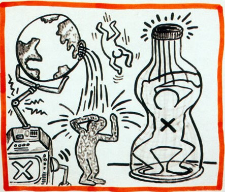
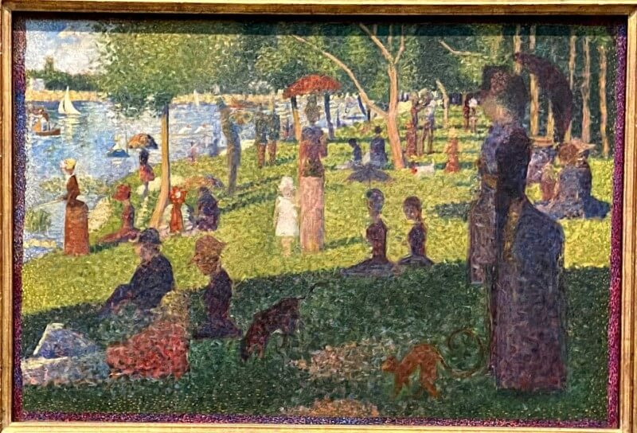
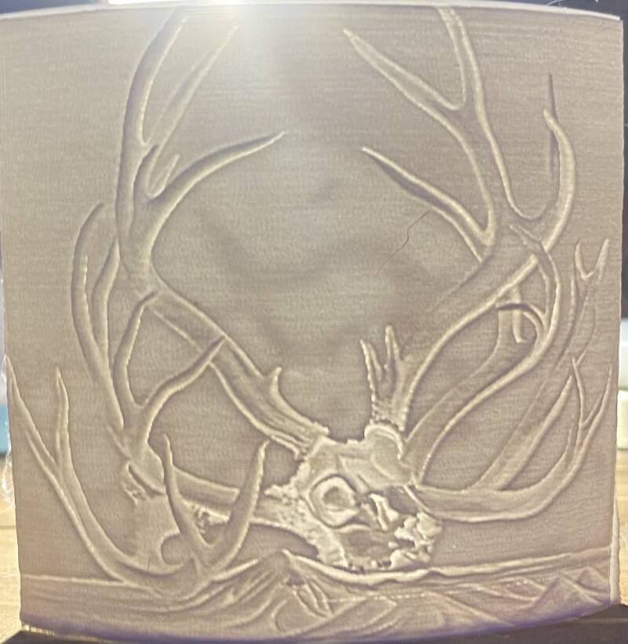

<head>
  <meta charset="UTF-8">
  <meta name="viewport" content="width=device-width, initial-scale=1.0">

  

  <link rel="preconnect" href="https://fonts.googleapis.com">
  <link rel="preconnect" href="https://fonts.gstatic.com" crossorigin>
  <link href="https://fonts.googleapis.com/css2?family=Crimson+Pro:ital,wght@0,200..900;1,200..900&display=swap" rel="stylesheet">
  <link href="https://fonts.googleapis.com/css2?family=Crimson+Pro:ital,wght@0,200..900;1,200..900&family=JetBrains+Mono:ital,wght@0,100..800;1,100..800&display=swap" rel="stylesheet">

  <link rel="stylesheet" href="../../assets/css/projects/project.css">
</head>

  <nav class="main-navigation">
    <ul>
      <li><a class="home" href="http://teddywarner.com">01 Home</a></li>
      <li><a class="proj" href="http://teddywarner.com/proj/">02 Projects</a></li>
      <li><a class="writ" href="http://teddywarner.com/writ/">03 Writing</a></li>
    </ul>
  </nav>

<a href="https://teddywarner.org/proj"><i class="fa-solid fa-arrow-left-long"></i> Project Feed</a>

# Lithophane Experiments

  <a href="https://x.com/WarnerTeddy"> Teddy Warner</a>| 2019-2022 | <i class="far fa-clock"></i> 1-2 minutes
  
  <a class="fb" title="Share on Facebook" href="https://www.facebook.com/sharer/sharer.php?u=https://teddywarner.org/Projects/LithophaneExperiments/"><i class="fa-brands fa-facebook"></i></a>
  <a class="twitter" title="Share on Twitter" href="https://twitter.com/intent/tweet?url=https://teddywarner.org/Projects/LithophaneExperiments/&text=Check%20Out%20this%20compilation%20of%20Litophanes%20on"><i class="fa-brands fa-x-twitter"></i></a>
  <a class="pin" title="Share on Pinterest" href="https://pinterest.com/pin/create/button/?url=https://teddywarner.org/Projects/LithophaneExperiments/&media=&description=Check%20Out%20this%20compilation%20of%20Litophanes%20on%20https://teddywarner.org/Projects/LithophaneExperiments/%20!"><i class="fa-brands fa-pinterest"></i></i></a>
  <a class="ln" title="Share on LinkedIn" href="https://www.linkedin.com/shareArticle?mini=true&url=https://teddywarner.org/Projects/LithophaneExperiments/"><i class="fab fa-linkedin"></i></i></a>
  <a class="email" title="Share via Email" href="mailto:info@example.com?&subject=&cc=&bcc=&body=Check%20Out%20this%20compilation%20of%20Litophanes%20on%20https://teddywarner.org/Projects/LithophaneExperiments/"><i class="fa-solid fa-paper-plane"></i></i></i></a>
  

---

A Lithophane is a piece of art made out of a thin translucent material designed to show an image in a "grisaille" color format when held up to light.[^1] 3D printers can be utilized to create some nice-looking lithophanes, a practice made easy with *3dp.rocks* lithophane generator, linked below. Due to their easy creation, I find lithophanes to be a nice medium to test slicer changes with, allowing for your time to be spent with the slicer settings, and not the file prep. 

!!! note "Note" 

    This page is not documentation on the lithophane making process, but more of a portfolio of some notable lithophanes I've printed since taking up this medium.

[3dp.rocks's Lithophane Generator :fontawesome-solid-earth-americas:](https://3dp.rocks/lithophane/){ .md-button .md-button--primary }

<iframe width="90%" height="495" src="https://www.youtube.com/embed/ZNlbl6uhqbI" title="YouTube video player" frameborder="0" allow="accelerometer; autoplay; clipboard-write; encrypted-media; gyroscope; picture-in-picture" allowfullscreen></iframe>

****

## People

{width="49.5%"}
{width="46.6%"}

{width="51.5%"}
{width="45.7%"}

{width="51.5%"}
{width="46.3%"}

{width="50%"}
{width="46.4%"}

{width="55.5%"}
{width="43%"}

{width="47.2%"}
{width="49.1%"}

{width="51.5%"}
{width="44.5%"}

## Art

{width="51%"}
{width="45%"}

{width="52%"}
{width="46%"}

{width="51.5%"}
{width="44.6%"}

[^1]: https://en.wikipedia.org/wiki/Lithophane

*[FDM]: Fused Deposition Modeling
*[CNC]: Computerized Numerical Control
*[MPCNC]: Mostly Printed Computerized Numerical Control - https://docs.v1engineering.com/mpcnc/intro/
*[SSH]: Secure Shell
*[GPIO]: General-Purpose Input/Output
*[USB]: Universal Serial Bus
*[ETA]: Estimated Time of Arrival
*[ISO]: International Organization for Standardization
*[UPDI]: Unified Program and Debug Interface
*[AVR]: A Family of microcontrollers developed since 1996 by Atmel
*[JTAG]: Joint Test Action Group
*[IDE]: Integrated Development Environment
*[Rx]: Receiving Signal
*[Tx]: Transmitting Signal
*[VCC]: Voltage Common Collector (+)
*[GND]: Ground / Common Drain (-)
*[IC]: Integrated Circuit
*[LED]: Light-Emitting Diode
*[Cap]: Capacitor
*[SPST]: Single Pole Single Throw Switch
*[SPDT]: Single Pole Double Throw Switch
*[DPST]: Double Pole Single Throw Switch
*[DPDT]: Double Pole Double Throw Switch
*[EEPROM]: Electrically Erasable Programmable Read-Only Memory
*[PCB]: Printed Circuit Board
*[PWM]: Pulse Width Modulation
*[SPI]: Serial Peripheral Interface
*[I2C]: Inter-Integrated Circuit
*[UART]: Universal Asynchronous Receiver/Transmitter
*[ADC]: Analog-to-Digital Converter
*[DAC]: Digital-to-Analog Converter
*[MCU]: Microcontroller Unit
*[FPGA]: Field-Programmable Gate Array
*[SLA]: Stereolithography
*[DLP]: Digital Light Processing 
*[SLS]: Selective Laser Sintering
*[PLA]: Polylactic Acid 
*[ABS]: Acrylonitrile Butadiene Styrene 
*[PETG]: Polyethylene Terephthalate Glycol 
*[CAD]: Computer-Aided Design
*[CAM]: Computer-Aided Manufacturing
*[G-code]: A language for controlling CNC machines
*[PID]: Proportional-Integral-Derivative (control loop feedback mechanism)
*[MOSFET]: Metal-Oxide-Semiconductor Field-Effect Transistor
*[BJT]: Bipolar Junction Transistor
*[SMD]: Surface-Mount Device
*[THT]: Through-Hole Technology
*[DIP]: Dual In-line Package
*[ESC]: Electronic Speed Controller
*[BEC]: Battery Eliminator Circuit
*[LiPo]: Lithium Polymer 
*[NiMH]: Nickel-Metal Hydride 
*[EMI]: Electromagnetic Interference
*[ESD]: Electrostatic Discharge