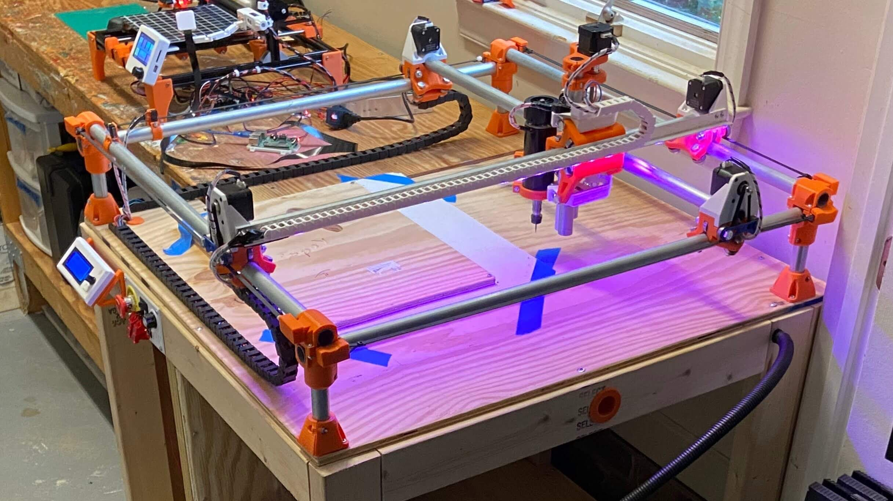

# CNC Milling Workflows (Junior Year - 2022)

<!-- Compleation Badge

Done - https://img.shields.io/badge/progress-done!-success?style=flat-square
Pending - https://img.shields.io/badge/progress-pending%20completion-yellow?style=flat-square
Halted - https://img.shields.io/badge/progress-halted-critical?style=flat-square
Constantly Updating - https://img.shields.io/badge/progress-constantly%20updating-informational?style=flat-square
-->

<!--- Social Links

HTML Link Generator - https://www.websiteplanet.com/webtools/sharelink/

<a class="fb" title="Share on Facebook" href="FACEBOOK-URL"><i class="fab fa-facebook-square"></i></a>
<a class="twitter" title="Share on Twitter" href="TWITTER-URL"><i class="fab fa-twitter"></i></a>
<a class="pin" title="Share on Pinterest" href="PINTEREST-URL"><i class="fab fa-pinterest"></i></a>
<a class="ln" title="Share on LinkedIn" href="LINKEDIN-URL"><i class="fab fa-linkedin"></i></a>
<a class="email" title="Share via Email" href="EMAIL-URL"><i class="fas fa-paper-plane"></i></a>

-->

**:fontawesome-regular-clock: X-X minutes**

<a class="fb" title="Share on Facebook" href="https://www.facebook.com/sharer/sharer.php?u=https://teddywarner.org/Projects/Milling/"><i class="fab fa-facebook-square"></i></a>
<a class="twitter" title="Share on Twitter" href="https://twitter.com/intent/tweet?url=https://teddywarner.org/Projects/Milling/&text=Check%20out%20Bantam%20CNC%20Milling%20on%20teddywarner.org!"><i class="fab fa-twitter"></i></a>
<a class="pin" title="Share on Pinterest" href="https://pinterest.com/pin/create/button/?url=https://teddywarner.org/Projects/Milling/&media=&description=Check%20out%20Bantam%20CNC%20Milling%20on%20teddywarner.org!"><i class="fab fa-pinterest"></i></a>
<a class="ln" title="Share on LinkedIn" href="https://www.linkedin.com/shareArticle?mini=true&url=https://teddywarner.org/Projects/Milling/"><i class="fab fa-linkedin"></i></a>
<a class="email" title="Share via Email" href="mailto:info@example.com?&subject=&cc=&bcc=&body=https://teddywarner.org/Projects/Milling/%0ACheck%20out%20Bantam%20CNC%20Milling%20on%20teddywarner.org!"><i class="fas fa-paper-plane"></i></a>

Subtractive manufacturing is a process I've always found mesmerizing. Although additive processes such as 3D printing allow for the creation of something from seemingly nothing, I believe it's even cooler to watch the morphing of existing stock into a different object. Despite this interest, I feel as though I've barely scratched the surface of CNC - primarily focusing on PCB milling in my subtractive manufacturing projects. I made a first attempt to dive into more subtractive manufacturing work a couple of years ago now when I built [V1 Engineering's](https://www.v1engineering.com/) original [MPCNC](https://docs.v1engineering.com/mpcnc/burly/).

{width="49%"}
{width="49%"}

  <figcaption>My Mostly Printed CNC Machine</figcaption>

I absolutely loved building this machine and recommend it to all interested in understanding the workings of CNC, yet I don't mill on mine all that often, I find more use in using the machine as a GCode dev platform for some of my other projects. 

Since my initial attempted steps with the [MPCNC](https://docs.v1engineering.com/mpcnc/burly/), I've become more versed with CNC milling due to exposure during my Fab Academy [Week 7: Computer Controlled Machineing](https://fabacademy.org/2021/labs/charlotte/students/theodore-warner/Assignments/week07/) assignment. For this assignment, I used the [CLS Fab Lab's](https://www.charlottelatin.org/academics/steam) [ShopBot PRSalpha](https://www.shopbottools.com/products/alpha) to mill the plywood fish tank housing for my Fab Academy [Final Project](https://fabacademy.org/2021/labs/charlotte/students/theodore-warner/Final%20Project/final-project/). I continued my milling work over the summer, running the ShopBot almost daily over July for [Young Engineers of Today's](https://www.youngengineersoftoday.com/) Summer Camps. Last fall, our lab picked up a [Bantam Tools Desktop CNC Milling Machine](https://store.bantamtools.com/collections/machines), Bantam's flagship machine, capable of super-rapid prototyping when partnered with their [Milling Machine Software](https://www.bantamtools.com/software-download). 

{width="54%"}
{width="43%"}

This machine was the needed spark for this CNC milling documentation article and will be the machine most of this page's projects are completed on. Thus, I'll be primarily focusing on a CAM to Bantam workflow in this article, highlighting powerful CAM workflows in [Autodesk Fusion 360](https://www.autodesk.com/products/fusion-360/overview), along with our lab's [Vectric Aspire](https://www.vectric.com/products/aspire) workflow. This article will be based upon a collection of micro-projects to display these workflows, giving me plenty of the subtractive manufacturing projects I've been looking for :smile:.

## Feeds & Speeds

???+ abstract "Feeds & Speeds Terminology"

    `Tool Diameter`

    :   Sed sagittis eleifend rutrum. Donec vitae suscipit est. Nullam tempus
        tellus non sem sollicitudin, quis rutrum leo facilisis.

        

          {width="50%"}
          {width="50%"}

        

    `Flute Count`

    :   Sed sagittis eleifend rutrum. Donec vitae suscipit est. Nullam tempus
        tellus non sem sollicitudin, quis rutrum leo facilisis.

        

          {width="50%"}
          {width="50%"}

        

    `Surface Speed`

    :   Sed sagittis eleifend rutrum. Donec vitae suscipit est. Nullam tempus
        tellus non sem sollicitudin, quis rutrum leo facilisis.    

        

          {width="40%"}
          {width="40%"}

        

    `Chip Load`

    :   Sed sagittis eleifend rutrum. Donec vitae suscipit est. Nullam tempus
        tellus non sem sollicitudin, quis rutrum leo facilisis.   

        

          {width="32%"}
          {width="32%"}

        

    `Spindle Speed`

    :   Sed sagittis eleifend rutrum. Donec vitae suscipit est. Nullam tempus
        tellus non sem sollicitudin, quis rutrum leo facilisis.  

        $$
        Spindle Speed (RPM) = {Surface Speed (ft/min) \over π ∗ {1 \over 12} ∗ Tool Diameter (in)}
        $$

    `Feed Rate`

    :   Sed sagittis eleifend rutrum. Donec vitae suscipit est. Nullam tempus
        tellus non sem sollicitudin, quis rutrum leo facilisis.  

        $$
        Feed Rate (in/min) = Spindle Speed (RPM) ∗ Flute Count ∗ Chip Load (in)
        $$

    `Plunge Rate`

    :   Sed sagittis eleifend rutrum. Donec vitae suscipit est. Nullam tempus
        tellus non sem sollicitudin, quis rutrum leo facilisis.  

        $$
        Plunge Rate(in/min) = Feed Rate (in/min) * {1 \over 2}
        $$

    `Stepdown`

    :   Sed sagittis eleifend rutrum. Donec vitae suscipit est. Nullam tempus
        tellus non sem sollicitudin, quis rutrum leo facilisis.  

        $$
        Stepover(in) = Tool Diameter (in) * {3 \over 5}
        $$

    `Stepover`

    :   Sed sagittis eleifend rutrum. Donec vitae suscipit est. Nullam tempus
        tellus non sem sollicitudin, quis rutrum leo facilisis.  

        $$
        Stepover(in) = Tool Diameter (in) * {9 \over 20}
        $$

### Material Reference

<table>
    <tr>
        <td><b>Material</b></td>
        <td><b>Description</b></td>
    </tr>
    <tr onclick="showHideRow('hidden_row1');">
        <td><i id="right1" class="fas fa-angle-right"></i><i id="down1" class="fas fa-angle-down"></i> Wax</td>
        <td>A easily milled medium, commonly used for casting cores, molds, and CNC program proofs.</td>
    </tr>
    <tr id="hidden_row1" class="hidden_row">
			<td>
        
			</td>
		</tr>
    <tr onclick="showHideRow('hidden_row2');">
        <td><i id="right2" class="fas fa-angle-right"></i><i id="down2" class="fas fa-angle-down"></i> Solid Wood</td>
        <td></td>
    </tr>
    <tr id="hidden_row2" class="hidden_row">
			<td>
        
			</td>
		</tr>
    <tr onclick="showHideRow('hidden_row3');">
        <td><i id="right3" class="fas fa-angle-right"></i><i id="down3" class="fas fa-angle-down"></i> Medium Density Fiberboard <code>MDF</code></td>
        <td></td>
    </tr>
    <tr id="hidden_row3" class="hidden_row">
			<td>
        
			</td>
		</tr>
    <tr onclick="showHideRow('hidden_row4');">
        <td><i id="right4" class="fas fa-angle-right"></i><i id="down4" class="fas fa-angle-down"></i> Oriented Strand Board <code>OBS</code></td>
        <td></td>
    </tr>
    <tr id="hidden_row4" class="hidden_row">
			<td>
        
			</td>
		</tr>
    <tr onclick="showHideRow('hidden_row5');">
        <td><i id="right5" class="fas fa-angle-right"></i><i id="down5" class="fas fa-angle-down"></i> High-density Polyethylene <code>HDPE</code></td>
        <td></td>
    </tr>
    <tr id="hidden_row5" class="hidden_row">
			<td>
        
			</td>
		</tr>
    <tr onclick="showHideRow('hidden_row6');">
        <td><i id="right6" class="fas fa-angle-right"></i><i id="down6" class="fas fa-angle-down"></i> Polyetheretherketone <code>PEEK</code></td>
        <td></td>
    </tr>
    <tr id="hidden_row6" class="hidden_row">
			<td>
        
			</td>
		</tr>
    <tr onclick="showHideRow('hidden_row7');">
        <td><i id="right7" class="fas fa-angle-right"></i><i id="down7" class="fas fa-angle-down"></i> Polyetherimide <code>PEI</code></td>
        <td></td>
    </tr>
    <tr id="hidden_row7" class="hidden_row">
			<td>
        
			</td>
		</tr>
    <tr onclick="showHideRow('hidden_row8');">
        <td><i id="right8" class="fas fa-angle-right"></i><i id="down8" class="fas fa-angle-down"></i> Polyvinyl Chloride <code>PVC</code></td>
        <td></td>
    </tr>
    <tr id="hidden_row8" class="hidden_row">
			<td>
        
			</td>
		</tr>
    <tr onclick="showHideRow('hidden_row9');">
        <td><i id="right9" class="fas fa-angle-right"></i><i id="down9" class="fas fa-angle-down"></i> Polyoxymethylene <code>POM</code></td>
        <td></td>
    </tr>
    <tr id="hidden_row9" class="hidden_row">
			<td>
        
			</td>
		</tr>
    <tr onclick="showHideRow('hidden_row10');">
        <td><i id="right10" class="fas fa-angle-right"></i><i id="down10" class="fas fa-angle-down"></i> Acrylonitrile Butadiene Styrene <code>ABS</code></td>
        <td></td>
    </tr>
    <tr id="hidden_row10" class="hidden_row">
			<td>
        
			</td>
		</tr>
    <tr onclick="showHideRow('hidden_row11');">
        <td><i id="right11" class="fas fa-angle-right"></i><i id="down11" class="fas fa-angle-down"></i> Polycarbonate <code>PC</code></td>
        <td></td>
    </tr>
    <tr id="hidden_row11" class="hidden_row">
			<td>
        
			</td>
		</tr>
    <tr onclick="showHideRow('hidden_row12');">
        <td><i id="right12" class="fas fa-angle-right"></i><i id="down12" class="fas fa-angle-down"></i> Nylon</td>
        <td></td>
    </tr>
    <tr id="hidden_row12" class="hidden_row">
			<td>
        
			</td>
		</tr>
    <tr onclick="showHideRow('hidden_row13');">
        <td><i id="right13" class="fas fa-angle-right"></i><i id="down13" class="fas fa-angle-down"></i> Acrylic</td>
        <td></td>
    </tr>
    <tr id="hidden_row13" class="hidden_row">
			<td>
        
			</td>
		</tr>
    <tr onclick="showHideRow('hidden_row14');">
        <td><i id="right14" class="fas fa-angle-right"></i><i id="down14" class="fas fa-angle-down"></i> Aluminium</td>
        <td></td>
    </tr>
    <tr id="hidden_row14" class="hidden_row">
			<td>
        
			</td>
		</tr>
    <tr onclick="showHideRow('hidden_row15');">
        <td><i id="right15" class="fas fa-angle-right"></i><i id="down15" class="fas fa-angle-down"></i> Brass</td>
        <td></td>
    </tr>
    <tr id="hidden_row15" class="hidden_row">
			<td>
        
			</td>
		</tr>
    <tr onclick="showHideRow('hidden_row16');">
        <td><i id="right16" class="fas fa-angle-right"></i><i id="down16" class="fas fa-angle-down"></i> Copper</td>
        <td></td>
    </tr>
    <tr id="hidden_row16" class="hidden_row">
			<td>
        
			</td>
		</tr>
    <tr onclick="showHideRow('hidden_row17');">
        <td><i id="right17" class="fas fa-angle-right"></i><i id="down17" class="fas fa-angle-down"></i> Steel</td>
        <td></td>
    </tr>
    <tr id="hidden_row17" class="hidden_row">
			<td>
        
			</td>
		</tr>
    <tr onclick="showHideRow('hidden_row18');">
        <td><i id="right19" class="fas fa-angle-right"></i><i id="down19" class="fas fa-angle-down"></i> Insulation Foam</td>
        <td></td>
    </tr>
    <tr id="hidden_row18" class="hidden_row">
			<td>
        
			</td>
		</tr>
</table>

[Fablab Feeds and Speeds Calcuator](https://pub.pages.cba.mit.edu/feed_speeds/)

[Narrowing Material Options for CNC Machining](https://www.protolabs.com/resources/design-tips/cnc-machining-materials/)

[CNC Milling Materials: What Are They & Which Should You Choose for Your Application?](https://www.3erp.com/blog/cnc-milling-materials-choose-application/)

[Selecting the Right CNC Material](https://www.hubs.com/knowledge-base/selecting-right-cnc-material/)

### Feeds & Speeds Calcuator

!!! example ""

    Metric? <input type="checkbox" id="units" onclick="unit()">

    Tool Diameter (inmm): <input class="calcinput" id="diameter" type="text">
          
    Flute Count: <input class="calcinput" id="flutes" type="text">
          
    Surface Speed (ft/minM/min): <input class="calcinput" id="surface" type="text">
          
    Chip Load (inmm): <input class="calcinput" id="chips" type="text">
      
    

    Spindle Speed (RPM): <input class="calcinput" id="speed" type="text" disabled>
          
    Feed Rate (in/minmm/min): <input class="calcinput" id="feed" type="text" disabled>
          
    Plunge Rate (in/minmm/min): <input class="calcinput" id="plunge" type="text" disabled>
          
    Stepdown (inmm): <input class="calcinput" id="down" type="text" disabled>
          
    Stepover (inmm): <input class="calcinput" id="over" type="text" disabled>
          
        
    <button class="calcbutton" onclick="calculate()"> Calculate </button>
    <button class="calcbutton" onclick="myFunction()"> Clear </button>

## Fusion 360 CAM

{width="100%"}

[Fusion 360 Manufacturing Overview](https://help.autodesk.com/view/fusion360/ENU/?guid=GUID-BEC5DEA9-AC3E-4FA8-998E-4AE8CD0D0B1E)

[Fusion 360 & Bantam Milling](https://support.bantamtools.com/hc/en-us/articles/115001671574-Fusion-360)

[Fusion 360 Bantam Tool Library](https://support.bantamtools.com/hc/article_attachments/115002419813/Bantam%20Tools%20Tool%20Library%200.3.zip)

### Wax Seal Stamp

### Chocolate Molding

## Vectric Aspire

{width="55%"}

[VCarve & Bantam Milling](https://support.bantamtools.com/hc/en-us/articles/115001668333-VCarve)

[Bantam Post-processer for Vectric Aspire](https://support.bantamtools.com/hc/en-us/article_attachments/115002242053/Othermill_tinyG_mm.pp.zip )

### Topography Paper Weight

[Terrain2STL :fontawesome-solid-earth-americas:](https://jthatch.com/Terrain2STL/){ .md-button .md-button--primary}

{width="55%"}
  <figcaption>Caption</figcaption>

{width="100%"}
  <figcaption>Caption</figcaption>

{width="55%"}
  <figcaption>Caption</figcaption>

## Autodesk Eagle

{width="100%"}

### PCB Badge

Inkscape to Eagle

*[FDM]: Fused Deposition Modeling
*[CNC]: Computerized Numerical Control
*[MPCNC]: Mostly Printed Computerized Numerical Control - https://docs.v1engineering.com/mpcnc/intro/
*[SSH]: Secure Shell
*[GPIO]: General-Purpose Input/Output
*[USB]: Universal Serial Bus
*[Baudrate]: Measurement of Symbol Rate
*[ETA]: Estimated Time of Arrival
*[GCode]: A software programming language used to control a CNC machine
*[Git]: Software for tracking changes in any set of files
*[GUI]: Graphical User Interface
*[Parametric]: Parametric design is a process based on algorithmic thinking that enables the expression of parameters and rules that, together, define, encode and clarify the relationship between design intent and design response.
*[ISO]: International Organization for Standardization
*[Kreg-Jig]: A Pocket-Hole Jig
*[UPDI]: Unified Program and Debug Interface
*[AVR]: A Family of microcontrollers developed since 1996 by Atmel
*[programmer]: A piece of electronic equipment that arranges written software to configure programmable non-volatile integrated circuits
*[jtag]: Joint Test Action Group
*[IDE]: Integrated Development Environment
*[Rx]: Receiving Signal
*[Tx]: Transmitting Signal
*[VCC]: Voltage Common Collector (+)
*[GND]: Ground / Common Drain (-)
*[IC]: Integrated Circuit
*[LED]: Light-Emitting Diode
*[Cap]: Capacitor
*[SPST]: Single Pole Single Throw Switch
*[SPDT]: Single Pole Double Throw Switch
*[DPST]: Double Pole Single Throw Switch
*[DPDT]: Double Pole Double Throw Switch
*[EEPROM]: Electrically Erasable Programmable Read-Only Memory