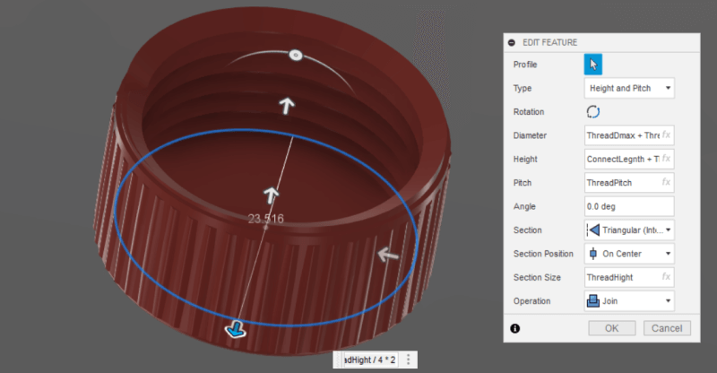
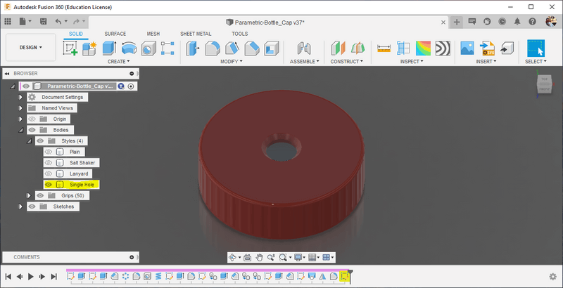

<link rel="stylesheet" href="../../assets/css/projects/project.css">

<script src="https://kit.fontawesome.com/79ff35ecec.js" crossorigin="anonymous"></script>

# Parametric Bottle Cap Generator

<!--- Social Links

HTML Link Generator - https://www.websiteplanet.com/webtools/sharelink/

<span class="share" style=" color: inherit;">
<a class="fb" title="Share on Facebook" href="FACEBOOK-URL"><i class="fab fa-facebook-square"></i></a>
<a class="twitter" title="Share on Twitter" href="TWITTER-URL"><i class="fab fa-twitter"></i></a>
<a class="pin" title="Share on Pinterest" href="PINTEREST-URL"><i class="fab fa-pinterest"></i></a>
<a class="ln" title="Share on LinkedIn" href="LINKEDIN-URL"><i class="fab fa-linkedin"></i></a>
<a class="email" title="Share via Email" href="EMAIL-URL"><i class="fas fa-paper-plane"></i></a>
</span>

-->

<div style="margin-top: -0.8em;">
  <span class="abtlinks"><a href="https://teddywarner.org/About-Me/about/"><span class="abt" style="font-weight: 300; padding-left: 6px;"> Teddy Warner</a><span class="abt" style="font-weight: 300; padding-left: 6px;"><span class="year">| Fall, 2021 </span>| <i class="far fa-clock"></i> 6-7 minutes</span></span></span>
  <span class="share" style=" color: inherit;">
  <a class="fb" title="Share on Facebook" href="https://www.facebook.com/sharer/sharer.php?u=https://teddywarner.org/Projects/ParametricGenerator/"><i class="fab fa-facebook-square"></i></a>
  <a class="twitter" title="Share on Twitter" href="https://twitter.com/intent/tweet?url=https://teddywarner.org/Projects/ParametricGenerator/&text=Check%20Out%20the%20Parametric%20Bottle%20Cap%20Generator%20on"><i class="fab fa-twitter"></i></a>
  <a class="pin" title="Share on Pinterest" href="https://pinterest.com/pin/create/button/?url=https://teddywarner.org/Projects/ParametricGenerator/&media=&description=Check%20Out%20the%20Parametric%20Bottle%20Cap%20Generator%20on%20https://teddywarner.org/Projects/ParametricGenerator/%20!"><i class="fab fa-pinterest"></i></a>
  <a class="ln" title="Share on LinkedIn" href="https://www.linkedin.com/shareArticle?mini=true&url=https://teddywarner.org/Projects/ParametricGenerator/"><i class="fab fa-linkedin"></i></a>
  <a class="email" title="Share via Email" href="mailto:info@example.com?&subject=&cc=&bcc=&body=Check%20Out%20the%20Parametric%20Bottle%20Cap%20Generator%20on%20https://teddywarner.org/Projects/ParametricGenerator/"><i class="fas fa-paper-plane"></i></a>
  </span>
</div>

---

Lost a lid or just want a more functional cap? Generate and print your own, compatible with any existing threads!

<center>

{width="100%"}

*Be Sure to check out this projects page on [PrusaPrinters](https://www.prusaprinters.org/prints/76271-parametric-bottle-cap-generator), and its [Instructable](https://www.instructables.com/Parametric-Bottle-Cap-Generator/)!*

[Parametric Bottle Cap Generator Files :fontawesome-brands-github:](https://github.com/Twarner491/project-files/blob/main/Parametric%20Generators/Parametric%20Bottle%20Cap%20Generator.f3d){: align=right .md-button .md-button--primary }

</center>

## CAD & Testing

This model was designed in Fusion 360 and uses 3 required input parameters and [standard Metric thread profile](https://amesweb.info/Screws/metric-thread-profile-form-formula.aspx) equations to generate a cap that will perfectly fit any of your threaded containers. Input Parameters can be found from an existing threaded connector following the documentation below and their values can be written in their corresponding Expression boxes in the Parameters spreadsheet of the attached Parametric Bottle Cap Fusion 360 file (shown below)

<center>

{width="95%"}

</center>

!!! abstract "Project Origins"

    I originally set out to make this generator due to a need for a lower profile cap for the isopropyl alcohol bottle I keep next to my printer. The thread profile of this bottle is rather abnormal, and thus I found myself finding thread component values with [standard Metric thread profile](https://amesweb.info/Screws/metric-thread-profile-form-formula.aspx) equations, the same used by the generator. 

Following the standard Metric thread profile[^1] (displayed in the diagram below)...

<center>

{width="75%"}

</center>

The model derives all necessary values from three required input parameters, all of which are fed into Fusion 360's coil tool, creating entirely parametrically generated threads. The calculations for user parameters derived from the three required input parameters are as followed ...

 - Thread Height - 0.8660254037844386 * ThreadPitch
 - Hole Size - ConnectDiamater + ThreadHight
 - ThreadDmax - ConnectDiamater
 - ThreadDmin - ThreadDmax - 2 * 5 / 8 * ThreadHight
 - Cap Diamater - *HoleSize + ThreadHight*
 - Cap Height - *ConnectLegnth + ThreadPitch / 2 + 1.5 mm*

The implementation of these [standard Metric thread profile](https://amesweb.info/Screws/metric-thread-profile-form-formula.aspx) equations in a Fusion model parametrically was the real kicker of this design. Unfortunately, Fusion's native thread tool is incompatible with user parameters and thus was unusable in the case of this generator. In its place, I utilized Fusion's coil tool, manipulating the values found in the generator's user parameters to create the caps inner threads. The final working coil tool calculations are as followed ...

 - Diameter - *ThreadDmax + ThreadHight / 4 * 2*
 - Height - *ConnectLegnth + ThreadPitch / 2*
 - Pitch - *ThreadPitch*
 - Angle - *0.0 deg*
 - Selection Size - *ThreadHeight*

all of which are included, shown below, to generate the cap's threads.

<center>

{width="95%"}

</center>

Following the Generation of the caps thread, an inner contour is added defined by the ISO 965-1 standard[^2] - shown in the diagram below.

<center>

{width="50%"}

</center>

This standard calls for radius value *ThreadPitch / 4*, and thus the following values are used in the inner contour ...

 - Radius - *ThreadPitch / 4*
 - Radius Type - *Constant*

The contour is created with Fusion's Fillet tool and the prior mentioned values, shown below.

<center>

{width="95%"}

</center>

All this yields the successful basic generator, embedded below ...

<center>

<iframe src="https://myhub.autodesk360.com/ue2cecd93/shares/public/SH9285eQTcf875d3c539495c089187ac95b8?mode=embed" width="95%" height="500" allowfullscreen="true" webkitallowfullscreen="true" mozallowfullscreen="true"  frameborder="0"></iframe>

</center>

... however, what fun would a custom cap generator be without a little customization. The generator includes four different body styles,

 1. Plain
 2. Single-Hole
 3. Salt-Shaker
 4. Lanyard

... allowing for total cap customization. These styles can be changed, along with two other customization factors, discussed in the *Cap Generation* section below.

## Cap Generation -

For documentation purposes, I created a new cap for my Nalgene water bottle …

### Required Measurements 

There are three measurements required to generate your cap, all of which can be taken from the existing threaded connector … 

1. [x] **Connector Diameter -**
Measure the diameter (in MM) of your existing connector, from the very farthest point (i.e. the point of the thread) on either side. 
<center>
{width="95%"}
</center>
Then, update the Expression value in the ConnectDiameter row (the box highlighted yellow below) with this found value.
<center>
{width="95%"}
</center>

2. [x] **Connector Length -**
Measure the height (in MM) of your existing connector, from the top lip to underneath the threads.
<center>
{width="95%"}
</center>
Then, update the Expression value in the ConnectLegnth row (the box highlighted yellow below) with this found value.
<center>
{width="95%"}
</center>
 
3. [x] **Thread Pitch -**
Measure the thread pitch of your existing connector, the distance in MM between the points of two sequential threads. 
<center>
{width="95%"}
</center>
Then, update the Expression value in the ThreadPitch row (the box highlighted yellow below) with this found value.
<center>
{width="95%"}
</center>

### Optional Customization

To offer a bit more customization to each generated cap, there are a couple of different preferences allowing for different functions.

1. [ ] **Number of Grips -**
The number of grips lining the edge of the cap can be changed in the Expression value of the NumofGrips row. I find values between 40 through 55 work best, but if your experimenting, going below 11 will stop the generation of grip chamfered.
<center>
{width="95%"}
</center>

2. [ ] **Grip Depth -**
The depths of these grips can be altered, determining how grippy your grips are. I've found a value around 0.3 or 0.4 offers a good texture around the edge.
<center>
{width="95%"}
</center>

3. [ ] **Lid Style -**
The lid style of your cap can be toggled between 4 presets in the Fusion Parametric Bottle Cap file by navigating to

```
Parametric-Bottle_Cap > Bodies > Styles
```

in the Fusion browser. The lid styles can be toggled between via the eye icon to the left of each style. The four styles are included below, with each of the toggles highlighted.

1. Plain -
<center>
{width="95%"}
</center>
2. Single Hole -
<center>
{width="95%"}
</center>
3. Salt Shaker -
<center>
{width="95%"}
</center>
4. Lanyard -
<center>
{width="95%"}
</center>

!!! success "Congrats!"

    You've successfully generated your own bottle cap!,

[^1]: https://amesweb.info/Screws/metric-thread-profile-form-formula.aspx
[^2]: https://www.iso.org/standard/57778.html

*[FDM]: Fused Deposition Modeling
*[CNC]: Computerized Numerical Control
*[MPCNC]: Mostly Printed Computerized Numerical Control - https://docs.v1engineering.com/mpcnc/intro/
*[SSH]: Secure Shell
*[GPIO]: General-Purpose Input/Output
*[USB]: Universal Serial Bus
*[Baudrate]: Measurement of Symbol Rate
*[ETA]: Estimated Time of Arrival
*[GCode]: A software programming language used to control a CNC machine
*[Git]: Software for tracking changes in any set of files
*[GUI]: Graphical User Interface
*[Parametric]: Parametric design is a process based on algorithmic thinking that enables the expression of parameters and rules that, together, define, encode and clarify the relationship between design intent and design response.
*[ISO]: International Organization for Standardization
*[Kreg-Jig]: A Pocket-Hole Jig
*[UPDI]: Unified Program and Debug Interface
*[AVR]: A Family of microcontrollers developed since 1996 by Atmel
*[programmer]: A piece of electronic equipment that arranges written software to configure programmable non-volatile integrated circuits
*[jtag]: Joint Test Action Group
*[IDE]: Integrated Development Environment
*[Rx]: Receiving Signal
*[Tx]: Transmitting Signal
*[VCC]: Voltage Common Collector (+)
*[GND]: Ground / Common Drain (-)
*[IC]: Integrated Circuit
*[LED]: Light-Emitting Diode
*[SPST]: Single Pole Single Throw Switch
*[SPDT]: Single Pole Double Throw Switch
*[DPST]: Double Pole Single Throw Switch
*[DPDT]: Double Pole Double Throw Switch
*[EEPROM]: Electrically Erasable Programmable Read-Only Memory