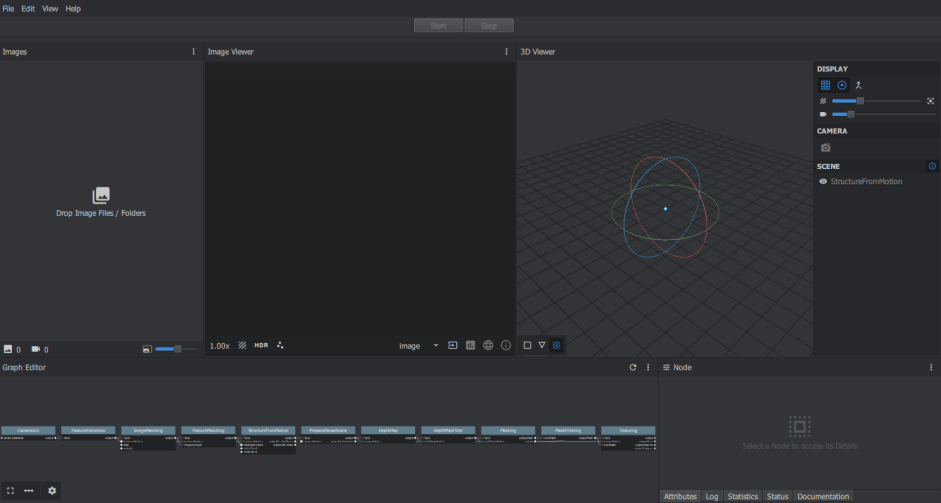
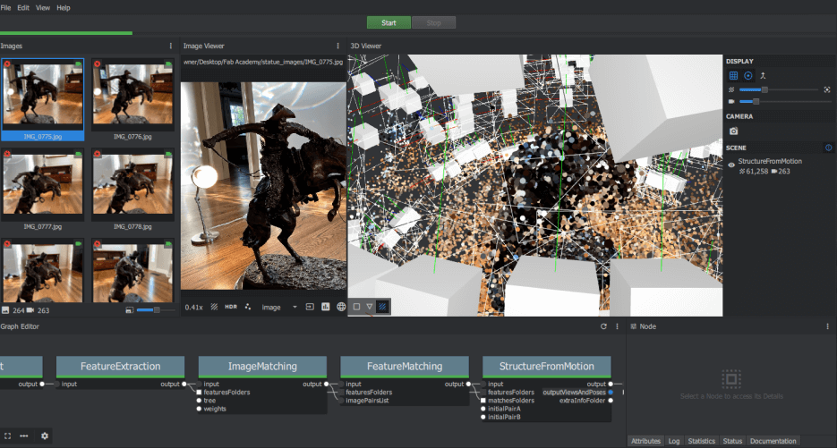
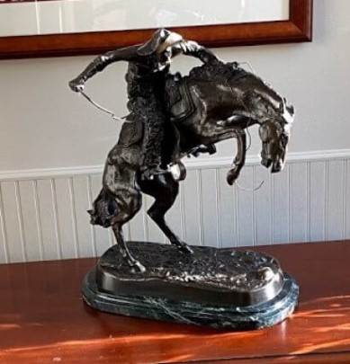
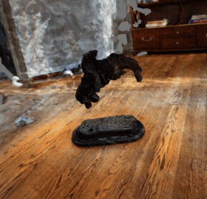
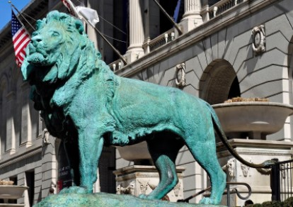
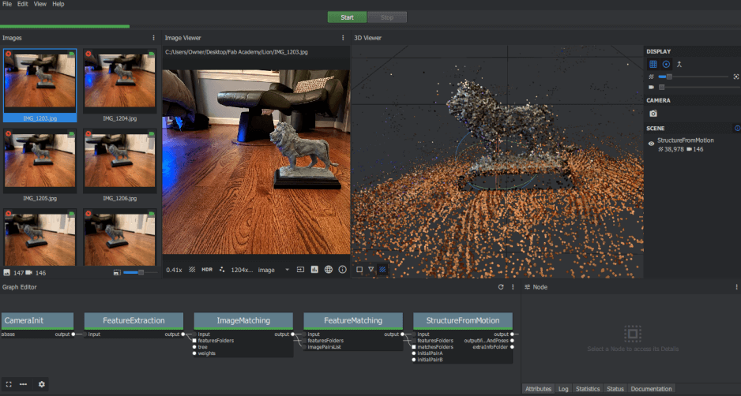
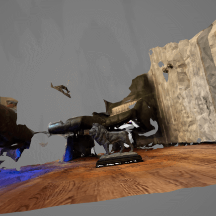
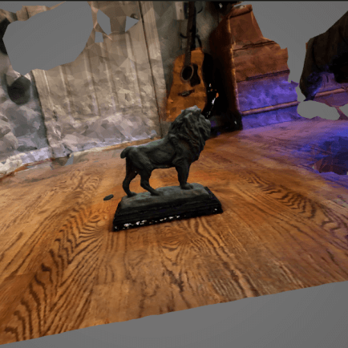
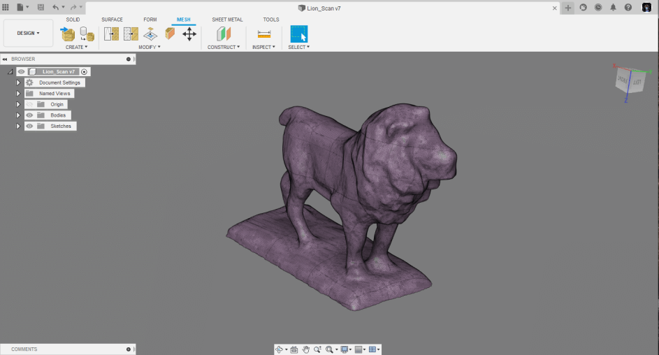

# Photogrammatry Expirements (Junior Year - 2021)

<!-- Compleation Badge

Done - https://img.shields.io/badge/progress-done!-success?style=flat-square
Pending - hhttps://img.shields.io/badge/progress-pending%20completion-yellow?style=flat-square
Halted - https://img.shields.io/badge/progress-halted-critical?style=flat-square
Constantly Updating - https://img.shields.io/badge/progress-constantly%20updating-informational?style=flat-square
-->

**X-X minutes :octicons-book-16:**

To complete my Fab Academy week 5 3D scanning assignment, I took advantage of [Meshroom](https://alicevision.org/#meshroom), a software that renders a mesh based on many pictures of an object, a practice called photogrammetry. I've experimented with Meshroom a couple of months before starting Fab Academy after watching [this video](https://www.youtube.com/watch?v=1D0EhSi-vvc) about the software and the practice of photogrammetry by Prusa Research, however, I was never really able to get a successful scan. Despite my lack of luck, these experiments, along with the Prusa Research video gave me some knowledge on the workings of Meshroom, and some best practices to keep in mind while scanning an object using it.

{width="95%"}
  <figcaption>Image of the Meshroom Application Interface</figcaption>

### Remington Bronze Horse Sculpture

On my first attempt at scanning with Meshroom, I tried scanning a Bronze Horse Sculpture we had on a table in the entrance of our house. The first step to photogrammetry 3d scanning is to take lots of pictures of your object. As described in the Prusa Research [Photogrammatry Video](https://www.youtube.com/watch?v=1D0EhSi-vvc) referenced earlier, it is best to take these pictures by going around and object in a circular pattern, varying the height of the shot and the closeness to the object in each circle. I set up the sculpture in the middle of an open area in my house and took just over 250 pictures of the sculpture in these circular patterns. Meshroom recommends a minimum of 50-100 images to generate a mesh, so this 250 was plenty. Although this process of taking images could be sped up by taking a video of the object, as said in Prusa's video, this is not recommended as the quality of the images will not be nearly as high, and therefore the mesh may not turn out. I took all these images on my phone camera, and send them to my computer through the cloud, where I imported them into the meshroom interface. A quick note is I set up my camera to save images as *.jpeg* files over the *.heic* standard, as the *.heic* file format is not supported in Meshroom. The meshroom interface comes equipped with a *Graph editor* section, where a user can change the processes ran when rendering a mesh, and chose to start and end processes early. After importing all of my *.jpeg* image files by dragging them into the interface, I ran a *StructureFromMotion* compute. This processes all of the images to the point where the user can see a *StructureFromMotion* plot in Meshroom's 3D viewer. This plot is not the full render of the object, but instead is just a map of all the camera positions where images were taken, as well as points generated from the images. Running this *StructureFromMotion* compute over the full rendering process is a way to be certain Meshroom is doing a good job generating points for your object and is significantly less time-consuming than a full render. 

{width="95%"}
  <figcaption>Meshroom Interface After StructureFromMotion Compute</figcaption>

The plot generated from the *StructureFromMotion* compute of my horse sculpture scan looked good after review, and I continued with the object render itself, by clicking the *start* button at the top of the interface. This mesh took around 2 hours to render on my laptop and left me with a textured *.obj* file of my horse sculpture. Unfortunately, although recognizable, the mesh generation failed, and my sculpture mesh was missing the legs and the arms of the horse rider. My theory behind this failure lies in the images taken of the sculpture and the properties of the sculpture itself, as the points generated by Meshroom seemed to form a complete mesh. Although I took note of the lighting in my picture taking, I think the bronze material the sculpture was made out of reflected too much light in too many different ways throughout the picture taking process, and therefore Meshroom couldn't generate a proper mesh of the sculpture.

{width="46%"}
{width="50%"}
  <figcaption>Orginal Statue vs Final Scanned Mesh</figcaption>

### Chicago Art Museum Lion

{: align=left }

After my fruitless attempts at scanning the bronze horse sculpture, I gave the object I wanted to scan some more thought. I settled on a bookrest modeled after one of the lions in front of Chicago's art museum, as the size of the bookrest was great, and the whole object was coated in a non-reflective paint. I followed the same steps I used to take and process images of the horse sculpture for this lion bookrest, however, during the picture taking process I took extra caution to ensure constant lighting. Apple's night mode helped me with this, as once I set in the night mode settings, each image of the lion would have the same lighting. Despite its help, this night mode tool also slowed me down quite a bit as when in use there is a 6-7 second processing time after each image was taken, which added up quickly with the almost 150 images taken of this lion.

{width="95%"}
  <figcaption>Meshroom Interface After StructureFromMotion Compute</figcaption>

Just like in my first scan, once I had imported all images take of the lion bookrest, I ran a *StructureFromMotion* compute to see all generated points by Meshroom. After this process completed, I noticed the I was missing points along the underside of the lion, so I used the same night mode process used before to take some from the underside of the bookrest, imported these into Meschroom along with all the other images, and ran another *StructureFromMotion* compute. This point cloud looked(shown above) much better than the prior, and after its completion, I rendered the entire mesh by again, clicking the *start* button at the top of the interface. This render took just under 2 hours, and yielded a complete mesh of the lion, with relatively high detail on all parts except for some missing bits of tail.

{width="47%"}
{width="46.8%"}
  <figcaption>Front & Back of Final Scanned Mesh of the Lion Bookrest</figcaption>

 I was pretty happy with this final lion mesh generated, so I moved on to cleaning up the *.obj* files in Fusion 360s *Mesh* interface. One fault of using Meshroom to 3D scan an object is how good Meshroom is a creating point. After opening in Fusion, I found my lion model was surrounded with a large chaotic shape that meshroom put together representing the background in all of the images, so some cleanup was required to delete all this excess mesh from the part I wanted, the lion. 

{width="95%"}
  <figcaption>Orginal Lion Mesh Generated by Meshroom in Fusion</figcaption>

I used Fusion 360's *Mesh* workspace to interact with my scanned mesh. To separate and delete the excess parts of my mesh I used the *Plane Cut* tool in the *Mesh* workspace. This allowed me to select a plane that I could cut into the mesh with, and delete the unwanted half. I used this tool to remove excess from all four sides of the mesh, as well as to flatten out the base bit of the model. Once I was happy with this and left with just the lion scan, I used the *Make Closed Mesh* tool to fill in any parts of the scanned mesh that were incomplete, and I was ready to export my model for 3D printing.

{width="95%"}
  <figcaption>Lion Body after Cleanup Work in Fusion 360</figcaption>

