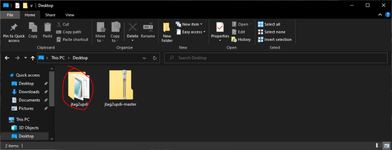
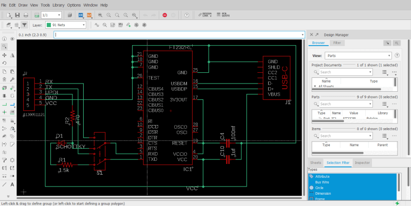
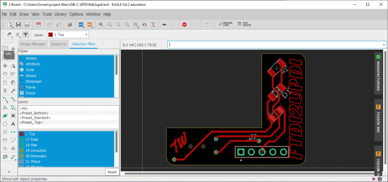

# USB-C UPDI Serial Programmer (Junior Year - 2021)

<!-- Compleation Badge


Done - https://img.shields.io/badge/progress-done!-success?style=flat-square
Pending - https://img.shields.io/badge/progress-pending%20completion-yellow?style=flat-square
Halted - https://img.shields.io/badge/progress-halted-critical?style=flat-square
Constantly Updating - https://img.shields.io/badge/progress-constantly%20updating-informational?style=flat-square
-->


**X-X minutes :octicons-book-16:**

Many modern small chipsets rely on the Unified Program and Debug Interface (UPDI), a one-wire interface allowing for the changing of fuzes, burning of bootloaders, or uploading of sketches to any AVR Dx-series parts or any modern [AVR Microcontrollers](https://www.microchip.com/en-us/products/microcontrollers-and-microprocessors/8-bit-mcus/avr-mcus). Due to their reliance on the Unified Program and Debug Interface, these parts cannot be programmed with classic ISP style programmers, and thus a UPDI enabled programmer is required. Although UPDI is the only programming option in the case of these parts, the one-wire interface is superior to the four-wire of a classic ISP programmer and allows for quicker programming setup and less cluttered boards due to fewer programming pins. This USB-C UPDI programmer is built with a [Ft232rl](https://ftdichip.com/products/ft232rl/) chip allowing for serial interfacing, and runs alongside the [megaTinyCore](https://github.com/SpenceKonde/megaTinyCore) library witch equips your IDE for serial UPDI programming via a portable python implementation.

## [MegaTinyCore](https://github.com/SpenceKonde/megaTinyCore) Documentation

In short, the [megaTinyCore](https://github.com/SpenceKonde/megaTinyCore) library is "An Arduino core for the tinyAVR 0-series, 1-series, and now the 2-series"([mTC Gtihub](https://github.com/SpenceKonde/megaTinyCore)). The [megaTinyCore](https://github.com/SpenceKonde/megaTinyCore) project was created and maintained by [SpenceKonde](https://github.com/SpenceKonde). As mentioned above, the library equips your IDE for UPDI programming via a portable python installation and can be used alongside a handful of different programmer types. The USB-C UPDI Serial programmer documented alter on this page is currently the optimal choice out of these options due to its low component requirement and faster speeds than other programmers. In addition to serial programmers, One can use a 328p based board as a programmer (i.e. an Arduino or any of its clones) via [megaTinyCore's](https://github.com/SpenceKonde/megaTinyCore) *jtag2updi* sketch, or a designated microchip programming board or and UPDI programming tool that mimicks any listed above. [Dr. Adam Harris](http://sheekgeek.org/), a mentor of mine during my cycle of [Fab Academy](https://fabacademy.org/) has a [Simple Fab-jtag2UPDI Board](http://sheekgeek.org/2020/adamsheekgeek/simple-fab-jtag2updi-board) project where a 328p based board is used alongside the jtag2UPDI sketch and is a great option when creating an In-Circuit programmer though the library. I manufactured this board during my [Electronics Production](https://fabacademy.org/2021/labs/charlotte/students/theodore-warner/Assignments/week04/) and continued to use it for the next 16 weeks of the course.

### Package Installation

**Arduino 1.8.13 is recommended** for use with the [megaTinyCore](https://github.com/SpenceKonde/megaTinyCore) library

Recent updates to the [megaTinyCore](https://github.com/SpenceKonde/megaTinyCore) library have simplified the installation process significantly. The library relies upon a board package that can be installed via the board manager witch can be installed with 3 simple steps included below (provided from this installation [page](https://github.com/SpenceKonde/megaTinyCore/blob/master/Installation.md)).

```
http://drazzy.com/package_drazzy.com_index.json
```
1. File -> Preferences, enter the above URL in "Additional Boards Manager URLs"
2. Tools -> Boards -> Boards Manager...
3. Select *megaTinyCore by Spence Konde* and click "Install". For best results, choose the most recent version.

### jtag2UPDI Programming

<center>

[Download the Latest jtag2udpi Sketch :fontawesome-solid-download:](https://github.com/SpenceKonde/jtag2updi){ .md-button .md-button--primary }

</center>

As mentioned prior, *jtag2updi* is a sketch from the [megaTinyCore](https://github.com/SpenceKonde/megaTinyCore) library, allowing for the use of a 328p-based board (i.e. Arduino or a clone) as an In-Circuit programmer. To begin with, this programming approach, download the latest version of the *jtag2udpi* sketch via the button above (Code -> *Download Zip*).

Extract the contents of this downloaded sketch folder by first unzipping the downloaded folder and next moving the contained sketch folder in the unzipped folder to a separate location. Finally, **Rename this sketch folder to *jtag2updi***, leaving you with a folder similar to the one circled in red in the image below.

<center>

{width="95%"}

</center>

Inside of this *jtag2updi* folder, navigate to the *jtag2UPDI.ino* project - circled and highlighted below - and open it in your IDE. 

<center>

{width="95%"}

</center>

This will open the *jtag2updi* project file system, leaving you with a blank *jtag2updi* sketch followed by multiple file tabs in your IDE (like shown in the picture below).

<center>

{width="95%"}

</center>

You can next upload this sketch to your 328p-based board of choice as you would any other sketch. As a first test to confirm the successful upload of this sketch to your board, hook up an LED to pin 6 of the board. If the board is successfully programmed, the LED will be dimly lit as shown below. **This simple test eliminates a potential error while troubleshooting a project, and confirms the programmer's working condition.**

<center>

{width="95%"}

</center>

Once a board is programmed with the *jtag2updi* project, it will act as a programmer until the next sketch is uploaded, unless the board's reset line is cut.

#### jtag2UPDI Usage

To make use of a *jtag2updi* enabled In-Circuit programmer board, prepare a sketch in your IDE to upload to your desired board. For documentation purposes, I'll be uploading the simple blink sketch included below to a super simple ATtiny 412 based LED board I made in [week 4](https://fabacademy.org/2021/labs/charlotte/students/theodore-warner/Assignments/week04/#blinky-test-board) of my Fab Academy cycle and documenting it for use with the Arduino IDE.

```
void setup() {
  pinMode(0, OUTPUT);
}

void loop() {
  digitalWrite(0, HIGH); 
  delay(500);
  digitalWrite(0, LOW); 
  delay(500); 
}
```

To upload code to your board via your *jtag2updi* enabled In-Circuit programmer board ...

 1. Wire your board to your *jtag2updi* In-Circuit Programmer board - UPDI pin of the board to pin 6 of *jtag2updi* In-Circuit Programmer board with an inline 100-470 ohm resistor running between the UPDI pin and the In-Circuit Programmer, VCC to VCC, and GND to GND
 2. Under the *Tools* menu in the Arduino IDE, change your board to your board's chipset by navigating to the *megaTinyCore* board menu via *Tools -> Board -> megaTinyCore* and then selecting your chip group from the list. 
 3. Next, specify your chip type under the *Chip* menu via *Tools -> Chip*. 
 4. For use with you *jtag2updi* In-Circuit Programmer board, change the programmer option to *Tools–>Programmer –> jtag2updi*
 5. Change your COM port to connect via serial to your In-Circuit Programmer board if not already connected
 6. Finally, upload your sketch via the ***Upload Using Programmer*** button found under the IDE's *Sketch* menu - Not with the normal upload button (this will override your programmers *jtag2updi* sketch if done).

Following these steps on my simple ATtiny 412 board yielded the 1/2 second blink example below. 

<iframe width="100%" height="500" src="https://www.youtube.com/embed/vvL9G3BIThU" title="YouTube video player" frameborder="0" allow="accelerometer; autoplay; clipboard-write; encrypted-media; gyroscope; picture-in-picture" allowfullscreen></iframe>

**Congrats!** you can now program any modern [AVR Microcontrollers](https://www.microchip.com/en-us/products/microcontrollers-and-microprocessors/8-bit-mcus/avr-mcus) via UPDI and a *jtag2updi* enabled 328p-based board.

### Serial Programming

Version 2.2.0 of the [megaTinyCore](https://github.com/SpenceKonde/megaTinyCore) library brings the implementation of a portable python implementation. This installation, based on [pymcuprog](https://pypi.org/project/pymcuprog/), **allows for a programming speed increase by a factor of 20** when compared to the prior *jtag2udpi* programming style. With this performance increase in addition to a smaller & cheaper hardware list, Serial UDPI programming with the [megaTinyCore](https://github.com/SpenceKonde/megaTinyCore) library is the most optimal form of programming I've used on my boards to date.

The serial programming style relies on this prior mentioned portable python installation alongside a USB-Serial adapter acting as the programmer in this case. Though this section of the page will document this programming style via a pre-made USB-Serial adapter (in this case an FTDI chip) and some other hardware bits, please note the [USB-C UPDI Serial Programmer](https://teddywarner.org/Projects/SerialUPDI/#usb-c-updi-programmer-manufacturing) board documented later on this page - this board is a set hardware piece for this Serial UPDI programming style, and provides a permanent hardware programming board. To engage the Serial UPDI programming method without a board like this you'll need the required hardware...

 1. A USB-Serial Adapter - I'll be using an FTDI FT232 for this documentation, but boards based on the CH340G or the CP210 chips work great as well
 2. Some Jumper Wires
 3. A Schottky Diode - I tacked some leads to an SMD package (as shown below), but if you can get your hands on a through-hole package, that works great as well.
 <center>
{width="95%"}
</center>
 4. A 470 ohms Resistor - If creating a UPDI programmable board, incorporate this resistor into your schematic using the pinout below, running the 470 resistor inline to the UPDI pin. Any value between 100 and 1k ohms will do here, but 470 is the optimal value.

```
      __________________
-----| UPDI---\/\/------>
-----| Gnd    470 ohms (100 ~ 1k)
-----| Vcc
     |__________________
```

If not creating your own board, and there's no inline UPDI resistor, you'll need to include this resistor externally. With that said, wiring between your serial adapter and the target device is diagrammed in the schematics below.

 - VCC of Adapter to VCC of Target
 - GND of Adapter to GND of Target
 - Schottky Diode between the Rx & Tx of Serial Adapter (Cathode to Tx)
 - Rx of Adapter to UPDI of Target - Here include the 470 ohms resistor as needed 

**Ideal - internal resistor in the adapter - not more than 1k**

```
--------------------                                 To Target device
                DTR|                                  __________________
    internal    Rx |--------------,------------------| UPDI---\/\/------>
  Tx---/\/\/\---Tx |-------|<|---'          .--------| Gnd    470 ohms (100 ~ 1k)
    resistor    Vcc|---------------------------------| Vcc
  typ. 1k       CTS|                     .`          |__________________
                Gnd|--------------------'             If you make a 3-pin connector, use this pinout
--------------------

or

--------------------                                 To Target device
                DTR|     External 470 ohms (100 ~ 1k) __________________
    internal    Rx |--------------,--\/\/------------| UPDI------------->
  Tx---/\/\/\---Tx |-------|<|---'          .--------| Gnd
    resistor    Vcc|---------------------------------| Vcc
  typ 1k        CTS|                     .`          |__________________
                Gnd|--------------------'
--------------------
```

**Or with no internal resistor on the adapter - as long as the target has one**

```
--------------------                                 To Target device
                DTR|                                  __________________
       no       Rx |--------------,------------------| UPDI---\/\/------>
    internal    Tx |-------|<|---'          .--------| Gnd    470 ohms (100 ~ 1k)
    resistor    Vcc|---------------------------------| Vcc
                CTS|                     .`          |__________________
                Gnd|--------------------'
--------------------
```

I rigged up the second included schematic on a breadboard as unfortunately the blinky board I'm programming doesn't have a valid inline resistor I can use. 

<center>

{width="95%"}
  <figcaption>Serial Programmer Setup on a Breadboard</figcaption>

</center>

#### Serial Programmer Usage

To program via your USB-Serial setup ...

 1. Navigate to the *Tools -> Programmer* menu and select an iteration of the *Serial-UPDI* options (Based on upload speeds, the tinyAVR core offers 57600 baud, 230400 baud, and 460800 baud options - thus the different speed settings)
 2. Then, under *Tools -> Port* select the port connected to your USB-Serial adapter, if not already selected
 3. Finally, upload your sketch via the *Upload* button and watch as your board is programmed at lightning speeds!

**Note - the serial programmer setup does not give you a serial monitor** - you'll need to connect a serial adapter the normal way for that. The later documented [USB-C UPDI Serial Programmer](https://teddywarner.org/Projects/SerialUPDI/#usb-c-updi-programmer-manufacturing) & [ftdi2updi](https://teddywarner.org/Projects/SerialUPDI/#ftdi2updi) boards provide a switching feature between a serial programming and serial monitoring mode, allowing for all programming and monitoring work to be done without rework of connections. Be sure to check out the specific [USB-C UPDI Serial Programmer usage](https://teddywarner.org/Projects/SerialUPDI/#programmer-usage) section for use of this feature.

For this example, I modified my prior used blink sketch to run a 5-second delay as opposed to the prior 0.5 seconds...

```
void setup() {
  pinMode(0, OUTPUT);
}

void loop() {
  digitalWrite(0, HIGH); 
  delay(5000);
  digitalWrite(0, LOW); 
  delay(5000); 
}
```

I uploaded this via the three-step process listed above, yielding the successful results below.

<iframe width="100%" height="500" src="https://www.youtube.com/embed/kzWAhotTQuY" title="YouTube video player" frameborder="0" allow="accelerometer; autoplay; clipboard-write; encrypted-media; gyroscope; picture-in-picture" allowfullscreen></iframe>

**Congrats!** you can now program any modern [AVR Microcontrollers](https://www.microchip.com/en-us/products/microcontrollers-and-microprocessors/8-bit-mcus/avr-mcus) via UPDI with a simple USB-Serial adapter with a speed increase by a factor of twenty when compared with the prior *jtag2updi* method.

## USB-C UPDI Serial Programmer Manufacturing

I made countless PCBs during my cycle of the [Fab Academy](https://fabacademy.org/), one of the first being a tool to program the rest, an [In-Circuit Programmer](http://fabacademy.org/2021/labs/charlotte/students/theodore-warner/Assignments/week04/#in-circuit-programmer). Being one of the first boards I fabricated myself, from the PCB milling to soldering & stuffing, I hadn't yet taken up the practice of designing my boards, and for this assignment, fabricated the [In-Circuit Programmer](http://fabacademy.org/2021/labs/charlotte/students/theodore-warner/Assignments/week04/#in-circuit-programmer) design of one of my mentors, [Dr. Adam Harris](http://sheekgeek.org/). This board is a specialized Arduino-like board, running on an ATMega 328p with a programmer sketch provided by the [megaTinyCore](https://github.com/SpenceKonde/megaTinyCore) library. The [In-Circuit Programmer](http://fabacademy.org/2021/labs/charlotte/students/theodore-warner/Assignments/week04/#in-circuit-programmer) I fabricated in Fab Academy's operation is great, but due to new updates in the [megaTinyCore](https://github.com/SpenceKonde/megaTinyCore) library, the process can be optimized for faster speeds, and the board size and component requirements can be reduced. This board marks my first steps into the world of multi-layered PCB design and fabrication, a process I'm super pumped to pick up and apply to future projects.

The USB-C UPDI Programmer is a specialized piece of hardware for use with the prior discussed [serial programming](https://teddywarner.org/Projects/SerialUPDI/#serial-programming) method and has a couple of advantages over rigging a programmer up on a breadboard. A permanent piece of the hardware enables the serial programming method to require a bit less setup, once the board has been made. Following that, this board includes "modes", allowing switching between serial programming and monitoring functions. When rigging a serial programmer up via a USB-serial adapter as documented prior, you cannot monitor serial from the board at the same time, but instead are required to require the board to the USB-serial adapter. The switching of "modes" on this programmer eliminates this extra hassle, handling all the required connections at the flip of a switch located on the board's underside.

### PCB Design

It was this elimination of hassle that pushed me to create this piece of hardware, yielding a simple workflow when serial programming. The USB-C UPDI Serial Programmer is based on the *FT232RL* IC, handling the USB protocol and USB to serial data transfer on the programmer. 

<iframe src="https://drive.google.com/file/d/1sXxm9A5GLxVPGFNDkNBzLakp-TWlVKT2/preview" width="100%" height="500" allow="autoplay"></iframe>

The *FT232RL* is broken out following the same wiring principals diagrammed in the prior [serial programming](https://teddywarner.org/Projects/SerialUPDI/#serial-programming) documentation, converting the IC's *Rx* and *Tx* lines to a UPDI line, routed to a programming pin. Just before this *Rx* and *Tx* junction, a Double-Pole Double-Through switch allows for the switching of this conversion to UPDI to straightforward *Rx* and *Tx* lines, routed each to their corresponding pin. Thus, the programmer board includes a UPDI, *Rx*, and *Tx* output pin, in addition to a VCC and GND line. This 5 pin programming pinout can be mimicked on any board containing a [AVR Microcontroller](https://www.microchip.com/en-us/products/microcontrollers-and-microprocessors/8-bit-mcus/avr-mcus), allowing for programming and monitoring functions to be switched without reworking connections between the programmer and board.

<center>

{width="100%"}
  <figcaption>USB-C UPDI Programmer Eagle Schematic</figcaption>

</center>

Then came the nesting process. Being my first double-sided board in Eagle, it took some work to get used to the use of vias between sides, but eventually, I worked out the process of changing Via's drill class through Eagle's *Change -> Drill* tool. I ended up using 0.6mm rivets for this board's vias, using 8 on the board in total. I nested bards on the board, including both the *FT232RL* and the USB-C female adapter on the top side, along with some smoothing capacitors, and on the bottom, the UPDI programming component array, as well as the DPDT switch.

<center>

{width="100%"}
{width="100%"}
{width="100%"}
  <figcaption>USB-C UPDI Programmer Eagle Board</figcaption>

</center>

The nesting of the two highest pinout parts on the board's topside inspired my next experiment with this board, [Solder Paste Stencil](https://www.sparkfun.com/tutorials/383) making. Although I feel pretty confident in my SMD soldering skills, soldering pads this small wouldn't only be a hassle, it would also be tedious time waste, and thus I settled on a solder paste stencil approach for the boards topside, while hand soldering the bottom half. I exported the *Tcream* layer of my programmer board from Eagle as a *.pdf* for cutting of the stencil from cardstock on a [Epliog Fusion Pro 48](https://teddywarner.org/Machine-Profiles/FusionPro48/) laser.

<center>

{width="100%"}
  <figcaption>Tcream board layer in Eagle</figcaption>

</center>

### ftdi2updi

In addition to the prior USB-C UPDI Serial Programmer board, I created an alternative hardware programmer that makes use of a pre-existing FTDI chip, enabling it with the same switching functions feature as the prior board. This provided a workaround to 2021's silicone shortage, as due to backed-up supply chains, I wasn't able to get my hands on the FT232RL right away.

The board's schematic is a cloned iteration of the prior programmer, but with the USB-C & FT232RL components removed, and replaced with headers for connection to an FTDI adapter, yielding the schematic below.

<center>

{width="100%"}
  <figcaption>ftdi2updi Programmer Eagle Schematic</figcaption>

</center>

I was compelled to expand on the original shape of an FTDI serial adapter for this board, as it expands on the functionality of the adapter itself. I used Inkscape to create the board shape, allowing for meshing with an FTDI serial adapter, with the board aligning two of the sides of the adapter and then imported this board shape into Eagle via a *ulp* as documented on my [Fab Academy Final Project](https://fabacademy.org/2021/labs/charlotte/students/theodore-warner/Final%20Project/final-project/#main-board-eagle-prototyping-and-design) page. I then nested the components on both sides of the board, aligning the FTDI connection pins allowing for proper seating of the FTDI serial adapter with the board.

<center>

{width="100%"}
{width="100%"}
{width="100%"}
  <figcaption>ftdi2updi Programmer Eagle Board</figcaption>

</center>

### Fabrication & Testing


[PCB Rivets](http://fab.cba.mit.edu/classes/863.16/doc/tutorials/PCB_Rivets/)

<center>

[Download the USB-C UPDI Serial Programmer Project Files :fontawesome-solid-download:](https://github.com/Twarner491/project-files/tree/main/USB-C%20UPDI){ .md-button .md-button--primary }

</center>

## Programmer Usage

<center>

[Download the FT232RL drivers :fontawesome-solid-download:](https://ftdichip.com/drivers/vcp-drivers/){ .md-button .md-button--primary }

</center>

<!-- begin wwww.htmlcommentbox.com -->
 <div id="HCB_comment_box"><a href="http://www.htmlcommentbox.com">Comment Form</a> is loading comments...</div>
 <link rel="stylesheet" type="text/css" href="https://www.htmlcommentbox.com/static/skins/bootstrap/twitter-bootstrap.css?v=0" />
 <script type="text/javascript" id="hcb"> /*<!--*/ if(!window.hcb_user){hcb_user={};} (function(){var s=document.createElement("script"), l=hcb_user.PAGE || (""+window.location).replace(/'/g,"%27"), h="https://www.htmlcommentbox.com";s.setAttribute("type","text/javascript");s.setAttribute("src", h+"/jread?page="+encodeURIComponent(l).replace("+","%2B")+"&mod=%241%24wq1rdBcg%24rC8CBT1V7ZoWek7B.CC5x."+"&opts=16798&num=10&ts=1634155475586");if (typeof s!="undefined") document.getElementsByTagName("head")[0].appendChild(s);})(); /*-->*/ </script>
<!-- end www.htmlcommentbox.com -->