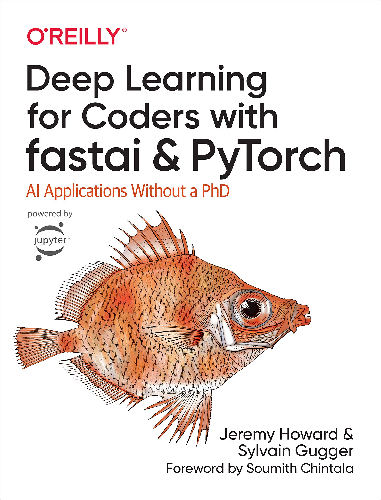

<head>
  <meta charset="UTF-8">
  <meta name="viewport" content="width=device-width, initial-scale=1.0">

  <script src="https://kit.fontawesome.com/79ff35ecec.js" crossorigin="anonymous"></script>

  <link rel="preconnect" href="https://fonts.googleapis.com">
  <link rel="preconnect" href="https://fonts.gstatic.com" crossorigin>
  <link href="https://fonts.googleapis.com/css2?family=Crimson+Pro:ital,wght@0,200..900;1,200..900&display=swap" rel="stylesheet">
  <link href="https://fonts.googleapis.com/css2?family=Crimson+Pro:ital,wght@0,200..900;1,200..900&family=JetBrains+Mono:ital,wght@0,100..800;1,100..800&display=swap" rel="stylesheet">

  <link rel="stylesheet" href="../../assets/css/projects/project.css">
</head>

  <nav class="main-navigation">
    <ul>
      <li><a class="home" href="https://teddywarner.com"><span class="navnum">01</span> Home</a></li>
      <li><a class="proj" href="https://teddywarner.com/proj/"><span class="navnum">02</span> Projects</a></li>
      <li><a class="writ" href="https://teddywarner.com/writ/"><span class="navnum">03</span> Writing</a></li>
    </ul>
  </nav>

<div class="return2feed"><a href="https://teddywarner.org/proj"><i class="fa-solid fa-arrow-left-long"></i> Project Feed</a></div>

# Hands on Neural Networks

<div style="margin-top: -0.8em;">
  <span class="abtlinks"><a href="https://x.com/WarnerTeddy"><span class="abt" id="name"> Teddy Warner</a><span class="abt" style="font-weight: 300; padding-left: 6px;"><span class="year">| Fall, 2024 </span>| <span class="readTime"><i class="far fa-clock"></i> X-X minutes</span></span></span></span>
  <span class="share" style=" color: inherit;">
  <a class="fb" title="Share on Facebook" href="https://www.facebook.com/sharer/sharer.php?u=https://teddywarner.org/Projects/fastai/"><i class="fa-brands fa-facebook"></i></a>
  <a class="twitter" title="Share on Twitter" href="https://twitter.com/intent/tweet?url=https://teddywarner.org/Projects/fastai/&text="><i class="fa-brands fa-x-twitter"></i></a>
  <a class="pin" title="Share on Pinterest" href="https://pinterest.com/pin/create/button/?url=https://teddywarner.org/Projects/fastai/&media=&description="><i class="fa-brands fa-pinterest"></i></a>
  <a class="ln" title="Share on LinkedIn" href="https://www.linkedin.com/shareArticle?mini=true&url=https://teddywarner.org/Projects/fastai/"><i class="fab fa-linkedin"></i></a>
  <a class="email" title="Share via Email" href="mailto:info@example.com?&subject=&cc=&bcc=&body=https://teddywarner.org/Projects/fastai/%0A"><i class="fa-solid fa-paper-plane"></i></a>
  </span>
</div>

---


{: align=left width="40%"}

[Deep Learning for Coders with fastai and PyTorch: AI Applications Without a PhD](https://www.goodreads.com/book/show/54331465-deep-learning-for-coders-with-fastai-and-pytorch)


### Market Trend Classification with Deep Convolutional Neural Networks

[Open in Colab :simple-googlecolab:](https://colab.research.google.com/drive/10lzn1q10XbpikhFbWtgyV0F9hI_739WK?usp=sharing){ .md-button .md-button--primary}

I recently started John C. Bogle's [*The Little Book of Common Sense Investing*](https://www.goodreads.com/book/show/171127.The_Little_Book_of_Common_Sense_Investing), and in anthesis of the books advocation for simple, long-term investments (perticulary index funds), I though it would be a bit fun to fine-tune a CNN to classify market trends for short-term trading (this also seems to stay on tune with the first lesson of the [fast.ai](https://course.fast.ai//) course).

This is by no means investment advice, the model simply classifies the probibility of the input chart of being a known market trend and outputs a boolean "Should I invest: Yes/No" based upon its results. Enjoy! 😺

<center>
  <div style="position:relative;padding-bottom:56.25%;">
    <iframe width="100%" height="100" style="width:100%;height:100%;position:absolute;left:0px;top:0px;" src="https://www.youtube.com/embed/8SF_h3xF3cE" title="Practical Deep Learning for Coders: Lesson 1" frameborder="0" allow="accelerometer; autoplay; clipboard-write; encrypted-media; gyroscope; picture-in-picture; web-share" referrerpolicy="strict-origin-when-cross-origin" allowfullscreen></iframe>
  </div>
</center>

``` py linenums="1"
import sys
if 'google.colab' not in sys.modules:
    raise Exception("run this in google colab please.")
```

``` py linenums="1"
!pip install -Uqq fastai duckduckgo_search
```

``` py linenums="1"
import socket, warnings
from duckduckgo_search import DDGS
from fastcore.all import *
from fastdownload import download_url
from fastai.vision.all import *
from fastai.callback.tracker import EarlyStoppingCallback
from time import sleep
import os
from google.colab import files
import io
from IPython.display import display
import ipywidgets as widgets
from pathlib import Path
```

Download images of various stock chart patterns

*Implemented boolean search queries to better filter the scraped data.*

Scraping stock chart images of the internet is a rather dumb way of fitting this model, would definetly be better off with a better dataset (like the following), but I want to learn fast.ai so we're running with it.

- [CRSP US Stock Databases](https://www.crsp.org/research/crsp-us-stock-databases/)
- [Stock Chart Patterns](https://www.kaggle.com/datasets/mustaphaelbakai/stock-chart-patterns)
- [200+ Financial Indicators of US stocks (2014-2018)](https://www.kaggle.com/datasets/cnic92/200-financial-indicators-of-us-stocks-20142018)
- [Stock Prices Predictions-EDA,LSTM(DeepExploration)](https://www.kaggle.com/code/saurabhshahane/stock-prices-predictions-eda-lstm-deepexploration)

``` py linenums="1"
def search_images(term, max_images=30):
    print(f"Searching for '{term}'")
    with DDGS() as ddgs:
        return L(ddgs.images(term, max_results=max_images)).itemgot('image')

searches = [
    '"bull market" AND ("graph" OR "plot") AND ("Yahoo Finance" OR "tradingview" OR "FusionCharts" OR "StockCharts") -analysis -annotation -indicator -overlay -drawn',
    '"bear market" AND ("graph" OR "plot") AND ("Yahoo Finance" OR "tradingview" OR "FusionCharts" OR "StockCharts") -analysis -annotation -indicator -overlay -drawn',
    '"sideways market" AND ("graph" OR "plot") AND ("Yahoo Finance" OR "tradingview" OR "FusionCharts" OR "StockCharts") -analysis -annotation -indicator -overlay -drawn',
    '"breakout market" AND ("graph" OR "plot") AND ("Yahoo Finance" OR "tradingview" OR "FusionCharts" OR "StockCharts")',
    '"breakdown market" AND ("graph" OR "plot") AND ("Yahoo Finance" OR "tradingview" OR "FusionCharts" OR "StockCharts")',
    '"double top" AND ("graph" OR "plot") AND ("Yahoo Finance" OR "tradingview" OR "FusionCharts" OR "StockCharts") -analysis -annotation -indicator -overlay -drawn',
    '"double bottom" AND ("graph" OR "plot") AND ("Yahoo Finance" OR "tradingview" OR "FusionCharts" OR "StockCharts") -analysis -annotation -indicator -overlay -drawn',
    '"head and shoulders pattern" AND ("graph" OR "plot") AND ("Yahoo Finance" OR "tradingview" OR "FusionCharts" OR "StockCharts") -analysis -annotation -indicator -overlay -drawn',
    '"inverse head and shoulders pattern" AND ("graph" OR "plot") AND ("Yahoo Finance" OR "tradingview" OR "FusionCharts" OR "StockCharts") -analysis -annotation -indicator -overlay -drawn',
    '"cup and handle pattern" AND ("graph" OR "plot") AND ("Yahoo Finance" OR "tradingview" OR "FusionCharts" OR "StockCharts") -analysis -annotation -indicator -overlay -drawn',
    '"ascending triangle" AND ("graph" OR "plot") AND ("Yahoo Finance" OR "tradingview" OR "FusionCharts" OR "StockCharts") -analysis -annotation -indicator -overlay -drawn',
    '"descending triangle" AND ("graph" OR "plot") AND ("Yahoo Finance" OR "tradingview" OR "FusionCharts" OR "StockCharts") -analysis -annotation -indicator -overlay -drawn',
    '"symmetrical triangle" AND ("graph" OR "plot") AND ("Yahoo Finance" OR "tradingview" OR "FusionCharts" OR "StockCharts") -analysis -annotation -indicator -overlay -drawn',
    '"rising wedge" AND ("graph" OR "plot") AND ("Yahoo Finance" OR "tradingview" OR "FusionCharts" OR "StockCharts") -analysis -annotation -indicator -overlay -drawn',
    '"falling wedge" AND ("graph" OR "plot") AND ("Yahoo Finance" OR "tradingview" OR "FusionCharts" OR "StockCharts") -analysis -annotation -indicator -overlay -drawn',
    '"overbought market" AND ("graph" OR "plot") AND ("Yahoo Finance" OR "tradingview" OR "FusionCharts" OR "StockCharts") -analysis -annotation -indicator -overlay -drawn',
    '"oversold market" AND ("graph" OR "plot") AND ("Yahoo Finance" OR "tradingview" OR "FusionCharts" OR "StockCharts") -analysis -annotation -indicator -overlay -drawn',
    '"uptrend market" AND ("graph" OR "plot") AND ("Yahoo Finance" OR "tradingview" OR "FusionCharts" OR "StockCharts")',
    '"downtrend market" AND ("graph" OR "plot") AND ("Yahoo Finance" OR "tradingview" OR "FusionCharts" OR "StockCharts") -analysis -annotation -indicator -overlay -drawn',
    '"consolidation phase" AND ("graph" OR "plot") AND ("Yahoo Finance" OR "tradingview" OR "FusionCharts" OR "StockCharts") -analysis -annotation -indicator -overlay -drawn',
    '"reversal pattern" AND ("graph" OR "plot") AND ("Yahoo Finance" OR "tradingview" OR "FusionCharts" OR "StockCharts") -analysis -annotation -indicator -overlay -drawn',
    '"continuation pattern" AND ("graph" OR "plot") AND ("Yahoo Finance" OR "tradingview" OR "FusionCharts" OR "StockCharts") -analysis -annotation -indicator -overlay -drawn',
    '"gap up market" AND ("graph" OR "plot") AND ("Yahoo Finance" OR "tradingview" OR "FusionCharts" OR "StockCharts")',
    '"gap down market" AND ("graph" OR "plot") AND ("Yahoo Finance" OR "tradingview" OR "FusionCharts" OR "StockCharts")',
    '"high volatility market" AND ("graph" OR "plot") AND ("Yahoo Finance" OR "tradingview" OR "FusionCharts" OR "StockCharts") -annotation -indicator -overlay -drawn',
    '"low volatility market" AND ("graph" OR "plot") AND ("Yahoo Finance" OR "tradingview" OR "FusionCharts" OR "StockCharts") -annotation -indicator -overlay -drawn',
    '"support level" AND ("graph" OR "plot") AND ("Yahoo Finance" OR "tradingview" OR "FusionCharts" OR "StockCharts") -analysis -annotation -indicator -overlay -drawn',
    '"resistance level" AND ("graph" OR "plot") AND ("Yahoo Finance" OR "tradingview" OR "FusionCharts" OR "StockCharts") -analysis -annotation -indicator -overlay -drawn',
    '"breaking support" AND ("graph" OR "plot") AND ("Yahoo Finance" OR "tradingview" OR "FusionCharts" OR "StockCharts") -analysis -annotation -indicator -overlay -drawn',
    '"breaking resistance" AND ("graph" OR "plot") AND ("Yahoo Finance" OR "tradingview" OR "FusionCharts" OR "StockCharts") -analysis -annotation -indicator -overlay -drawn',
    '"momentum-driven market" AND ("graph" OR "plot")',
    '"value-driven market" AND ("graph" OR "plot")',
    '"approaching moving average" AND ("graph" OR "plot")',
    'bouncing off moving average AND ("graph" OR "plot")',
    'crossing above moving average AND ("graph" OR "plot")',
    'crossing below moving average AND ("graph" OR "plot")',
    '"market channel" AND ("graph" OR "plot") AND ("Yahoo Finance" OR "tradingview" OR "FusionCharts" OR "StockCharts") -analysis -annotation -indicator -overlay -drawn',
    '"accumulation phase" AND ("graph" OR "plot") AND ("Yahoo Finance" OR "tradingview" OR "FusionCharts" OR "StockCharts") -analysis -annotation -indicator -overlay -drawn',
    '"distribution phase" AND ("graph" OR "plot") AND ("Yahoo Finance" OR "tradingview" OR "FusionCharts" OR "StockCharts") -analysis -annotation -indicator -overlay -drawn',
    '"parabolic move" AND ("graph" OR "plot") AND ("Yahoo Finance" OR "tradingview" OR "FusionCharts" OR "StockCharts") -analysis -annotation -indicator -overlay -drawn',
    '"V-shaped recovery" AND ("graph" OR "plot") AND ("Yahoo Finance" OR "tradingview" OR "FusionCharts" OR "StockCharts") -analysis -annotation -indicator -overlay -drawn',
    '"W-shaped recovery" AND ("graph" OR "plot") AND ("Yahoo Finance" OR "tradingview" OR "FusionCharts" OR "StockCharts") -analysis -annotation -indicator -overlay -drawn',
    '"flag pattern" AND ("graph" OR "plot") AND ("Yahoo Finance" OR "tradingview" OR "FusionCharts" OR "StockCharts") -analysis -annotation -indicator -overlay -drawn',
    '"pennant pattern" AND ("graph" OR "plot") AND ("Yahoo Finance" OR "tradingview" OR "FusionCharts" OR "StockCharts") -analysis -annotation -indicator -overlay -drawn'
]

path = Path('stock_trends')

for search in searches:
    dest = (path/search.replace('"', '').replace(' ', '_').lower())
    dest.mkdir(exist_ok=True, parents=True)
    download_images(dest, urls=search_images(search, max_images=50))
    sleep(10)
    resize_images(dest, max_size=400, dest=dest)
```

Train the model

Remove any failed downloads

``` py linenums="1"
failed = verify_images(get_image_files(path))
failed.map(Path.unlink)
print(f"Removed {len(failed)} failed downloads")
```

Data augmentation

``` py linenums="1"
def get_stock_images(path):
    return get_image_files(path)

item_tfms = [
    Resize(224, method='squish'),
    RandomResizedCrop(224, min_scale=0.8)
]

batch_tfms = [
    *aug_transforms(
        flip_vert=False,
        max_rotate=15,
        max_zoom=1.1,
        max_lighting=0.2,
        max_warp=0.1,
        p_affine=0.7,
        p_lighting=0.7
    ),
    Normalize.from_stats(*imagenet_stats)
]
```

Data Loaders

``` py linenums="1"
dls = DataBlock(
    blocks=(ImageBlock, CategoryBlock),
    get_items=get_stock_images,
    splitter=RandomSplitter(valid_pct=0.2, seed=42),
    get_y=parent_label,
    item_tfms=item_tfms,
    batch_tfms=batch_tfms
).dataloaders(path, bs=32)

print(f"total batches: {len(dls.train)}")
xb, yb = dls.one_batch()
print(f"image shape: {xb.shape}")
print(f"label shape: {yb.shape}")
```

Show a batch to verify augmentations

``` py linenums="1"
dls.show_batch(max_n=9, figsize=(12,9))
```

Pre-trained model established

``` py linenums="1"
learn = vision_learner(dls, resnet50, metrics=[error_rate, accuracy], ps=0.5)
```

Find the optimal learning rate

``` py linenums="1"
suggested_lr = learn.lr_find().valley
```

Fine-tune the model

``` py linenums="1"
learn.freeze()
learn.fit_one_cycle(5, suggested_lr/10)
```

``` py linenums="1"
learn.unfreeze()
learn.fit_one_cycle(10, slice(suggested_lr/100, suggested_lr/10),
                    cbs=[EarlyStoppingCallback(monitor='valid_loss', min_delta=0.01, patience=5)])
```

Save the model

``` py linenums="1"
learn.save('stock_trend_classifier_v2')
```

Use the model

``` py linenums="1"
def classify_trend(img):
    pattern_advice = {
        "Bull market": ("Prices are in a sustained upward trend, indicating positive momentum and potential for further gains.", True),
        "Bear market": ("Prices are in a sustained downward trend, suggesting further declines are likely.", False),
        "Sideways market": ("Prices are moving sideways, indicating a period of equilibrium. Wait for a breakout direction.", None),
        "Breakout": ("Prices have broken out of a previous range, potentially signaling the start of a new trend.", True),
        "Breakdown": ("Prices have broken down from a previous range, potentially signaling the start of a downtrend.", False),
        "Double top": ("Suggests a potential reversal of an uptrend, indicating possible upcoming price declines.", False),
        "Double bottom": ("Suggests a potential reversal of a downtrend, indicating possible upcoming price increases.", True),
        "Head and shoulders": ("Often signals the end of an uptrend and the beginning of a downtrend.", False),
        "Inverse head and shoulders": ("Often signals the end of a downtrend and the beginning of an uptrend.", True),
        "Cup and handle": ("Bullish pattern suggesting a continuation of an uptrend after a brief consolidation.", True),
        "Ascending triangle": ("Bullish pattern indicating a potential breakout to the upside.", True),
        "Descending triangle": ("Bearish pattern indicating a potential breakdown to the downside.", False),
        "Symmetrical triangle": ("Neutral pattern that can break in either direction. Wait for the breakout.", None),
        "Rising wedge": ("Often bearish in an uptrend, suggesting a potential reversal.", False),
        "Falling wedge": ("Often bullish in a downtrend, suggesting a potential reversal.", True),
        "Overbought market": ("Indicates that the market may be overvalued and due for a pullback or correction.", False),
        "Oversold market": ("Indicates that the market may be undervalued and due for a bounce or recovery.", True),
        "Uptrend": ("Prices are consistently rising, suggesting potential for further gains.", True),
        "Downtrend": ("Prices are consistently falling, suggesting potential for further losses.", False),
        "Consolidation": ("Market is taking a breather. Wait for a breakout to determine the next move.", None),
        "Reversal pattern": ("Suggests a potential change in the current trend direction.", None),
        "Continuation pattern": ("Suggests the current trend is likely to continue after a brief pause.", None),
        "Gap up": ("A sudden jump in prices, often bullish if it occurs in an uptrend.", True),
        "Gap down": ("A sudden drop in prices, often bearish if it occurs in a downtrend.", False),
        "High volatility": ("Large price swings indicate uncertainty. Exercise caution.", None),
        "Low volatility": ("Small price movements might precede a larger move. Stay alert.", None),
        "Support level": ("Price has reached a level where buying interest may increase.", True),
        "Resistance level": ("Price has reached a level where selling interest may increase.", False),
        "Breaking support": ("A break below support often leads to further downside.", False),
        "Breaking resistance": ("A break above resistance often leads to further upside.", True),
        "Momentum-driven": ("Strong price movement backed by high volume, likely to continue.", None),
        "Value-driven": ("Prices moving based on fundamental factors rather than technical.", None),
        "Approaching moving average": ("Price nearing a key moving average, watch for potential bounce or break.", None),
        "Bouncing off moving average": ("Price respecting a moving average as support or resistance.", None),
        "Crossing above moving average": ("Bullish signal, especially for longer-term moving averages.", True),
        "Crossing below moving average": ("Bearish signal, especially for longer-term moving averages.", False),
        "Market channel": ("Prices moving between parallel support and resistance lines.", None),
        "Accumulation": ("Suggests smart money is buying, potentially preceding an uptrend.", True),
        "Distribution": ("Suggests smart money is selling, potentially preceding a downtrend.", False),
        "Parabolic move": ("Extremely steep price increases, often unsustainable and prone to sharp reversals.", False),
        "V-shaped recovery": ("Sharp decline followed by a quick recovery, often bullish.", True),
        "W-shaped recovery": ("Double bottom pattern, often bullish after the second bottom is formed.", True),
        "Flag pattern": ("Short-term consolidation in a strong trend, often continues in trend direction.", None),
        "Pennant pattern": ("Similar to a flag, but with converging boundary lines.", None)
    }

    def get_display_name(pattern):
        pattern_lower = pattern.lower().replace("_", " ")

        for key in pattern_advice.keys():
            if key.lower() in pattern_lower:
                return key

        parts = pattern_lower.split("and")
        main_part = parts[0].strip()

        for key in pattern_advice.keys():
            if key.lower() in main_part:
                return key

        if "bull market" in pattern_lower:
            return "Bull market"
        elif "bear market" in pattern_lower:
            return "Bear market"
        elif "sideways market" in pattern_lower:
            return "Sideways market"
        elif "breakout" in pattern_lower:
            return "Breakout"
        elif "breakdown" in pattern_lower:
            return "Breakdown"
        elif "volatility" in pattern_lower:
            return "High volatility" if "high" in pattern_lower else "Low volatility"
        elif "moving average" in pattern_lower:
            if "crossing above" in pattern_lower:
                return "Crossing above moving average"
            elif "crossing below" in pattern_lower:
                return "Crossing below moving average"
            elif "approaching" in pattern_lower:
                return "Approaching moving average"
            elif "bouncing" in pattern_lower:
                return "Bouncing off moving average"
        elif "channel" in pattern_lower:
            return "Market channel"

        return "Unclassified Pattern"

    trend, _, probs = learn.predict(img)
    sorted_probs = sorted(zip(learn.dls.vocab, probs), key=lambda x: x[1], reverse=True)

    top_pattern = get_display_name(sorted_probs[0][0])

    if top_pattern in pattern_advice:
        advice, investment_decision = pattern_advice[top_pattern]
    else:
        advice, investment_decision = "Uncertain pattern detected. More analysis needed.", None

    print("\n=== Performance Analysis ===")
    print(f"\nDetected Market Condition: {top_pattern}")
    print(f"Confidence: {sorted_probs[0][1]:.2%}")

    print("\nTop 5 Predictions:")
    for label, prob in sorted_probs[:5]:
        display_name = get_display_name(label)
        print(f"- {display_name}: {prob:.2%}")

    print(f"\nInvestment Advice: {'Favorable' if investment_decision else 'Unfavorable' if investment_decision is not None else 'Neutral'} market conditions")
    print(f"Interpretation: {advice}")

    if investment_decision is not None:
        decision = "CONSIDER INVESTING" if investment_decision else "EXERCISE CAUTION"
        print(f"\nSuggested Action: {decision}")
    else:
        print("\nSuggested Action: FURTHER ANALYSIS RECOMMENDED")

    print("\n=============================")
```

File upload

``` py linenums="1"
def upload_and_classify():
    uploaded = files.upload()
    for filename in uploaded.keys():
        content = uploaded[filename]
        img = PILImage.create(io.BytesIO(content))
        classify_trend(img)

upload_button = widgets.Button(description="Upload & Classify")
output = widgets.Output()

def on_button_clicked(b):
    with output:
        upload_and_classify()

upload_button.on_click(on_button_clicked)
display(upload_button, output)
```

### GeoKnowr: Solving GeoGuesser with Deep Convolutional Neural Networks

[Open in Colab :simple-googlecolab:](https://colab.research.google.com/drive/1QV1xRaOAVBP1fDGZx9ng1rOBnrK3b9Em?usp=sharing){ .md-button .md-button--primary}

[Open on Hugging Face :simple-huggingface:](https://huggingface.co/spaces/twarner/geoKnowr){ .md-button .md-button--primary}

There's this guy, [Rainbolt](https://www.youtube.com/@georainbolt), who is particularly good at the game [GeoGuessr](https://www.geoguessr.com/). The premise of the game is you are placed at a random location in a Google Maps interface, and you're assessed on the time it takes you to guess where you are, and how accurate your guess is.

There's a lot of interesting material on learning the tricks/metals to this game, I thought it would be fun to incorporate a few of them into a classification net.
- [Beginner’s Guide to Geoguessr](https://www.plonkit.net/beginners-guide-2#what-to-look-for)
- [GeoGuessr META](https://www.reddit.com/r/geoguessr/comments/vpefde/meta_guide/)
- [GeoGuessr- The Top Tips, Tricks and Techniques](https://somerandomstuff1.wordpress.com/2019/02/08/geoguessr-the-top-tips-tricks-and-techniques/)

<center>
  <div style="position:relative;padding-bottom:56.25%;">
    <iframe width="100%" height="100" style="width:100%;height:100%;position:absolute;left:0px;top:0px;" src="https://www.youtube.com/embed/F4tvM4Vb3A0" title="Lesson 2: Practical Deep Learning for Coders 2022" frameborder="0" allow="accelerometer; autoplay; clipboard-write; encrypted-media; gyroscope; picture-in-picture; web-share" referrerpolicy="strict-origin-when-cross-origin" allowfullscreen></iframe>
  </div>
</center>

``` py linenums="1"
!pip install -Uqq fastbook
!pip install -Uqq fastai
!pip install -Uqq duckduckgo_search
!pip install fastdownload
```

``` py linenums="1"
import fastbook
from fastbook import *
from fastai.vision.all import *
from fastai.vision.widgets import *
from fastai.losses import CrossEntropyLossFlat
from duckduckgo_search import DDGS
from fastdownload import download_url
from functools import partial
import time
from fastcore.all import *
from tqdm.notebook import tqdm
import random
import requests
from requests.adapters import HTTPAdapter
from requests.packages.urllib3.util.retry import Retry
from concurrent.futures import ThreadPoolExecutor, as_completed
```

Set up paths and data

``` py linenums="1"
path = Path('geoguessr_data')
path.mkdir(exist_ok=True)
```

25 most probable geoguessr countries

``` py linenums="1"
countries = [
    "United States", "Brazil", "Canada", "Russia", "Australia",
    "United Kingdom", "France", "Germany", "Japan", "South Africa",
    "Argentina", "Mexico", "New Zealand", "Finland", "Norway",
    "Sweden", "Italy", "Spain", "Poland", "Indonesia",
    "Chile", "Turkey", "Thailand", "Ukraine", "Portugal"
]
```

Download images of cityscapes and landscapes of each country

``` py linenums="1"
def get_search_queries(country):
    return [
        f'"{country}" AND ("architecture" OR "buildings") AND ("cityscape" OR "street view") -person -people -portrait',
        f'"{country}" AND ("landscape" OR "nature" OR "scenery") AND ("countryside" OR "rural" OR "outdoor") -person -people -portrait'
    ]
```

``` py linenums="1"
def download_image(url, dest):
    try:
        response = requests.get(url, timeout=10)
        if response.status_code == 200:
            with open(dest, 'wb') as f:
                f.write(response.content)
            return True
    except Exception:
        return False
```

``` py linenums="1"
def download_images(country, query, max_images=100):
    dest = (path/country)
    dest.mkdir(exist_ok=True)
    with DDGS() as ddgs:
        results = list(ddgs.images(query, max_results=max_images*3))  # Get more results to account for failures

    random.shuffle(results)

    successful_downloads = 0
    with ThreadPoolExecutor(max_workers=10) as executor:
        futures = []
        for i, result in enumerate(results):
            if len(futures) >= max_images:
                break
            future = executor.submit(download_image, result['image'], dest/f"{country}_{query[:10]}_{i:03d}.jpg")
            futures.append(future)

        for future in as_completed(futures):
            if future.result():
                successful_downloads += 1
            if successful_downloads >= max_images:
                break

    return successful_downloads

total_downloads = len(countries) * 2 * 100

with tqdm(total=total_downloads, desc="Downloading images") as pbar:
    for country in countries:
        for query in get_search_queries(country):
            downloaded = download_images(country, query)
            pbar.update(downloaded)
        time.sleep(2)
```

Verify and clean up images

``` py linenums="1"
fns = get_image_files(path)
failed = verify_images(fns)
failed.map(Path.unlink)
```

define dataloaders and augment data

``` py linenums="1"
def get_valid_images(path):
    def is_valid_file(x):
        return x.is_file() and x.suffix.lower() in ['.jpg', '.jpeg', '.png']
    return [f for f in get_image_files(path, recurse=True) if is_valid_file(f)]

geo_data = DataBlock(
    blocks=(ImageBlock, CategoryBlock),
    get_items=get_valid_images,
    splitter=RandomSplitter(valid_pct=0.2, seed=42),
    get_y=parent_label,
    item_tfms=[RandomResizedCrop(224, min_scale=0.35, ratio=(0.75, 1.3333))],
    batch_tfms=[
        *aug_transforms(max_rotate=10, max_zoom=1.3, max_lighting=0.4, max_warp=0.4,
                        p_affine=0.75, p_lighting=0.75),
        Normalize.from_stats(*imagenet_stats)
    ]
)

try:
    dls = geo_data.dataloaders(path, bs=32)
    print(f"Number of training batches: {len(dls.train)}")
    print(f"Number of validation batches: {len(dls.valid)}")
    dls.show_batch()
except Exception as e:
    print(f"Error creating DataLoaders: {e}")

    valid_files = get_valid_images(path)
    print(f"Total number of valid images: {len(valid_files)}")

    labels = [parent_label(f) for f in valid_files]
    unique_labels = set(labels)
    print(f"Number of unique labels: {len(unique_labels)}")
    print(f"Labels: {unique_labels}")

    for label in unique_labels:
        count = sum(1 for f in valid_files if parent_label(f) == label)
        print(f"Class {label}: {count} images")
```

Model Def

``` py linenums="1"
geoKnower = vision_learner(dls, resnet50, metrics=[error_rate, accuracy],
                           loss_func=CrossEntropyLossFlat(label_smoothing=0.2),
                           cbs=[MixUp(0.3)],
                           wd=0.1)
```

Progressive training

``` py linenums="1"
def progressive_training(learn, epochs, start_lr, end_lr):
    learn.fit_one_cycle(epochs, start_lr,
                        cbs=[SaveModelCallback(monitor='accuracy', comp=np.greater, fname='best_model'),
                             ReduceLROnPlateau(monitor='valid_loss', patience=2, factor=0.5)])
    learn.fit_one_cycle(epochs, slice(start_lr/10, end_lr),
                        cbs=[SaveModelCallback(monitor='accuracy', comp=np.greater, fname='best_model'),
                             ReduceLROnPlateau(monitor='valid_loss', patience=2, factor=0.5)])
```

Find optimal learning rate

``` py linenums="1"
geoKnower.lr_find()
```

``` py linenums="1"
start_lr = 1e-3
```

**Train model**

I took several attempts to improve the accuracy of this model without much luck (from ~15% to ~20% accuracy). While my data augmentation steps seem to be slightly helping with overfitting, a better dataset all together would hopefully aid in increasing the accuracy.

``` py linenums="1"
progressive_training(geoKnower, 10, start_lr, start_lr/10)
```

Fine-tuning

``` py linenums="1"
geoKnower.unfreeze()
geoKnower.lr_find()
geoKnower.fit_one_cycle(5, lr_max=slice(1e-6, 1e-3))
```

Interpretation and model assesment

``` py linenums="1"
interp = ClassificationInterpretation.from_learner(geoKnower)
```

``` py linenums="1"
interp.plot_confusion_matrix(figsize=(12,12))
```

Image cleaning

``` py linenums="1"
#hide_output
cleaner = ImageClassifierCleaner(geoKnower)
cleaner
```

``` py linenums="1"
#hide
# for idx in cleaner.delete(): cleaner.fns[idx].unlink()
# for idx,cat in cleaner.change(): shutil.move(str(cleaner.fns[idx]), path/cat)
```

Save and export

``` py linenums="1"
geoKnower.save('geoKnower')
```

``` py linenums="1"
geoKnower.export('geoKnower.pkl')
```

Colab UI

``` py linenums="1"
uploader = widgets.FileUpload()
output = widgets.Output()
button = widgets.Button(description='Classify')
label = widgets.Label()

def on_click(change):
    img = PILImage.create(uploader.data[-1])
    out_pl = widgets.Output()
    out_pl.clear_output()
    with out_pl: display(img.to_thumb(224,224))
    pred, pred_idx, probs = geoKnower.predict(img)
    label.value = f'Prediction: {pred}; Probability: {probs[pred_idx]:.04f}'

    top_5 = sorted(zip(geoKnower.dls.vocab, map(float, probs)), key=lambda p: p[1], reverse=True)[:5]
    for i, (category, prob) in enumerate(top_5, 1):
        print(f"{i}. {category}: {prob:.4f}")

button.on_click(on_click)

vbox = widgets.VBox([
    widgets.Label('Upload a GeoGuessr image:'),
    uploader,
    button,
    output,
    label
])

vbox.layout.align_items = 'center'
uploader.layout.width = '300px'
button.layout.width = '200px'
button.style.button_color = '#4CAF50'
label.layout.margin = '20px 0 0 0'

display(vbox)
```

### Emotional (Artificial) Intelligence

[Open in Colab :simple-googlecolab:](https://colab.research.google.com/drive/1OjpLPut2ydwMuCOyYbkISs-ZpasqG0GG?usp=sharing){ .md-button .md-button--primary}

My highschool mandated an Emotional Intelligence unit for all incoming Freshman, and while my highschool days are well behind me, my younger sister just started the course. That being said, I thought it would be fune to fine-tune a convolutional neural network to classify facial expressions for emotion prediction.

I've chosen to use the levit_384 architecture and a Kaggle dataset "[Face expression recognition dataset](https://www.kaggle.com/datasets/jonathanoheix/face-expression-recognition-dataset/data)" for this task. Enjoy!

<center>
  <div style="position:relative;padding-bottom:56.25%;">
    <iframe width="100%" height="100" style="width:100%;height:100%;position:absolute;left:0px;top:0px;" src="https://www.youtube.com/embed/hBBOjCiFcuo" title="Lesson 3: Practical Deep Learning for Coders 2022" frameborder="0" allow="accelerometer; autoplay; clipboard-write; encrypted-media; gyroscope; picture-in-picture; web-share" referrerpolicy="strict-origin-when-cross-origin" allowfullscreen></iframe>
  </div>
</center>

``` py linenums="1"
!pip install -Uqq fastai kaggle timm
```

``` py linenums="1"
import io
from fastai.vision.all import *
from fastai.vision.widgets import *
import torch
import torch.nn as nn
from timm import create_model
import numpy as np
```

Set up Kaggle API

``` py linenums="1"
!mkdir -p ~/.kaggle
!cp /content/kaggle.json ~/.kaggle/
!chmod 600 ~/.kaggle/kaggle.json
```

Download the dataset

``` py linenums="1"
!kaggle datasets download -d jonathanoheix/face-expression-recognition-dataset
```

Unzip the dataset

``` py linenums="1"
!unzip face-expression-recognition-dataset.zip -d /content/face_expression_dataset
```

Set up paths

``` py linenums="1"
path = Path('/content/face_expression_dataset/images')
train_path = path/'train'
valid_path = path/'validation'
```

Define label names

``` py linenums="1"
label_names = ['angry', 'disgust', 'fear', 'happy', 'neutral', 'sad', 'surprise']
```

Create DataBlock

``` py linenums="1"
dblock = DataBlock(
    blocks=(ImageBlock, CategoryBlock),
    get_items=get_image_files,
    get_y=parent_label,
    splitter=GrandparentSplitter(train_name='train', valid_name='validation'),
    item_tfms=[Resize(224)],
    batch_tfms=[*aug_transforms(size=224), Normalize.from_stats(*imagenet_stats)]
)

dls = dblock.dataloaders(path, bs=64)
```

Create LeViT model

I wanted to toy around with some of the models from the article "[Which image models are best?](https://www.kaggle.com/code/jhoward/which-image-models-are-best/)", and wound up implementing *Levit 384*, a slightly larger yet still rather quick model. That being said, I wound up fitting this model with an A100 through Google Colab and absoutly chewed through my GPU hours. 😿

``` py linenums="1"
def create_levit_model(num_classes):
    model = create_model('levit_384', pretrained=True, num_classes=num_classes)
    return model
```

Create Learner

``` py linenums="1"
def levit_learner(dls, lr=1e-3):
    model = create_levit_model(len(dls.vocab))
    learn = Learner(dls, model, loss_func=nn.CrossEntropyLoss(), metrics=[accuracy, error_rate])
    return learn
```

``` py linenums="1"
learn = levit_learner(dls)
```

Fine-tune the model

``` py linenums="1"
learn.fine_tune(5, freeze_epochs=3)
```

Save the model

``` py linenums="1"
learn.save('levit384_fer')
```

Make Predictions

``` py linenums="1"
def predict_image(img):
    pred, pred_idx, logits = learn.predict(img)

    logits = torch.softmax(logits, dim=0)

    pred_idx = torch.argmax(logits).item()

    return pred, pred_idx, logits
```

UI

``` py linenums="1"
uploader = widgets.FileUpload(accept='image/*', multiple=False)
output = widgets.Output()
button = widgets.Button(description='Classify')
label = widgets.Label()

out_pl = widgets.Output()

def predict_image(img):
    pred, _, logits = learn.predict(img)
    logits = torch.softmax(logits, dim=0)

    pred_idx = torch.argmax(logits).item()

    return pred, pred_idx, logits

def on_click(change):
    if uploader.value:
        file_name = next(iter(uploader.value))
        img_data = uploader.value[file_name]['content']

        img = PILImage.create(img_data)
        out_pl.clear_output()

        with out_pl:
            display(img.to_thumb(224, 224))

        pred, pred_idx, logits = predict_image(img)

        print(f"Prediction: {pred}, Index: {pred_idx}, Logits: {logits}")

        probability = logits[pred_idx].item()
        label.value = f'Prediction: {pred}; Probability: {probability:.04f}'

        top_5 = sorted(zip(learn.dls.vocab, map(float, logits)), key=lambda p: p[1], reverse=True)[:5]
        output.clear_output()
        with output:
            print("Top 5 Predictions:")
            for i, (category, prob) in enumerate(top_5, 1):
                print(f"{i}. {category}: {prob:.4f}")

button.on_click(on_click)

vbox = widgets.VBox([
    widgets.Label('Upload a facial expression image:'),
    uploader,
    button,
    out_pl,
    label,
    output
])

vbox.layout.align_items = 'center'
uploader.layout.width = '300px'
button.layout.width = '200px'
button.style.button_color = '#4CAF50'
label.layout.margin = '20px 0 0 0'

display(vbox)
```

- https://docs.fast.ai/
- https://www.kaggle.com/code/jhoward/is-it-a-bird-creating-a-model-from-your-own-data
- https://www.kaggle.com/code/jhoward/jupyter-notebook-101
- https://www.forbes.com/advisor/investing/how-to-read-stock-charts/
- https://fastai1.fast.ai/vision.models.html
- https://medium.com/@bijil.subhash/transfer-learning-how-to-pick-the-optimal-learning-rate-c8621b89c036
- https://www.linkedin.com/pulse/analyzing-historical-stock-data-python-yahoo-finance-ali-azary-zptxe/
- https://medium.com/@bijil.subhash/transfer-learning-how-to-pick-the-optimal-learning-rate-c8621b89c036
- https://www.jeremyjordan.me/nn-learning-rate/
- https://www.reddit.com/r/MLQuestions/comments/13javik/using_image_recognition_classification_to_detect/
- https://www.investopedia.com/terms/e/efficientmarkethypothesis.asp
- https://www.kaggle.com/code/stetelepta/finding-chart-patterns
- https://amunategui.github.io/unconventional-convolutional-networks/index.html
- https://arxiv.org/abs/1603.06995
- https://huggingface.co/foduucom/stockmarket-pattern-detection-yolov8
- https://www.nbshare.io/notebook/628144649/Stock-Charts-Detection-Using-Image-Classification-Model-ResNet/
- https://www.nbshare.io/notebook/84089365/Stock-Sentiment-Analysis-Using-Autoencoders/
- https://www.nbshare.io/notebook/992875219/Demystifying-Stock-Options-Vega-Using-Python/
- https://www.nbshare.io/notebook/84311835/Calculate-Implied-Volatility-of-Stock-Option-Using-Python/
- https://www.nbshare.io/notebook/751930309/Stock-Tweets-Text-Analysis-Using-Pandas-NLTK-and-WordCloud/
- https://www.nbshare.io/notebook/615052180/Plot-Stock-Options-Vega-Implied-Volatility-Using-Python-Matplotlib/
- https://www.nbshare.io/notebook/318554522/Calculate-Stock-Options-Max-Pain-Using-Data-From-Yahoo-Finance-With-Python/
- https://github.com/CharlesLoo/stock-pattern-recorginition

*[FDM]: Fused Deposition Modeling
*[CNC]: Computerized Numerical Control
*[MPCNC]: Mostly Printed Computerized Numerical Control - https://docs.v1engineering.com/mpcnc/intro/
*[SSH]: Secure Shell
*[GPIO]: General-Purpose Input/Output
*[USB]: Universal Serial Bus
*[ETA]: Estimated Time of Arrival
*[ISO]: International Organization for Standardization
*[UPDI]: Unified Program and Debug Interface
*[AVR]: A Family of microcontrollers developed since 1996 by Atmel
*[JTAG]: Joint Test Action Group
*[IDE]: Integrated Development Environment
*[Rx]: Receiving Signal
*[Tx]: Transmitting Signal
*[VCC]: Voltage Common Collector (+)
*[GND]: Ground / Common Drain (-)
*[IC]: Integrated Circuit
*[LED]: Light-Emitting Diode
*[Cap]: Capacitor
*[SPST]: Single Pole Single Throw Switch
*[SPDT]: Single Pole Double Throw Switch
*[DPST]: Double Pole Single Throw Switch
*[DPDT]: Double Pole Double Throw Switch
*[EEPROM]: Electrically Erasable Programmable Read-Only Memory
*[PCB]: Printed Circuit Board
*[PWM]: Pulse Width Modulation
*[SPI]: Serial Peripheral Interface
*[I2C]: Inter-Integrated Circuit
*[UART]: Universal Asynchronous Receiver/Transmitter
*[ADC]: Analog-to-Digital Converter
*[DAC]: Digital-to-Analog Converter
*[MCU]: Microcontroller Unit
*[FPGA]: Field-Programmable Gate Array
*[SLA]: Stereolithography
*[DLP]: Digital Light Processing 
*[SLS]: Selective Laser Sintering
*[PLA]: Polylactic Acid 
*[ABS]: Acrylonitrile Butadiene Styrene 
*[PETG]: Polyethylene Terephthalate Glycol 
*[CAD]: Computer-Aided Design
*[CAM]: Computer-Aided Manufacturing
*[G-code]: A language for controlling CNC machines
*[PID]: Proportional-Integral-Derivative (control loop feedback mechanism)
*[MOSFET]: Metal-Oxide-Semiconductor Field-Effect Transistor
*[BJT]: Bipolar Junction Transistor
*[SMD]: Surface-Mount Device
*[THT]: Through-Hole Technology
*[DIP]: Dual In-line Package
*[ESC]: Electronic Speed Controller
*[BEC]: Battery Eliminator Circuit
*[LiPo]: Lithium Polymer 
*[NiMH]: Nickel-Metal Hydride 
*[EMI]: Electromagnetic Interference
*[ESD]: Electrostatic Discharge