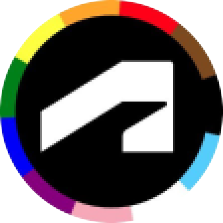
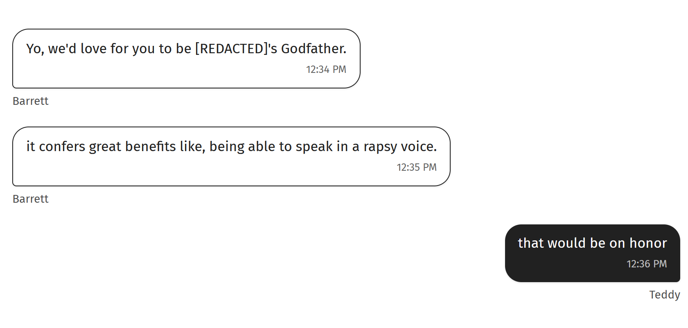

<!DOCTYPE html>
<html lang="en">
<head>
  <meta charset="UTF-8">
  <meta name="viewport" content="width=device-width, initial-scale=1.0">
  
  <!-- Primary Meta Tags -->
  <meta name="title" content="Teddy Warner">
  <meta name="description" content="I use digital fabrication techniques to accelerate human centric design. // @WarnerTeddy">
  <meta name="keywords" content="Digital fabrication, PCB development, Mechatronics engineering, USC Iovine and Young Academy, Engineering design, Fab Academy, Hardware engineering, Rapid prototyping, CAD design, Physical computing, Electronics design, IoT development, Wearable technology, Engineering portfolio">
  <meta name="author" content="Teddy Warner">
  <meta name="robots" content="index, follow">
  
  <!-- Open Graph / Facebook -->
  <meta property="og:type" content="website">
  <meta property="og:url" content="https://teddywarner.org/">
  <meta property="og:title" content="Teddy Warner">
  <meta property="og:description" content="I use digital fabrication techniques to accelerate human centric design. // @WarnerTeddy">
  <meta property="og:image" content="https://teddywarner.org/assets/images/thumb.png">
  <meta property="og:image:type" content="image/png">
  <meta property="og:image:width" content="1200">
  <meta property="og:image:height" content="630">

  <!-- Twitter -->
  <meta property="twitter:card" content="summary_large_image">
  <meta property="twitter:url" content="https://teddywarner.org/">
  <meta property="twitter:title" content="Teddy Warner">
  <meta property="twitter:description" content="I use digital fabrication techniques to accelerate human centric design. // @WarnerTeddy">
  <meta property="twitter:image" content="https://teddywarner.org/assets/images/thumb.png">

  <link rel="preconnect" href="https://fonts.googleapis.com">
  <link rel="preconnect" href="https://fonts.gstatic.com" crossorigin>
  <link href="https://fonts.googleapis.com/css2?family=Crimson+Pro:ital,wght@0,200..900;1,200..900&display=swap" rel="stylesheet">
  <link href="https://fonts.googleapis.com/css2?family=Crimson+Pro:ital,wght@0,200..900;1,200..900&family=JetBrains+Mono:ital,wght@0,100..800;1,100..800&display=swap" rel="stylesheet">
  
  <link rel="stylesheet" href="/assets/css/index.css">
  <link rel="stylesheet" href="/assets/css/header.css">
</head>

<body>

  <nav class="main-navigation">
    <ul>
      <li><a class="home" href="https://teddywarner.com">01 Home</a></li>
      <li><a class="proj" href="https://teddywarner.com/proj/">02 Projects</a></li>
      <li><a class="writ" href="https://teddywarner.com/writ/">03 Writing</a></li>
    </ul>
  </nav>
  
  

  <main data-scroll-container>
  

    <section class="intro-section">
      

        

          <h2>Hey! I’m <a id="twittername" target=”_blank” href="https://x.com/WarnerTeddy">Teddy</a>, </h2>
          <h3>I build robots and write essays  here's a bit of my work.</h3>
        

      

    </section>
    <section class="featured-projects">
        

            

                

                    <svg viewBox="0 0 1440 1024" preserveAspectRatio="none" fill="none" xmlns="http://www.w3.org/2000/svg">
                        <defs>
                            <clipPath id="clip0_107_71">
                                <rect x="804.5" y="624" width="226" height="272" rx="21" />
                            </clipPath>
                            <clipPath id="clip1_107_71">
                                <rect x="143" y="212" width="467" height="288" rx="25" />
                            </clipPath>
                            <clipPath id="clipImage1">
                                <rect x="1065" y="307" width="225" height="389" rx="112.5" />
                            </clipPath>
                            <clipPath id="clipImage2">
                                <rect x="277.5" y="527" width="492" height="328" rx="21" />
                            </clipPath>
                            <clipPath id="clipImage4">
                                <rect x="151" y="220" width="451" height="273" rx="21" />
                            </clipPath>
                            <clipPath id="clipImageTone">
                                <path d="M847.468 115H819.532H658.601H649.2C645.28 115 643.319 115 641.822 115.763C640.505 116.434 639.434 117.505 638.763 118.822C638 120.319 638 122.28 638 126.2V135.343V470.823V480.8C638 484.72 638 486.681 638.763 488.178C639.434 489.495 640.505 490.566 641.822 491.237C643.319 492 645.28 492.165 649.2 492.165H659.601H749.535H759.685C760.842 492.165 761.42 492.165 761.909 492.176C784.891 492.699 803.397 511.205 803.92 534.187C803.931 534.676 803.931 535.254 803.931 536.411V565.657V575.731C803.931 579.651 804 581.681 804.763 583.178C805.434 584.495 806.505 585.566 807.822 586.237C809.319 587 811.28 587 815.2 587L825.463 586.931L1007.4 587H1017.8C1021.72 587 1023.68 587 1025.18 586.237C1026.5 585.566 1027.57 584.495 1028.24 583.178C1029 581.681 1029 579.72 1029 575.8V565.657V136.343V126.2C1029 122.28 1029 120.319 1028.24 118.822C1027.57 117.505 1026.5 116.434 1025.18 115.763C1023.68 115 1021.72 115 1017.8 115H1007.4H847.468Z" />
                            </clipPath>
                            <path id="circlePath" d="M 1137 797 m -50, 0 a 50,50 0 1,1 100,0 a 50,50 0 1,1 -100,0" />
                        </defs>
                        <g id="title-group" class="title">
                            <rect x="141" y="143" width="224" height="49" rx="24.5" fill="var(--md-default-bg-color)" />
                            <rect x="141.5" y="143.5" width="223" height="48" rx="24" stroke="var(--md-default-fg-color--lighter)" />
                            <text x="253" y="175" fill="var(--md-default-fg-color--light)" text-anchor="middle" font-family="Crimson Pro" font-size="23" font-style="normal" font-weight="300" line-height="109.588%">A Creative Curation</text>
                        </g>
                        <a href="https://teddywarner.org/Projects/AssistiveAquaponics/">
                            <g id="image-card-1" class="project">
                                <rect x="1057" y="299" width="240" height="405" rx="120" fill="var(--md-default-fg-color--lightest)" />
                                <rect x="1057.5" y="299.5" width="239" height="404" rx="119.5" stroke="var(--md-default-fg-color--lighter)" stroke-opacity="0.2" />
                                <image x="1065" y="307" width="225" height="389" href="assets/images/index/aaft.png" clip-path="url(#clipImage1)" preserveAspectRatio="xMidYMid slice" alt="Assistive Aquaponics project image" />
                                <rect x="1065.5" y="307.5" width="224" height="388" rx="112" stroke="var(--md-default-fg-color--lighter)" stroke-opacity="0.2" />
                            </g>
                        </a>
                        <a href="https://teddywarner.org/writ">
                          <g id="image-card-2" class="project">
                              <rect x="269.5" y="520" width="508" height="342" rx="26" fill="var(--md-default-fg-color--lightest)" />
                              <rect x="270" y="520.5" width="507" height="341" rx="25.5" stroke="var(--md-default-fg-color--lighter)" stroke-opacity="0.2" />
                              <image x="277.5" y="527" width="492" height="328" href="assets/images/index/flowers.jpg" clip-path="url(#clipImage2)" preserveAspectRatio="xMidYMid slice" alt="Flowers project image" />
                              <rect x="278" y="527.5" width="491" height="327" rx="20.5" stroke="var(--md-default-fg-color--lighter)" stroke-opacity="0.2" />
                          </g>
                        </a>
                        <a target="_blank" href="https://www.goodreads.com/review/list/179003175?shelf=%23ALL%23&view=covers">
                          <g id="reading-card" class="project">
                              <rect x="796.5" y="616" width="242" height="288" rx="27" fill="var(--md-default-fg-color--lightest)" stroke="var(--md-default-fg-color--lighter)" stroke-opacity="0.2" />
                              <g clip-path="url(#clip0_107_71)">
                                  <g class="reading-content">
                                      <rect x="804.5" y="624" width="226" height="272" rx="21" fill="var(--md-default-bg-color)" fill-opacity="0.4" />
                                      <rect x="843" y="645" width="149" height="31" rx="15.5" fill="var(--md-default-bg-color)" />
                                      <text x="917.5" y="665" text-anchor="middle" fill="var(--md-default-fg-color)" fill-opacity="0.55" font-family="JetBrains Mono" font-size="12" font-style="normal" font-weight="300" line-height="109.588%">What I'm Reading</text>
                                      <text x="816" y="700" text-anchor="left" fill="var(--md-default-fg-color)" fill-opacity="0.75" font-family="JetBrains Mono" font-size="16" font-style="normal" font-weight="500" line-height="109.588%">When</text>
                                      <text x="816" y="720" text-anchor="left" fill="var(--md-default-fg-color)" fill-opacity="0.75" font-family="JetBrains Mono" font-size="16" font-style="normal" font-weight="500" line-height="109.588%">Einstein</text>
                                      <text x="816" y="740" text-anchor="left" fill="var(--md-default-fg-color)" fill-opacity="0.75" font-family="JetBrains Mono" font-size="16" font-style="normal" font-weight="500" line-height="109.588%">Walked with</text>
                                      <text x="816" y="760" text-anchor="left" fill="var(--md-default-fg-color)" fill-opacity="0.75" font-family="JetBrains Mono" font-size="16" font-style="normal" font-weight="500" line-height="109.588%">Gödel</text>
                                      <text x="817" y="778" text-anchor="left" fill="var(--md-default-fg-color)" fill-opacity="0.75" font-family="JetBrains Mono" font-size="11" font-style="normal" font-weight="400" line-height="109.588%">Jim Holt</text>
                                  </g>
                                  <image x="930.473" y="713" width="144.272" height="230.193" transform="rotate(10 930.473 713)" href="https://images-na.ssl-images-amazon.com/images/S/compressed.photo.goodreads.com/books/1515964026i/36794489.jpg" preserveAspectRatio="xMidYMid slice" alt="Book cover of When Einstein Walked with Gödel" />
                              </g>
                              <rect x="805" y="624.5" width="225" height="271" rx="20.5" stroke="var(--md-default-fg-color--lighter)" stroke-opacity="0.2" />
                          </g>
                        </a>
                        <a href="https://teddywarner.org/Projects/VonNiemannProbe/">
                            <g id="image-card-4" class="project">
                                <g clip-path="url(#clip1_107_71)">
                                    <rect x="142" y="212" width="468" height="288" rx="26" fill="var(--md-default-fg-color--lightest)" />
                                    <image x="151" y="220" width="451" height="273" href="assets/images/index/vnp.gif" clip-path="url(#clipImage4)" preserveAspectRatio="xMidYMid slice" alt="Von Niemann Probe project image" />
                                    <rect x="151.5" y="220.5" width="450" height="272" rx="20.5" stroke="var(--md-default-fg-color--lighter)" stroke-opacity="0.2" />
                                </g>
                                <rect x="143.5" y="212.5" width="466" height="287" rx="24.5" stroke="var(--md-default-fg-color--lighter)" stroke-opacity="0.2" />
                            </g>
                        </a>
                        <a target="_blank" href="https://tone.computer/">
                            <g id="image-card-3" class="project">
                                <path d="M848.04 107H818.96H652.485C644.615 107 640.679 107 637.673 108.503C635.029 109.825 632.879 111.935 631.532 114.53C630 117.48 630 121.342 630 129.066V477.986C630 485.71 630 489.572 631.532 492.522C632.879 495.117 635.029 497.227 637.673 498.549C640.679 500.052 644.615 500.052 652.485 500.052H750.262H760.035C780.16 500.052 796.475 516.367 796.475 536.493V572.934C796.475 580.658 796.475 584.52 798.007 587.47C799.354 590.065 801.504 592.175 804.149 593.497C807.155 595 811.09 595 818.96 595H818.96H1014.52H1014.52C1022.39 595 1026.32 595 1029.33 593.497C1031.97 592.175 1034.12 590.065 1035.47 587.47C1037 584.52 1037 580.658 1037 572.934V129.066V129.066C1037 121.342 1037 117.48 1035.47 114.53C1034.12 111.935 1031.97 109.825 1029.33 108.503C1026.32 107 1022.39 107 1014.52 107H848.04Z" fill="var(--md-default-fg-color--lightest)" stroke="var(--md-default-fg-color--lighter)" stroke-opacity="0.2" />
                                <image class="toneimg" x="638" y="107" width="390" height="488" clip-path="url(#clipImageTone)" preserveAspectRatio="xMidYMid slice" alt="Tone project image" />
                                <path d="M847.468 115H819.532H658.601H649.2C645.28 115 643.319 115 641.822 115.763C640.505 116.434 639.434 117.505 638.763 118.822C638 120.319 638 122.28 638 126.2V135.343V470.823V480.8C638 484.72 638 486.681 638.763 488.178C639.434 489.495 640.505 490.566 641.822 491.237C643.319 492 645.28 492.165 649.2 492.165H659.601H749.535H759.685C760.842 492.165 761.42 492.165 761.909 492.176C784.891 492.699 803.397 511.205 803.92 534.187C803.931 534.676 803.931 535.254 803.931 536.411V565.657V575.731C803.931 579.651 804 581.681 804.763 583.178C805.434 584.495 806.505 585.566 807.822 586.237C809.319 587 811.28 587 815.2 587L825.463 586.931L1007.4 587H1017.8C1021.72 587 1023.68 587 1025.18 586.237C1026.5 585.566 1027.57 584.495 1028.24 583.178C1029 581.681 1029 579.72 1029 575.8V565.657V136.343V126.2C1029 122.28 1029 120.319 1028.24 118.822C1027.57 117.505 1026.5 116.434 1025.18 115.763C1023.68 115 1021.72 115 1017.8 115H1007.4H847.468Z" fill="none" stroke="var(--md-default-fg-color--lighter)" stroke-opacity="0.2" />
                            </g>
                        </a>
                        <a class="circleLink" href="https://teddywarner.org/proj">
                            <g class="circleGroup" id="circleGroup">
                                <circle class="abtbtn" stroke="none" fill="var(--md-default-bg-color)" cx="1137" cy="797" r="50" onmouseenter="leftrevoff()" onmouseleave="leftrevon()" />
                                <path id="circlePath" d="M 1137 797 m -50, 0 a 50,50 0 1,1 100,0 a 50,50 0 1,1 -100,0" fill="none" />
                                <text class="circle-text" fill="var(--md-default-fg-color)" font-size="14.3" font-weight="300" font-family="JetBrains Mono" dy="0.4em">
                                    <textPath id="circleTextPath" href="#circlePath" startOffset="50%" text-anchor="middle">
                                      More Work - More Work - More Work - 
                                    </textPath>
                                </text>
                            </g>
                        </a>
                    </svg>
                

            

        

    </section>
    <section class="experience">
      

        <h2>What I’ve Been Up To</h2>
        <a target=”_blank” href="https://intempus.org">
          
Intempus
</a>
Founder

Sept 2024 - Present

        

        <a target=”_blank” href="https://www.midjourney.com/home">
          
Midjourney
</a>
Hardware

July 2024 - Aug 2024

        

        <a target=”_blank” href="https://www.autodesk.com/">
          
Autodesk
</a>
Author, Community Manager

May 2024 - Aug 2024

        

        <a target=”_blank” href="https://tone.computer/">
          
Tone
</a>
Founder

Oct 2023 - July 2024

        

        <a target=”_blank” href="https://rhythmlink.com/">
          
Rhythmlink
</a>
Manufacturing R&D
Oct 2022 - May 2023

        

        <a target=”_blank” href="https://www.charlottelatin.org/academics/steam">
          
Charlotte Latin CLS Fab Lab
</a>
Manager, Machinist

Oct 2020 - July 2023

        

        <a target=”_blank” href="https://www.youngengineersoftoday.com/">
          
Young Engineers of TodayYEOT
</a>
Instructor

June 2019 - Aug 2023

    </section>
    <section class="about">
      

        <h2>About</h2>
        
I’m an engineer specialized in rapid prototyping and applied AI. I’m currently based in SF, building <a target=”_blank” href="https://intempus.org">emotionally intellegent robots</a>.

        
I'm a <a target=”_blank” style="text-decoration: none;" href="https://thielfellowship.org/">Thiel Fellow</a> and a graduate of the <a target=”_blank” style="text-decoration: none;" href="https://fabacademy.org/">Fab Academy</a>. I previously studied design and engineering at the <a target=”_blank” style="text-decoration: none;" href="https://iovine-young.usc.edu/">USC Iovine and Young Academy</a>.

        
This site holds my <a href="https://teddywarner.org/proj">work</a> and <a href="https://teddywarner.org/writ">writings</a>.   Contact me on X <a target=”_blank” href="https://x.com/WarnerTeddy">@WarnerTeddy</a> or at <a href="mailto:teddy@intempus.org">teddy@intempus.org</a>.

    </section>
    <section class="projects">
      

        <a href="https://teddywarner.org/proj"><h2>Projects</h2></a>
        

          <a target=”_blank” href="https://intempus.org/research/"> 

              
Intempus

              
Expressive robots.

              <i class="fa-solid fa-arrow-up-right-from-square"></i>
            
 </a>
          <a href="https://teddywarner.org/Projects/SerialUPDI/"> 

              
UPDI Serial Programming

              
$2.20 and 22x Faster.

              <i class="fa-solid fa-arrow-up-right-from-square"></i>
            
 </a>
          <a href="https://teddywarner.org/Projects/AssistiveAquaponics/"> 

              
Assistive Aquaponics

              
Automated ecosystem monitoring.

              <i class="fa-solid fa-arrow-up-right-from-square"></i>
            
 </a>
          <a href="https://teddywarner.org/Projects/VonNiemannProbe/"> 

              
Von Niemann Probe

              
A Chess cheating device.

              <i class="fa-solid fa-arrow-up-right-from-square"></i>
            
 </a>
          
          <a href="https://teddywarner.org/Projects/MillingWorflow/"> 

              
CNC Milling Workflows

              
Jargon, Feeds & Speeds, etc.

              <i class="fa-solid fa-arrow-up-right-from-square"></i>
            
 </a>
          
          <a href="https://teddywarner.org/Projects/ParametricGenerator/"> 

              
Parametric Cap Generator

              
Lost a cap? Make a new one.

              <i class="fa-solid fa-arrow-up-right-from-square"></i>
            
 </a>
        

      

    </section>
    <section class="writing">
      

        <a href="https://teddywarner.org/writ"><h2>Writing</h2></a>
        

          <a href="https://teddywarner.org/writings/on-becoming-a-godfather/">
            

            
On Becoming a Godfather

            
This confers great benefits like, being able to speak in a raspy voice.

            
Aug 2025

            
            
10–13 mins

            
          </a>
        

        

        

          <a href="https://teddywarner.org/writings/on-turning-twenty">
            

            
On Turning Twenty

            
I turned twenty today.

            
Aug 2025

            
            
9-11 mins

            
          </a>
        

        
        

        

          <a href="https://teddywarner.org/writings/efd">
            

            
The Emotion/Feeling Discontinuity

            
How to convince yourself into greatness.

            
Dec 2024

            
            
5-6 mins

            
          </a>
        

        
      

    </section>
    <section class="press">
      

        <h2>Press</h2>
        
<a target=”_blank” href="https://techcrunch.com/2025/05/25/why-intempus-thinks-robots-should-have-a-human-physiological-state/">TechCrunch</a>, <a target=”_blank” href="https://www.inc.com/chloe-aiello/why-this-19-year-old-founder-wants-to-give-robots-emotional-intelligence/91195706">Inc. Magazine</a>, <a target=”_blank” href="https://www.youtube.com/live/JY0RL1jr22o?t=9656s">TBPN</a>, <a target=”_blank” href="https://businesswire.com/news/home/20250522267532/en/Thiel-Foundation-Announces-2025-Class-of-Thiel-Fellows">Business Wire</a>, <a target=”_blank” href="https://blog.adafruit.com/2023/02/01/the-von-niemann-probe-aims-to-investigate-the-accusations-of-chess-cheating-wearablewednesday/">Adafruit</a>, <a target=”_blank” href="https://hackaday.com/2023/02/01/electronic-shoe-explores-alleged-chess-misbehavior/">Hackaday</a> (<a target=”_blank” href="https://hackaday.com/2022/12/26/turning-a-microchip-mplab-snap-into-a-udpi-avr-programmer/">x2</a>, <a target=”_blank” href="https://hackaday.com/2023/01/25/pizza-making-cnc-machine-is-the-only-tool-weve-ever-dreamed-of/">x3</a>), <a target=”_blank” href="https://www.hackster.io/news/pizza-pizza-cnc-machine-makes-pizzas-so-you-don-t-have-to-2abc96e2c411">Hackster.io</a> (<a target=”_blank” href="https://www.hackster.io/news/this-chess-cheating-wearable-aims-to-investigate-the-accusations-against-grandmaster-hans-neimann-90b63403b5d0">x2</a>), <a target=”_blank” href="https://www.chicagotribune.com/2016/01/04/st-francis-students-gain-skills-while-creating-underwater-robot/">Chicago Tribune</a>  testestestestestsetsettestestestsetset

    </section>
    <section class="footer">
      

        

          <a target=”_blank” href="https://github.com/Twarner491">
            <i class="fa-brands fa-github"></i>
          </a>
        

        

          <a target=”_blank” href="https://x.com/WarnerTeddy">
            <i class="fa-brands fa-x-twitter"></i>
          </a>
        

        

          <a target=”_blank” href="mailto:tawarner@usc.edu">
            <i class="fa-solid fa-paper-plane"></i>
          </a>
        

        <a target=”_blank” href="https://github.com/Twarner491/TeddyWarner.org/blob/main/LICENSE">
          
Copyright © 2025 Teddy Warner

        </a>
    </section>
    <h1 style="display:none;">Teddy Warner - Digital Fabrication Engineer & Designer</h1>
  

  </main>

  
  
  
  
</body>
</html>