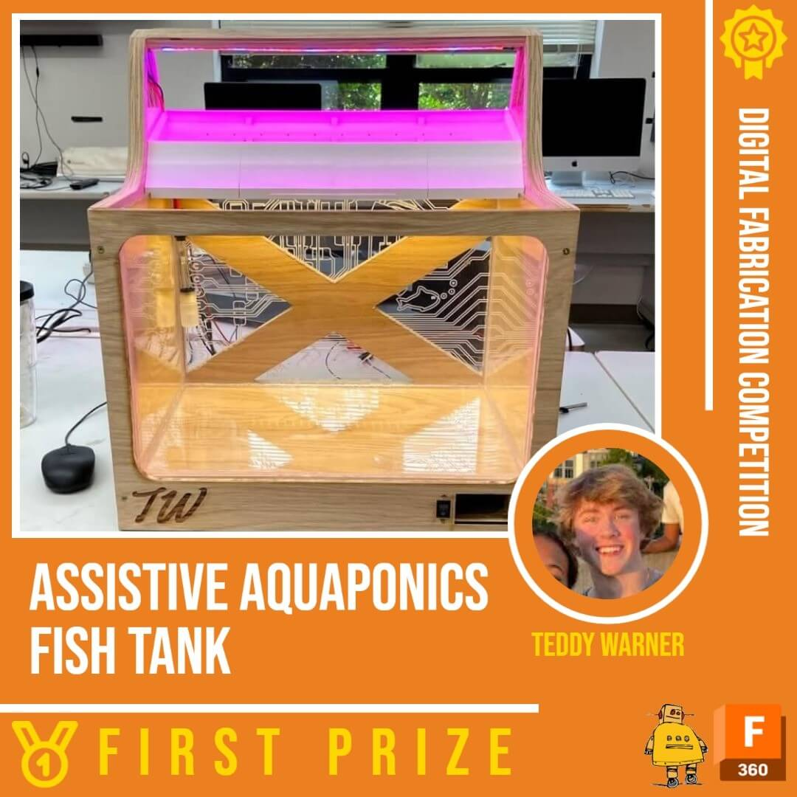

<head>
  <meta charset="UTF-8">
  <meta name="viewport" content="width=device-width, initial-scale=1.0">
  <title>Teddy Warner</title>
  
  
</head>

<nav class="main-navigation">
    <ul>
      <li><a class="home" href="../">01 Home</a></li>
      <li><a class="about" href="http://teddywarner.com/About-Me/about/">02 About Me</a></li>
      <li><a class="proj" href="http://teddywarner.com/feed/">03 Projects</a></li>
      <li><a class="mach" href="http://teddywarner.com/Machine-Profiles/FusionPro48/">04 Machine Profiles</a></li>
      <li><a style="font-family: 'Fira Sans';" class="fab" href="https://fabacademy.org/2021/labs/charlotte/students/theodore-warner/">05 Fab Academy</a></li>
    </ul>
</nav>

<body>
  <main data-scroll-container>
   <section class="head" data-scroll-section>
    

      <svg class="svgwave" xmlns="http://www.w3.org/2000/svg" width="651.13959" height="458.78751" viewBox="0 0 651.13959 458.78751">
        <defs>
          <linearGradient id="grad">
            <stop offset="5%" stop-color="#0f5cbf"/>
            <stop offset="25%" stop-color="#25d964"/>
            <stop offset="50%" stop-color="#f2b90f"/>
            <stop offset="75%" stop-color="#f24f13"/>
            <stop offset="95%" stop-color="#8080ff"/>
          </linearGradient>
        </defs>
         <path id="wavepath" d="m -248.17361,246.93888 c 24.96004,16.36036 49.9193,32.72021 73.62105,44.88566 23.70175,12.16546 46.14365,20.13548 67.53808,21.91827 21.394432,1.7828 41.73896,-2.62169 55.68722,-9.75315 13.948261,-7.13146 21.498958,-16.98931 26.847468,-29.99346 5.348511,-13.00415 8.494635,-29.15425 8.389798,-50.54871 -0.104836,-21.39446 -3.460633,-48.0311 -20.555114,-66.90869 -17.09448,-18.87758 -47.925876,-29.99366 -69.320482,-53.80018 -21.3946,-23.806515 -33.34963,-60.300818 -23.3865,-85.995374 9.96313,-25.694556 41.843213,-40.58591 77.291019,-49.395388 35.447805,-8.809479 74.459737,-11.536119 110.116538,-12.375089 35.656801,-0.83897 67.957003,0.209738 95.539133,5.768177 27.58214,5.558439 50.4435,15.625828 69.32095,30.518161 18.87746,14.8923329 33.7688,34.607632 51.59759,53.065601 17.82878,18.457969 38.59279,35.656435 67.22366,46.563331 28.63086,10.906891 65.1259,15.521211 101.62137,20.135581"></path>
         <text id="wavetext" text-anchor="middle">
          <textPath class="my-text" href="#wavepath" startOffset="50%">
          <animate attributeName="startOffset" from="-50%" to="150%" begin="0s" dur="100s" repeatCount="indefinite"></animate>
            TEDDYWARNER.ORG • TEDDYWARNER.ORG • TEDDYWARNER.ORG • TEDDYWARNER.ORG • TEDDYWARNER.ORG • TEDDYWARNER.ORG • TEDDYWARNER.ORG • TEDDYWARNER.ORG • TEDDYWARNER.ORG • TEDDYWARNER.ORG • TEDDYWARNER.ORG • TEDDYWARNER.ORG • TEDDYWARNER.ORG • TEDDYWARNER.ORG • TEDDYWARNER.ORG • 
          </textPath>
        </text>
      </svg>
    

    

      

        
      

    

   

    

      <svg class="svgspin1" xmlns="http://www.w3.org/2000/svg" width="109.01334mm" height="108.60135mm" viewBox="0 0 109.01334 108.60135">
        <defs>
          <clipPath id="myClip1">
              <path transform="scale(2.38)" d="M 24.714666,11.296318 C 13.323524,16.938343 5.1073711,23.065641 1.9044893,31.699804 -1.2983925,40.333967 0.51190865,51.474289 7.2957899,60.658898 14.079671,69.843507 25.836173,77.071843 36.337524,84.555813 c 10.50135,7.48397 19.746332,15.222649 29.77514,19.820247 10.028808,4.59759 20.840247,6.05374 27.921117,-1.09297 7.080869,-7.146718 10.430629,-22.895579 12.531879,-35.774947 2.10125,-12.879367 2.95373,-22.887717 0.92183,-31.987606 C 105.45558,26.420648 100.53937,18.230297 93.016916,11.685032 85.494457,5.1397676 75.366562,0.24052821 63.019063,0.36909154 50.671564,0.49765486 36.105807,5.6542924 24.714666,11.296318 Z"></path>
          </clipPath>
        </defs>
      </svg>
    

    

      <svg class="svgspin2" xmlns="http://www.w3.org/2000/svg" width="139.41669mm" height="105.1701mm" viewBox="0 0 139.41669 105.1701">
        <defs>
          <clipPath id="myClip2">
            <path transform="scale(2.86)" d="m 62.849321,26.23857 c 6.914581,7.091318 16.376711,12.516217 29.18273,16.968074 12.806019,4.451858 28.954879,7.930418 37.909179,13.975608 8.95431,6.04519 10.67558,14.469968 8.06447,22.760979 -2.61111,8.29101 -9.33294,15.745074 -16.53733,19.979824 -7.20439,4.234755 -14.74191,5.084795 -24.609565,4.919735 -9.867656,-0.16505 -22.064076,-1.34522 -32.768676,-4.2537 C 53.385529,97.680613 44.174053,93.043994 35.51008,87.412892 26.846108,81.78179 18.730079,75.156459 12.24633,66.532136 5.7625818,57.907812 0.79925286,47.039032 0.34379623,37.56573 -0.1116604,28.092428 3.8848046,19.892876 8.7613652,13.546875 13.637926,7.2008746 19.394051,2.7091682 25.947569,1.0323236 32.501088,-0.64452108 39.851209,0.4935627 45.709704,5.4416481 51.568199,10.389733 55.93474,19.147253 62.849321,26.23857 Z"></path>
          </clipPath>
        </defs>
      </svg>
    

    

      

        <h2>a student.</h2>
        <h2>a maker.</h2>
        <h2>a developer.</h2>
        <h2>an <em>award winning</em> designer.</h2>
        <h2>a graduate of the <a href="https://fabacademy.org/">Fab Academy</a>.</h2>
      

      <h2><b>Hey! I’m Teddy Warner✌️,</b> </h2>
      <h3>I'm a student at the University of Southern California's <a href="https://iovine-young.usc.edu/">Iovine and Young Academy</a> from <em>Charlotte, NC</em> 🇺🇸. As a graduate of the <a href="https://fabacademy.org/">Fab Academy</a>, I have a great interest in contemporary fabrication technologies, and a passion to spread the reaches of digital fabrication.
      </h3> 
      <h3> I utlize plethoras of fabrication processes to produce mixed-media projects equipped with additive and subtractive parts, custom electronics, and software integration. My personal work encompasses my hope to inspire & showcase the vast potential of digital fabrication.
      </h3>
      <h3 style="width:31em;">When I'm not studying, I love to lose myself in the internet or pick up a new book, hit a mountain bike trail with my friends, and foremost, continue work on a project. Regardless of the activity, you'll always find me listing to some music.
      </h3>
      

        

          <svg version="1.1" xmlns="http://www.w3.org/2000/svg" xmlns:xlink="http://www.w3.org/1999/xlink" x="0px" y="0px" width="200px" height="200px" viewBox="0 0 300 300" xml:space="preserve" class="textrev">
            <defs>
              <path id="circlePath" d=" M 150, 150 m -60, 0 a 60,60 0 0,1 120,0 a 60,60 0 0,1 -120,0 "/>
            </defs>
            <g>
             <use xlink:href="#circlePath" fill="none"/>
               <text>
                 <textPath fill="var(--md-default-fg-color)" xlink:href="#circlePath">- More About Me - More About Me - More About Me </textPath>
               </text>
            </g>
            <a href="http://teddywarner.com/About-Me/about/" class="abtbtn" onmouseenter="leftrevon()" onmouseleave="leftrevoff()">
              <circle fill="none" cx="150" cy="150" r="75"/>
             </a>
          </svg>
        

       

    

   </section>
    <section class="featured-projects" data-scroll-section>
    

    <h2>Featured Projects</h2>
      

      

        <a href="https://teddywarner.org/Projects/AdaptableAquaponics/">
          

        </a>
        <a href="https://teddywarner.org/Projects/VonNiemannProbe/">
          

            <svg xmlns="http://www.w3.org/2000/svg" viewBox="-846.979 63.885 447.7 559.7" style="transform: scale(1.1);">
              <defs>
                <clipPath id="funnypath">
                  <path d="m-424.23 623.55h-218.67a24.985 24.985 0 0 1-24.985-24.985v-49.171a34.979 34.979 0 0 0-34.979-34.979h-119.13a24.985 24.985 0 0 1-24.985-24.985v-400.56a24.985 24.985 0 0 1 24.985-24.985h397.77a24.985 24.985 0 0 1 24.985 24.985v509.7a24.985 24.985 0 0 1-24.985 24.985z" />
                </clipPath>
              </defs>
              <g clip-path="url(#funnypath)">
                <image width="504px" x="-846.979" y="63.885" xlink:href="https://teddywarner.org/images/VonNiemannProbe/cover.jpg" />
              </g>
            </svg>
          

        </a>
        <a href="https://teddywarner.org/Projects/ParametricGenerator">
          

        </a>
        <a href="https://teddywarner.org/Projects/SerialUPDI">
          

        </a>
        <a href="https://teddywarner.org/Projects/AssistiveAquaponics">
          

        </a>
      

        

          <svg version="1.1" xmlns="http://www.w3.org/2000/svg" xmlns:xlink="http://www.w3.org/1999/xlink" x="0px" y="0px" width="200px" height="200px" viewBox="0 0 300 300" xml:space="preserve" class="textrev">
            <defs>
              <path id="circlePath" d=" M 150, 150 m -60, 0 a 60,60 0 0,1 120,0 a 60,60 0 0,1 -120,0 "/>
            </defs>
            <g>
              <use xlink:href="#circlePath" fill="none"/>
                <text>
                  <textPath fill="var(--md-default-fg-color)" xlink:href="#circlePath">- More Projects - More Projects - More Projects </textPath>
                </text>
            </g>
            <a href="http://teddywarner.com/feed/" class="abtbtn" onmouseenter="leftrevon()" onmouseleave="leftrevoff()">
              <circle fill="none" cx="150" cy="150" r="75"/>
            </a>
          </svg>
        

      

        <svg xmlns="http://www.w3.org/2000/svg" height="100" width="100" viewBox="0 0 24 24"><title>New Project!</title><path d="M23,12L20.56,9.22L20.9,5.54L17.29,4.72L15.4,1.54L12,3L8.6,1.54L6.71,4.72L3.1,5.53L3.44,9.21L1,12L3.44,14.78L3.1,18.47L6.71,19.29L8.6,22.47L12,21L15.4,22.46L17.29,19.28L20.9,18.46L20.56,14.78L23,12M13,17H11V15H13V17M13,13H11V7H13V13Z" fill="#26a7de"/></svg>
      

    

    

    </section>    
    <section class="featured-articles" data-scroll-section>
    

      <h2>Featured Articles</h2>
      

       

        

          

           <a href="https://hackaday.com/2023/02/01/electronic-shoe-explores-alleged-chess-misbehavior/">
            
            <h3>Electronic Shoe Explores Alleged Chess Misbehavior </h3>
           </a> 
          

          

           <a href="https://blog.adafruit.com/2023/02/01/the-von-niemann-probe-aims-to-investigate-the-accusations-of-chess-cheating-wearablewednesday/">
            
            <h3>Adafruit - This Project Aims to Investigate the Accusations ...</h3>
           </a> 
          

          

           <a href="https://www.hackster.io/news/this-chess-cheating-wearable-aims-to-investigate-the-accusations-against-grandmaster-hans-neimann-90b63403b5d0">
            
            <h3>Hackster.io - This Chess-Cheating Wearable Aims to Investigate ...</h3>
           </a> 
          

        

        

          

           <a href="https://hackaday.com/2023/01/25/pizza-making-cnc-machine-is-the-only-tool-weve-ever-dreamed-of/">
            
            <h3>Pizza-Making CNC Machine Is The Only Tool We’ve Ever Dreamed Of</h3>
           </a> 
          

          

           <a href="https://hackaday.com/2022/12/26/turning-a-microchip-mplab-snap-into-a-udpi-avr-programmer/">
            
            <h3>Turning A Microchip MPLAB Snap Into A UDPI AVR Programmer</h3>
           </a> 
          

          

           <a href="https://www.hackster.io/news/pizza-pizza-cnc-machine-makes-pizzas-so-you-don-t-have-to-2abc96e2c411">
            
            <h3>Pizza-Pizza CNC Machine Makes Pizzas So You Don’t Have To</h3>
           </a> 
          

        

        

          

           <a href="https://blogs.autodesk.com/learn-lab/2022/07/20/upskilling-for-the-future-with-instructables-student-design-challenges/">
            
            <h3>Autodesk Learn Lab - Upskilling for the Future </h3>
           </a> 
          

          

           <a href="https://vimeo.com/563923609">
            
            <h3>Fab Academy 2021 Final Project Presentation</h3>
           </a> 
          

          

           <a href="https://www.chicagotribune.com/suburbs/wilmette/ct-wml-st-francis-underwater-robotics-tl-0107-20160104-story.html">
            
            <h3>St. Francis students gain skills while creating underwater robot</h3>
           </a> 
          

        

        

          

           <a href="https://www.instagram.com/p/CgyCMWkr7Wc/">
            
            <h3>Fusion 360 Students - Student Spotlight</h3>
           </a> 
          

          

           <a href="https://www.instagram.com/p/CYboI6zrTs8/">
            
            <h3>Charlotte Latin School Fab Lab - Student Spotlight</h3>
           </a> 
          

        

      

     

      

        <button onclick="scrollPrev()"><i class="fas fa-chevron-left"></i></button>
        <button onclick="scrollNext()"><i class="fas fa-chevron-right"></i></button>
      

      

     

    </section>
    <h1></h1>
   

  </main>
  
  
  
  
  
</body>
</html>
