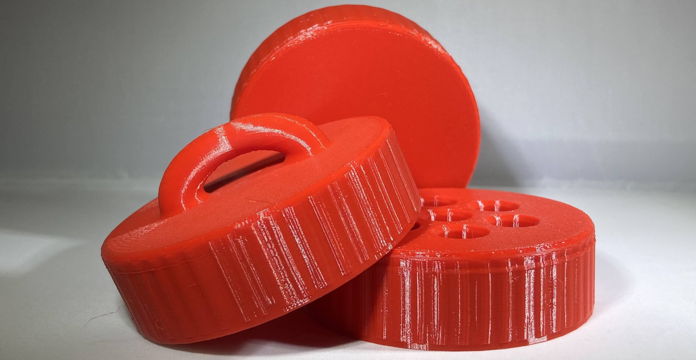
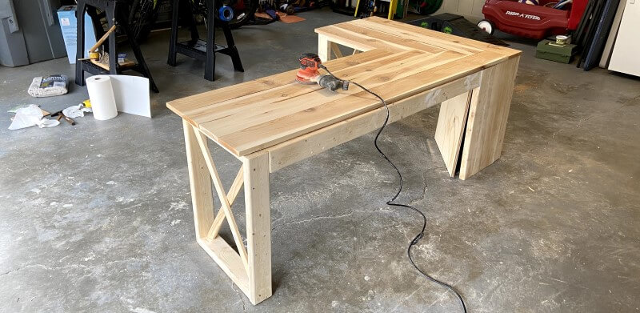

---
hide:
  - navigation
  - toc
  - feedback
template: index.html
search:
  exclude: true
---

<head>
  <meta charset="UTF-8">
  <meta name="viewport" content="width=device-width, initial-scale=1.0">
  
  <link rel="preconnect" href="https://fonts.googleapis.com">
  <link rel="preconnect" href="https://fonts.gstatic.com" crossorigin>
  <link href="https://fonts.googleapis.com/css2?family=Crimson+Pro:ital,wght@0,200..900;1,200..900&display=swap" rel="stylesheet">
  <link href="https://fonts.googleapis.com/css2?family=Crimson+Pro:ital,wght@0,200..900;1,200..900&family=JetBrains+Mono:ital,wght@0,100..800;1,100..800&display=swap" rel="stylesheet">
  <link rel="stylesheet" href="../assets/css/proj.css">
</head>

  <nav class="main-navigation">
    <ul>
      <li><a class="home" href="http://teddywarner.com">01 Home</a></li>
      <li><a class="proj" href="http://teddywarner.com/proj/">02 Projects</a></li>
      <li><a class="writ" href="http://teddywarner.com/writ/">03 Writing</a></li>
    </ul>
  </nav>

<body>
  <main data-scroll-container>
  

    <section class="intro-section">
      

        

          <h2>Project Portfolio</h2>
          <h3>Here's some of the Open-Source   shenanigans I've been up to.</h3>
        

      

    </section>
    <section class="writing">
      

        <!--

          <a target=”_blank” href="http://teddywarner.com/Projects/fastai/">
            

            
Hands on Neural Networks

            
Fall 2024

            
            
X-X mins

            
            
DESCRIPTION

          </a>
        

        
-->
        

          <a target=”_blank” href="https://tone.computer/">
            

            
Tone

            
2023-2024

            
            
1-2 mins

            
            
An AI-enabled pendant that acts as your second brain, distilling your lived experiences into a personal AI. A digital extension of yourself, starting in the form of a necklace.

          </a>
        

        

        

          <a href="http://teddywarner.com/Projects/VonNiemannProbe/">
            

            
Von Niemann Probe

            
Winter 2023

            
            
46-58 mins

            
            
An AVR-based Bluetooth telegraphing shoe insole that lets you play chess in the way Hans Niemann has been accused! This project is our contribution to the ongoing investigation into the Hans Niemann/Magnus Carlsen cheating scandal and tests the feasibility of creating and using an over-the-board chess cheating aid.

          </a>
        

        

        

          <a href="http://teddywarner.com/Projects/MillingWorflow/">
            

            
CNC Milling Workflows

            
2022-2023

            
            
12-15 mins

            
            
A guide for CNC milling, covering machinist jargon, material standards, feeds and speeds, CAM workflows with Autodesk Fusion 360 & Vetric Aspire, and milling workflows for Shopbot & Bantam Tools machines - all through a collection of milling micro-projects ranging from a 1 to 1.9 Million scale mill of Mars's Gale Crater to brass wax seals.

          </a>
        

        

        

          <a href="http://teddywarner.com/Projects/AdaptableAquaponics/">
            

            
Adaptable Aquaponics

            
Summer 2022

            
            
18-23 mins

            
            
A Theoretical Confrontation to Contemporary Farming Challenges. Adaptive Aquaponics is the scaled successor to my Assistive Aquaponics Fish Tank & my entry into Autodesk Instructable's Make It Modular student design scholarship.

          </a>
        

        

        

          <a href="http://teddywarner.com/Projects/SerialUPDI/">
            

            
UPDI Programming

            
Summer-Winter 2021

            
            
24-31 mins

            
            
Programming via the megaTinyCore library, enabling your IDE for serial UPDI programming via a portable python implementation and temporary hardware, or one of two designated serial programmer options. Each UPDI serial programmer enables switching between serial programming and monitoring without any rewiring.

          </a>
        

        

        

          <a href="http://teddywarner.com/Projects/ParametricGenerator/">
            

            
Parametric Bottle Cap Generator

            
Fall 2021

            
            
6-7 mins

            
            
Lost a lid or just want a more functional cap? Generate and print your own, compatible with any existing threads! Uses metric thread standards via equasions in fusions parameters, allowing for the generation of a threaded cap with only 3 required measurements.

          </a>
        

        

        

          <a href="http://teddywarner.com/Projects/LithophaneExperiments/">
            

            
Lithophane Experiments

            
2019-2022

            
            
1-2 mins

            
            
A Lithophane is a piece of art made out of a thin translucent material designed to show an image in a “grisaille” color format when held up to light, an art medium I use to test slicer changes with.

          </a>
        

        

        

          <a href="http://teddywarner.com/Projects/Octoprint/">
            

            
Octoprint Setup

            
Fall 2021

            
            
9-11 mins

            
            
Complete Octoprint Setup Documentation, including hardware setup, software installation, machine mounting, and a list of great plugins to expand Octoprint's capabilities.

          </a>
        

        

        

          <a href="https://fabacademy.org/2021/labs/charlotte/students/theodore-warner/Final%20Project/final-project/">
            

            
Assistive Aquaponics Fish Tank

            
Winter-Spring 2021

            
            
83–105 mins

            
            
A monitored aquaponics ecosystem, expanding the accessibility of successful & thriving aquaponics ecosystems. - my Fab Academy final project.

          </a>
        

        

        

          <a href="http://teddywarner.com/Projects/KlipperEnder3/">
            

            
Klipper Enabled Ender 3

            
Spring-Summer 2021

            
            
10-12 mins

            
            
A modified Ender 3 with printer electronics rehoused, carriage reworked to direct drive, motherboard & screen swapped, and Klipper firmware installed.

          </a>
        

        

        

          <a href="http://teddywarner.com/Projects/ProjectPortfolioSite/">
            

            
Project Portfolio Site

            
Summer 2021

            
            
6-7 mins

            
            
The behind the scenes of the site you are on right now - Static site generation with Mkdocs, and hosting via GitHub Pages.

          </a>
        

        

        

          <a href="http://teddywarner.com/Projects/CornerDesk/">
            

            
Cable-managed Corner Desk

            
Spring 2020

            
            
6-8 mins

            
            
A desk for the corner of my bedroom with integrated cable management and laptop mounting, allowing for super-clean cable routing.

          </a>
        

      

    </section>
    <section class="footer">
      

        

          <a target=”_blank” href="https://github.com/Twarner491">
            <i class="fa-brands fa-github"></i>
          </a>
        

        

          <a target=”_blank” href="https://x.com/WarnerTeddy">
            <i class="fa-brands fa-twitter"></i>
          </a>
        

        

          <a target=”_blank” href="mailto:tawarner@usc.edu">
            <i class="fa-solid fa-paper-plane"></i>
          </a>
        

        <a target=”_blank” href="https://github.com/Twarner491/TeddyWarner.org/blob/main/LICENSE">
          
Copyright © 2021 Teddy Warner

        </a>
    </section>
    <h1></h1>
  

  </main>
  
  
  
</body>
</html>