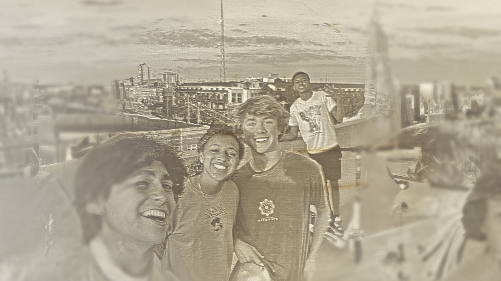

---
hide:
  - navigation
  - toc
  - feedback
template: index.html
search:
  exclude: true
---

<head>
  <meta charset="UTF-8">
  <meta name="viewport" content="width=device-width, initial-scale=1.0">
  
  <!-- Primary Meta Tags -->
  <meta name="title" content="Projects - Teddy Warner">
  <meta name="description" content="Some of the Open-Source shenanigans I've been up to.">
  <meta name="keywords" content="Digital fabrication, PCB development, Mechatronics engineering, USC Iovine and Young Academy, Engineering design, Fab Academy, Hardware engineering, Rapid prototyping, CAD design, Physical computing, Electronics design, IoT development, Wearable technology, Engineering portfolio">
  <meta name="author" content="Teddy Warner">
  <meta name="robots" content="index, follow">
  
  <!-- Open Graph / Facebook -->
  <meta property="og:type" content="website">
  <meta property="og:url" content="https://teddywarner.org/proj/">
  <meta property="og:title" content="Projects - Teddy Warner">
  <meta property="og:description" content="Some of the Open-Source shenanigans I've been up to.">
  <meta property="og:image" content="https://teddywarner.org/assets/images/thumb.png">
  <meta property="og:image:type" content="image/png">
  <meta property="og:image:width" content="1200">
  <meta property="og:image:height" content="630">

  <!-- Twitter -->
  <meta property="twitter:card" content="summary_large_image">
  <meta property="twitter:url" content="https://teddywarner.org/proj/">
  <meta property="twitter:title" content="Projects - Teddy Warner">
  <meta property="twitter:description" content="Some of the Open-Source shenanigans I've been up to.">
  <meta property="twitter:image" content="https://teddywarner.org/assets/images/thumb.png">

  <!-- Existing resource links -->
  
  <link rel="preconnect" href="https://fonts.googleapis.com">
  <link rel="preconnect" href="https://fonts.gstatic.com" crossorigin>
  <link href="https://fonts.googleapis.com/css2?family=Crimson+Pro:ital,wght@0,200..900;1,200..900&display=swap" rel="stylesheet">
  <link href="https://fonts.googleapis.com/css2?family=Crimson+Pro:ital,wght@0,200..900;1,200..900&family=JetBrains+Mono:ital,wght@0,100..800;1,100..800&display=swap" rel="stylesheet">
  <link rel="stylesheet" href="/assets/css/proj.css">
  <link rel="stylesheet" href="/assets/css/header.css">
  
  
</head>

  <nav class="main-navigation">
    <ul>
      <li><a class="home" href="https://teddywarner.com">01 Home</a></li>
      <li><a class="proj" href="https://teddywarner.com/proj/">02 Projects</a></li>
      <li><a class="writ" href="https://teddywarner.com/writ/">03 Writing</a></li>
    </ul>
  </nav>
  
  

<body>
  <main data-scroll-container>
  

    <section class="intro-section">
      

        

          <h2>Projects and Adventures</h2>
          <h3>Here's some of the stuff I've been up to.</h3>
        

      

    </section>
    <section class="writing">
      

        

          <a target=”_blank” href="https://onethreenine.net/about">
            

            

              
onethreenine.net

              
A web accessable corkboard for my apartment.

            

          </a>
        

        

          <a href="https://teddywarner.org/Projects/Quotes/">
            

            

              
Quote Receipts

              
"Did I really say that?" Why yes, you did.

            

          </a>
        

        

          <a href="https://intempus.org/research">
            

            

              
Intempus

              
Giving agents a temporal understanding through human physiological data.

            

          </a>
        

        <!---

          <a href="https://teddywarner.org/Projects/pi0/">
            

            

              
Zero-Shot Prompt to Action

              
Zero-shot prompt to action on a $160 3D printed robotic arm with π₀.

            

          </a>
        
-->
          

          <a href="https://teddywarner.org/Projects/LearnedSpectrum/">
            

            

              
Learned Spectrum

              
Towards temporal understanding in AI through fMRI learning stage classification.

            

          </a>
        

        

          <a target=”_blank” href="https://tone.computer/">
            

            

              
Tone

              
A digital extension of yourself, in the form of a necklace.

            

          </a>
        

        

          <a href="https://teddywarner.org/Projects/VonNiemannProbe/">
            

            

              
Von Niemann Probe

              
A telegraphing shoe insole that lets you play chess in the way Hans Niemann has been accused!

            

          </a>
        

        

          <a href="https://teddywarner.org/Projects/MillingWorflow/">
            

            

              
CNC Milling Workflows

              
A guide for CNC milling, covering machinist jargon, material standards, and feeds and speeds.

            

          </a>
        

        <!---

          <a href="https://teddywarner.org/Projects/8-bit/">
            

            

              
8-bit Breadboard Computer

              
A dive into computer logic, and processor workings.

            

          </a>
        
-->
        

          <a href="https://teddywarner.org/Projects/PizzaPizza/">
            

            

              
Pizza-Pizza CNC Machine

              
A pizza-preparing, tool-changing, 3-axis, 3D-printed CNC machine!

            

          </a>
        

        

          <a href="https://teddywarner.org/Projects/AdaptableAquaponics/">
            

            

              
Adaptable Aquaponics

              
A theoretical confrontation to contemporary farming challenges.

            

          </a>
        

        

          <a href="https://teddywarner.org/Projects/SerialUPDI/">
            

            

              
UPDI Programming

              
Enabling your IDE for serial UPDI programming and monitoring.

            

          </a>
        

        

          <a href="https://teddywarner.org/Projects/ParametricGenerator/">
            

            

              
Parametric Bottle Cap Generator

              
Generate your own cap, compatible with any existing threads!

            

          </a>
        

        

          <a href="https://teddywarner.org/Projects/LithophaneExperiments/">
            

            

              
Lithophane Experiments

              
Some pretty Lithophanes I've made

            

          </a>
        

        

          <a href="https://teddywarner.org/Projects/Octoprint/">
            

            

              
Octoprint Setup

              
Complete Octoprint setup documentation.

            

          </a>
        

        

          <a href="https://teddywarner.org/Projects/AssistiveAquaponics/">
            

            

              
Assistive Aquaponics Fish Tank

              
A beautiful, monitored aquaponics ecosystem.

            

          </a>
        

        

          <a href="https://teddywarner.org/Projects/KlipperEnder3/">
            

            

              
Klipper Enabled Ender 3

              
A modified Ender 3 and Klipper profile.

            

          </a>
        

        

          <a href="https://teddywarner.org/Projects/ProjectPortfolioSite/">
            

            

              
Project Portfolio Site

              
The behind the scenes of the site you are on right now.

            

          </a>
        

        

          <a href="https://teddywarner.org/Projects/CornerDesk/">
            

            

              
Cable-managed Corner Desk

              
A lovely desk for the corner of my bedroom.

            

          </a>
        

      

    </section>
    <section class="footer">
      

        

          <a target=”_blank” href="https://github.com/Twarner491">
            <i class="fa-brands fa-github"></i>
          </a>
        

        

          <a target=”_blank” href="https://x.com/WarnerTeddy">
            <i class="fa-brands fa-x-twitter"></i>
          </a>
        

        

          <a target=”_blank” href="mailto:tawarner@usc.edu">
            <i class="fa-solid fa-paper-plane"></i>
          </a>
        

        <a target=”_blank” href="https://github.com/Twarner491/TeddyWarner.org/blob/main/LICENSE">
          
Copyright © 2025 Teddy Warner

        </a>
    </section>
    <h1 style="display:none;">Project Portfolio - Digital Fabrication & Engineering Projects</h1>
  

  </main>
  
  
  
  
</body>
</html>