<script src="/assets/js/mathjax.js"></script>
<script src="https://cdn.jsdelivr.net/npm/mathjax@3/es5/tex-mml-chtml.js" async></script>

<center>

<iframe width="100%" height="550" src="https://www.youtube.com/embed/YuM9sASTiBI" title="Assistive Aquaponics Fish Tank Project Video" frameborder="0" allow="autoplay; encrypted-media" allowfullscreen loading="lazy"></iframe>

</center>

## Final Project Concept

I've always had an interest in having my own home garden capable of growing plants and herbs, as I enjoy the access to fresh foods, however, my past attempts at gardening always seemed to be relatively fruitless. Due to my structured high school student schedule, I am usually not around to look after and take care of a garden, and thus, this want for fresh foods hasn't become a reality. My interest in my Fab Academy final project came from this interest in having a home garden that could morph to my tight high school schedule. I started brainstorming this concept and found many projects and articles that were helpful or influential to my idea, some of them being [Gardening + Arduino](https://www.instructables.com/Garduino-Gardening-Arduino/), [Garduino](https://github.com/gradyh/GradyHillhouseGarduino), [DIY Home Assistant Garden Automation System](https://www.youtube.com/watch?v=Q9fjKeYOyqU), [Raspberry Pi Powered IOT Garden](https://www.instructables.com/Raspberry-Pi-Powered-IOT-Garden/), and the [Advanced Irrigation System](https://create.arduino.cc/projecthub/narangrahulrahul8/advanced-irrigation-system-eeb622?ref=tag&ref_id=irrigation&offset=2). Although looking at projects like these gave me some inspiration, I have many personal design factors that have also helped me form my idea. I started the Fab Academy course with the idea of an Automated Windowsill Garden for my final project, talked about on my [Orginal Project Concept](https://www.youtube.com/watch?v=Q9fjKeYOyqU) page, however as I began work through the class, I expanded on the idea. After talking with [Professor Neil Gershenfeld](https://en.wikipedia.org/wiki/Neil_Gershenfeld) about my Final Project concept in the [Computer-Aided Design week lecture](https://vimeo.com/510901917), I began to alter my idea from this windowsill box garden, into a garden in a different form factor. While discussing my windowsill box concept, Neil suggested some research into the world of ['ponics'](https://organicmattersblog.com/2017/07/06/the-evolution-of-ponics-in-organic/), the techniques of growing plantlife without soil, where plant roots are placed in a water-mineral solution and fed with liquid fertilizers. After some research, I found the practice of Aquaponics especially appealing to me. "Aquaponics is a system of producing food that combines aquaculture (raising fish, snails, or prawns) and hydroponics (growing plants in water). It can be an elegant closed system whereby the fish produce waste which, in turn, circulates to feed the plants which, in turn, purify the water for the next school of aquatic generations" ([The Evolution of “Ponics” in Organic](https://organicmattersblog.com/2017/07/06/the-evolution-of-ponics-in-organic/)). The second thought that also leads me to this change was the form factor of the projects themselves. I attend Fab Academy classes on my Highschool campus after I finished my school day, and carrying in a windowsill box like a coffin to and from our lab every day would be impractical. With this form factor issue comes my third motivation for this change, my family may be moving houses in the upcoming months, and I would not want to build a windowsill box to fit a windowsill on a house that I may not even live in by the end of this course. With all of these thoughts in mind, I was still committed to the idea of a Garden in general, and settled on an aquaponic garden in a fish tank-like form factor, with the plants growing on top of the tank itself. This not only solves my transportation problem, but a fish tank-style aquaponic garden could be placed inside, and then be moved from house to house. 

## Reasearch, Planning & Sketches

Before starting work on designing, manufacturing, and running an aquaponics system, I set off to learn about the practice of aquaponics more in-depth. As stated previously, "Aquaponics is a system of producing food that combines aquaculture (raising fish, snails, or prawns) and hydroponics (growing plants in water). It can be an elegant closed system whereby the fish produce waste which, in turn, circulates to feed the plants which, in turn, purify the water for the next school of aquatic generations" ([The Evolution of “Ponics” in Organic](https://organicmattersblog.com/2017/07/06/the-evolution-of-ponics-in-organic/)). An Aquaponics system is thus an ecosystem shaped like a closed circle, where each step leads to the next until returned to where the system started. I jotted down this "Circle" concept in the diagram shown below, listing out each step taken in the system to return to the starting place.


  <figcaption>Aquaponics Circle Diagram - System of Recirulation</figcaption>


  <figcaption>Aquaponics System Diagram - A more Colorful System Depiction</figcaption>

When in balance, six steps create a successful aquaponics ecosystem, where all parts of the system rely on the others, a process known as recirculation. The aquatic life of the tank contributes poop and waste food into the ecosystem, creating ammonia, a toxin for the fish, in the water in the process. This generated ammonia is then converted into helpful Nitrites, and eventually, Nitrates by bacteria in the system through a natural process called *The Nitrification Cycle*, after which, the system's plants absorb these Nitades as plant food, filtering the water in the process, and therefore the eliminating any harmful ammonia in the system's water, returning the system to its starting place. The six major players in the system, Fish, Plants, Bacteria, Ammonia, Nitrites, and Nitrates, rotate around this six-step ecosystem repeatedly, and when kept intolerance with each other, create the thriving aquaponics ecosystem I'm looking for in creating my aquaponics fish tank. In *The Effectiveness of Aquaponic Compared to Modified Conventional Aquaculture for Improved of Ammonia, Nitrite, and Nitrate*, an academy journal article written by Deswati, Amelliza Deviona, Ella Intan Sari, Yulizar Yusuf, and Hilfi Pardi for the Rasayan Journal of Chemistry, elements of the aquaponic system are analyzed, and some ideal thresholds are given for a balanced system between Fish, Plants, Bacteria, Ammonia, Nitrites, and Nitrates, all with included real-life large scale aquaponics systems. I found this journal super helpful with providing application to aquaponics and also expanding my understanding of the ecosystem components through the journal's experiments.

<iframe src="https://drive.google.com/file/d/1QwnFZ5CrjeZOEV_yVuPqWRHJbGDSE3x0/preview" width="900" height="650" loading="lazy"></iframe> 

*Deswati, et al. “The Effectiveness of Aquaponic Compared to Modified Conventional Aquaculture for Improved of Ammonia, Nitrite, and Nitrate.” Rasayan Journal of Chemistry, vol. 13, no. 1, Jan. 2020, p. 1. EBSCOhost, search.ebscohost.com/login.aspx?direct=true&db=edb&AN=142699175&site=eds-live.*

With the workings of this system in mind, I began to sketch out a design for my aquaponics tank, where a garden box is located above a fish tank, to allow for optimal water paths. I planned on making this structure from plywood and then adding additional internal sections for both the fish and plants, connecting these two to the plywood structure, which will also house electronics. Below are some of these concept sketches, showing the brainstorming of the tank's plywood structure.

<figure markdown="1">

{align="left"}
{align="right"}

  <figcaption>Some Notes and Sketches of the Aquaponics Fish Tank</figcaption>

</figure>

<figure markdown="1">

## Project License

<a rel="license" href="http://creativecommons.org/licenses/by-nc/4.0/"></a><br />This work is licensed under a <a rel="license" href="http://creativecommons.org/licenses/by-nc/4.0/">Creative Commons Attribution-NonCommercial 4.0 International License</a>.

</figure>

<figure markdown="1">

## Bill of Materials

| Qty |  Description    |  Price  |           Link           | Notes  |
|-----|-----------------|---------|--------------------------|--------|
| 1   |Power Supply|$26.95| [Link](https://www.amazon.com/LRS-200-12-Switching-Supply-Single-Output/dp/B0131UU9E2/ref=bmx_6?pd_rd_w=ZmMKT&pf_rd_p=9e42592e-5816-4d9d-8232-41e9635bb789&pf_rd_r=ZAKQDZ5J1D6SXFTXBEP2&pd_rd_r=e9ec1359-e8c4-4d53-a111-70689e4242d7&pd_rd_wg=Srau5&pd_rd_i=B0131UU9E2&th=1)    |AC to 12v DC - Low Height Profile|
| 1   |AC Power Adapter|$8.99| [Link](https://www.amazon.com/BIQU-Rocker-Switch-Socket-Module/dp/B07KS2TQ45/ref=sr_1_6?dchild=1&keywords=ac+power+socket+with+switch&qid=1616086668&sr=8-6)    |Rocker Switch for Power Control - Inline Fuse|
| 1   |Water Pump|$24.99| [Link](https://www.amazon.com/VANSUNA-Submersible-Aquaponics-Agricultural-Irrigation/dp/B08526ZK8B/ref=sr_1_5?dchild=1&keywords=12v%2Baquaponics%2Bpump&qid=1616102210&sr=8-5&th=1)    |12v - 9mm outlet - 130GPH|
|2m / 6.6ft| 9mm Silicon Tubing|$10.49| [Link](https://www.amazon.com/uxcell-Silicone-Flexible-Silicon-Transfer/dp/B07PPWHG1X/ref=sr_1_8?dchild=1&keywords=9mm+clear+tubing&qid=1619642400&refinements=p_85%3A2470955011&rnid=2470954011&rps=1&sr=8-8)    |N/A |
| 5m / 16.4ft |Grow Light Strips|$13.99| [Link](https://www.amazon.com/Plant-OUEVA-16-4ft-Waterproof-Spectrum/dp/B06XCM28Q8/ref=pd_di_sccai_7?pd_rd_w=rnnYR&pf_rd_p=c9443270-b914-4430-a90b-72e3e7e784e0&pf_rd_r=7G17WNVAM63M69YCB5BW&pd_rd_r=d1fca20a-252d-4c1a-b08a-33cf42dec282&pd_rd_wg=nWsQq&pd_rd_i=B06XCM28Q8&psc=1)    |4 Red : 1 Blue|
| 5m / 16.4ft  |White Light Strips|$11.99| [Link](https://www.amazon.com/YUNBO-6000-6500K-Waterproof-Flexible-Cuttable/dp/B07QLLMT4T/ref=sr_1_2_sspa?dchild=1&keywords=waterproof+white+led+strip&qid=1618760761&sr=8-2-spons&psc=1&spLa=ZW5jcnlwdGVkUXVhbGlmaWVyPUExTjZMRFdWMERWUU0yJmVuY3J5cHRlZElkPUEwMTk3MDI0MkdJMkJXVzQ4T0JVQSZlbmNyeXB0ZWRBZElkPUEwNzk5NzIxMVVRT0FDSjZERExLWSZ3aWRnZXROYW1lPXNwX2F0ZiZhY3Rpb249Y2xpY2tSZWRpcmVjdCZkb05vdExvZ0NsaWNrPXRydWU=)    |In Lab |
| 1   |pH Sensor|$66.99| [Link](https://atlas-scientific.com/kits/gravity-analog-ph-kit/)    |N/A |
| 1   |Electrical Isolation Board|$16.99| [Link](https://atlas-scientific.com/carrier-boards/gravity-analog-isolator/)    |N/A |
|120p|Female to Female Jumper Cables |$13.99| [Link](https://www.amazon.com/EDGELEC-Optional-Breadboard-Assorted-Multicolored/dp/B07GCZBH51/ref=sr_1_10?dchild=1&keywords=long%2Bfemale%2Bto%2Bfemale%2Bjumper%2Bcables&qid=1620182069&sr=8-10&th=1)    |In Lab |
| 1 Spool |Speaker Wire|$9.95| [Link](https://www.amazon.com/AmazonBasics-16-Gauge-Audio-Stereo-Speaker/dp/B006LW0WDQ/ref=sr_1_5?dchild=1&keywords=speaker+wire&qid=1623172412&sr=8-5)    |In Lab |
| 1 Pack  |18 Gauge Wire|$15.99| [Link](https://www.amazon.com/Electrical-Flexible-Silicone-different-automotive/dp/B07G744V5Z/ref=sxin_10?asc_contentid=amzn1.osa.2b65cac5-156d-4cb0-9333-7d3ec365d493.ATVPDKIKX0DER.en_US&asc_contenttype=article&ascsubtag=amzn1.osa.2b65cac5-156d-4cb0-9333-7d3ec365d493.ATVPDKIKX0DER.en_US&creativeASIN=B07G744V5Z&crid=3Y490C9HMOO5&cv_ct_cx=18+gauge+wire&cv_ct_id=amzn1.osa.2b65cac5-156d-4cb0-9333-7d3ec365d493.ATVPDKIKX0DER.en_US&cv_ct_pg=search&cv_ct_we=asin&cv_ct_wn=osp-single-source-earns-comm&dchild=1&keywords=18+gauge+wire&linkCode=oas&pd_rd_i=B07G744V5Z&pd_rd_r=b33b7fa4-44c0-420f-b204-226e7deb1f27&pd_rd_w=EUtiW&pd_rd_wg=nJZgK&pf_rd_p=2a3243ce-188f-426b-9a7c-cd22d207971e&pf_rd_r=6BJ8GTZSFEAZX22PR8VV&qid=1623172461&sprefix=18+gau%2Caps%2C275&sr=1-1-64f3a41a-73ca-403a-923c-8152c45485fe&tag=cb-osp-20)    |In Lab |
| 1.75mm - 1kg |White PETG|$23.99| [Link](https://www.amazon.com/HATCHBOX-3D-Filament-Dimensional-Accuracy/dp/B014VM9724/ref=sr_1_1_sspa?dchild=1&keywords=hatchbox%2Bpetg&qid=1621011636&sr=8-1-spons&smid=ANPI0LINHGMTA&spLa=ZW5jcnlwdGVkUXVhbGlmaWVyPUEyU1NNMUpVREJHTE9VJmVuY3J5cHRlZElkPUEwMDU5MDYwMVZCRVNDUFFPWExBSyZlbmNyeXB0ZWRBZElkPUEwMzUwNjg2MlZPSzRPR1FHQkhLQyZ3aWRnZXROYW1lPXNwX2F0ZiZhY3Rpb249Y2xpY2tSZWRpcmVjdCZkb05vdExvZ0NsaWNrPXRydWU&th=1)    |N/A |
| 2lb   |Aquaponics Beads|$11.95| [Link](https://www.amazon.com/xGarden-LECA-Expanded-Clay-Pebbles/dp/B01LZQBV33/ref=sr_1_2?dchild=1&keywords=aquaponics+beads&qid=1620182933&s=lawn-garden&sr=1-2)    | N/A |
|  5oz Tube  |WeldOn 16|$17.90| [Link](https://www.amazon.com/IPS-Weld-Acrylic-Plastic-Cement/dp/B0149IFA9O/ref=sr_1_1?dchild=1&keywords=weldon+16&qid=1620182756&sr=8-1)    | N/A |
|  10.1oz Caulk Tube  |All Purpose Clear Silicone|$5.38| [Link](https://www.lowes.com/pd/GE-Silicone-1-10-1-oz-Clear-Silicone-Caulk/3070881?cm_mmc=shp-_-c-_-prd-_-pnt-_-google-_-lia-_-221-_-caulk-_-3070881-_-0&placeholder=null&ds_rl=1286981&gclid=Cj0KCQjw16KFBhCgARIsALB0g8KkB85mLHKJt0APusqtejX1NB2LV4j8kdj8Thq93LrLgg1GRvnPE58aAp7JEALw_wcB&gclsrc=aw.ds)    | N/A |
| 6 - 1206 Footprint |SMD LED|$3.00| [Link](https://www.newark.com/dialight/597-6601-607f/led-blue-1-6mm-180mcd-475nm/dp/06P3508?CMP=AFC-OP#)    | In Lab |
| 1 - 1206 Footprint |100nf Capacitor|$0.18| [Link](https://www.newark.com/avx/12065c104kat2a/capacitor-ceramic-0-1uf-1808-10/dp/07WX6801?CMP=AFC-OP)    | In Lab |
| 2 - 1206 Footprint |22pf Capacitor|$0.10| [Link](https://www.newark.com/avx/06031a220jat2a/ceramic-capacitor-22pf-100v-c0g/dp/96K4756?CMP=AFC-OP)    | In Lab |
| 7 - 1206 Footprint |10uf Capacitor|$1.40| [Link](https://www.newark.com/tdk/c1608x5r1a106m080ac/ceramic-capacitor-10uf-10v-x5r/dp/48T2910?CMP=AFC-OP)    | In Lab |
| 1 - 1206 Footprint |1uf Capacitor|$0.13| [Link](https://www.newark.com/multicomp/mc1206b105k160ct/smd-multilayer-ceramic-capacitor/dp/33R0763?MER=sy-me-pd-mi-alte)    | In Lab |
| 1 |16Mhz SMD Crystal|$0.27| [Link](https://www.digikey.com/en/products/detail/ATS160SM-1/CTX514CT-ND/280214?utm_campaign=buynow&utm_medium=aggregator&curr=usd&utm_source=octopart)    | In Lab |
| 8 - 1206 Footprint |330 Resistor|$3.20| [Link](https://www.newark.com/panasonic-electronic-components/era8aeb331v/surface-mount-metal-film-resistor/dp/62W9363?CMP=AFC-OP)    | In Lab |
| 3 - 1206 Footprint |10k Resistor|$0.30| [Link](https://www.newark.com/panasonic/erjp08f1002v/surface-mount-thick-film-resistor/dp/62W9830?CMP=AFC-OP)    | In Lab |
| 11 - 1206 Footprint |0 Resistor|$0.26| [Link](https://www.newark.com/yageo/rc1206jr-070rl/res-thick-film-0r-0-25w-1206/dp/68R0297?CMP=AFC-OP)    | In Lab |
| 3 |SMD 12v-5v Fixed Voltage Regulator|$4.80| [Link](https://www.digikey.com/en/products/detail/LM2937IMP-5.0-NOPB/LM2937IMP-5.0-NOPBDKR-ND/1706507?utm_campaign=buynow&utm_medium=aggregator&curr=usd&utm_source=octopart)    | In Lab |
| 1 |10k Potentiometer|$0.87| [Link](https://www.newark.com/vishay/t73yu103kt20/trimmer-potentiometer-10kohm-1turn/dp/70M7262?CMP=AFC-OP)    | In Lab |
| 3 - 1206 Footprint |4.9k Resistor|$1.50| [Link](https://www.newark.com/holsworthy-te-connectivity/rn73c2b49k9btdf/rn-1206-49k9-0-1-10ppm-1k-rl/dp/96X1338?CMP=AFC-OP)    | In Lab |
| 3 |SMD Schottky Diode|$0.36| [Link](https://www.newark.com/nexperia/bat54h-115/schottky-diode-switching-30v-sod/dp/75R4978?CMP=AFC-OP)    | In Lab |
| 1 |SMD MOSFET|$0.37| [Link](https://www.newark.com/on-semiconductor/fdy301nz/mosfet-n-smd-sc89/dp/61M6361?CMP=AFC-OP)    | In Lab |
| 1 |ATTiny 1614|$0.91| [Link](https://www.newark.com/microchip/attiny1614-ssfr/mcu-8bit-avr-20mhz-soic-14/dp/72AC4969?CMP=AFC-OP)    | In Lab |
| 2 |ATTiny 412|$1.40| [Link](https://www.newark.com/microchip/attiny412-ssnr/mcu-8bit-20mhz-soic-8/dp/07AH6439?CMP=AFC-OP)    | In Lab |
| 1 |ATMega 328p|$2.43| [Link](https://www.newark.com/microchip/atmega328p-au/microcontroller-mcu-8-bit-atmega/dp/68T2935?CMP=AFC-OP)    | In Lab |
| 1 Pack |Through Hole Male Headers|$7.49| [Link](https://www.amazon.com/uxcell-Straight-Connector-Arduino-Prototype/dp/B07DK1N2VV/ref=sr_1_17?dchild=1&keywords=Through+Hole+Male+Headers+angled&qid=1623179240&sr=8-17)    | In Lab |
| 5 |SMD Male Headers|$4.75| [Link](https://www.sparkfun.com/products/9015)    | In Lab |
| 3 - Single Sided |Copper PCB Blanks|$9.35| [Link](https://www.amazon.com/uxcell-200x150mm-Single-Sided-Thickness-Prototyping/dp/B07R78KNMC/ref=sr_1_5?dchild=1&keywords=copper+PCB+blanks&qid=1623178831&sr=8-5)    | In Lab |

Total Cost: $323.60

</figure>

## Downloads

  - Click [Here](https://gitlab.fabcloud.org/academany/fabacademy/2021/labs/charlotte/students/theodore-warner/-/blob/master/docs/files/Final_Project_Files-TeddyWarner.zip?ref_type=heads) to access and download all files, including CAD, Code, and Schematics, for this project. These files can be used and altered with attribution, as stated and enforced by my [project license](http://fabacademy.org/2021/labs/charlotte/students/theodore-warner/Final%20Project/final-project/#project-license). In addition to the files included in this downloads folder, please note that Fusion 360 source files can be accessed with the *Open in Fusion 360* button in the bottom right-hand corner of each of the embedded designs on this page.

## Assignments Devoted Towards my Final Project
    
|Week |  Tool/Practice         | Product | Link to Compleation|
|---|-----------------------|---------|-------------------|
| 6 | Electronics Design |Tank Main Board| ✔️ [First Board Iteration](http://fabacademy.org/2021/labs/charlotte/students/theodore-warner/assignments/week06/#final-project-board-work)|
| 7 |CNC Milling |Aquaponics Tank Plywood Structure| ✔️ [Plywood Tank Structure](http://fabacademy.org/2021/labs/charlotte/students/theodore-warner/assignments/week07/)|
|11 |Inputs |Temp/Humidity Sensor| ✔️ [Temp/Humidity Board](http://fabacademy.org/2021/labs/charlotte/students/theodore-warner/assignments/week11/)  |
|13 |Outputs|LCD | ✔️ [LCD Breakout Board](http://fabacademy.org/2021/labs/charlotte/students/theodore-warner/assignments/week13/)  |
|14 |Networking & Communication|LCD Interface & Tank System Communication |  ✔️ [LCD Interface & Communications](http://fabacademy.org/2021/labs/charlotte/students/theodore-warner/assignments/week14/)  |

## Tank Render - Fusion 360

<iframe src="https://gmail5303747.autodesk360.com/shares/public/SH286ddQT78850c0d8a4dfc1ae1ca47cd6d8?mode=embed" width="900" height="600" allowfullscreen="true" webkitallowfullscreen="true" mozallowfullscreen="true"  frameborder="0" loading="lazy"></iframe>

## Electronics System

### Main Board Eagle Prototyping and Design

I started this final project board design process following the same steps I used while making any other board in the previous weeks of this class, beginning the process by creating a schematic of my board. Throughout the schematic creating process, I referenced a prior Fab Academy final project, the [Sashakit](http://fabacademy.org/archives/2015/doc/Projects/satshakit/satshakit.html) "an Arduino compatible, fabbable board, and also an improved version of [Fabkit](http://www.fabacademy.org/archives/2015/doc/Projects/fabkit-0.4.html)." (Quote from the [Sashakit](http://fabacademy.org/archives/2015/doc/Projects/satshakit/satshakit.html), as well as one of my professors, [Dr. Adam Harris](http://sheekgeek.org/), In-Circuit programmer board I made in my [week 4](http://fabacademy.org/2021/labs/charlotte/students/theodore-warner/assignments/week04/) class. I found that looking at the labeled schematics and board designs for these boards give me the information I needed to dive deeper into the workings of a microcontroller. Before starting any work in Autodesk EAGLE, I took some time to write out my needs on a final project board and was able to use all of this pre-work to start creating my final project board schematic. I worked through this schematic system by system, adding components as I went until I had a finished schematic. I found this approach to be more assistive in my understandings of how the components interact with each other and also allowed me to do some additional research on the different needed sections while working on them. I finished all major sections of my schematic following this approach, and the only editing that I had to go in to add later were 0-ohm jumper resistors, a component I used to connect traces at intersections while designing my final project board.


With this schematic done, I moved onto generating my final board file, however, I wasn't entirely happy with the default generation for my final project board, as I wanted it to have a little more flair, so I set off to add a custom board shape, and some icons to my board design before routing any traces on the board. After doing some research on this process, I found this good article on [Importing Custom Images into Eagle](https://learn.sparkfun.com/tutorials/importing-custom-images-into-eagle/all#method-2-import-dxf), a process easier said than done. Although this process of importing images and shapes into EAGLE is entirely possible, the software cannot handle the importing of any closed polygons or shapes with complex curves of any kind, and therefore any images/icons you want to be imported require a good bit of prep work. I completed this prep work in Inkscape on my desired board shape, a fishbowl, as well as on a little fish icon, and a TW logo for some more personalization. The prep work process for all these images was the same in Inkscape, starting with tracing the bitmaps into SVGs of these images after opening them in Inkscape. This step was to dive by right-clicking on the imported bitmap and selecting the *Trace from Bitmap* tool. This process generated a scalable vector graphic of the imported bitmap, that I could then start to alter so it could be imported into EAGLE. My workflow of altering this graphic started by resizing the Inkscape page by going to 

```
File > Document Properties
```

and selecting the *Resize page to drawing or selection* button under the *Custom Size* window. After this, I converted the graphic into a path by selecting *Object to Path* under the *Path* tab and the top of the Inkscape GUI, and ungrouped all parts of this path by selecting everything in the design, right-clicking, and then selecting *Ungroup*. Nextly, I navigated to 

```
Extensions > Modify Path
```

Where I used the *Add Nodes* tool to add excess nodes to my design. Under this same menu, I removed any complex curves that EAGLE would not be able to handle by using the *Flatten Beziers* tool with a flatness value of 8. Finally, to address EAGLE's inability to import closed polygons, I used the *Division* tool under the *Path* menu to cut any closed polygons in half, and then separated all of these nodes by using the *Break Apart* tool under the same menu. This process adds some unwanted dividing lines, that can be removed once imported into EAGLE, but these lines allow for the successful importing of these shapes in the first place, so are required. 


Once all this pre-work in Inkscape was complete, I saved each of these altered files as a *.dxf* file to my computer from Inkscape. To import these *.dxf* files into EAGLE, I found making use of the [import-dxf](https://github.com/erikwilson/import-dxf) plugin for EAGLE worked the best. After installing this ULP into EAGLE following the instructions provided by the [import-dxf](https://github.com/erikwilson/import-dxf) Github, I opened my final project generated board file in EAGLE and ran the command

```
run import-dxf
```

This line opens the [import-dxf](https://github.com/erikwilson/import-dxf) interface, where the desired *.dxf* file can be selected, and then imported into a specific layer of a board design. I imported my fishbowl *.dxf* into layer 20 of my design, the *Dimensions* layer, to replace the generic rectangle board profile, and then ran the same command to import both the fish icon, and the TW logo, but to the *Top* layer over the *Dimensions*. Because these shapes are on the *Top* layer of my board design, they will both be milled as traces instead of being included with the outline shape of the board. With all of this importing work done, I had a template to start routing the traces of my board around. I opted for the hand routing process for my final project board, as after attempting to autoroute a couple of times, I just wasn't happy with the results. This also gave me the ability to utilize parts like 0-ohm resistors as jumpers over weird interceptions of the board, a technique I took advantage of while routing the traces on this board. This hand routing process was relatively tedious and pretty time-consuming, but I think the results look great and work much better than the autorouter generated traces with the weird constraints put in place by the odd board shape. 


  <figcaption>Final Project Board With All Trace Routed, and Icons Imported</figcaption>

Unfortunately, this first iteration of my final project board didn't work on the first attempt, and I seemed to have an excess of noize across it, probably due to the large quantity of 0-ohm resistors in line with the traces. 

I kept iterating on this board, working towards the removal of the excess 0 ohms with better trace routing, an aspect of my board design that only improved over the iterations. On the sixth iteration of this board, shown in the schematic and board file images below, I had reduced the number of 0 ohms's on my board by a good bit, but also worked on the smoothing capacitors routing.

<figure markdown="1">

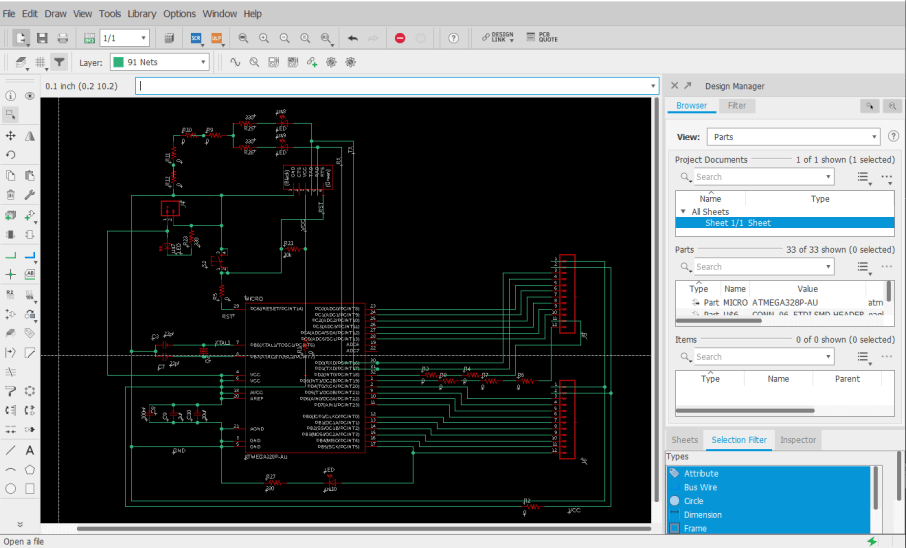
  <figcaption>Sixth Itteration Fish Bowl Board Schematic</figcaption>


  <figcaption>Sixth Itteration Fish Bowl Board File</figcaption>

</figure>

Just like its prior iterations though, this sixth iteration was still unsuccessful, and so far I had been unable to get a version working. I began to make some larger strides on this board during my [week 13](http://fabacademy.org/2021/labs/charlotte/students/theodore-warner/assignments/week13/) class and started another iteration of this board by working back through all systems in the board's schematic, familiarizing myself with the purpose of each system/component. From here, I started work on adding in a 12v to 5v voltage regulator on the fishbowl board, as my fish tank will be run on a 12v DC supply, and this regulator will allow for this 12v system. I took advantage of a 12v to 5v voltage regulator in this regulator system, opposed to a variable voltage regulator, as the components on my fishbowl board will always be 5v, and thus the voltage can be set by the regulator itself. Along with this regulator, I included two *10uf* capacitors between GND and VCC on the voltage regulators' input and output, reducing portion noise on my board.

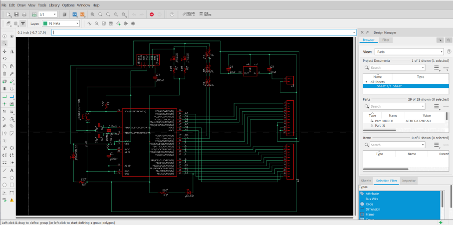
  <figcaption>Seventh Itteration of the Fish Bowl Main Board Schematic</figcaption>

With the addition of these new voltage regulator systems, a rewiring of the fishbowl board was needed, and during this time around, I took some extra time to reduce the needed components on the board, and allow for easier soldering. After messing around in the board file for a bit, I found I could use one of my "Fish Bowl" shape decorative traces as a GND line that surrounded the entirety of my board. This line implemented a universal ground way more accessible from everywhere on the board and offered another solution to a problem I had previously addressed by using 0-ohm jumpers resistors to solve, routing GND lines over other traces with these "jumpers". This surrounding ground line reduced the crazy amount of 0-ohm resistors on my board and made the board's soldering/stuffing process simpler and less time-consuming.


  <figcaption>Seventh First Itteration of the Fish Bowl Main Board </figcaption>

I milled this board following the same steps I used while milling boards previously in [week 4](http://fabacademy.org/2021/labs/charlotte/students/theodore-warner/assignments/week04/#milling-blinky-board), and other electronics production assignments in my previous weeks, starting with the board traces operation with a PCB engraving bit. While iterating on this board since [week 6](http://fabacademy.org/2021/labs/charlotte/students/theodore-warner/assignments/week06/#final-project-board-work), I've milled a handful of tests, some yielding successes in some systems, but always including another issue/broken system to flatten out. I next moved on to milling the board's holes and outline, using a 1/32" bit for these two operations, before moving onto board soldering. 

The part reduction steps I had taken earlier while encluding the wrap-around GND trace on my board paid off here, and the boards soldering and stuffing time had been greatly reduced. One thing that I've picked up on while soldering prior test fishbowl boards is a "drag" technique while soldering the ATMega to the board. I used this technique on these boards as well, first aligning the chip to its corresponding pins (ensuring correct orientation), before tacking down one of the pins of the chip to the board, and then dragging the tinned iron across one of the rows of pads, allowing solder to flow and connect between each of the chips pins and the board's pads, and leaving me with a clean set of joints. With the chip soldered, I wrapped up the board by soldering all of the other components, finishing with the three largest components, the crystal, voltage regulator, and reset button, leaving me with the boards show below.


  <figcaption>Seventh Itteration of the Fish Bowl Main Board Stuffed & Soldered</figcaption>

As the first test for this new fishbowl board, after soldering, I hooked up the board to a 12v DC power supply, and then probed the new voltage regulator output to test the output voltage. To my luck, the regulator yielded a 5v output and remained at a constant voltage throughout my probing. I next moved onto attempting to burn a bootloader to the fishbowl board. This process is similar to the one taken while burning the bootloader on my Sashakit made in our [Student Bootcamp](http://fabacademy.org/2021/labs/charlotte/students/theodore-warner/assignments/student-bootcamp/) class. The bootloader is burned to my board through an Arduino acting as an ISP programmer, so the first step while attempting to burn the bootloader was to set up the Arduino. I uploaded the Arduino example skets, *Arduino as ISP*, to an Arduino board, and referencing the *Arduino as ISP* sketch, and my fishbowl board eagle file, I attached the two with some jumpers using the pins called on by the *Arduino as ISP* sketch. From here, I opened the Arduino IDE, selected the port my Arduino acting as a programmer was connected to, and then used the IDE's *Burn Bootloader* tool, and ... it failed. Unfortunately, even after triple-checking my wiring, switching my Arduino board, reuploading the Arduino as an ISP sketch, and ensuring my fishbowl board was receiving enough power from my power supply, I still received an error message upon any attempt to burn a bootloader. I tried this process a couple of times and received two different error codes, one of which is shown below.


  <figcaption>One Error Message Recieved Upon a Bootloader Burning Attempt</figcaption>

A bit of research into the codes I was receiving helped me break down the problem a little bit, but not a ton. I found that there were three major potential flaws, however, a board short / VCC error, a "bricked" chip, or a non-oscillating clock, and decided to look into these three more. Being the easiest resolved I began looking into the VCC error a little more, starting by probing each of my board's traces for continuity between places that should not be connected, and also probed the voltages of the GND and VCC line of the board when supplied power, however, all of these results looked normal. After a little more research of the matter online, as well as into the ATMega 328p, I noticed that it recommended to included a smoothing *100nf* capacitor in between the chips *AREF* line and its nearest *GND* pin, so back in the board's eagle file, I added this smoothing capacitor along with the previously existing *100nf* smoothing capacitor running between two GND and VCC pins on my chip.


  <figcaption>Eight Itteration of the Fish Bowl Main Board With Smoothing Cap</figcaption>

From here, I also explored the other two potential causes of my bootloader burning issue, however, I found no easy fix to a "bricked" chip, and therefore moved on researching a non-oscillating clock a little more. I found that similar to the "bricked" chip, a non-oscillating clock is not easily fixed, but can be avoided, as the clock will not turn to its non-oscillating state unless the fuses of the ISP programmer are incorrectly set. Confirming in my ISP programmer, I had the correct fuses set, and eliminated this as being one of my potential issues.

As a workaround to my inability to "Un-Brick" a chip, I followed the advice of one of my instructors, [Dr. Adam Harris](https://www.sheekgeek.org/), to test the working of my chip before using it aboard. To do this, I soldered up a Sashakit board, just like I had in my [Student Bootcamp](http://fabacademy.org/2021/labs/charlotte/students/theodore-warner/assignments/student-bootcamp/) class, however, I left the chip unsoldered to this board. I was then able to connect this Sashakit board to an ArduinoISP programmer, and then use it to try out the bootloader on multiple chips. I aligned a chip with its corresponding pads of the sashakit, heald it down in the center with a pair of tweezers, and used the Arduino IDE to burn a bootloader to my board. All this worked! and the Arduino let me burn a bootloader to a couple of different chips, however, I did find some other faulty "Bricked" chips along the way. Despite that, I was left with a couple of chips with bootloaders burned, that I could be sure were working, and was able to eliminate another potential issue on my board.

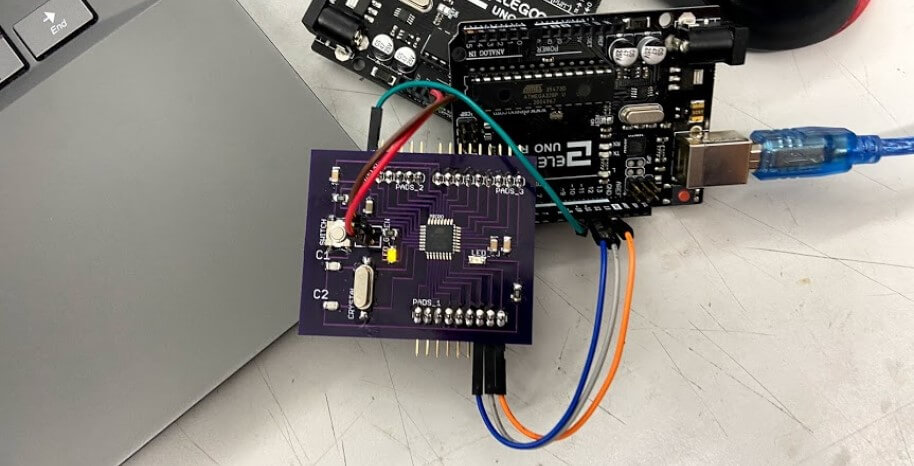
  <figcaption>Sashakit ATMega 328p Bootloader Burning Setup</figcaption>

With all this troubleshooting into my issues at a stopping point, I was ready to manufacture another board iteration, going first milling the PCB, 


then soldering and stuffing, leaving me with the board shown below.


Due to my previous failures with this board, I was pretty nervous to test this iteration and started my first just powering up the board through a power supply. Unfortunately, this simple startup produced a cloud of smoke from the top of my board, and the board's voltage regulator exploded. This error sucked, and ended up stemming from the misplacement of a strip of 5v to 3.3v regulators in a bin meant for 12v to 5v (the ones needed by my board), and the false component use ended up frying one of my boot loaded chips. I unsoldered the remains of the busted voltage regulator, as well as the fired chip, and replaced them with working correct components. I tested the board with power again, this time fortunately without explosion, and was ready to attempt to program the board again. I wired the board to an Arduino with the *Arduino as ISP* sketch flashed to it, and tried to upload a blink code ... no luck. Upon this uploading attempt, the uploading process began, and then returned error *0x0000000*, a GND or Reset error.

Here I went back to my schematic, and went through the system by system, and referencing the datasheets for major components. I wanted to make sure to include all recommended/required components for components on each of their pins. In addition to what I already had, this included adding a larger smoothing capacitor between GND and VCC, another capacitor between AREF and its closest GND pin, as well as an additional RST pin, without the 100nf inline capacitor. After a board works though with [Dr. Adam Harris](https://www.sheekgeek.org/), I also moved these additional smoothing capacitors closer to my board's ATMega 328 to reduce any resistance build upon the traces. All of these changes left me with yet another board iteration, shown below.


Again, I worked through the manufacturing process for this board, first milling, and the soldering and stuffing of the board. All of these board iterations have sped up their production time, as I know have the component layout of the board memorized, and have increased my soldering speed with each iteration. 


  <figcaption>Working Iterration of the ATMega 328 Fish Bowl Board</figcaption>

Just like the prior iterations, I wired up this board to an Arduino with the *Arduino as ISP* example sketch flashed to it, and attempted a bootloader burn, this time, yielding successful results!! 

#### Main Board Testing

After all of the troubleshooting that went into my fishbowl board, it was super nice to finally have to worry about code. I began this fishbowl board programming process with a simple blink sketch, and uploaded the Arduino IDE *Blink* example sketch to my fishbowl board via an Arduino as ISP programmer, yielding a successful upload shown below.


This simple sketch proved the working of my board and flashed my onboard pin 13 LED on my fishbowl board.


  <figcaption>Blinky Example Sketch Running on my Fish Bowl Board</figcaption>


  <figcaption>All Fish Bowl Board Attempts Up to First Working Itteration</figcaption>

### Inputs & Outputs

To interface with my Fish Bowl mainboard, I'm planning on reading a temp/humidity sensor as well as a pH probe placed in my tank. The readings of both temperature and humidity are crucial measurements when calculating the toxicity of ammonia in an aquaponics system. Keeping the nitrogen cycle in check is needed for the success of any aquaponics system, and this is why I've chosen these inputs to read. 

#### PH Sensor

A quick beginning note - here's the pH scale I referenced during the pH work of my tank. Goldfish, the fish that will be using in my ecosystem, thrive at a neutral pH, something between 7 & 8.

<figure markdown="1">

{width="49%"}

</figure>

I settled on using an Atlas Scientific [Gravity pH Probe](https://atlas-scientific.com/kits/gravity-analog-ph-kit/) in my tank. This sensor, in addition to coming from a reputable company, allows the probe to be underwater up to its connector indefinitely, an important aspect of any tank probe, as well as for a connection between the probe and its interfacing board constantly, without a need for the probe to be detached when not in use. Before beginning the work on my board to interface with this pH probe and board, I did a bit of research into the operating principle of the sensor, a subject well covered in the [Probe's Datasheet](https://atlas-scientific.com/files/consumer-grade-pH-probe.pdf), with some highlights covered below.

"A pH (potential of Hydrogen) probe measures the hydrogen ion activity in a liquid.
At the tip of a pH probe is a glass membrane. This glass membrane permits hydrogen
ions from the liquid being measured to defuse into the outer layer of the glass, while
larger ions remain in the solution. The difference in the concentration of hydrogen ions
(outside the probe vs. inside the probe) creates a VERY small current. This current
is proportional to the concentration of hydrogen ions in the liquid being measured." ([Probe Datasheet](https://atlas-scientific.com/files/consumer-grade-pH-probe.pdf))

<figure markdown="1">

{width="49%"}

</figure>

"A pH electrode is a passive device that detects a current generated from hydrogen ion
activity. This current (which can be positive or negative) is very weak and cannot be
detected with a multimeter, or an analog to digital converter. This weak electrical signal
can easily be disrupted and care should be taken to only use proper connectors and cables ... The current that is generated from the hydrogen ion activity is the reciprocal of that
activity and can be predicted using [the equation pictured below]" ([Probe Datasheet](https://atlas-scientific.com/files/consumer-grade-pH-probe.pdf))

$$E = E^0 + \frac{RT}{F}\ln(\alpha_{H+}) = E^0 - \frac{2.303RT}{F}pH$$

 - Where R is the ideal gas constant
 - T is the temperature in Kelvin
 - F is the Faraday constant

<figure markdown="1">

{width="49%"}

</figure>

To calibrate the pH probe to work against these voltage reading thresholds, a calibration is required. Included along with the Atlas Scientific pH probe I ordered were three packs of pH calibration liquids, a *4*, *7*, and *10* level liquid. The concept of the calibration reflects measurements of the probe at each of these points, and the probe can be calibrated by being placed in each one of these liquids and then set to the liquid's corresponding pH value, leaving a scale like that shown below.


To achieve probe calibration and eventual readings from the probe, I created a simple analog sensor interfacing board with an ATTiny 1614 microcontroller. This board includes data pins to connect to the pH probe board array, along with transmitting and receiving pins that will be used for the eventual calibration of the probe.


  <figcaption>ATTiny 1614 pH Probe Interfacing Board Eagle Files</figcaption>

This board is designed to reflect the exact board footprint of the pH sensing board, as well as its electrical isolation board used between the connection. Speaking of which, this electrical isolation board is a pH probe board accessory from Atlas Scientific that connects between the Atlas Scientific pH board and my analog interfacing board, allowing for complete isolation of analog signal from the pH sensor board, and its conversion into a PWM signal. This isolation board removes the issue of false readings that could occur from excess current in the water released by my tank's pump and leaves me with accurate pH readings. After the completion of my analog interfacing board, I milled and stuffed the board with its four components, leaving me with the board shown below.


With this board manufactured and ready to program, I again referenced the pH [Probe's Datasheet](https://atlas-scientific.com/files/consumer-grade-pH-probe.pdf), to find the Atlas Scientific [Gravity pH Library & Sample Code](https://atlas-scientific.com/files/gravity-pH-ardunio-code.pdf). This library adds a ton of helpful calibration and probe reading functions to Arduino. I ended up modifying the pH calibration example sketch included in this library for my final pH reading sketch, due to the inclusion of the entire calibration via serial feature as well as integration with my electrical isolation board. After this calibration function, the pH itself is read, and then written to a string and printed to serial. In front of this pH value, the line *3pH =* is printed, to interface with my tanks LCD parsing statements, a function of code discussed later on this page, leaving me with the pH reading and printing loop function below ...

```

void loop() {
  if (Serial.available() > 0) {                                                      
    user_bytes_received = Serial.readBytesUntil(13, user_data, sizeof(user_data));   
  }

  if (user_bytes_received) {                                                      
    parse_cmd(user_data);                                                          
    user_bytes_received = 0;                                                        
    memset(user_data, 0, sizeof(user_data));                                         
  }
 
  Serial.println("3pH = " + String(pH.read_ph(), 2));                                                      
  delay(20000);
}
```

This loop with my pH reading string was then incorporated back into the other functions of my pH code, and I was left with the final code below.

```
#define USE_GRAV_ISOLATOR
#ifdef USE_GRAV_ISOLATOR
  #include "ph_iso_grav.h"       
  Gravity_pH_Isolated pH = Gravity_pH_Isolated(10);         
#else
  #include "ph_grav.h"             
  Gravity_pH pH = Gravity_pH(10);   
#endif
                
uint8_t user_bytes_received = 0;                
const uint8_t bufferlen = 32;                   
char user_data[bufferlen];                     

void parse_cmd(char* string) {                   
  strupr(string);                                
  if (strcmp(string, "CAL,7") == 0) {       
    pH.cal_mid();                                
    Serial.println("MID CALIBRATED");
  }
  else if (strcmp(string, "CAL,4") == 0) {            
    pH.cal_low();                                
    Serial.println("LOW CALIBRATED");
  }
  else if (strcmp(string, "CAL,10") == 0) {      
    pH.cal_high();                               
    Serial.println("HIGH CALIBRATED");
  }
  else if (strcmp(string, "CAL,CLEAR") == 0) { 
    pH.cal_clear();                              
    Serial.println("CALIBRATION CLEARED");
  }
}

void setup() {
  Serial.begin(9600);                            
  delay(200);
  Serial.println(F("Use commands \"CAL,7\", \"CAL,4\", and \"CAL,10\" to calibrate the circuit to those respective values"));
  Serial.println(F("Use command \"CAL,CLEAR\" to clear the calibration"));
  if (pH.begin()) {                                     
    Serial.println("Loaded EEPROM");
  }
}

void loop() {
  if (Serial.available() > 0) {                                                      
    user_bytes_received = Serial.readBytesUntil(13, user_data, sizeof(user_data));   
  }

  if (user_bytes_received) {                                                      
    parse_cmd(user_data);                                                          
    user_bytes_received = 0;                                                        
    memset(user_data, 0, sizeof(user_data));                                         
  }
 
  Serial.println("3pH = " + String(pH.read_ph(), 2));                                                      
  delay(20000);
}
```

I uploaded this code to my analog pH interfacing board, and connected the board's communication and power headers to their corresponding pins on an FTDI chip, and then via USB to my laptop. 


  <figcaption>pH probe wired to all three pH interfacing boards</figcaption>

Following the calibration steps discussed a bit above, I completed the pH probe's first calibration starting with the *7* mid calibration liquid. I placed the end of the probe in the liquid, and set the command *CAL,7* via serial to my analog pH interfacing board. After this, I repeated this step with the *4* low calibration liquid with the line *CAL,4*, and for a final time with the *10* high calibration liquid, and the line *CAL,10*.

<iframe width="900" height="600" src="https://www.youtube.com/embed/aHC4-tacAKg" title="YouTube video player" frameborder="0" allow="autoplay; encrypted-media" allowfullscreen loading="lazy"></iframe>

#### Temp/Humidity Sensor

Following my system's PH sensor, the next sensor in my system is a DHT11 Temperature and Humidity sensor I manufactured in my [week 11](http://fabacademy.org/2021/labs/charlotte/students/theodore-warner/assignments/week11/) inputs class. For space reasons, this page just covers the highlights of the working temperature/humidity monitoring board, and the troubleshooting behind it can be read about on my [week 11](http://fabacademy.org/2021/labs/charlotte/students/theodore-warner/assignments/week11/) inputs class page.

I began this temperature monitoring board manufacturing process by reading up on the DHT11 temp and humidity sensor, finding this [link](https://www.circuitbasics.com/how-to-set-up-the-dht11-humidity-sensor-on-an-arduino//) on its set up with an Arduino helpful, giving me some useful wiring diagrams. I planned on using this DHT11 Temperature and Humidity sensor on my temp and humidity monitoring board, reading the sensor through an onboard ATtiny 412, and writing the read values to another microcontroller through RX and TX pins. I started in EAGLE, creating a small ATtiny 412 circuit, incorporating a DHT11 Temperature and Humidity sensor, as well as some headers for programming and communication. First, I started a new schematic for the board, keeping in mind the required components while adding them to the schematic. The DHT11 sensor is a four-pin sensor with a VCC, GND, and two data pins. In my case, I communicated with the sensor via one data pin, keeping in mind this pin not only needed to be connected to my ATtiny 412 but also ran to VCC with a 10k ohms resistor. Along with its connection to this sensor, my board's ATtiny 412 also runs to two separate headers, one for programming via the board's UPDI pin, and another supplying the board's power, and RX and TX pins, for future communication between boards. A final little touch to this schematic was a power indicating LED, and this left me with the schematic shown below.


The next step in this board design process was the conversion of my schematic into my temperature and humidity reading board. Keeping with the aquarium theme, I decided to shape this board like a fish, following the same steps I used creating a custom board shape in eagle during [week 6](http://fabacademy.org/2021/labs/charlotte/students/theodore-warner/assignments/week06/#design-work). For this board outline, I used the same fish icon I had created in that week's assignment, importing the shape into the dimensions layer of my sensor board file to create the shape. From here I began the process of laying out the board's components, in eagle, starting with the mounting position of the DHT11 sensor and ATtiny 412, and positioning around those two components. One thing I had to keep in mind during this layout is the size of the DHT11, as its connection to my board using a 4 pin header, but the body of the sensor itself was much larger than this. I began by positioning the header where I thought the rest of the sensor would fit, and checked this positioning by drawing a square from the corner of the header, so its dimensions were the size of the DHT11. From here I laid out all other components on my board and routed the board's traces. Due to the small size of this board, the trace routing was a relatively simple task and left me with a nice-looking temperature and humidity monitoring fish board.


  <figcaption>Final Tempeture and Humitidy Monetering Fish Board</figcaption>

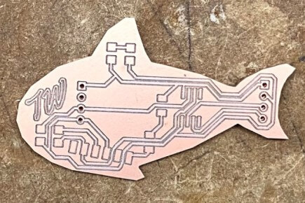
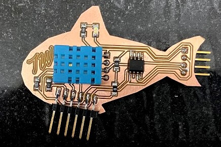
  <figcaption>Fish Tempature and Humidity Sensor Board</figcaption>

Similarly to before starting my board's schematic, before programming the board, I read up on the DHT11 sensor, referencing the same site as before, found [here](https://www.circuitbasics.com/how-to-set-up-the-dht11-humidity-sensor-on-an-arduino//). 

"The DHT11 detects water vapor by measuring the electrical resistance between two electrodes. The humidity sensing component is a moisture-holding substrate with electrodes applied to the surface. When water vapor is absorbed by the substrate, ions are released by the substrate which increases the conductivity between the electrodes. The change in resistance between the two electrodes is proportional to the relative humidity. Higher relative humidity decreases the resistance between the electrodes, while lower relative humidity increases the resistance between the electrodes. The DHT11 measures temperature with a surface mounted NTC temperature sensor (thermistor) built into the unit." ([Circuit Basics](https://www.circuitbasics.com/how-to-set-up-the-dht11-humidity-sensor-on-an-arduino//))

The sensor relies on the [DHTLib](https://playground.arduino.cc/Main/DHTLib/) Arduino library and can read the sensors data pin into a readable humidity and temperature output. The libraries follow the equation below to derive the relative humidity from the sensor.

$$RH = (\frac{\rho_w}{\rho_s}) \times 100\%$$

Where:
- $RH$: Relative Humidity
- $\rho_w$: Density of water vapor
- $\rho_s$: Density of water vapor at saturation

With knowledge of the DHT11's workings, I began programming the code to read temp and humidity through the DHT11 and print the found values through TX to a serial monitor. I used the sensors reference code found on the [Circuit Basics](https://www.circuitbasics.com/how-to-set-up-the-dht11-humidity-sensor-on-an-arduino//) code as a reference and began the coding process. The code starts by including the needed [DHTLib](https://playground.arduino.cc/Main/DHTLib/) library and setting up the DHT11's connections to my boards ATtiny 412. Next, the code begins serial and then prints the found values to it, with the prefixes "Temp" & "Humidity" in front of their corresponding values. This left me with the sensor reading code below.

```
#include <Arduino.h>
#include <dht.h>

dht DHT;

#define DHT11_PIN 4

void setup(){
  Serial.begin(9600);
}

void loop(){
  int chk = DHT.read11(DHT11_PIN);
  Serial.print("Temp = ");
  Serial.println(DHT.temperature);
  Serial.print("Humidity = ");
  Serial.println(DHT.humidity);
  delay(5000);
}
```

At the end of this sensor reading loop, I included a 5-second delay, as the DHT11 can only be read every 2 seconds, so this gives the sensor plenty of wiggle room.

With this code flattened out, I wired my fish sensor board to my in-circuit programmed, made in [week 4's](http://fabacademy.org/2021/labs/charlotte/students/theodore-warner/assignments/week04/#in-circuit-programmer) electronic production class, connecting my boards GND and VCC to the programmers corresponding pins, and my sensor boards UPDI to the UPDI pin of my in-circuit programmer. I followed the same programing steps I've used for all of my other ATtiny 412 containing boards, like that in [week 4](http://fabacademy.org/2021/labs/charlotte/students/theodore-warner/assignments/week04/#in-circuit-programmer), uploading my sensor reading code through my in-circuit programmer using the Arduino IDE's *Upload Using Programmer* tool. This code was uploaded successfully to my board, and I was ready to move on to testing and reading my sensor.

I attached this fish board to an FDTI chip, RX to TX, TX to RX, and GND to GND, and then attempted to read the sensors values again, and this time, it worked! Every five seconds the serial monitor is updated with reading temperature and humidity values from my DHT11, and output the values in a serial monitor through serial, shown below. 


The final step in this sensor board code was a little bit of alteration to the serial prints I did in my [week 14](http://fabacademy.org/2021/labs/charlotte/students/theodore-warner/assignments/week14/) class. These alterations allow for the communication required to print the transmitted values to a specific line on my system's LCD, a feature discussed later on this page. Beginning this process, I had to figure out how to print a specific line of incoming serial to a controlled position on an LCD. After a bit of research online, It seemed like the best way about doing this would be to include an indicator between different lines being sent over serial, and then read that indicator to determine the position of the text in the interface. With this idea in mind, I altered my input board's code to include a *1* before the transmitted temperature line, and a *2* before the transmitted humidity.

```
//(c) Teddy Warner 28 May 2021

//This work may be reproduced, modified, distributed, performed, and displayed 
//for any purpose, but must acknowledge the Assistive Aquaponics Fish Tank. 
//Copyright is retained and must be preserved. The work is provided as is; 
//no warranty is provided, and users accept all liability.

#include <Arduino.h>
#include <dht.h>

dht DHT;

#define DHT11_PIN 4

void setup(){
  Serial.begin(9600);
}

void loop(){
  int chk = DHT.read11(DHT11_PIN);
  Serial.print("1Temp = ");
  Serial.println(DHT.temperature);
  delay(5000);
  Serial.print("2Humidity = ");
  Serial.println(DHT.humidity);
  delay(5000);
 }
}
```

#### LCD

I spent the better half of an afternoon during my [week 13](http://fabacademy.org/2021/labs/charlotte/students/theodore-warner/assignments/week13/) output class searching for the perfect LCD for my tank, as the space requirements of the mounting area, along with the need for a 20 x 4 LCD minimum to display all necessary info in a readable format made this search more difficult. Eventually, I stumbled on the *C204C-FTW-LW65* from Focus LCDs, a vertical compact 20 x 4 LCD, that works great for my use case. I originally began work on my systems LCD during my [week 13](http://fabacademy.org/2021/labs/charlotte/students/theodore-warner/assignments/week13/) output class, as mentioned above, and just like the previous temperature and humidity monitoring board, this page will just touch on the working highlights of this feature, and my [week 13](http://fabacademy.org/2021/labs/charlotte/students/theodore-warner/assignments/week13/) page goes into more depth on the troubleshooting behind it.

This LCD met all of my space and screen size requirements, and I began in Eagle creating a breakout board to the screen. This board will mount to the LCD, and break out the screen pins to the headers that will need to connect to a microcontroller. The premise of the breakout board was pretty simple, and I referenced the *C204C-FTW-LW65*'s datasheet and attached the needed data lines from the LCD, *DB4-DB7*, to a set of breakout pins on the board. I next hooked up the LCD's VCC and GND, as well as its backlight VCC and GND, to their corresponding power headers on the board. A 330 ohms resistor is included on the LCD backlight's VCC line, to dim the light so the screen's content is readable. I found the 330 resistance value worked better than the standard 220 for my *C204C-FTW-LW65* greyscale style screen and allowed for better readability. The final portion of this board was a contrast adjusting 10k ohms potentiometer. This potentiometer provides a voltage to the LCD's contrast adjusting pin, allowing the LCD character brightness to be altered, leaving me with the final schematic shown below.

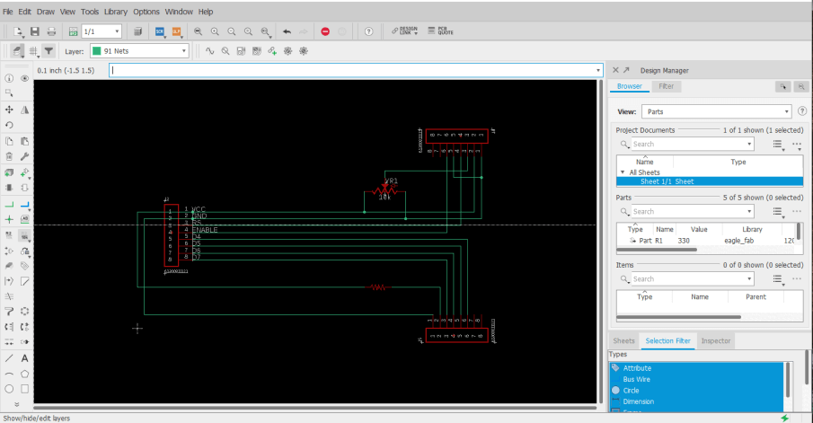

With this schematic flatted out, I moved onto converting this schematic into my LCD breakout board. Here I began again by referencing the datasheet, positioning the LCD mounting headers to the correct dimensions on my board to line up with the *C204C-FTW-LW65* LCD. From here, I positioned the contrast adjusting potentiometer to mount on the backside of the board, allowing the LCD to mount directly over the breakout board, in the most space-efficient manner. From here, I also positioned the board's resistor and jumper resistors, and then positioned the breakout headers towards the bottom of the board, before running all of the board's traces. Due to the mounting position of this breaker board, the shape had to fit in as compact of a space behind the LCD as possible, so I dragged the boards outline down to fit around the boards content, and used Eagles *miter* tool to round over the board's corners, leaving me with the boards shown below.

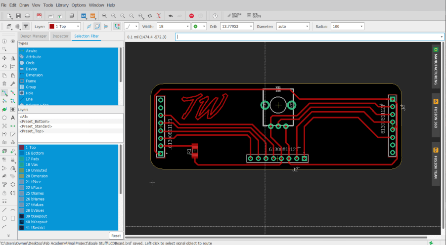

Due to its single 330 ohms resistor component and three-pin potentiometer, the milling and stuffing of this LCD breakout board weren't super time-consuming, and I worked through it with relative ease. I first attached the breakout board to the backside of the LCD board, soldering the pins of the LCD to their propper pads on the breakout board. From here I tracked down the 330 ohms resistor, and also soldered the potentiometer in place. Finally, I attached the breakout board headers, that would allow for connections between the LCD and the board, leaving me with the LCD and breakout system below.


  <figcaption>Compleated LCD and Breakout Board Assembly</figcaption>

After the completion of my LCD breakout, I began the interface coding process in the second half of my [week 13](http://fabacademy.org/2021/labs/charlotte/students/theodore-warner/assignments/week13/), and then later expanded on the interface in my [week 14](http://fabacademy.org/2021/labs/charlotte/students/theodore-warner/assignments/week14/) networking and communication assignment. The LCD interface code utilizes the Liquid Crystal Library included by default in the Arduino library for LCD control. Breaking down the code, there are two sections of my LCD interface, a boot screen, and a status display screen that will in the future, provide information read from my Aquaponics fish tank's sensors. I started the interface work on my tank's boot screen. The boot screen code is a simple display of characters spanning the width of the LCD, with the top and bottom lines being filled with *-*, and the middle lines displaying the text *Aquaponics Fish Tank* and *... In Development*. The inclusion of this boot screen in the *Void Setup* function of my code shows this boot screen upon bootup of the system, and the function includes a short delay while displaying the screen, allowing all of the input sensors to get started up and begin future communications with the mainboard.


  <figcaption>Aquaponics Fish Tank LCD Bootscreen Code </figcaption>


  <figcaption>Aquaponics Fish Tank LCD Bootscreen Implemented in Void Setup</figcaption>

From this boot screen, the interface next moves into its status screen display. It was here where I planned on taking full advantage of the 20 x 4 display size of my LCD, and decided to create some custom characters to include a fish icon on my status screen, as well as include an *Aquaponics Fish Tank* title. I began this status screen creation with some research on the creation of custom characters, where I found this [Hackster.io](https://www.hackster.io/jacoslabbert99/arduino-lcd-icons-custom-characters-548f38) article to give a good description of the topic. The article is linked to an online [LCD Character Creator](https://maxpromer.github.io/LCD-Character-Creator/), where a GUI is provided that converts a drawn character into the hex codes that can be written to an LCD in code. I used this generator online to create a 2 x 3 character fish and was able to copy the generated characters generated into my LCD code. 


I began the status screen code in the *Void Loop* function of my code, where I started by including an *Aquaponics Fish Tank* title printed at the top of the display. Following this, I called upon each of my 6 custom characters established earlier in the code, positioning each of them to create a 2 x 3 fish icon on the left side of the screen. The final touch to this first iteration of the status screen would be indicators for Temp, Humidity, and PH, each receiving their line in the interface. In this instance of the status screen, these indicators are just text displayed on a set line of the interface, to the right of the fish icon. All of this left me with the first iteration of the status screen, shown below.


  <figcaption>First Itteration of the Aquaponics Fish Tank LCD Statusscreen</figcaption>

I began working from this interface in my [week 14](http://fabacademy.org/2021/labs/charlotte/students/theodore-warner/assignments/week14/) class to include the sensor readings on my interface's status screen, altering the loop to read transmitting nodes via the [software serial](https://www.arduino.cc/en/Reference/softwareSerial) library, and print them to their proper interface positions, removing the setup *Temp =*, *Humidity =*, and *PH =* place holders in the process. 

The bulk of this communication setup work is discussed on my [week 14](http://fabacademy.org/2021/labs/charlotte/students/theodore-warner/assignments/week14/) page, but I'll touch on the highlights on this function here. As mentioned above, this LCD networking feature in my system uses the [software serial](https://www.arduino.cc/en/Reference/softwareSerial) library. This library allows serial communications on any of a microcontroller's digital pins, and allows me to configure two receiving and transmitting pins on my mainboard node, and communicate with bus addresses to my two input nodes. My first step while implementing this library was to set up two communication ports in my mainboard code, one for communication with my systems temperature and humidity input node, and another for the PH input node. Through this setup, I'm able to communicate across all three nodes, passing through these two set communication ports, and will be able to call on specific nodes with their defined addresses, *portDHT* and *portPH*.

I call upon each of these different nodes throughout my mainboard interface code. Each port is started with the line ...

```
 portDHT.listen();
```

as in the software serial library can only listen to one transmitting node through one port at a time, and then this data is saved to an incoming string. From here, the data is run through two of my code's parsing *If* statements, to determine whether the board is receiving temperature or humidity data, and the base of this, just as before, will print the read values to my LCD.

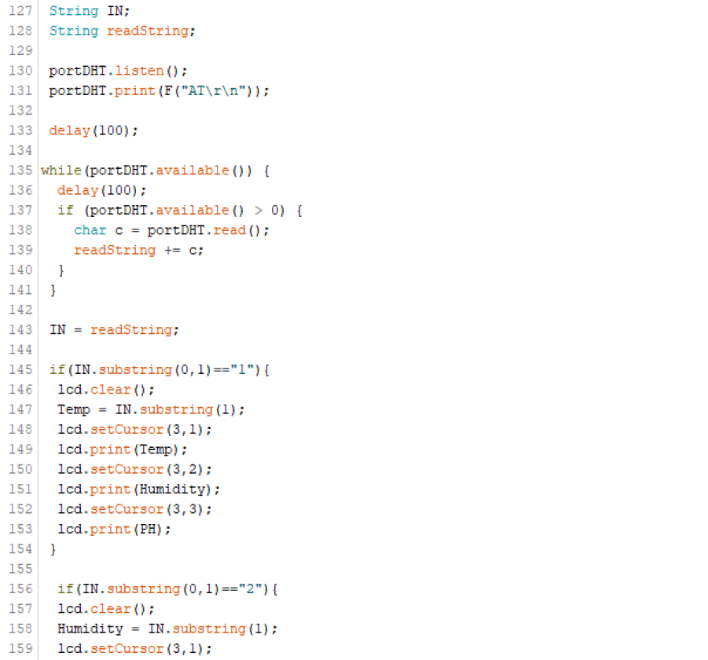

This same process is repeated in the *Void Loop* function, after the listing of *portDHT*, with *portPH*. This, just like the previous port, saves read data to a string, and then prints the read data to the proper line of the LCD interface, this time without any *If* statement due to the singular reading that will be coming in over this address.


All of these interface features and functions together left me with an LCD interface code capable of reading from transmitting sensor nodes and printing to the LCD, also including a startup routine with an included interface boot screen, as well as the main status screen with a custom fish icon. This final interface code, with all of these features implemented, is included below.

```
//(c) Teddy Warner 28 May 2021

//This work may be reproduced, modified, distributed, performed, and displayed 
//for any purpose, but must acknowledge the Assistive Aquaponics Fish Tank. 
//Copyright is retained and must be preserved. The work is provided as is; 
//no warranty is provided, and users accept all liability.

#include <LiquidCrystal.h>
#include <SoftwareSerial.h>    

SoftwareSerial portDHT(2, 3);
SoftwareSerial portPH(4, 5);

const int rs = 12, en = 11, d4 = 10, d5 = 9, d6 = 8, d7 = 7;
LiquidCrystal lcd(rs, en, d4, d5, d6, d7);

String Temp;
String Humidity;
String pH;

byte fishbl[] = {
  B00011,
  B00111,
  B01111,
  B01111,
  B00110,
  B00000,
  B00000,
  B00000
};

byte fishbr[] = {
  B11000,
  B11100,
  B11110,
  B11110,
  B01100,
  B00000,
  B00000,
  B00000
};

byte fishml[] = {
  B11111,
  B11111,
  B11111,
  B01111,
  B01111,
  B00111,
  B00111,
  B00011
};

byte fishmr[] = {
  B11111,
  B11111,
  B11111,
  B11110,
  B11110,
  B11100,
  B11100,
  B11000

};

byte fishtl[] = {
  B00000,
  B00000,
  B00000,
  B00011,
  B00111,
  B01111,
  B01111,
  B11111
};

byte fishtr[] = {
  B00000,
  B00000,
  B00000,
  B11000,
  B11100,
  B11110,
  B11110,
  B11111
};

void setup() {

  Serial.begin(9600);
  portDHT.begin(9600);
  portPH.begin(9600);
  
  lcd.begin(20, 4);

  lcd.setCursor(0,0);
    lcd.print("--------------------");
  lcd.setCursor(0,1);
    lcd.print("Aquaponics Fish Tank");
  lcd.setCursor(0,2);
    lcd.print("... In Development");
  lcd.setCursor(0,3);
    lcd.print("--------------------");

  delay(5000);
  lcd.clear();

}

void loop() {

 lcd.createChar(1,fishtl);
 lcd.createChar(2,fishtr);
 lcd.createChar(3,fishml);
 lcd.createChar(4,fishmr);
 lcd.createChar(5,fishbl);
 lcd.createChar(6,fishbr);

 lcd.setCursor(0,0); 
 lcd.print("Aquaponics Fish Tank");

  lcd.setCursor(0,1);  
  lcd.write(1);
  lcd.setCursor(1,1);
  lcd.write(2);
  lcd.setCursor(0,2);
  lcd.write(3);
  lcd.setCursor(1,2);
  lcd.write(4);
  lcd.setCursor(0,3);
  lcd.write(5);
  lcd.setCursor(1,3);
  lcd.write(6);

 String IN;
 String readString;

 portDHT.listen();
 portDHT.print(F("AT\r\n"));     

 delay(100);

while(portDHT.available()) {
  delay(100);
  if (portDHT.available() > 0) { 
    char c = portDHT.read();
    readString += c;
  }
 }

 IN = readString;

 if(IN.substring(0,1)=="1"){
  Temp = IN.substring(1);
  lcd.setCursor(3,1);
  lcd.print(Temp);
 }

  lcd.setCursor(15,1);
  lcd.print(" ");
  lcd.setCursor(16,1);
  lcd.print(" ");

 if(IN.substring(0,1)=="2"){
  Humidity = IN.substring(1);
  lcd.setCursor(3,2);
  lcd.print(Humidity);
 }

  lcd.setCursor(19,2);
  lcd.print(" ");
 
 portPH.listen();
 portPH.print(F("AT\r\n"));     

 delay(100);

while(portPH.available()) {
  delay(100);
  if (portPH.available() > 0) { 
    char b = portPH.read();
  readString += b;
  }
 }
 
 IN = readString;

 if(IN.substring(0,1)=="3"){
  pH = IN.substring(1);
  lcd.setCursor(3,3);
  lcd.print(pH);
 }

  lcd.setCursor(13,3);
  lcd.print(" ");
  lcd.setCursor(14,3);
  lcd.print(" ");
 
}
```

I updated my Fish Bowl mainboard with this final code, and tested the system with my Temp/Humidity sensor board, (shown in the image below), and ... It Worked!


  <figcaption>Updated Software Serial Code Running on my System</figcaption>

### Power Supply & Breakout

To power, all of these parts of my electronics system & the tank as a whole, I'll be using a 12v DC power supply with a connection to an AC mains adapter to take wall power. Before doing any powering from this supply, I dialed the output voltage to exactly 12v DC, shown in the image below.

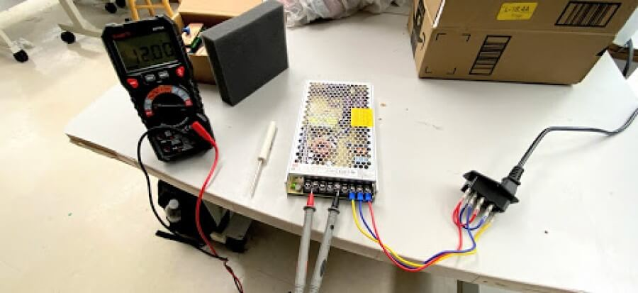

#### Water Pump, Tank & Plant Lights

All three outputs from this DC power supply run to a power breakout board allowing the four power drawing components to receive power, the Fish Bowl Main Board, Tank Lights, Grow Lights, and Water Pump. This power breakout board directs two of the three 12v DC inputs to its tank lights and mainboard output terminals and steps down the third input to a 5v current to be used in an ATTiny 412 timing circuit. This third line powers the tank's pump at 5v, as well as the timing circuit, which toggles a MOSFET on and off every 12 hours to allow 12v DC to reach the tank's plant lights.


  <figcaption>Power Breakout Board Eagle Schematic</figcaption>

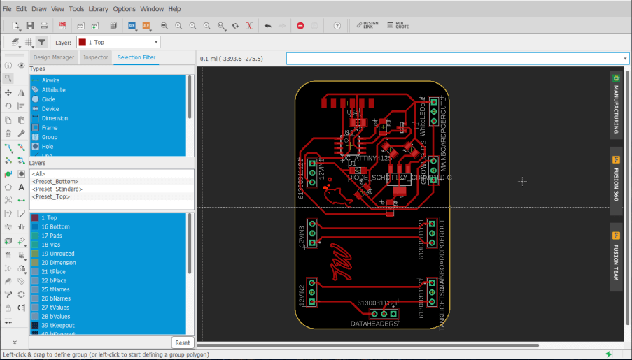
  <figcaption>Power Breakout Board Eagle Board File</figcaption>

I manufactured this board following the same steps as all PCBs previously made for my project and then was ready to begin the programming process.

After a bit of research online, indoor plants grown under grow lights thrive under 10 to 14 hours of grow lights, and I took the middle of this for my timer and toggled every 12 hours. The time sketch is super simple, just writing a MOSFET on *pin 4* to high for 12 hours, and then low for another 12. The final grow light timer code is included below.

```
//(c) Teddy Warner 28 May 2021

//This work may be reproduced, modified, distributed, performed, and displayed 
//for any purpose, but must acknowledge the Assistive Aquaponics Fish Tank. 
//Copyright is retained and must be preserved. The work is provided as is; 
//no warranty is provided, and users accept all liability.

int Mosfet = 4;

void setup(){
pinMode(Mosfet,OUTPUT);
}
void loop(){
  digitalWrite(Mosfet,HIGH);
  delay(43200000);                  // 12hr
  digitalWrite(Mosfet,LOW);
  delay(43200000);                  // 12hr
}
```

To test this sketch and board, however, I didn't want to wait the 12-hour alternating period, so I shortened the time frame of my sketch to only 5 seconds by dropping the delay from 12 hours ...

```
  delay(43200000);                  // 12hr
```

... to 5 seconds...

```
  delay(5000);                  // 5sec
```

I uploaded this test code to my power breakout board, connected it to a voltage input, and probed the output terminal block ports with a multimeter, yielding the 5 seconds on 5 seconds off results shown below.

<iframe width="900" height="600" src="https://www.youtube.com/embed/BrxtLnOwK7k" title="YouTube video player" frameborder="0" allow="autoplay; encrypted-media" allowfullscreen loading="lazy"></iframe>

After this successful test, I uploaded the final 12-hour iteration of the code and was then ready to test the breakout in my system, the step where everything when wrong. Although the timing circuit of my power breakout board worked great, the board itself did not. Unfortunately during the design process, I forgot to consider my usage of an inductive load, my water pump. Upon the first bootup of my system with this power breakout board, the circuit worked great, however, after cutting power to the system, my inductive water pump sent a current back into my breakout, destroying the timing circuit of the board. This board design left me facing the problem of always off grow lights after powering the water pump since when power is cut to a motor, like my water pump, the motion doesn't stop, and the excess current generated needs to go somewhere, in my case, my timing circuit. The fix for this use of an inductive load revolves around the use of a flyback diode, a feature I'm familiar with from use on 3D Printers. 
 
With this solution in mind, I began the process of setting up a diode flyback protection circuit around my water pump terminals, starting with some research yielding these two articles, [Simple Over-Voltage Protection Circuit using Zener Diodes](https://components101.com/articles/designing-an-overvoltage-protection-circuit-using-zener-diodes) & [How To Prevent an Inductive Load from Damaging Your Power Supply](http://blog.powerandtest.com/blog/prevent-an-inductive-load-from-damaging-your-power-supply). Based off of the information in the first [Simple Over-Voltage Protection Circuit using Zener Diodes](https://components101.com/articles/designing-an-overvoltage-protection-circuit-using-zener-diodes) article, I began work on modifying my power breakout schematic to include a Zener diode in parallel with the water pumps two terminals, orientated to direct any returning current into ground, and creating a new part of least resistance for the returning current. Due to the spec of the SMD Zener diode that was accessible to me, however, another component was needed, a current liming resistor. This resistor keeps the Zener diode from exploding on my board and reduces the current down to one the diode could handle, in my case I used a 100 ohms resistor. Unfortunately, this implementation only leads to more troubleshooting, as the current draw of the pump during its startup couldn't be matched with this Zener diode & limiting resistor setup, so after a couple more iterations, I decided to take another approach, based more off of the information in the second article, [How To Prevent an Inductive Load from Damaging Your Power Supply](http://blog.powerandtest.com/blog/prevent-an-inductive-load-from-damaging-your-power-supply). This lead to the implementation of a second flyback diode setup, one where a Schottky diode is run in parallel with the water pumps terminal headers, along with a second in line with the input VCC to the system. In addition to this diode setup, I also completely isolated the voltage regulation setup for my pump, eliminating any connection to the timing circuit, and allowing for complete isolation of my inductive water pump load. In this instance, like the prior, the two diodes prevent a returning current from the water pump from reaching my voltage regulation circuitry, by creating a new path of least resistance to a GND line. This update left me with the board schematic and board file shown below.


  <figcaption> Final Power Breakout Board Eagle Schematic</figcaption>


  <figcaption>Final Power Breakout Board Eagle Board File</figcaption>

Again, I fabricated this power breakout board, and uploaded my timing sketch to it, as done prior.


  <figcaption>Final Fabricated Power Breakout Board</figcaption>

I then implemented the power board in my tank's electronics system and booted up the PSU, yielding the results in the video below. All aspects of the electronics system are powered from the breakout, and bootup after multiple power cuts.

<iframe width="900" height="600" src="https://www.youtube.com/embed/PK6Xp42kFps" title="YouTube video player" frameborder="0" allow="autoplay; encrypted-media" allowfullscreen loading="lazy"></iframe>

## Tank Structure - CNC Milling & Laser Cutting

The wooden tank structure was my first large physical step towards my final project that I completed in my [week 7](http://fabacademy.org/2021/labs/charlotte/students/theodore-warner/assignments/week07/) computer-controlled machining assignment. The structure is documented in-depth on my [week 7](http://fabacademy.org/2021/labs/charlotte/students/theodore-warner/assignments/week07/) page, and again, for space concerns, this page will just tough on the important bits and highlights. 

Although I created a model of this wooden structure in Fusion 360 while planning the project, I began the structure creation process by starting to put some thought into the manufacturing processes I would need to take to produce this structure in real life. I settled on milling 6 different pieces to assemble the structure, one back wall, two sides, and 3 stacked pieces to make the base of the structure. I planned on creating these parts based on their corresponding components in my Fusion 360 design. For each of these pieces, I created a new sketch on the face of the profile and used Fusion 360's *Project* tool found under the *Sketch* menu to project all desired lines for each part into one single sketch in the Fusion 360 browser. With all of these lines in one single sketch for each of the 6 different components, I could export each sketch from the Fusion 360 browser onto my computer as a *.dxf* file by right-clicking on the sketch, and then selecting *export as .dxf*.


  <figcaption>Fusion Model with Projected Sketches for Each Component</figcaption>

### Aspire Work & Structure Milling

To generated the toolpaths I would later run on a CNC machine from my altered *.svg* files, I used Vectric CNC's [Aspire](https://www.vectric.com/products/aspire) CAM software. I firstly created a new file in Aspire, where I was prompted to set a workplane size. The workplane of the [ShopBot PRSalpha](https://www.shopbottools.com/products/alpha), the CNC I would be milling on, was 96" x 48", and my material height was 0.776", so I entered these value in the prompt accordingly. I then imported each of my *.svg* files into Aspire, nesting the files as I imported to reduce waste stock material. I spent a little more time with all of my files imported messing with the part orientation to ensure that there would be little stock material waste between my parts. In the assembly of my design, I planned to use milled tabs to align the back piece to the structure's two sidewalls and created this feature in my design. I then switched over to Aspires *3D View* by clicking on the tab labeled *3D View* at the top of the interface's workspace. Here I could start working on generating the different toolpaths for my parts. Throughout this process, I referenced my original Fusion 360 design to determine which sections of each of my files would require different toolpath operations. The first toolpath operation I generated was a Boreing operation that would boreholes for alignment dowels in the base of my structure. This operation was especially needed in my operation as I was not planning on switching to a drill bit anytime throughout the milling process, and this boreing operation allows me to mill these holes with an endmill instead. Nextly I generated Profile toolpaths for all of my parts, outlining each of my files, and cutting them out. I selected all intended profile cuts for each of my files and set the depth of each of these profile cuts to 0.776", the thickness of my stock material. This cut depth would ensure all of my profile cuts would go all the way through the material. Nextly I selected a *.25 Endmill* bit for both my profile and boreing operations, as this was the endmill I was planning on using. To prevent the movement of each of these parts after the profile cut completes, I added tabs to the toolpath under the *Edit Tabs* section of the toolpaths settings. These "Tabs" leave a small bit of stock material connecting the profile to the rest of the stock and holding their position. I found adding 3 to 4 tabs per profile, depending on size and shape, worked best to hold my parts in place. The final tool paths I generated were pocket cuts. These toolpaths remove material to add depth to some of my parts. These pockets were relatively straightforward, as they didn't require any added tabs because they cont cut through the material, however, I used a different, larger, bit size for these pockets to speed up milling time, so I was required to change that. Finally, before exporting any of these toolpaths, I went back through and turned on "Ramping" for each operation. This setting diagonally moves the Endmill bit, as opposed to vertical plunges and then horizontal movement, allowing the side of the endmill to cut material as intended. I saved all of these toolpaths from Aspire through the *Save Toolpath* menu. Each of these toolpaths was saved under the Shopbot format, *.sbp*, and grouped based on the bit used. This left me with 3 different *.sbp* files for each a 1/8", 1/4", and 1/2" bit.

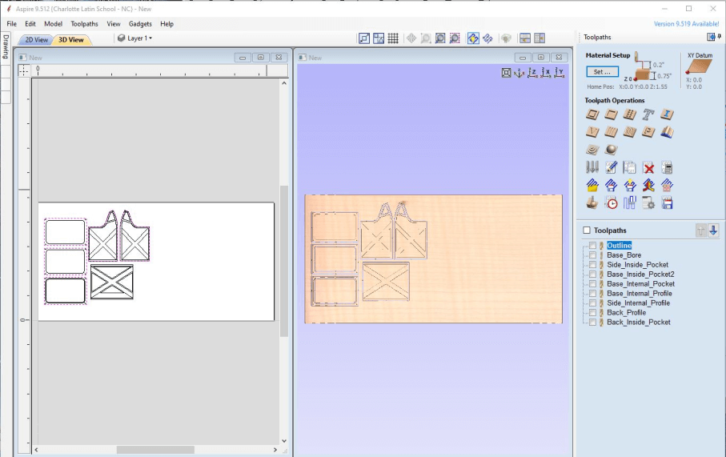

{: align=left }

I began by prepping my machine with the proper bit and mounted my stock to the machine's bed. My classmate [Graham Smith](http://fabacademy.org/2021/labs/charlotte/students/graham-smith/) and I did all of our millings this week together as the operation of a machine on this scale can be unsafe if the right precautions are not taken, or if operated alone. I loaded my first tool path, my 1/2" pocket operation, into the [Shopbot Command Console](https://www.shopbottools.com/support/control-software) through the *Load File* menu under the *File* tab. I selected my *.sbp* toolpath, and under the pop-up menu, selected *3D Offset* as the operations offset, and then proceeded to click enter to start the cut. This "3D Offset" allows for me to complete an "Air Cut" of my file, where the tool doesn't engage with my stock material but just runs above it. I ran this Air Cut to ensure my part placement fit with the side of the machine's workspace limits, and also didn't run into any screws. This test of cutting air was successful, so I was ready to move onto the real milling operation. I loaded the file into [Shopbot Command Console](https://www.shopbottools.com/support/control-software) following the same steps taken previously, but this time I left the offset dropdown set to the default *No Offset* as opposed to *3D offset*, so the machine would run another air cut. Before running this operation, I ensured the dust collection was turned on, and then clicked the *enter* key to start the operation.

The assembly and post-processing work on this wooden tank structure is well documented on my [week 7](http://fabacademy.org/2021/labs/charlotte/students/theodore-warner/assignments/week07/) computer-controlled machining class page, and that work will not be documented in-depth again on this page for space reasons, however, the final assembled and post-processed beauty shots are included below.

<figure markdown="1">

{align="left"}
{align="right"}

  <figcaption>Final Shots of Sanded Fish Tank Structure</figcaption>

</figure>

After the completion of my tanks structure in my [week 7](http://fabacademy.org/2021/labs/charlotte/students/theodore-warner/assignments/week07/) class, a couple of additions had to be made to allow for the mounting of a mains AC input, my front panel electronics, as well as a mount for my tanks grow lights. Beginning with the mount for my mains AC adapter, I used a paddle bit on my drill to take out some material in the shape of the adapter on the back of the tank, before finishing up the rectangle with a chisel, using the adapter as a reference until reaching a press-fit install. I also drilled two M4 mounting holes with this adapter as a reference, allowing for a secure attachment of the adapter to the frame.


  <figcaption>Mains AC Adapter and Switch Box Mounting Hole</figcaption>

The cables from this adapter are routed through this pocket on the back of my tank, and into the underside electronics enclosure before the adapter is mounted to the frame with M4 bolts, as shown in the images below. Note these M4 screws were just a place holder and were replaced with some nice matching matte black M4 bolts, allowing for a cleaner adapter look.


The next addition to my plywood tank structure is the grow light mounting bard, which ran across between the two highest points of my structure. This bar is made out of some scrap plywood from my tanks CNC job, and I ripped it down to size on a table saw, before tweaking the height to match that of its mounts on a bandsaw. I used the same tactics sued to assemble the tank structure to mount this light bar, with something dowels for alignment, with wood glue to hold. Underneath this bar, on the side that will be facing the eventual plant box, I mounted three rows of *Grow Light Strips*, a strip of special neo pixels with light frequencies meant to help plant growth. In my particular case, I used 4 red : 1 blue strip, and alternated the mounting of the three rows to offset this pattern.


The final modification needed on my plywood tank structure was a pocket allowing for the mounting of my front panel's electronics, a switch, and my tank's LCD. I spent a while pinpointing the location and sizing of this box, as to not interfere with the lip holding the acrylic panel over my electronics enclosure, a feature discussed later on this page. I used a speed square and a Metric/Imperial ruler to draw out a pocket large enough to fit the two needed components, with some additional space for wiring, considering the restrictions of the area throughout. 

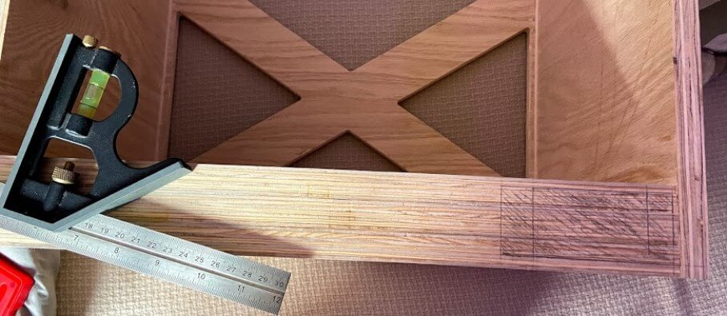
  <figcaption>Front Panle Electronics Clearence Hole Layout</figcaption>

I then followed the same approach taken to remove material for my mains AC adapter mount, starting by removing material with paddle bits and my drill, before cleaning up with a chisel. This hole will eventually be completely covered with the front panel of my tank, so I wasn't too concerned with the appearance of this one. After all the material was removed, I was left with the clearance hole, shown below.


### Tank Front Plate

To cover up this newly carved electronics clearance hole, and also complete the side symmetry of my plywood structure, my next step was to laser cut my tank structure's front plate. I began this plate in Fusion 360, as even in 2d design, I find myself most conferrable when using Fusion 360's constraints and sketch interface. I mocked this plate up to hold my system's LCD and a light power switch over the physical cut clearance hole and then added in some icons to the plate, including a *TW* logo, as well as a *light on* and *light off* icon.

<iframe src="https://gmail5303747.autodesk360.com/shares/public/SH286ddQT78850c0d8a412b692a4a61153da?mode=embed" width="900" height="600" allowfullscreen="true" webkitallowfullscreen="true" mozallowfullscreen="true"  frameborder="0" loading="lazy"></iframe>

I saved this Fusion 360 sketch as a *.dxf* and imported the file into CorelDRAW, where I could then, following the same process I took in [week 3](http://fabacademy.org/2021/labs/charlotte/students/theodore-warner/assignments/week03/), could run this file on our lab's Fusion Pro 48 laser cutter. I ran this plate of a sheet of 1/4" plywood, a sheet with matching veneer to that of my plywood structure, allowing the front plate to blend in with the rest of the structure. I wanted to reduce as much laser residue and char on this piece as possible, so I weighted this piece down to the bed of the laser before focusing on the laser, and starting the job. To get a minimal amount of char took a couple of different attempts, but eventually, I was left with the product below ...


... and after a bit of touching up, fit perfectly to the front of my tank, aligning with the electronics clearance hole, and when mounted with some brass furniture screws, left me with the tank front below.


### Electronics Compartment Cover

To finish up the fish tank structure that will be the bones of my final project, I laser cut a press-fit acrylic bottom panel for the base of the tank that will cover the electronic housing cutout located on the bottom of the tank structure. I followed the same steps take earlier this week to export the bottom panel as a *.dxf* file from Fusion, but instead of worrying about toolpaths for this file, I imported the *.dxf* into Inkscape, where I added in some air holes over the PSU mounting position, as well as a mount for a 40x40 fan for cooling. As a final touch, I included a QR code that links to this project page your reading currently, along with the project name and copyright. 


Next, following the same process I took in [week 3](http://fabacademy.org/2021/labs/charlotte/students/theodore-warner/assignments/week03/), I laser cut this file from 1/4" acrylic on our lab's Fusion Pro 48 laser cutter.


## Acrylic Fish Tank

Being the real centerpiece of my Aquaponics Fish Tank project, the fish tank itself was a special piece to work on, that I spent a good bit of time planning out before its creation. The tank, in its simplest form, is 5 acrylic panels cut on a laser cutter, and bonded together to form the tank itself with [WeldOn 16](https://www.amazon.com/IPS-Weld-Acrylic-Plastic-Cement/dp/B0149IFA9O/ref=sr_1_1?dchild=1&keywords=weldon+16&qid=1620182756&sr=8-1). However just a plain acrylic box like this is a little too basic, and taking inspiration from an assignment completed by 7th-grade engineering classes in our lab, I decided to etch something on the back wall of my tank. This assignment I took inspiration from is a pretty simple project completed by our lab's seventh graders as an intro to the laser cutter. The gist of the assignment involves laser-cutting and etching an acrylic sign, and then shining a neopixel strip down on the acrylic, lighting up the etched portion of the assignment. My fish tank will include white neopixel light strips on the inside of the tank as accent lighting, and an etched back wall of my fishtank would complement well with these lights, just like the seventh-grade sign project. Although I didn't know for sure what I would be etched into this back panel yet, I knew I wanted this design to align with the four cutouts on the back wall of my wooden tank structure, so I began this tank design work referencing my physical wooden tank structure. I used Inkscape to create the tank's basic 5 rectangles, so four outer walls would all sit on a larger tank baseplate. From here, referencing the wooden structure again, I projected the cutouts of my structure's back wall to the back panel, giving me a workspace to include my future design. During all this Inkscape work, I remembered a conversation between one of my instructors, [Mr. Tom Ducick](http://archive.fabacademy.org/fabacademy2016/charlottelatin/students/999/about.html) and our Fab group, where Mr. Dubick brought up the inclusion of our Eagle designs outside of circuit boards. For the back panel of my fish tank, I decided on embedding an SVG exported from my first mainboard attempt made all the back in [week 6](http://fabacademy.org/2021/labs/charlotte/students/theodore-warner/assignments/week06/#final-project-board-work). I used Inkscape's *Intercect* tool to crop this SVG down into the back walls four design slots. My final bit of work on this tank design fell on this back panel design again, as after meeting with another one of my instructors [Dr. Terence Fagan](https://mees.uncc.edu/directory/terence-j-fagan), the point was brought up that as sweet as the etched original circuit board would look on the back panel of the tank, my final project is a fish tank, something that is more organic and doesn't make you think of something as modern looking as the sharpe traces of a circuit board. To combat this, I increased the nodes of this back panel design in Inkscape, and then also increased the designs beziers, until left with something still legible as my original circuit board, but less sharp and with more organic curves, leaving me with the finished fish tank design in Inkscape, shown below.


I exported this Inkscape design as an SVG file, and then opened the file into CorelDRAW, and following the workflow for laser cutting I used in my [week 3](http://fabacademy.org/2021/labs/charlotte/students/theodore-warner/assignments/week03/) class, I ran this tank file on a sheet of 1/4" clear acrylic on our lab's Fusion Pro 48 laser cutter.

<iframe width="900" height="650" src="https://www.youtube.com/embed/jMZu8fX5GOA" title="YouTube video player" frameborder="0" allow="autoplay; encrypted-media" allowfullscreen loading="lazy"></iframe>

This job left me with the 5 panels of my tank, ready to assemble


As mentioned earlier, for the panel assembly of my tank, I'm using [WeldOn 16](https://www.amazon.com/IPS-Weld-Acrylic-Plastic-Cement/dp/B0149IFA9O/ref=sr_1_1?dchild=1&keywords=weldon+16&qid=1620182756&sr=8-1) to bond all of my acrylic panels together. This bonding process was super time-consuming, as each run with Weldon 16 required a 24 hour set time to completely bond. Despite this long total set time, the work time of [WeldOn 16](https://www.amazon.com/IPS-Weld-Acrylic-Plastic-Cement/dp/B0149IFA9O/ref=sr_1_1?dchild=1&keywords=weldon+16&qid=1620182756&sr=8-1) is only a little over a minute, so all of my application had to be clean and quick. I used a set of two 90 degrees angle clamps to hold my tank's panels in place while using [WeldOn 16](https://www.amazon.com/IPS-Weld-Acrylic-Plastic-Cement/dp/B0149IFA9O/ref=sr_1_1?dchild=1&keywords=weldon+16&qid=1620182756&sr=8-1) and left the clamps on through the 24 hours set time for each individual corner to allow for a square tank. Below is an image of the last bonding run for the tank's sidewalls.


The longes part of the tank assembly was all 4 of the sidewalls of the tank, and after this 4-day process was complete, I followed the same application process for the bottom of the tank, this time holding the pieces in place with some painters tape along all edges, as well as across both pieces, shown below.


After this final bit of bonding was entirely set, I went to test out by tank, setting the tank up on a sheet of cardboard to see if any water leaked out, and unfortunately, it did ... a lot. 


I found that although [WeldOn 16](https://www.amazon.com/IPS-Weld-Acrylic-Plastic-Cement/dp/B0149IFA9O/ref=sr_1_1?dchild=1&keywords=weldon+16&qid=1620182756&sr=8-1) worked great for the structure of my tank, and allowed for a secure bond between all of the tanks panels, it didn't leave a watertight seal. This problem was simply fixed, however, with the application of silicon to the interior edges of my tank. During this step finding an Aquarium-Safe Silicone is super important, as to not kill any future fish. I found this article on [Aquarium-Safe Silicones]() to be a super helpful reference while picking one of these, and with the article as a reference, was able to pick a tank safe silicone out from my local hardware store. 

The application process for this silicone was worlds easier than the previous [WeldOn 16](https://www.amazon.com/IPS-Weld-Acrylic-Plastic-Cement/dp/B0149IFA9O/ref=sr_1_1?dchild=1&keywords=weldon+16&qid=1620182756&sr=8-1) work, due to the large working window with the product, and ability to do all of my tanks edges at once. I worked through starting with the four bottom edges of my tank, before tackling the four vertices, and then taking out any high spots on these lines with a popsicle stick.


The set time for this silicone was only 15 hours, but 24 was recommended on my brand's datasheet before exposer to water, so after this time, another watertight test of my tank was in order. I set up my silicone sealed tank of some sheets of dry computer paper, to reveal any leaks right away. I stress tested the sealed tank, filling it up to the brim with water, and then allowing the tank to sit for 3 hours, checking back on it around every 30 minutes. This test yielded successful results, with no water on the computer paper, and dry external semes on the tank, leaving with finally, with a fish ready tank!


  <figcaption>Water-Tight Test on Sealed Tank - Three Hour Mark</figcaption>


  <figcaption>BTT Rubber Duckies Enjoying the Water-Tight Tank</figcaption>

## Plant Box - 3D Printing

Following the acrylic fish tank, the *aqua* part of the aquaponics system, it was time to move onto my tank's plant box, covering the system *ponics* side. The fabrication of this plant box is one of the additive processes used on my tank, allowing me to incorporate otherwise impossible features, such as embedded water pipes, and nice cable management. Around the time of designing this plant box a nice article from Prusa Research came out on [How to Make Prints Waterproof](https://blog.prusaprinters.org/watertight-3d-printing-pt1-vases-cups-and-other-open-models_48949/), and its contents gave this additive plant box manufacturing some more light. With the contents of that article, as well as this article on [Waterproof Printing](https://all3dp.com/2/waterproof-3d-print-pla/) from All3D as a reference, I settled on some basic goals for this plant box manufacturing, The box itself will be printed from white PETG. PETG is not only one of my favorite filaments to print in, but also considered a watertight material, and when not colored and left white, is also fish tank safe.

With the manufacturing process in mind, I began work on the plant box's CAD in Fusion 360. The CAD for this part is pretty complex, including not just water routing from a connection port on the bottom of the part, but also a water directing reflow system, and cable management with board mounts incorporated in the design. The part is split into four separate sections, to allow for optimal print orientation on my printer's bed. These four pieces align with three mounting alignment holes for embedded M3 nuts and bolts, and these same alignment screws are used to secure the four sections together.

<iframe src="https://gmail5303747.autodesk360.com/shares/public/SH286ddQT78850c0d8a4c37a952529255412?mode=embed" width="900" height="650" allowfullscreen="true" webkitallowfullscreen="true" mozallowfullscreen="true"  frameborder="0" loading="lazy"></iframe>

  <figcaption>Final Plant Box Itteration in Fusion 360</figcaption>

After the completion of all design work for my tank's plant box, the tedious process of manufacturing was ready to begin. In total, all four parts of the plant box took just over 72 hours to print. Each of the printed parts went through a couple of extra steps in the slicing process, where the plant box's water tightness would be ensured. The basic premise of a watertight component relates very closely to the density of that component. With this in mind, each of the four plant box parts are sliced with four perimeters, and with a 10% gyroid infill, an infill type with super high strength along with a low weight (less filament usage). Each of these parts runs at a *0.20mm* layer height, allowing for a relatively high part density while keeping a lower number of layer lines, places where water could seep into the print. After all of this, I used *Prusa SLicer*'s ( my slicer of choice) *Paint on Supports* tool, to add supports to the aspects of my print where they were needed. This step, as opposed to auto-generating the supports allowed me to keep the internal water pipes of my part intact and usable without supports clogging them, shown in the inspected slicing image below.


This slicing setup process was used across all four parts of my tank plant box, and after a ton of print time, I was left with the task of assembly. As mentioned above, my CAD design for this part includes alignment pins for all four of the plant box's sections. After cleaning up the supports from each of these sections, I inserted the embedded M3 nuts used in this alignment setup and dry-fit the four parts together with the alignment M3 bolts. After this, I repeated the same assembly process, this time using the same silicone used to seal my tank on all of the inside surfaces on my plant box sections, leaving me with the assembled part below...


## Electronics Mounting & Cable Managment- 3D Printing

Following the plant box system of my assistive aquaponics fish tank, a plethora of other small bits and pieces helping with the system integration of my part were also made with the 3d printing workflow. Due to a large number of these small bits, and their relative simpleness, instead of taking a deep dive into the concept behind each design and the manufacturing of the part, I'll just hit some design concept highlights in this paragraph, and include the CAD and manufacture a part for each piece below. All of these parts are mounts of one kind or another, either press fit for boards, or bolt down for cables/sensors. A lot of these pieces serve as a visual benefit just as much as their purpose of mounting and cable management. With this in mind, many of the pieces are designed with a framing drafted banding around the edge. Inspiration from this angled framing came from my time in my 8th-grade art class, where I was taught the practice of directing a viewer's vision. The angled frame of a lot of these mounts serves to direct your vision inward, away from the frame itself. In addition to the angled nature of these mounts, any part I'm wishing to achieve this effect with is printed from a black PETG, assisting in the directing of vision away from them, as they don't 'pop'. A good example of this effect is seen in the *Fish Bowl Board Mount* part included below. This mount, for my fishbowl mainboard, uses the framing draft angle technique, along with the black filament color to direct one's eyes towards the center of the board, where the microchip is located, upon first glance.

#### Fish Bowl Board Mount

<center>

<iframe src="https://gmail5303747.autodesk360.com/shares/public/SH286ddQT78850c0d8a46f90867f3530bc9d?mode=embed" width="900" height="600" allowfullscreen="true" webkitallowfullscreen="true" mozallowfullscreen="true"  frameborder="0" loading="lazy"></iframe>

</center>

<figure markdown="1">

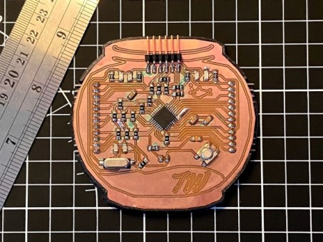{align="left"}
{align="right"}
  <figcaption>Board Prototype Fitted in Fish Bowl Board Mount</figcaption>

</figure>

#### Jumper Cable Mounts

<center>

<iframe src="https://gmail5303747.autodesk360.com/shares/public/SH286ddQT78850c0d8a413785fae920f543f?mode=embed" width="900" height="600" allowfullscreen="true" webkitallowfullscreen="true" mozallowfullscreen="true"  frameborder="0" loading="lazy"></iframe>

</center>

<figure markdown="1">


  <figcaption>12x Jumper Mount On Jumper Cables</figcaption>

</figure>

#### PSU Mounting Brackets

<center>

<iframe src="https://gmail5303747.autodesk360.com/shares/public/SH286ddQT78850c0d8a47bc00797a75a3012?mode=embed" width="900" height="600" allowfullscreen="true" webkitallowfullscreen="true" mozallowfullscreen="true"  frameborder="0" loading="lazy"></iframe>

</center>

<figure markdown="1">

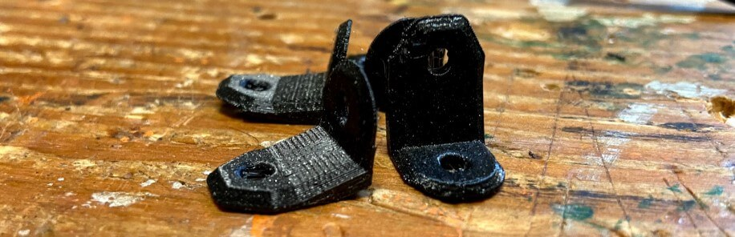
  <figcaption>Power Supply Mounting Brackets After Cleanup</figcaption>

</figure>

<figure markdown="1">

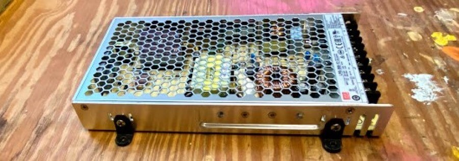
  <figcaption>Power Supply Mounts Attached to PSU</figcaption>

</figure>

#### Wire Grommet

<center>

<iframe src="https://gmail5303747.autodesk360.com/shares/public/SH286ddQT78850c0d8a42aed3208bae14bf6?mode=embed" width="900" height="600" allowfullscreen="true" webkitallowfullscreen="true" mozallowfullscreen="true"  frameborder="0" loading="lazy"></iframe>

</center>

<figure markdown="1">


  <figcaption>Back Wire Grommet After Cleanup</figcaption>

</figure>

<figure markdown="1">


  <figcaption>Back Wire Grommet Fitted to Wire Passthrough Hole</figcaption>

</figure>

#### PSU Terminal Cover

<center>

<iframe src="https://gmail5303747.autodesk360.com/shares/public/SH286ddQT78850c0d8a448bc2484cc94a3fa?mode=embed" width="900" height="600" allowfullscreen="true" webkitallowfullscreen="true" mozallowfullscreen="true"  frameborder="0" loading="lazy"></iframe>

</center>

<figure markdown="1">


  <figcaption>PSU Terminal Cover Plate After Cleanup</figcaption>

</figure>

<figure markdown="1">


  <figcaption>PSU Terminal Cover Mounted to PSU Terminals</figcaption>

</figure>

#### Power Breakout Board Mount

<center>

<iframe src="https://gmail5303747.autodesk360.com/shares/public/SH286ddQT78850c0d8a4440684e0772e84b2?mode=embed" width="900" height="600" allowfullscreen="true" webkitallowfullscreen="true" mozallowfullscreen="true"  frameborder="0" loading="lazy"></iframe>

</center>

<figure markdown="1">

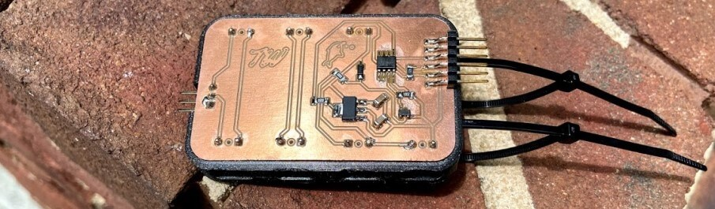

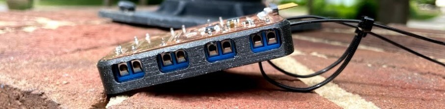
  <figcaption>Power Breakout Board Fitted in Board Mount</figcaption>

</figure>

#### pH Boards Mounts

<center>

<iframe src="https://gmail5303747.autodesk360.com/shares/public/SH286ddQT78850c0d8a49fc0850090dedefb?mode=embed" width="900" height="600" allowfullscreen="true" webkitallowfullscreen="true" mozallowfullscreen="true"  frameborder="0" loading="lazy"></iframe>

</center>

<figure markdown="1">


  <figcaption>pH electrical Isolation Board Mounted on Board Mount</figcaption>

</figure>

#### pH Probe Mount

<center>

<iframe src="https://gmail5303747.autodesk360.com/shares/public/SH286ddQT78850c0d8a4386a4a2819a7e7be?mode=embed" width="900" height="600" allowfullscreen="true" webkitallowfullscreen="true" mozallowfullscreen="true"  frameborder="0" loading="lazy"></iframe>

</center>

<figure markdown="1">


  <figcaption>Assembled pH Probe Mount After Cleanup</figcaption>

</figure>

#### Cable Bundle Mounting Clips

<center>

<iframe src="https://gmail5303747.autodesk360.com/shares/public/SH286ddQT78850c0d8a453d284a8f5c97b29?mode=embed" width="900" height="600" allowfullscreen="true" webkitallowfullscreen="true" mozallowfullscreen="true"  frameborder="0" loading="lazy"></iframe>

</center>

<figure markdown="1">


  <figcaption>Cable Bundle Clip Mounted to Back of Tank Structure</figcaption>

</figure>

## System Assembly & Testing

Due to the countless design hours spent planning the assembly of my entire tank, this process had plenty of digital references, making the most time-consuming process of the assembly the one, not digitally planned aspect, cable management. I began the assembly process on this task, beginning with the connection of my power supply to mains via the inlaid AC adapter in my tank structure. Due to the dangerously high voltages in these terminals, I followed best practices for the connecting of these wires, using crimp-on connectors for each wire connected to these terminals, as well as grounding the whole system, and including an AC adapter with a 250v fuze.

<figure markdown="1">


  <figcaption>Power Supply Terminal Wireing</figcaption>

</figure>

As included above, these PSU terminals have a 3d printed terminal cover plate, to provide a little extra protection from any accidental bumps into the terminals. After completing the terminal wiring of the PSU, I installed this terminal cover plate, screwing it down to the wooden plate with M3 screws. I then, with the installed PSU as a reference, found the center of the remaining chunk of the electronics compartment and installed my printed fishbowl main board mount.

<figure markdown="1">


  <figcaption>Begining of System Integraiton - PSU and Main Board</figcaption>

</figure>

Taking a break from cable management for a bit, It was time to begin the incorporation of my tank's subsystems into my plywood tank structure, beginning with my acrylic fish tank. The tank was designed to be an exact fit in this plywood structure, and after real-world fabrication, fit in the structure tight enough to stay put without adhesives of fasteners, even when upsidedown. For the installation of the acrylic tank into the plywood structure, I used four wood clamps long enough to span the width/length of both pieces, and then used the clamps to slowly and evenly press the tank into the structure so it sat flush on all four connecting walls. Following this, I then reattached the structure's laser-cut front panel with some brass furniture screws.

<figure markdown="1">


  <figcaption>Acrylic Fish Tank Installed in Plywood Structure</figcaption>

</figure>

Next, I began preparing the next subsystem of my tank, the plant box. Due to the predesigned cable management features, the process of including the necessary components here was pretty straightforward. I first routed the tank light strips along their channel, using the zip tie cable mount and cable passthrough to route the cables out the back grommet hole of the plant box. From here I routed a wire that would later be connected to the tank's water pump and finally moved onto the inlaying of the fishbowl board. Behind this board inlay is a little channel meant for the jumpers to run through while attached to the backside of the board. I connected these jumpers to their pins on my fish board, super glued them in place, and took a picture for reference later, as the wires will next be completely hidden. Then, I pressed the board into its corresponding slot, followed by its press-fit laser cut acrylic cover, and sealed around any gaps with silicon. This left me, as shown below, with a mounted sensor board with only the sensor itself exposed.

<figure markdown="1">


  <figcaption>Bottom of Plant Box After Electronics & Cable Installation</figcaption>

</figure>

I was then ready to press this plant box into place, with all of its mounted electronics. The plant box follows the same tight press fit mounting principle as the previous acrylic tank, however instead of using clamps, I slowly worked the assembled plant box back into position, until aligned with the acrylic fish tank and plywood structure, shown below.

<figure markdown="1">


  <figcaption>Plant Box Installed in Tank Structure Above Acrylic Tank</figcaption>

</figure>

While pressing the plant box into position, I was sure to route and keep the structures grow light wires in their cable passthrough on the side of the plant box, yielding some nice clean cable routing across the components of the whole system.

<figure markdown="1">


  <figcaption>Grow Light Cables Routed Through Plant Box Cable Passthrough</figcaption>

</figure>

After the installation of all this, a test of the newly installed lights was in order, and I hooked up both my tank's grow & tank lights to a power supply set to 12v and turned them on.

<figure markdown="1">


  <figcaption>System Grow & Tank Lights Testing</figcaption>

</figure>

With the bulk of the structure assembly done, I next began the mounting and integration process, starting with the internal tank components like the pH probe. I attached both printed probe clamps to my pH probe and then used some silicone to stick it in the back left corner of my tank, where the probe cable routed up through the plant box, hidden away.

<figure markdown="1">


  <figcaption>pH Probe Mounted in Back Left Tank Corner</figcaption>

</figure>

Following the pH probe, next up in the tank itself was the water pump. I first connected the pump to the plant box via both a bit of silicone tubing cut to length and then hose clamped and siliconed in place, as well as with connection between the pump's cable and the router pump wires installed previously. I then used the pump's two included mounts to stick the pump down to the tank floor with silicone.

<figure markdown="1">


  <figcaption>Water Pump Connected & Installed in Tank</figcaption>

</figure>

Once all contents of the tank/plant box systems were embedded, I could move on routing their cables down to my structure's main electronics compartment. I used the 3D-printed cable clips printed earlier to route these cables down the back of my tank, between the two included wire grommets. I wrapped all of these cables with some cable wrap I had laying around from and Ender 3 mod I had done.

<figure markdown="1">


  <figcaption>Cable Routing From Plant Box to Electronics Compartment</figcaption>

</figure>

These routed cables run through the cable passthrough grommet on the backside of the tank and then slot through their cable route in the PSU terminal cover plate, until out the other side. From here the bulk of cable management began, starting with the power breakout system. I mounted the power breakout board on its 3D printed mount right below the fishbowl mainboard, and then connected the correct incoming and outgoing wires to their connected headers while referencing my eagle power breakout board file. Each of these cables was screwed into their terminal headers before the board was mounted down to the wooden base. From here I began the mounting of the 3 remaining pH boards, two of which sit to the left of my mainboard, and one just off-centered above. These three boards mount via press-fit mounts & their mounting holes, two boards with 3mm holes, and one with 4mm. I then connected the incoming pH probe cable to its terminal, and wired the three pH boards together, before moving onto the main data wiring. Using all of my testing media as a reference, I made the jumper connections for all of the lines in my electronics enclosure, coming from the pH board, temp/humidity sensor, LCD, and light switch, and with that had an integrated system.

<figure markdown="1">


  <figcaption>All Board Mounted Electronics Compartment</figcaption>

</figure>

Although I had wired all of my connections with mounted boards in my electronics enclosure, I finished the system integration process with some additional cable management via jumper cable mounts.

<figure markdown="1">


  <figcaption>Final Cable Managed Electronics Compartment</figcaption>

</figure>

... and, with all this assembly & integration work done, it was time for final testing. Below is a successful demonstration of my tank's electronics system. Just a note, in this video, my tank's pump is disconnected, because it's never good to run a water pump outside of water. Instead of leaving this pump connected during the testing of the electronics system, I tested the voltage and current from the pump cables run under the plant box.

<iframe width="900" height="650" src="https://www.youtube.com/embed/aCb7Cp4qs18" title="YouTube video player" frameborder="0" allow="autoplay; encrypted-media" allowfullscreen loading="lazy"></iframe>

Finally, came the water test. Despite the number of water tests I had done with the subsystems before, and the proof of their watertight features, this test was damn stressful leading up to it, due to the inclusion of all my electronics in my system on this test. I prepared a spot outside where I could test my tank, and then began preparing the tank, first by filling the plant box with my LECA grow medium ...


... and next, by filling the tank itself. I did this with the help of a couple of my fab groupmates and was able to use a spare water pump and some excess silicone tubing to pump water into my fish tank, without concern of spilling around the base of the tank, where its electronics are located.

<iframe width="900" height="650" src="https://www.youtube.com/embed/_RH-z7r-aJA" title="YouTube video player" frameborder="0" allow="autoplay; encrypted-media" allowfullscreen loading="lazy"></iframe>

Unsurprisingly, but to my relief, the filling of the tank went smoothly, and there was absolutely no spillage/leakes anywhere in the whole system, leaving me with the last remaining tank ... turning it on.

<iframe width="900" height="650" src="https://www.youtube.com/embed/k-yAUQGVHbw" title="YouTube video player" frameborder="0" allow="autoplay; encrypted-media" allowfullscreen loading="lazy"></iframe>

it worked!, upon bootup, water begins flowing through the system, and draining out through the plant boxes draining feature, at the same time as the electronics system is taking measurements from the system and displaying it all of the tanks embedded front LCD. 

*[FDM]: Fused Deposition Modeling
*[CNC]: Computerized Numerical Control
*[MPCNC]: Mostly Printed Computerized Numerical Control - https://docs.v1engineering.com/mpcnc/intro/
*[SSH]: Secure Shell
*[GPIO]: General-Purpose Input/Output
*[USB]: Universal Serial Bus
*[ETA]: Estimated Time of Arrival
*[ISO]: International Organization for Standardization
*[UPDI]: Unified Program and Debug Interface
*[AVR]: A Family of microcontrollers developed since 1996 by Atmel
*[JTAG]: Joint Test Action Group
*[IDE]: Integrated Development Environment
*[Rx]: Receiving Signal
*[Tx]: Transmitting Signal
*[VCC]: Voltage Common Collector (+)
*[GND]: Ground / Common Drain (-)
*[IC]: Integrated Circuit
*[LED]: Light-Emitting Diode
*[Cap]: Capacitor
*[SPST]: Single Pole Single Throw Switch
*[SPDT]: Single Pole Double Throw Switch
*[DPST]: Double Pole Single Throw Switch
*[DPDT]: Double Pole Double Throw Switch
*[EEPROM]: Electrically Erasable Programmable Read-Only Memory
*[PCB]: Printed Circuit Board
*[PWM]: Pulse Width Modulation
*[SPI]: Serial Peripheral Interface
*[I2C]: Inter-Integrated Circuit
*[UART]: Universal Asynchronous Receiver/Transmitter
*[ADC]: Analog-to-Digital Converter
*[DAC]: Digital-to-Analog Converter
*[MCU]: Microcontroller Unit
*[FPGA]: Field-Programmable Gate Array
*[SLA]: Stereolithography
*[DLP]: Digital Light Processing 
*[SLS]: Selective Laser Sintering
*[PLA]: Polylactic Acid 
*[ABS]: Acrylonitrile Butadiene Styrene 
*[PETG]: Polyethylene Terephthalate Glycol 
*[CAD]: Computer-Aided Design
*[CAM]: Computer-Aided Manufacturing
*[G-code]: A language for controlling CNC machines
*[PID]: Proportional-Integral-Derivative (control loop feedback mechanism)
*[MOSFET]: Metal-Oxide-Semiconductor Field-Effect Transistor
*[BJT]: Bipolar Junction Transistor
*[SMD]: Surface-Mount Device
*[THT]: Through-Hole Technology
*[DIP]: Dual In-line Package
*[ESC]: Electronic Speed Controller
*[BEC]: Battery Eliminator Circuit
*[LiPo]: Lithium Polymer 
*[NiMH]: Nickel-Metal Hydride 
*[EMI]: Electromagnetic Interference
*[ESD]: Electrostatic Discharge
