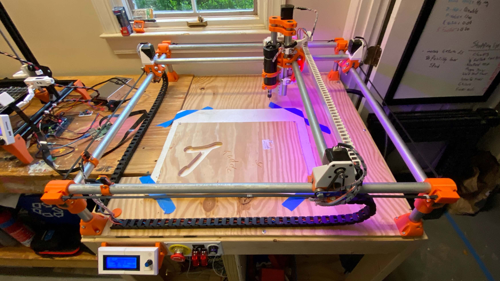
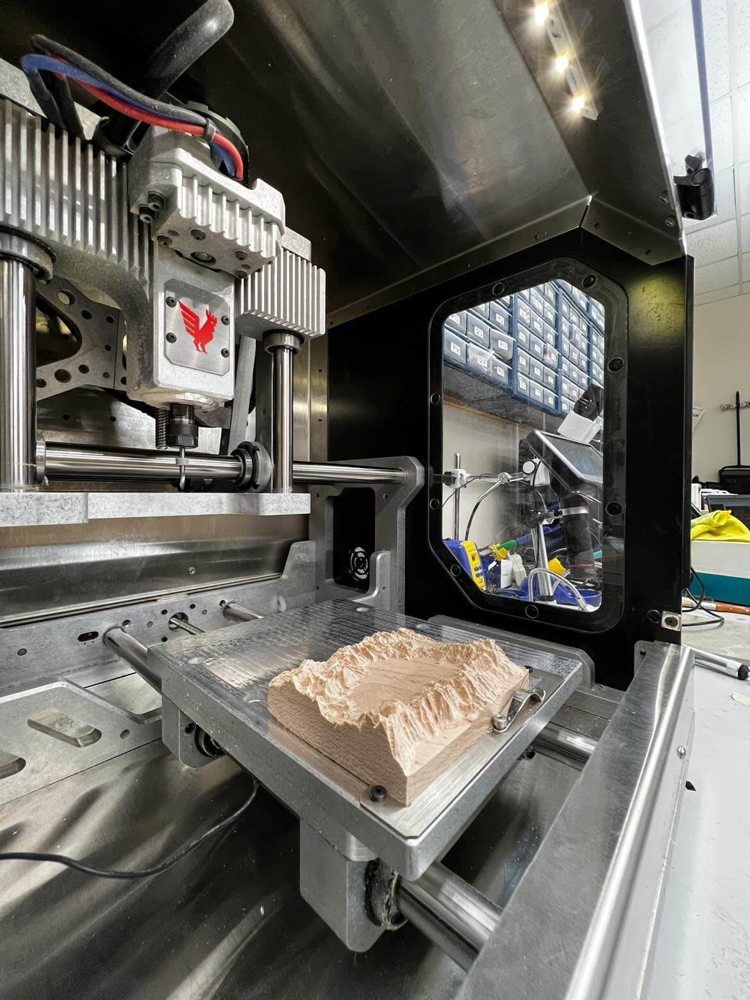
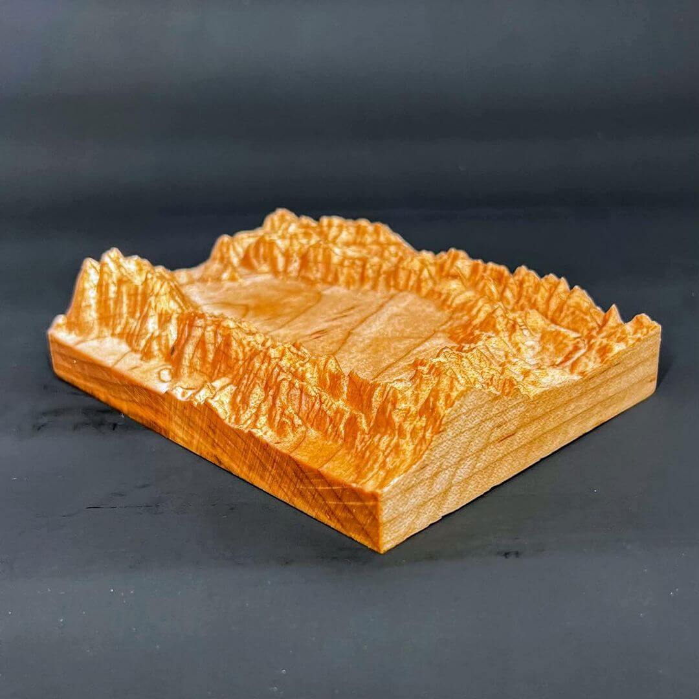

<link rel="stylesheet" href="../../assets/css/projects/milling.css">

Subtractive manufacturing is a process I've always found mesmerizing. Although additive processes such as 3D printing allow for the creation of something from seemingly nothing, I believe it's even cooler to watch the morphing of existing stock into a different object. Despite this interest, I feel as though I've barely scratched the surface of CNC - primarily focusing on PCB milling in my subtractive manufacturing projects. I made a first attempt to dive into more subtractive manufacturing work a couple of years ago now when I built [V1 Engineering's](https://www.v1engineering.com/) original [MPCNC](https://docs.v1engineering.com/mpcnc/burly/).

<figure markdown="1">

{width="48%" align="left"}
{width="48%" align="left"}

</figure>

I absolutely loved building this machine and recommend it to all interested in understanding the workings of CNC, yet I don't mill on mine all that often, I find more use in using the machine as a GCode dev platform for some of my other projects. 

Since my initial attempted steps with the [MPCNC](https://docs.v1engineering.com/mpcnc/burly/), I've become more versed with CNC milling due to exposure during my Fab Academy [Week 7: Computer Controlled Machining](https://fabacademy.org/2021/labs/charlotte/students/theodore-warner/Assignments/week07/) assignment. For this assignment, I used the [CLS Fab Lab's](https://www.charlottelatin.org/academics/steam) [ShopBot PRSalpha](https://www.shopbottools.com/products/alpha) to mill the plywood fish tank housing for my Fab Academy [Final Project](https://fabacademy.org/2021/labs/charlotte/students/theodore-warner/Final%20Project/final-project/). I continued my milling work over the summer, running the ShopBot almost daily over July for [Young Engineers of Today's](https://www.youngengineersoftoday.com/) Summer Camps. Last fall, our lab picked up a [Bantam Tools Desktop CNC Milling Machine](https://store.bantamtools.com/collections/machines), Bantam's flagship machine, capable of super-rapid prototyping when partnered with their [Milling Machine Software](https://www.bantamtools.com/software-download). 

<figure markdown="1">

[{width="53%" align="left"}](https://www.bantamtools.com/)
[{width="42%" align="left"}](https://www.shopbottools.com/)

</figure>

This article attempts to serve as a complete guide for CNC milling, covering machinist jargon, material standards, feeds and speeds, CAM workflows with [Autodesk Fusion 360](https://www.autodesk.com/products/fusion-360/overview) & [Vectric Aspire](https://www.vectric.com/products/aspire), and milling workflows for [Shopbot](https://www.shopbottools.com/) & [Bantam Tools](https://www.bantamtools.com/) machines - all through a collection of milling micro-projects ranging from a 1 to 1.9 Million scale mill of Mars's Gale Crater to brass wax seals :smile:. 

!!! example "Milling Micro-Projects"

    This page strays from my normal single-project documentation style, opting to cover different CAM & milling workflows via a collection of micro-projects. In a similar approach to the "Constantly Updating" status of my [Lithophane Experiments](https://theodore.net/projects/LithophaneExperiments/) article, I plan to continually expand the content of this article with any additional milling micro-project I complete. Initally, the page will just host [material reference](https://theodore.net/projects/MillingWorflow/#material-reference) & a [feeds and speed calculator](https://theodore.net/projects/MillingWorflow/#feeds-speeds-calculator). That being said, be sure to stay tuned for future updates!

## Feeds & Speeds

  <label class="cl-switch">
    Imperial
    <input type="checkbox" id="units" onclick="unit()">
    
    Metric
  </label>

Creating a successful subtractive manufacturing toolpath can be a bit more intimidating than slicing for additive manufacturing. Not only can you jeopardize your stock material, but incorrect feeds and speeds can also yield a hazardous environment & potential machine damage. **There is no streamlined answer to find the right feeds and speeds**, ideal values depend on numerous variables & feeds and speeds may not remain constant from job to job. This section provides a starting place for feeds and speeds, with general values provided as well as a calculator for the required inputs in your toolpath. **This is by no means a universal key** and necessary precautions & alterations should be made to provide values to mesh with your manufacturing workflow. Often the manufacturer of your tool & your machine will provide generic feeds and speeds for your specific equipment. Operator input is required to achieve successful & safe cuts, often you'll be able to hear machine strain - a telltale sign of poor cutting. Trial and error adjusting is necessary to achieve the sweet spot for your feeds and speeds.  

???+ abstract "Feeds & Speeds Terminology"

    `Tool Diameter`

    :   The diameter of the endmill. When Profile milling or Through Cutting stock, it is best to keep the ***Tool Diameter ≥ 1/6 Stock Thickness***, preserving the integrity of the endmill while allowing for full passes. Larger tool diameters yield shorter cut times when removing a lot of material, while smaller diameters allow for higher detail to be reached. It is typically best to utilize both larger and smaller diameter endmills, using the larger to clear the bulk of stock material, while finishing the mill with a smaller diameter tool to achieve the best detail. 

        <figure markdown="1">

          {width="50%"}
          {width="50%"}

        </figure>

    `Flute Count`

    :   The number of individual flutes an endmill has. Flutes are the upward running cutting edges on an endmill. Lower flute counts allow for better chip & heat clearance from the cutting edge, while higher flute counts provided a smoother finish to a part. Stock materials that require a high surface speed also require higher flute bits, and vice versa with lower surface speed requirements. One to Two flute bits will suffice for prototyping with soft plastics & waxes. Two or more flutes will typically be needed for harder plastics (such as HDPE), woods, and metals.

        <figure markdown="1">

          {width="50%"}
          {width="50%"}

        </figure>

    `Surface Speed`

    :   The speed at which the tool's cutting edge travels through the stock. Surface Speed is dependent on both the stock & endmill materials. Maximum surface speeds are typically published by your endmill's manufacturer and do not need to be derived experimentally. ***Staring jobs at ≤ 50% of the maximum provided value is the best practice to allow for ample time to ensure the successful operation of your machine***.

        <figure markdown="1">

          {width="50%"}
          {width="50%"}

        </figure>

    `Chip Load`

    :  The thickness of offcut 'chips' removed with each flute per revolution of the endmill. Maximum chip load is typically provided by the endmill's manufacturer, based upon the tool's characteristics. Finding a balance between chip load extremes is crucial for the safety of you and your machine. While larger chip loads yield shorter machine time, they also put greater forces on your endmill, potentially pushing the bit towards its point of rupture. On the other hand, smaller chip loads increase machine time, while expelling waste and heat from the tool at a slower pace, thus risking overheating and potential fire. Safe chip load values usually fall between *0.001"* & *0.010"*<i>0.0254mm</i> & <i>0.254mm</i>.

        <figure markdown="1">

          {width="50%"}
          {width="50%"}

        </figure>

    `Spindle Speed`

    :   The number of revolutions made by the endmill in a unit of time (RPM is standard). A Lower RPM yields a higher quality surface finish & more cutting power, while a higher RPM decreases machine time. For optimal milling operations, use a higher RPM for roughing passes & a lower for finishing.

        <figure markdown="1">

          {width="50%"}
          {width="50%"}

        </figure>

        

        $$
        Spindle Speed (RPM) = {Surface Speed (ft/min) \over π ∗ {1 \over 12} ∗ Tool Diameter (in)}
        $$

        

        

        
        $$
        Spindle Speed (RPM) = {Surface Speed (M/min) \over π ∗ {1 \over 1000} ∗ Tool Diameter (mm)}
        $$

        

    `Feed Rate`

    :   The speed at which the machine moves the tool through the stock. Finding the right feed rate is crucial for the safety of you and your machine. Excessively high feed rates cause excessive load on the cutter, leading to cataclysmic failure of the endmill, spindle, and machine. Feed rates that are too low produce unnecessary vibration on the machine, leading to poor surface finishes & potential cutter failure.

        <figure markdown="1">

          {width="50%"}
          {width="50%"}

        </figure>

        

        $$
        Feed Rate (in/min) = Spindle Speed (RPM) ∗ Flute Count ∗ Chip Load (in)
        $$

        

        

        
        $$
        Feed Rate (mm/min) = Spindle Speed (RPM) ∗ Flute Count ∗ Chip Load (mm)
        $$

        

    `Plunge Rate`

    :   The speed at which the endmill is driven down into the stock. The vertically running flutes on an endmill allow the tool to cut horizontally, while vertical plunges are more demanding on the tool. Lower plunge rates prevent tool damage & maintain lower temperatures while boring holes. ***All plunging cuts should be ramped***, as gradual plunging while traveling across the stock will reduce tool stress.
        
        <figure markdown="1">

          {width="50%"}
          {width="50%"}

        </figure>

        

        $$
        Plunge Rate(in/min) = Feed Rate (in/min) * {1 \over 2}
        $$

        

        

        
        $$
        Plunge Rate(mm/min) = Feed Rate (mm/min) * {1 \over 2}
        $$

        

    `Stepdown`

    :   The vertical depth of each pass of the tool into the stock. ***Best practice is to maintain a step down of ≤ 50% of the tool diameter***, however, may be increased while milling softer materials. The step down should **always** remain less than the tool diameter.

        <figure markdown="1">

          {width="50%"}
          {width="50%"}

        </figure>

        

        $$
        Stepover(in) = Tool Diameter (in) * {3 \over 5}
        $$

        

        

        
        $$
        Stepover(mm) = Tool Diameter (mm) * {3 \over 5}
        $$

        

    `Stepover`

    :   The space between passes of the tool into the stock. While pocketing, a maximum stepover of 50% can be used, however lower stepover values will leave a better surface finish.

        <figure markdown="1">

          {width="50%"}
          {width="50%"}

        </figure>

        

        $$
        Stepover(in) = Tool Diameter (in) * {9 \over 20}
        $$

        

        

        
        $$
        Stepover(mm) = Tool Diameter (mm) * {9 \over 20}
        $$

        

### Material Reference

Feeds and speeds are equally dependent on material properties and the specific of your machine & tool. Below I've compiled a table of commonly milled stock materials, ranging from woods to plastics to metals. Each material offers a brief description of the stock, as well as average surface speed & chip loads. Chiploads are tool-dependent just as much as they are material-dependent, so be sure to select an adequate load for your tool's diameter. More conservative chip loads are given on the left, while aggressive loads are given on the right. Conservative values will extend the life of your tool, while the higher loads will catalyze your job time - select a chipload within the provided range based on your needs. As mentioned above, **This is by no means a universal key** and necessary precautions & alterations should be made to provide values to mesh with your manufacturing workflow. Often the manufacturer of your tool & your machine will provide generic feeds and speeds for your specific equipment. Operator input is required to achieve successful & safe cuts, often you'll be able to hear machine strain - a telltale sign of poor cutting.

<figure markdown="1">

<table>
    <tr>
        <td><b>Material</b></td>
        <td><b>Description</b></td>
    </tr>
    <tr class="tablehover" onclick="showHideRow('hidden_row1');">
        <td><i id="right1" class="fas fa-angle-right"></i><i id="down1" class="fas fa-angle-down"></i> Wax</td>
        <td>A easily milled medium, commonly used for casting cores, molds, and CNC program proofs.</td>
    </tr>
    <tr id="hidden_row1" style="display: none;">
			<td>
        
			</td>
      <td>
        <ul>
        <li>Cost Efficient, offcut may be saved, melted & reused</li>
        <li>Environmentally Friendly</li>
        <li>Safe, no hazardous waste or fumes</li>
        <li>High Dimensional Accuracy</li>
        <li>Self-lubricating</li>
        <li>Easy on Tooling</li>
        </ul>
        
<strong>Surface Speed</strong> <em>(ft/minM/min)</em> = <code> 200 </code><code> 60.96 </code>

        
<strong>Chip Load</strong> <em>(inmm)</em> -
        

           1/8" Tool Diameter3.175mm Tool Diameter - <code>0.0089</code> - <code>0.005</code><code>0.22606</code> - <code>0.127</code>
           1/4" Tool Diameter6.35mm Tool Diameter - <code>0.010</code> - <code>0.015</code><code>0.254</code> - <code>0.381</code>
           3/8" Tool Diameter9.525mm Tool Diameter - <code>0.015</code> - <code>0.020</code><code>0.381</code> - <code>0.508</code>
           ≥ 1/2" Tool Diameter≥ 12.7mm Tool Diameter - <code>0.025</code> - <code>0.033</code><code>0.635</code> - <code>0.8382</code>
          

        

			</td>
		</tr>
    <tr class="tablehover" onclick="showHideRow('hidden_row20');">
        <td><i id="right20" class="fas fa-angle-right"></i><i id="down20" class="fas fa-angle-down"></i> Soft Wood</td>
        <td>A accessible & stylish medium, not to tricky to mill, often used for large scale parts - Pine, Spruce, Cedar, etc.</td>
    </tr>
    <tr id="hidden_row20" style="display: none;">
			<td>
        
			</td>
      <td>
        <ul>
        <li>Light weight, low density</li>
        <li>Sustainable resource, softwoods grow at a rapid rate</li>
        <li>Cheap & readily available</li>
        <li>Easily milled</li>
        </ul>
        
<strong>Surface Speed</strong> <em>(ft/minM/min)</em> = <code>650</code><code> 198.12 </code>

        
<strong>Chip Load</strong> <em>(inmm)</em> -
        

           1/8" Tool Diameter3.175mm Tool Diameter - <code>0.004</code> - <code>0.006</code><code>0.1016</code> - <code>0.1524</code>
           1/4" Tool Diameter6.35mm Tool Diameter - <code>0.011</code> - <code>0.013</code><code>0.2794</code> - <code>0.3302</code>
           3/8" Tool Diameter9.525mm Tool Diameter - <code>0.017</code> - <code>0.020</code><code>0.4318</code> - <code>0.508</code>
           ≥ 1/2" Tool Diameter≥ 12.7mm Tool Diameter - <code>0.021</code> - <code>0.023</code><code>0.5334</code> - <code>0.5842</code>
          

			</td>
		</tr>
    <tr class="tablehover" onclick="showHideRow('hidden_row2');">
        <td><i id="right2" class="fas fa-angle-right"></i><i id="down2" class="fas fa-angle-down"></i> Hard Wood</td>
        <td>Similar benefits to soft wood, can be a bit more costly - Maple, Walnut, Cherry, Ash, etc.</td>
    </tr>
    <tr id="hidden_row2" style="display: none;">
			<td>
        
			</td>
      <td>
        <ul>
        <li>Extremely Durable</li>
        <li>Enhanced strength when compared to softwoods, higher density</li>
        <li>Naturally more fire resistance than softwoods</li>
        </ul>
        
<strong>Surface Speed</strong> <em>(ft/minM/min)</em> = <code>650</code><code> 198.12 </code>

        
<strong>Chip Load</strong> <em>(inmm)</em> -
        

           1/8" Tool Diameter3.175mm Tool Diameter - <code>0.003</code> - <code>0.005</code><code>0.0762</code> - <code>0.127</code>
           1/4" Tool Diameter6.35mm Tool Diameter - <code>0.009</code> - <code>0.011</code><code>0.2286</code> - <code>0.2794</code>
           3/8" Tool Diameter9.525mm Tool Diameter - <code>0.016</code> - <code>0.018</code><code>0.4064</code> - <code>0.4572</code>
           ≥ 1/2" Tool Diameter≥ 12.7mm Tool Diameter - <code>0.019</code> - <code>0.021</code><code>0.4826</code> - <code>0.5334</code>
          

			</td>
		</tr>
    <tr class="tablehover" onclick="showHideRow('hidden_row3');">
        <td><i id="right3" class="fas fa-angle-right"></i><i id="down3" class="fas fa-angle-down"></i> Medium Density Fiberboard <code>MDF</code></td>
        <td>An easily machined & finished material, relatively cheap, commonly used for jigs, fixtures, vacuum molds & engraving.</td>
    </tr>
    <tr id="hidden_row3" style="display: none;">
			<td>
        
			</td>
      <td>
        
⚠️ <b>Strong Dust Collection Required</b>, as the fused nature of the material creates extremely fine dust.

        <ul>
        <li>Affordable & readily available</li>
        <li>Consistent, dense, heavy, flat & stiff</li>
        <li>Flex & crack resistant</li>
        <li>Easily machined</li>
        <li>Easy to post-process, paint & seal</li>
        </ul>
        
<strong>Surface Speed</strong> <em>(ft/minM/min)</em> = <code>650</code><code> 198.12 </code>

        
<strong>Chip Load</strong> <em>(inmm)</em> -
        

           1/8" Tool Diameter3.175mm Tool Diameter - <code>0.004</code> - <code>0.007</code><code>0.1016</code> - <code>0.1778</code>
           1/4" Tool Diameter6.35mm Tool Diameter - <code>0.013</code> - <code>0.016</code><code>0.3302</code> - <code>0.4064</code>
           3/8" Tool Diameter9.525mm Tool Diameter - <code>0.020</code> - <code>0.023</code><code>0.508</code> - <code>0.5842</code>
           ≥ 1/2" Tool Diameter≥ 12.7mm Tool Diameter - <code>0.025</code> - <code>0.027</code><code>0.635</code> - <code>0.6858</code>
          

			</td>
		</tr>
    <tr class="tablehover" onclick="showHideRow('hidden_row4');">
        <td><i id="right4" class="fas fa-angle-right"></i><i id="down4" class="fas fa-angle-down"></i> Oriented Strand Board <code>OSB</code></td>
        <td>A strong, light weight, cost-efficient material, a great choice for large scale stiff parts.</td>
    </tr>
    <tr id="hidden_row4" style="display: none;">
      <td>
        <ul>
        <li>Similar to plywood but contains no natural defects, knot free and consistent density</li>
        <li>Environmentally friendly, often produced from sustainable rapid growing trees</li>
        <li>Recyclable into new OSB</li>
        <li>Stiff & lightweight</li>
        </ul>
        
<strong>Surface Speed</strong> <em>(ft/minM/min)</em> = <code>650</code><code> 198.12 </code>

        
<strong>Chip Load</strong> <em>(inmm)</em> -
        

           1/8" Tool Diameter3.175mm Tool Diameter - <code>0.004</code> - <code>0.006</code><code>0.1016</code> - <code>0.1524</code>
           1/4" Tool Diameter6.35mm Tool Diameter - <code>0.011</code> - <code>0.013</code><code>0.2794</code> - <code>0.3302</code>
           3/8" Tool Diameter9.525mm Tool Diameter - <code>0.017</code> - <code>0.020</code><code>0.4318</code> - <code>0.508</code>
           ≥ 1/2" Tool Diameter≥ 12.7mm Tool Diameter - <code>0.021</code> - <code>0.023</code><code>0.5334</code> - <code>0.5842</code>
          

			</td>
			<td>
        
			</td>
		</tr>
    <tr class="tablehover" onclick="showHideRow('hidden_row5');">
        <td><i id="right5" class="fas fa-angle-right"></i><i id="down5" class="fas fa-angle-down"></i> High-density Polyethylene <code>HDPE</code></td>
        <td>A soft-ish plastic, great for prototyping but a tricky material to mill.</td>
    </tr>
    <tr id="hidden_row5" style="display: none;">
			<td>
        
			</td>
      <td>
        <ul>
        <li>Impact resistant at low temperatures</li>
        <li>Great Chemical resistance</li>
        <li>UV Resistant</li>
        <li>Moisture Resistant</li>
        <li>Stiff & strong</li>
        <li>Emits not hazardous odors or waste</li>
        </ul>
        
<strong>Surface Speed</strong> <em>(ft/minM/min)</em> = <code>450</code><code> 137.16 </code>

        
<strong>Chip Load</strong> <em>(inmm)</em> -
        

           1/8" Tool Diameter3.175mm Tool Diameter - <code>0.003</code> - <code>0.006</code><code>0.0762</code> - <code>0.1524</code>
           1/4" Tool Diameter6.35mm Tool Diameter - <code>0.007</code> - <code>0.010</code><code>0.1778</code> - <code>0.254</code>
           3/8" Tool Diameter9.525mm Tool Diameter - <code>0.010</code> - <code>0.012</code><code>0.254</code> - <code>0.3048</code>
           ≥ 1/2" Tool Diameter≥ 12.7mm Tool Diameter - <code>0.012</code> - <code>0.016</code><code>0.3048</code> - <code>0.4064</code>
          

			</td>
		</tr>
    <tr class="tablehover" onclick="showHideRow('hidden_row6');">
        <td><i id="right6" class="fas fa-angle-right"></i><i id="down6" class="fas fa-angle-down"></i> Polyetheretherketone <code>PEEK</code></td>
        <td>A high-performance thermoplastic, great for structural applications with resistance to fatigue and stress-cracking.</td>
    </tr>
    <tr id="hidden_row6" style="display: none;">
      <td>
        
⚠️ PEEK is rather abrasive on tooling, <b>Carbide or Polycrystalline (PCD) tooling should be used</b>.

        <ul>
        <li>Comparable performance to Human bone tissue</li>
        <li>Resistant to chemicals and radiation</li>
        <li>Great strength to weight ratio</li>
        <li>Creep-resistant & long-wearing</li>
        <li>Great strength to weight ratio</li>
        <li>Temperature resistant, can operate up to 480° F</li>
        <li>Easy to machine</li>
        </ul>
        
<strong>Surface Speed</strong> <em>(ft/minM/min)</em> = <code>500</code><code> 152.4 </code>

        
<strong>Chip Load</strong> <em>(inmm)</em> -
        

           1/8" Tool Diameter3.175mm Tool Diameter - <code>0.002</code> - <code>0.004</code><code>0.0508</code> - <code>0.1016</code>
           1/4" Tool Diameter6.35mm Tool Diameter - <code>0.006</code> - <code>0.009</code><code>0.1524</code> - <code>0.2286</code>
           3/8" Tool Diameter9.525mm Tool Diameter - <code>0.008</code> - <code>0.010</code><code>0.2032</code> - <code>0.254</code>
           ≥ 1/2" Tool Diameter≥ 12.7mm Tool Diameter - <code>0.010</code> - <code>0.012</code><code>0.254</code> - <code>0.3048</code>
          

			</td>
			<td>
        
			</td>
		</tr>
    <tr class="tablehover" onclick="showHideRow('hidden_row7');">
        <td><i id="right7" class="fas fa-angle-right"></i><i id="down7" class="fas fa-angle-down"></i> Polyetherimide <code>PEI</code></td>
        <td>A high-performance thermoplastic, with great heat, solvent & flame resistant. Often used in applications with long term steam exposure.</td>
    </tr>
    <tr id="hidden_row7" style="display: none;">
      <td>
        <ul>
        <li>High deflection temperature at 400° F</li>
        <li>Resistant to chemicals and radiation</li>
        <li>Creep-resistant, strong & rigid</li>
        <li>Heat & flame resistant</li>
        </ul>
        
<strong>Surface Speed</strong> <em>(ft/minM/min)</em> = <code>360</code><code> 109.728 </code>

        
<strong>Chip Load</strong> <em>(inmm)</em> -
        

           1/8" Tool Diameter3.175mm Tool Diameter - <code>0.002</code> - <code>0.004</code><code>0.0508</code> - <code>0.1016</code>
           1/4" Tool Diameter6.35mm Tool Diameter - <code>0.006</code> - <code>0.009</code><code>0.1524</code> - <code>0.2286</code>
           3/8" Tool Diameter9.525mm Tool Diameter - <code>0.008</code> - <code>0.010</code><code>0.2032</code> - <code>0.254</code>
           ≥ 1/2" Tool Diameter≥ 12.7mm Tool Diameter - <code>0.010</code> - <code>0.012</code><code>0.254</code> - <code>0.3048</code>
          

			</td>
			<td>
        
			</td>
		</tr>
    <tr class="tablehover" onclick="showHideRow('hidden_row8');">
        <td><i id="right8" class="fas fa-angle-right"></i><i id="down8" class="fas fa-angle-down"></i> Polyvinyl Chloride <code>PVC</code></td>
        <td>An cost efficient & accessible plastic, typically used across industry but offers a cheap & lightweight medium.</td>
    </tr>
    <tr id="hidden_row8" style="display: none;">
			<td>
        
			</td>
      <td>
        <ul>
        <li>Lightweight & durable</li>
        <li>Easy to process</li>
        <li>Low cost & accessible</li>
        <li>Waterproof</li>
        <li>Easy to machine</li>
        </ul>
        
<strong>Surface Speed</strong> <em>(ft/minM/min)</em> = <code>250</code><code> 76.2 </code>

        
<strong>Chip Load</strong> <em>(inmm)</em> -
        

           1/8" Tool Diameter3.175mm Tool Diameter - <code>0.002</code> - <code>0.004</code><code>0.0508</code> - <code>0.1016</code>
           1/4" Tool Diameter6.35mm Tool Diameter - <code>0.006</code> - <code>0.009</code><code>0.1524</code> - <code>0.2286</code>
           3/8" Tool Diameter9.525mm Tool Diameter - <code>0.008</code> - <code>0.010</code><code>0.2032</code> - <code>0.254</code>
           ≥ 1/2" Tool Diameter≥ 12.7mm Tool Diameter - <code>0.010</code> - <code>0.012</code><code>0.254</code> - <code>0.3048</code>
          

			</td>
		</tr>
    <tr class="tablehover" onclick="showHideRow('hidden_row9');">
        <td><i id="right9" class="fas fa-angle-right"></i><i id="down9" class="fas fa-angle-down"></i> Polyoxymethylene <code>POM</code></td>
        <td>A general purpose, good all around thermoplastic - also know as <i>Acetal</i> or <i>Delrin</i>.</td>
    </tr>
    <tr id="hidden_row9" style="display: none;">
			<td>
        
			</td>
      <td>
        <ul>
        <li>Strong, tough & ridged</li>
        <li>Great impact strength</li>
        <li>Easy to machine</li>
        <li>High dimensional accuracy</li>
        <li>Wear resistant</li>
        </ul>
        
<strong>Surface Speed</strong> <em>(ft/minM/min)</em> = <code>375</code><code> 114.3 </code>

        
<strong>Chip Load</strong> <em>(inmm)</em> -
        

           1/8" Tool Diameter3.175mm Tool Diameter - <code>0.002</code> - <code>0.004</code><code>0.0508</code> - <code>0.1016</code>
           1/4" Tool Diameter6.35mm Tool Diameter - <code>0.006</code> - <code>0.009</code><code>0.1524</code> - <code>0.2286</code>
           3/8" Tool Diameter9.525mm Tool Diameter - <code>0.008</code> - <code>0.010</code><code>0.2032</code> - <code>0.254</code>
           ≥ 1/2" Tool Diameter≥ 12.7mm Tool Diameter - <code>0.010</code> - <code>0.012</code><code>0.254</code> - <code>0.3048</code>
          

			</td>
		</tr>
    <tr class="tablehover" onclick="showHideRow('hidden_row10');">
        <td><i id="right10" class="fas fa-angle-right"></i><i id="down10" class="fas fa-angle-down"></i> Acrylonitrile Butadiene Styrene <code>ABS</code></td>
        <td>Easily accessed & low cost thermoplastic, commonly used for molding applications.</td>
    </tr>
    <tr id="hidden_row10" style="display: none;">
			<td>
        
			</td>
      <td>
        <ul>
        <li>Ridged, good abrasion and strain resistance</li>
        <li>High dimensional accuracy</li>
        <li>Good impact resistance</li>
        <li>Can be chemically welded</li>
        <li>Good insulating properties</li>
        <li>Easy to machine</li>
        </ul>
        
<strong>Surface Speed</strong> <em>(ft/minM/min)</em> = <code>300</code><code> 91.44 </code>

        
<strong>Chip Load</strong> <em>(inmm)</em> -
        

           1/8" Tool Diameter3.175mm Tool Diameter - <code>0.002</code> - <code>0.004</code><code>0.0508</code> - <code>0.1016</code>
           1/4" Tool Diameter6.35mm Tool Diameter - <code>0.006</code> - <code>0.009</code><code>0.1524</code> - <code>0.2286</code>
           3/8" Tool Diameter9.525mm Tool Diameter - <code>0.008</code> - <code>0.010</code><code>0.2032</code> - <code>0.254</code>
           ≥ 1/2" Tool Diameter≥ 12.7mm Tool Diameter - <code>0.010</code> - <code>0.012</code><code>0.254</code> - <code>0.3048</code>
          

			</td>
		</tr>
    <tr class="tablehover" onclick="showHideRow('hidden_row11');">
        <td><i id="right11" class="fas fa-angle-right"></i><i id="down11" class="fas fa-angle-down"></i> Polycarbonate <code>PC</code></td>
        <td>An incredibly strong and possibly transparent thermoplastic, known for maintained temperature resistance.</td>
    </tr>
    <tr id="hidden_row11" style="display: none;">
      <td>
        <ul>
        <li>Outstanding strength, stiffness & impact resistance</li>
        <li>Resists cracking, chips, dents & scratches</li>
        <li>Easy to paint</li>
        <li>Chemically weldable</li>
        </ul>
        
<strong>Surface Speed</strong> <em>(ft/minM/min)</em> = <code>360</code><code> 109.728 </code>

        
<strong>Chip Load</strong> <em>(inmm)</em> -
        

           1/8" Tool Diameter3.175mm Tool Diameter - <code>0.002</code> - <code>0.004</code><code>0.0508</code> - <code>0.1016</code>
           1/4" Tool Diameter6.35mm Tool Diameter - <code>0.006</code> - <code>0.009</code><code>0.1524</code> - <code>0.2286</code>
           3/8" Tool Diameter9.525mm Tool Diameter - <code>0.008</code> - <code>0.010</code><code>0.2032</code> - <code>0.254</code>
           ≥ 1/2" Tool Diameter≥ 12.7mm Tool Diameter - <code>0.010</code> - <code>0.012</code><code>0.254</code> - <code>0.3048</code>
          

			</td>
			<td>
        
			</td>
		</tr>
    <tr class="tablehover" onclick="showHideRow('hidden_row12');">
        <td><i id="right12" class="fas fa-angle-right"></i><i id="down12" class="fas fa-angle-down"></i> Nylon</td>
        <td>A cost-effective & long-lasting thermoplastic, used in cases of required mechanical dampening or electrical insulation.</td>
    </tr>
    <tr id="hidden_row12" style="display: none;">
			<td>
        
			</td>
      <td>
        <ul>
        <li>Strong & durable</li>
        <li>Lightweight & elastic</li>
        <li>Low friction</li>
        <li>Corrosion & abrasion resistant</li>
        <li>Great insulating prosperities</li>
        </ul>
        
<strong>Surface Speed</strong> <em>(ft/minM/min)</em> = <code>400</code><code> 121.92 </code>

        
<strong>Chip Load</strong> <em>(inmm)</em> -
        

           1/8" Tool Diameter3.175mm Tool Diameter - <code>0.002</code> - <code>0.004</code><code>0.0508</code> - <code>0.1016</code>
           1/4" Tool Diameter6.35mm Tool Diameter - <code>0.006</code> - <code>0.009</code><code>0.1524</code> - <code>0.2286</code>
           3/8" Tool Diameter9.525mm Tool Diameter - <code>0.008</code> - <code>0.010</code><code>0.2032</code> - <code>0.254</code>
           ≥ 1/2" Tool Diameter≥ 12.7mm Tool Diameter - <code>0.010</code> - <code>0.012</code><code>0.254</code> - <code>0.3048</code>
          

			</td>
		</tr>
    <tr class="tablehover" onclick="showHideRow('hidden_row13');">
        <td><i id="right13" class="fas fa-angle-right"></i><i id="down13" class="fas fa-angle-down"></i> Acrylic</td>
        <td>A lightweight insulating  thermoplastic, serves as an effective replacement for glass.</td>
    </tr>
    <tr id="hidden_row13" style="display: none;">
			<td>
        
			</td>
      <td>
      
⚠️ Acrylic is prone to stress cracks & fractures during milling & post-processing.

        <ul>
        <li>Transparent & UV resistant</li>
        <li>Good impact resistance</li>
        <li>Great thermal insulation</li>
        </ul>
        
<strong>Surface Speed</strong> <em>(ft/minM/min)</em> = <code>500</code>, <code>130</code><code>152.4</code>, <code>39.624</code> without coolant

        
<strong>Chip Load</strong> <em>(inmm)</em> -
        

           1/8" Tool Diameter3.175mm Tool Diameter - <code>0.003</code> - <code>0.005</code><code>0.0762</code> - <code>0.127</code>
           1/4" Tool Diameter6.35mm Tool Diameter - <code>0.008</code> - <code>0.010</code><code>0.2032</code> - <code>0.254</code>
           3/8" Tool Diameter9.525mm Tool Diameter - <code>0.010</code> - <code>0.012</code><code>0.254</code> - <code>0.3048</code>
           ≥ 1/2" Tool Diameter≥ 12.7mm Tool Diameter - <code>0.012</code> - <code>0.015</code><code>0.3048</code> - <code>0.381</code>
          

			</td>
		</tr>
    <tr class="tablehover" onclick="showHideRow('hidden_row21');">
        <td><i id="right21" class="fas fa-angle-right"></i><i id="down21" class="fas fa-angle-down"></i> Carbon Fiber</td>
        <td>A strong & lightweight composite of carbon based fibers, desirable for various industrial applications due to its heat & chemical resistance.</td>
    </tr>
    <tr id="hidden_row21" style="display: none;">
      <td>
        
⚠️ Carbon fiber is incredibly abrasive and will wear down tooling & dull bits will pull fibers from the composite  instead of cutting through them. <b>The use of Carbide and Polycrystalline Diamond (PCD) bits are optimal while milling carbon fiber</b>, as they offer a superior wear resistance.

        <ul>
        <li>Lightweight</li>
        <li>Stiff & Strong</li>
        <li>High temperature tolerance with low thermal expansion</li>
        <li>Resistant to chemical abrasion</li>
        </ul>
        
<strong>Surface Speed</strong> <em>(ft/minM/min)</em> = <code>5.45</code><code> 1.66116 </code>

        
<strong>Chip Load</strong> <em>(inmm)</em> -
        

           1/8" Tool Diameter3.175mm Tool Diameter - <code>0.003</code> - <code>0.006</code><code>0.0762</code> - <code>0.1524</code>
           1/4" Tool Diameter6.35mm Tool Diameter - <code>0.009</code> - <code>0.012</code><code>0.2286</code> - <code>0.3048</code>
           3/8" Tool Diameter9.525mm Tool Diameter - <code>0.016</code> - <code>0.018</code><code>0.4064</code> - <code>0.4572</code>
           ≥ 1/2" Tool Diameter≥ 12.7mm Tool Diameter - <code>0.023</code> - <code>0.025</code><code>0.5842</code> - <code>0.635</code>
          

			</td>
			<td>
        
			</td>
		</tr>
    <tr class="tablehover" onclick="showHideRow('hidden_row14');">
        <td><i id="right14" class="fas fa-angle-right"></i><i id="down14" class="fas fa-angle-down"></i> Aluminium</td>
        <td>An accessible, easy to mill metal, seen across thermal & electrical conducting components.</td>
    </tr>
    <tr id="hidden_row14" style="display: none;">
			<td>
        
			</td>
      <td>
        <ul>
        <li>Easy to machine</li>
        <li>Non-magnetic</li>
        <li>Lightweight & durable metal</li>
        <li>Good electrical & heat conductor</li>
        </ul>
        
<strong>Surface Speed</strong> <em>(ft/minM/min)</em> = <code>600</code>, <code>200</code><code>182.88</code>, <code>60.96</code> without coolant

        
<strong>Chip Load</strong> <em>(inmm)</em> -
        

           1/8" Tool Diameter3.175mm Tool Diameter - <code>0.003</code> - <code>0.004</code><code>0.0762</code> - <code>0.1016</code>
           1/4" Tool Diameter6.35mm Tool Diameter - <code>0.005</code> - <code>0.007</code><code>0.127</code> - <code>0.1778</code>
           3/8" Tool Diameter9.525mm Tool Diameter - <code>0.006</code> - <code>0.008</code><code>0.1524</code> - <code>0.2032</code>
           ≥ 1/2" Tool Diameter≥ 12.7mm Tool Diameter - <code>0.008</code> - <code>0.010</code><code>0.2032</code> - <code>0.254</code>
          

			</td>
		</tr>
    <tr class="tablehover" onclick="showHideRow('hidden_row15');">
        <td><i id="right15" class="fas fa-angle-right"></i><i id="down15" class="fas fa-angle-down"></i> Brass</td>
        <td>A easy to machine & highly conductive metal, ideal for low friction & intricate parts.</td>
    </tr>
    <tr id="hidden_row15" style="display: none;">
      <td>
        <ul>
        <li>Easy to machine</li>
        <li>Non-magnetic</li>
        <li>Highly electrical & thermal conductive</li>
        <li>Wear & corrosion resistant</li>
        <li>High malleability</li>
        <li>Antibacterial</li>
        </ul>
        
<strong>Surface Speed</strong> <em>(ft/minM/min)</em> = <code>600</code><code> 182.88 </code>

        
<strong>Chip Load</strong> <em>(inmm)</em> -
        

           1/8" Tool Diameter3.175mm Tool Diameter - <code>0.0004</code> - <code>0.0010</code><code>0.01016</code> - <code>0.0254</code>
           1/4" Tool Diameter6.35mm Tool Diameter - <code>0.0005</code> - <code>0.0020</code><code>0.0127</code> - <code>0.0508</code>
           3/8" Tool Diameter9.525mm Tool Diameter - <code>0.0005</code> - <code>0.0030</code><code>0.0127</code> - <code>0.0762</code>
           ≥ 1/2" Tool Diameter≥ 12.7mm Tool Diameter - <code>0.0010</code> - <code>0.0060</code><code>0.0254</code> - <code>0.1524</code>
          

			</td>
			<td>
        
			</td>
		</tr>
    <tr class="tablehover" onclick="showHideRow('hidden_row16');">
        <td><i id="right16" class="fas fa-angle-right"></i><i id="down16" class="fas fa-angle-down"></i> Copper</td>
        <td>A malleable metal, typically used for its high electrical & thermal conductivity.</td>
    </tr>
    <tr id="hidden_row16" style="display: none;">
			<td>
        
			</td>
      <td>
        <ul>
        <li>Non-magnetic</li>
        <li>High electrical & thermal conductivity</li>
        <li>Wear & corrosion resistant</li>
        <li>High malleability</li>
        <li>Antibacterial</li>
        </ul>
        
<strong>Surface Speed</strong> <em>(ft/minM/min)</em> = <code>550</code><code> 167.64 </code>

        
<strong>Chip Load</strong> <em>(inmm)</em> -
        

           1/8" Tool Diameter3.175mm Tool Diameter - <code>0.0004</code> - <code>0.0010</code><code>0.01016</code> - <code>0.0254</code>
           1/4" Tool Diameter6.35mm Tool Diameter - <code>0.0005</code> - <code>0.0020</code><code>0.0127</code> - <code>0.0508</code>
           3/8" Tool Diameter9.525mm Tool Diameter - <code>0.0005</code> - <code>0.0030</code><code>0.0127</code> - <code>0.0762</code>
           ≥ 1/2" Tool Diameter≥ 12.7mm Tool Diameter - <code>0.0010</code> - <code>0.0060</code><code>0.0254</code> - <code>0.1524</code>
          

			</td>
		</tr>
    <tr class="tablehover" onclick="showHideRow('hidden_row17');">
        <td><i id="right17" class="fas fa-angle-right"></i><i id="down17" class="fas fa-angle-down"></i> Steel</td>
        <td>An iron alloy with high strength & fracture resistance, typically used in situations requiring its high tensile strength, such as tools & machines.</td>
    </tr>
    <tr id="hidden_row17" style="display: none;">
      <td>
        <ul>
        <li>High strength & durable</li>
        <li>High fracture resistance</li>
        <li>Wear & corrosion resistant</li>
        </ul>
        
<strong>Surface Speed</strong> <em>(ft/minM/min)</em> = <code>200</code>, <code>50</code><code>60.96</code>, <code>15.24</code> without coolant

        
<strong>Chip Load</strong> <em>(inmm)</em> -
        

           1/8" Tool Diameter3.175mm Tool Diameter - <code>0.0004</code> - <code>0.0008</code><code>0.01016</code> - <code>0.02032</code>
           1/4" Tool Diameter6.35mm Tool Diameter - <code>0.0008</code> - <code>0.0010</code><code>0.02032</code> - <code>0.0254</code>
           3/8" Tool Diameter9.525mm Tool Diameter - <code>0.0012</code> - <code>0.0015</code><code>0.03048</code> - <code>0.0381</code>
           ≥ 1/2" Tool Diameter≥ 12.7mm Tool Diameter - <code>0.0015</code> - <code>0.0025</code><code>0.0381</code> - <code>0.0635</code>
          

			</td>
			<td>
        
			</td>
		</tr>
    <tr class="tablehover" onclick="showHideRow('hidden_row18');">
        <td><i id="right18" class="fas fa-angle-right"></i><i id="down18" class="fas fa-angle-down"></i> Insulation Foam</td>
        <td>A low cost, accessible & easy to mill material, commonly used for large molds & as cores for lightweight parts. </td>
    </tr>
    <tr id="hidden_row18" style="display: none;">
			<td>
        
			</td>
      <td>
        <ul>
        <li>Easy to machine</li>
        <li>High mechanical strength with very low density</li>
        <li>Thermal insulating properties</li>
        <li>Cheap & accessible</li>
        <li>Resistance to water absorption</li>
        </ul>
        
<strong>Surface Speed</strong> <em>(ft/minM/min)</em> = <code>1000</code><code> 304.8 </code>

        
<strong>Chip Load</strong> <em>(inmm)</em> -
        

           1/8" Tool Diameter3.175mm Tool Diameter - <code>0.004</code> - <code>0.006</code><code>0.1016</code> - <code>0.1524</code>
           1/4" Tool Diameter6.35mm Tool Diameter - <code>0.011</code> - <code>0.013</code><code>0.2794</code> - <code>0.3302</code>
           3/8" Tool Diameter9.525mm Tool Diameter - <code>0.017</code> - <code>0.020</code><code>0.4318</code> - <code>0.508</code>
           ≥ 1/2" Tool Diameter≥ 12.7mm Tool Diameter - <code>0.021</code> - <code>0.023</code><code>0.5334</code> - <code>0.5842</code>
          

			</td>
		</tr>
</table>

</figure>

### Feeds & Speeds Calculator

  

    <label class="cl-switch">
      No Coolant
      <input type="checkbox" id="coolant" onchange="matChange();">
      
      Coolant
    </label>
  

??? note "Instructions for Use"
    Work through the calcuator from top to bottom. First select your coolant prefrence, then input tool diamater and flute count. *You may pull reccomended material settings from the table above via the "Material Library" dropdown, or you may under your own.* Please note the prior warnings on calcuator dependence: **This is by no means a universal key** and necessary precautions & alterations should be made to provide values to mesh with your manufacturing workflow. Often the manufacturer of your tool & your machine will provide generic feeds and speeds for your specific equipment. Operator input is required to achieve successful & safe cuts, often you'll be able to hear machine strain - a telltale sign of poor cutting.

  

    

      <label for="diameter">Tool Diameter (inmm)</label>
      <input type="text" id="diameter" name="diameter" placeholder="0.25" onchange="matChange();">
    

    
    

      <label for="flutes">Flute Count</label>
      

        <button type="button" class="flute-btn" onclick="document.getElementById('flutes').stepDown(); matChange();">−</button>
        <input type="number" id="flutes" min="1" max="12" step="1" value="1">
        <button type="button" class="flute-btn" onclick="document.getElementById('flutes').stepUp(); matChange();">+</button>
      

    

    
    

      <label for="matlib">Material Library</label>
      <select id="matlib" onchange="matChange();">
        <option value="Mlib">Select Material...</option>
        <option value="Wax">Wax</option>
        <option value="SWood">Soft Wood</option>
        <option value="HWood">Hard Wood</option>
        <option value="MDF">MDF</option>
        <option value="OSB">OSB</option>
        <option value="HDPE">HDPE</option>
        <option value="PEEK">PEEK</option>
        <option value="PEI">PEI</option>
        <option value="PVC">PVC</option>
        <option value="POM">POM</option>
        <option value="ABS">ABS</option>
        <option value="PC">PC</option>
        <option value="Nylon">Nylon</option>
        <option value="Acrylic">Acrylic</option>
        <option value="CFiber">Carbon Fiber</option>
        <option value="Aluminium">Aluminium</option>
        <option value="Brass">Brass</option>
        <option value="Copper">Copper</option>
        <option value="Steel">Steel</option>
        <option value="IFoam">Insulation Foam</option>
      </select>
    

    
    

      <label for="surface">Surface Speed (ft/minM/min)</label>
      <input type="text" id="surface" name="surface" placeholder="—">
    

    
    

      <label for="chips">Chip Load (inmm)</label>
      <input type="text" id="chips" name="chips" placeholder="—">
    

  

  

    <button type="button" class="calc-btn primary" onclick="calculateNew()">Calculate</button>
    <button type="button" class="calc-btn" onclick="clearCalc()">Clear</button>
  

  

    

      <label>Spindle Speed</label>
      
    

    

      <label>Feed Rate (in/minmm/min)</label>
      
    

    

      <label>Plunge Rate (in/minmm/min)</label>
      
    

    

      <label>Stepdown (inmm)</label>
      
    

    

      <label>Stepover (inmm)</label>
      
    

  

## Microprojects

An addendum - Jan 2025.

When I set out to write this piece a few years ago, I had the somewhat lofty intention of doccumenting as many different CAD/CAM softwares as I could, providing comprehensive walkthroughs for their usage. By the time I finished assembling and testing the above [Material Reference](#material-reference) section (believe me when I say this was a lift), I was quite burnt out of this endevour, and so this article just sat, unfinished on this site for a few years.

In hopes of providing a slightly better "conclusion" to this piece, I've appended a gallary of project media below, all of which was machined with settings from the above [Feeds & Speeds Calcuator](#feeds--speeds-calculator). Enjoy!

### Gale Crater Mill

  <iframe width="98%" height="550" src="https://www.youtube.com/embed/coUpBlCA4uU" title="YouTube video player" frameborder="0" allow="autoplay; encrypted-media" allowfullscreen></iframe>
  <figcaption>Scanning the profile of my cedar stock</figcaption>

  <iframe width="98%" height="550" src="https://www.youtube.com/embed/yV5A9La4UWM" title="YouTube video player" frameborder="0" allow="autoplay; encrypted-media" allowfullscreen></iframe>
  <figcaption>and processing this scan on Inkscape</figcaption>

  <iframe src="https://gmail5303747.autodesk360.com/shares/public/SH286ddQT78850c0d8a4a5951829956659aa?mode=embed" width="98%" height="550" allowfullscreen="true" webkitallowfullscreen="true" mozallowfullscreen="true"  frameborder="0"></iframe>
  <figcaption>Gale Crater model on Fusion 360</figcaption>

 

  <iframe width="49%" height="550" align="left" src="https://www.youtube.com/embed/KlI0BbFsN2A" title="YouTube video player" frameborder="0" allow="autoplay; encrypted-media" allowfullscreen></iframe><iframe width="49%" height="550" align="right" src="https://www.youtube.com/embed/8p87vys_IMQ" title="YouTube video player" frameborder="0" allow="autoplay; encrypted-media" allowfullscreen></iframe>
 

   <figcaption>Milling on the Shopbot Desktop MAX</figcaption>

<figure markdown="1">

{width="98%"}
   <figcaption>... and the results</figcaption>

</figure>

<figure markdown="1">

{width="48%" align="left"}
{width="48%" align="right"}
   <figcaption>Final Gale Crater Mill after finishing</figcaption>

</figure>

### Topography Paper Weight

<figure markdown="1">

{width="100%"}
  <figcaption>Using <a href="https://jthatch.com/Terrain2STL/">Terrain2STL</a> to generate the topography</figcaption>

</figure>

  <iframe width="98%" height="550" align="left" src="https://www.youtube.com/embed/U-eiMsjUyIY" title="YouTube video player" frameborder="0" allow="autoplay; encrypted-media" allowfullscreen></iframe>
   <figcaption>Milling on the Bantam Tools Desktop CNC Milling Machine</figcaption>

<figure markdown="1">

{width="31%" align="left"}
{width="31%" align="left"}
{width="31%" align="left"}
   <figcaption>Some more milling media</figcaption>

</figure>

 

  <iframe width="49%" height="550" align="left" src="https://www.youtube.com/embed/-axCvptGYzE" title="YouTube video player" frameborder="0" allow="autoplay; encrypted-media" allowfullscreen></iframe><iframe width="49%" height="550" align="right" src="https://www.youtube.com/embed/ofZhTsMJd7w" title="YouTube video player" frameborder="0" allow="autoplay; encrypted-media" allowfullscreen></iframe>
 

<figcaption>and some more milling media</figcaption>

<figure markdown="1">

{width="48%" align="left"}
{width="48%" align="right"}
   <figcaption>... and the results</figcaption>

</figure>

### Flat-Pack Stool

  <iframe src="https://gmail5303747.autodesk360.com/shares/public/SH286ddQT78850c0d8a41ede4ded2003d332?mode=embed" width="98%" height="550" allowfullscreen="true" webkitallowfullscreen="true" mozallowfullscreen="true"  frameborder="0"></iframe>
   <figcaption>Flat-Pack Stool model in Fusion 360</figcaption>

<figure markdown="1">

{width="48%" align="left"}
{width="48%" align="right"}
   <figcaption>Milling in progress</figcaption>

</figure>

<figure markdown="1">

{width="31%" align="left"}
{width="31%" align="left"}
{width="31%" align="left"}
   <figcaption>... and the results</figcaption>

</figure>

[^1]: https://www.cnccookbook.com/machining-carbon-fiber-composites-drilling-cnc-tools/
[^2]: https://dragonplate.com/how-to-cut-carbon-fiber
[^3]: https://www.gutenberg.org/files/12299/12299-h/12299-h.htm
[^4]: https://www.practicalmachinist.com/vb/general-archive/face-milling-pvc-152424/
[^5]: https://www.precisebits.com/tutorials/spindle-rpm
[^6]: https://pub.pages.cba.mit.edu/feed_speeds/
[^7]: https://www.protolabs.com/resources/design-tips/cnc-machining-materials/
[^8]: https://www.3erp.com/blog/cnc-milling-materials-choose-application/
[^9]: https://www.hubs.com/knowledge-base/selecting-right-cnc-material/

*[FDM]: Fused Deposition Modeling
*[CNC]: Computerized Numerical Control
*[MPCNC]: Mostly Printed Computerized Numerical Control - https://docs.v1engineering.com/mpcnc/intro/
*[SSH]: Secure Shell
*[GPIO]: General-Purpose Input/Output
*[USB]: Universal Serial Bus
*[ETA]: Estimated Time of Arrival
*[ISO]: International Organization for Standardization
*[UPDI]: Unified Program and Debug Interface
*[AVR]: A Family of microcontrollers developed since 1996 by Atmel
*[JTAG]: Joint Test Action Group
*[IDE]: Integrated Development Environment
*[Rx]: Receiving Signal
*[Tx]: Transmitting Signal
*[VCC]: Voltage Common Collector (+)
*[GND]: Ground / Common Drain (-)
*[IC]: Integrated Circuit
*[LED]: Light-Emitting Diode
*[Cap]: Capacitor
*[SPST]: Single Pole Single Throw Switch
*[SPDT]: Single Pole Double Throw Switch
*[DPST]: Double Pole Single Throw Switch
*[DPDT]: Double Pole Double Throw Switch
*[EEPROM]: Electrically Erasable Programmable Read-Only Memory
*[PCB]: Printed Circuit Board
*[PWM]: Pulse Width Modulation
*[SPI]: Serial Peripheral Interface
*[I2C]: Inter-Integrated Circuit
*[UART]: Universal Asynchronous Receiver/Transmitter
*[ADC]: Analog-to-Digital Converter
*[DAC]: Digital-to-Analog Converter
*[MCU]: Microcontroller Unit
*[FPGA]: Field-Programmable Gate Array
*[SLA]: Stereolithography
*[DLP]: Digital Light Processing 
*[SLS]: Selective Laser Sintering
*[PLA]: Polylactic Acid 
*[ABS]: Acrylonitrile Butadiene Styrene 
*[PETG]: Polyethylene Terephthalate Glycol 
*[CAD]: Computer-Aided Design
*[CAM]: Computer-Aided Manufacturing
*[G-code]: A language for controlling CNC machines
*[PID]: Proportional-Integral-Derivative (control loop feedback mechanism)
*[MOSFET]: Metal-Oxide-Semiconductor Field-Effect Transistor
*[BJT]: Bipolar Junction Transistor
*[SMD]: Surface-Mount Device
*[THT]: Through-Hole Technology
*[DIP]: Dual In-line Package
*[ESC]: Electronic Speed Controller
*[BEC]: Battery Eliminator Circuit
*[LiPo]: Lithium Polymer 
*[NiMH]: Nickel-Metal Hydride 
*[EMI]: Electromagnetic Interference
*[ESD]: Electrostatic Discharge