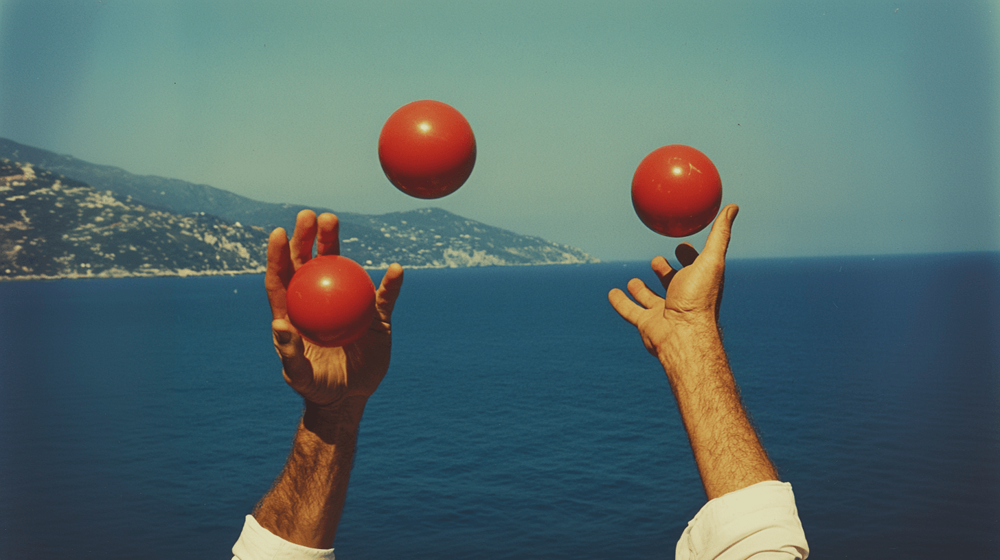

---
hide:
  - navigation
  - toc
  - feedback
template: index.html
search:
  exclude: true
---

<head>
  <meta charset="UTF-8">
  <meta name="viewport" content="width=device-width, initial-scale=1.0">
  
  <!-- Primary Meta Tags -->
  <meta name="title" content="Writing Portfolio - Teddy Warner">
  <meta name="description" content="A conglomerate of my thoughts and essays.">
  <meta name="keywords" content="Engineering essays, Technical writing, Philosophy analysis, Neuroscience writing, Personal development, Engineering blog, Technical analysis, Engineering philosophy, Learning experiences, Engineering insights, Personal growth, Technical documentation, Engineering perspective, Design thinking, Innovation writing">
  <meta name="author" content="Teddy Warner">
  <meta name="robots" content="index, follow">
  
  <!-- Open Graph / Facebook -->
  <meta property="og:type" content="website">
  <meta property="og:url" content="https://teddywarner.org/writ/">
  <meta property="og:title" content="Writing Portfolio - Teddy Warner">
  <meta property="og:description" content="A conglomerate of my thoughts and essays.">
  <meta property="og:image" content="https://teddywarner.org/assets/images/thumb.png">
  <meta property="og:image:type" content="image/png">
  <meta property="og:image:width" content="1200">
  <meta property="og:image:height" content="630">

  <!-- Twitter -->
  <meta property="twitter:card" content="summary_large_image">
  <meta property="twitter:url" content="https://teddywarner.org/writ/">
  <meta property="twitter:title" content="Writing Portfolio - Teddy Warner">
  <meta property="twitter:description" content="A conglomerate of my thoughts and essays.">
  <meta property="twitter:image" content="https://teddywarner.org/assets/images/thumb.png">

  <!-- Existing resource links -->
  
  <link rel="preconnect" href="https://fonts.googleapis.com">
  <link rel="preconnect" href="https://fonts.gstatic.com" crossorigin>
  <link href="https://fonts.googleapis.com/css2?family=Crimson+Pro:ital,wght@0,200..900;1,200..900&display=swap" rel="stylesheet">
  <link href="https://fonts.googleapis.com/css2?family=Crimson+Pro:ital,wght@0,200..900;1,200..900&family=JetBrains+Mono:ital,wght@0,100..800;1,100..800&display=swap" rel="stylesheet">
  <link rel="stylesheet" href="../assets/css/proj.css">
</head>

  <nav class="main-navigation">
    <ul>
      <li><a class="home" href="https://teddywarner.com">01 Home</a></li>
      <li><a class="proj" href="https://teddywarner.com/proj/">02 Projects</a></li>
      <li><a class="writ" href="https://teddywarner.com/writ/">03 Writing</a></li>
    </ul>
  </nav>

<body>
  <main data-scroll-container>
  

    <section class="intro-section">
      

        

          <h2>My Writings</h2>
          <h3>A conglomerate of thoughts and essays.</h3>
        

      

    </section>
    <section class="writing">
      

        

          <a href="https://teddywarner.org/writings/downforce">
            

            
To Drive with Downforce

            
2024

            
            
~2 mins

            
            
Addressing the confidence bottleneck.

          </a>
        

        

        

          <a href="https://teddywarner.org/writings/juggling">
            

            
Learning to Juggle

            
2024

            
            
5-7 mins

            
            
A journey to lessen doom-scrolling.

          </a>
        

        

        

          <a href="https://teddywarner.org/writings/a-mutual-meaning">
            

            
A Mutual Meaning

            
2024

            
            
7-11 mins

            
            
Discovering Eastern philosophy.

          </a>
        

        

        

          <a href="https://teddywarner.org/writings/otherness-and-belonging/">
            

            
Otherness and Belonging

            
2024

            
            
4-6 mins

            
            
Some notes on neuroscience.

          </a>
        

        

        

          <a href="https://teddywarner.org/writings/torpediniformes">
            

            
Torpediniformes

            
2022

            
            
3-5 mins

            
            
An analysis of The Meno.

          </a>
        

      

    </section>
    <section class="footer">
      

        

          <a target=”_blank” href="https://github.com/Twarner491">
            <i class="fa-brands fa-github"></i>
          </a>
        

        

          <a target=”_blank” href="https://x.com/WarnerTeddy">
            <i class="fa-brands fa-twitter"></i>
          </a>
        

        

          <a target=”_blank” href="mailto:tawarner@usc.edu">
            <i class="fa-solid fa-paper-plane"></i>
          </a>
        

        <a target=”_blank” href="https://github.com/Twarner491/TeddyWarner.org/blob/main/LICENSE">
          
Copyright © 2024 Teddy Warner

        </a>
    </section>
    <h1></h1>
  

  </main>
  
  
</body>
</html>
