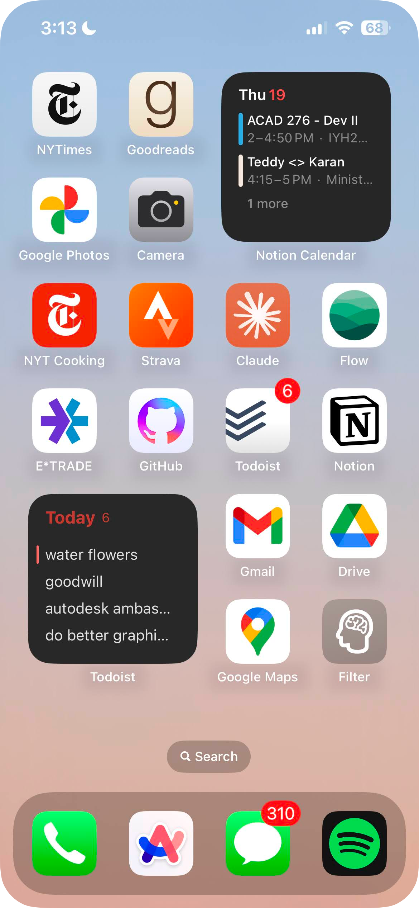

This semester I've found myself in quite an interesting class at the USC Marshall School of Business: *BAEP 472 - The Science of Peak Performance*.

The course was written by [Dr. Glenn Fox](https://glennrfox.com/) and [Coach Pete Caroll](https://www.petecarroll.com/), and its aspiration is rather straightforward, it seeks to equip students with a science-based approach to productivity (and every other facet of life).

On the first day of class, as we discussed the structure of the weekly lecture, and notably, how we would have a 15-minute break in the middle of each lecture, Dr. Fox told us a story.

Eight years ago, when he had first sat down with Pete to flush out BAEP 472, they had a debate over this quote on quote "break". While both agreed it would be antithetical to a class on peak performance to simply allow students to rot on their phones, Pete, being a football coach, was a proponent of mandated physical activity. 

While theoretically, a few burpees in the middle of my business lecture may actually be quite the welcome change of pace, Dr. Fox stood by the fact that he couldn't have a bunch of USC students getting sweaty in his classroom. 

The two went back and forth on this issue for a while, toying with different exercises and approaches, until finally, it hit them: *they would teach all the students how to juggle*.

Every semester for the past 8 years BAEP 472 has been a filled class, partly because students are interested in the neuroscience behind enhancing productivity, yet more probably because students want to take the juggling class.

So here it is, the blog post where I'll be documenting my journey learning to juggle (at the moment I'm just getting the hang of two balls lol), as well as discussing a few more tricks I use to spend less time on my phone:

### Within Thumb's Reach

The easiest way to eradicate temptation to doom-scroll is to follow the "out of sight, out of mind" mantra - and this principle's inverse works as well. 

*Place healthy apps within your thumbs reach.* By doing so, you increase the likelihood of future you opening those apps in an attempt to doom-scroll, get bored, and shutting off your phone. Nathaniel from [Practical Betterments](https://practicalbetterments.com/) has a few good "plausible scenarios" for placing healthy apps within reach:

> - The weather app reminds you to go outside and water the plants — you do and the fresh air is invigorating.
> - The calendar app has a blank space you fill with a meaningful real-life event — say a meeting with an old friend or a pub quiz.
> - Your flashcard app helps you learn trivia that wins you first place in a pub quiz, impressing everyone, including a stranger, who despite your normal-sized thumbs, learns to love you for who you are.

<figure markdown="1" style="opacity:85%;">

 {width="50%" alt="Healthy apps placed within thumb's reach on iPhone home screen in light theme"}
 {width="50%" alt="Healthy apps placed within thumb's reach on iPhone home screen in dark theme"}

</figure>

Sometimes just tempting yourself with a healthy option isn't sufficient, however. If you have a truly toxic, doom-scrolling relationship with an app, delete it! I frequently try to dream up potential future use cases for apps that I don't want to delete. You can fight this by simply realizing that you can always reinstall the app as needed (yet usually once it's gone, the urge to scroll disappears).

### Even Lower Phone Brightness

The "minimum" brightness on you're phone is actually still quite bright. 

Bright enough that even when on the lowest possible brightness melatonin suppression and circadian rhythm disruption occur. 

This is because manufacturers optimize their screens to be visible in broad daylight, and thus even with night mode enabled, the minimum brightness is too bright for a dark room. 

<h4>How to lower your brightness below the "minimum" on iPhone</h4>

On iOS will be enabling an Accessibility feature: `Reduce White Point`.

Here's how:

1. Open Settings
2. Navigate to `Accessibility`
3. Navigate to `Accessibility Shortcut`
4. Select `Reduce White Point`

To activate this shortcut simply triple-click the power button.

<h4>How to lower your brightness below the "minimum" on Android</h4>

On Android phones, this feature is called `Extra dim`.

1. Open Settings
2. Navigate to `Accessibility`
3. Toggle on `Extra dim` under the `Display` section

To activate, swipe down twice from the top of the screen and turn `Extra dim` on.

### Grey-tinted Spectacles

Taking things a step further, you can rid your phone of all of those addicting colors with a greyscale `Color Filter`.

To do so open settings and navigate to `Accessibility` -> `Display & Text Size`, then:

1. Select `Color Filters`
2. Toggle on `Color Filters`
3. Select `Greyscale`

<figure markdown="1">

 {width="30%" alt="iPhone screen showing normal color display" align="left"}
 {width="30%" alt="iPhone screen showing greyscale color filter applied" align="left"}

</figure>

<h4>Making a greyscale filter shortcut</h4>

While I've found this to be the single most productive trick in eradicating the desire to stare blankly into the abyss (my phone screen), I do occasionally like to indulge, and thus have set up a shortcut on my home screen for easy toggling.

You can create a greyscale filter shortcut of your own in the iOS Shortcuts app. 

First, open the app and tap the plus icon in the top right corner, then:

1. Select `Add Action`
2. Search for `Set Color Filters`
3. Select `Turn color filters On`
4. Click on `Turn` and select `Toggle`

After clicking done, you've set up your shortcut! You can now add it to your home screen for easy access, or even set it to run automatically each day. 

[^1]: https://www.reddit.com/r/AndroidQuestions/comments/czwzwp/why_is_android_minimum_brightness_so_high/
[^2]:https://www.ncbi.nlm.nih.gov/pmc/articles/PMC5839336/
[^3]:https://cemind.org/blog/screen-brightness-and-how-it-negatively-impacts-your-sleep/
[^4]:https://www.csl.sri.com/users/jha/papers/cases15.pdf
[^5]:https://practicalbetterments.com/create-a-shortcut-for-even-lower-phone-brightness\
[^6]:https://practicalbetterments.com/place-healthy-apps-within-thumbs-reach/
[^7]:https://www.calm.com/blog/screen-time-before-bed
[^8]:https://www.health.harvard.edu/staying-healthy/blue-light-has-a-dark-side
[^9]:https://www.popularmechanics.com/technology/gadgets/how-to/a9340/how-to-fix-your-phones-brightness-settings-15839497/
