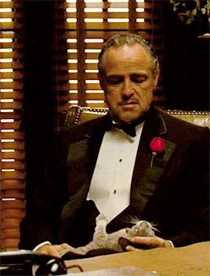

<link rel="stylesheet" href="../../assets/css/messages.css">

  

    

      

        
Yo, we'd love for you to be [REDACTED]'s Godfather.

        
4:50 PM

      

      
Barrett

    

    
    

      

        
it confers great benefits like, being able to speak in a raspy voice.

        
4:50 PM

      

      
Barrett

    

    
    

      

        
that would be on honor

        
4:51 PM

      

      
Teddy

    

  

---

I was raised Catholic, as was my mom. My dad converted to Catholicism when I was young, and faith was always present in our household. I attended Catholic school in my youth - though this was partly practical (Catholic schools in Chicago let you start kindergarten a year early, perfect for my working professional parents).

The Catholic education system in Chicago was wonderful—full of smart people looking to thoughtfully engage with their faith. I never questioned my faith in my childhood. It was what I knew, and I embraced it fully, serving as an altar boy for several years.

In 2016, my family moved to North Carolina for my dad's work. I was just starting middle school.

My mom wanted to keep my siblings and me in Catholic school, so I started sixth grade at a large Catholic middle school. I found my new school dismally easy and started coasting. More troubling, I hadn't found the same thoughtful engagement with faith; instead, I found what I would call "culturally Catholic" (we go to church, we do the things, because this is what we are told to do).

Maybe it was this new Catholic culture, or maybe just my entry into the teenage years, but I started to question a lot.

For a while, I acted as though I were too "cool" for Catholicism. While I kept up my practice - attended weekly mass, got confirmed - I also stopped singing, started picking flaws with any homily I could, and sought logical inconsistencies in the church with a fine-tooth comb. My practices had fallen to the level of "cultural Catholicism," while all my thoughtful engagement turned to "debunking" the faith I was brought up in.

Fortunately, I'm certainly not the first Catholic to experience this.

I changed schools in eighth grade, transferring to a secular private school that was much more intellectually engaging. I started research and writing, eventually finding all my free time outside school (and sometimes when I really should have been studying) taken up by whatever my latest project was. I finally had a proper outlet for "thoughtful engagement," though my participation and attitude towards faith had been quite tarnished.

Outside of my projects, I became fascinated by philosophy, and eventually, found myself in a philosophy class my senior year of high school. I held the [Classics](https://theodore.net/writings/torpediniformes/) in high reverence, alongside my contemporary favorites: Niezche and Dostoevsky. Yet when we took on Catholic philosophy and even secular attempts at "proving" the faith (ahem ... Descartes), I took up my old search for logical inconsistencies (with a much greater rigor than any other era/domain we covered in the class). 

One of the quams of attending a secular school is that this appears to be the norm. The brightest young, often left-leaning, high school minds want to rebel against institution and prove their intellectual prowess, and there is no target more apt than the Catholic church. I fell into this bucket of students, desperately wanting to free myself from any intellectual "prerequisites" that had been "thrust" upon me, and with no one willing to take the other side, I ruthlessly kept picking for logical inconsistencies. 

I ended my high school career with a focus on Eastern philosophy. Thich Nhat Hanh's *The Other Shore* was a particular favorite of mine (see: [A Mutual Meaning](https://theodore.net/writings/a-mutual-meaning/)), as I found it provided a sense of peace and resolution to many outstanding questions: What matters? What am I to do with my life? (both of which felt particarly pressing as I ended my time in high school - see: [On Turning Twenty](https://theodore.net/writings/on-turning-twenty/)) I've always had a laissez-faire nature, and rarely get too worked up about decisions, and found this eastern philosophy to be a really nice confirmation that this is, in fact, a sane way to live.

I think it was through my acceptance of this eastern philosophy (initially through an entirely secular lens) that I finally allowed my faith to slowly creep back into my life. 

I moved to California after high school and had a brief stint at university before moving to the Bay Area to work and research full-time. As I lived and grew on the cutting edge, I began to realize how woefully naive I had been.

When I first experienced "cultural Catholicism," my ego rose to a place where I felt all the knowledge I'd amassed was somehow too substantial, too worthy, to bother thoughtfully engaging with Faith any longer. As it turns out, we know extraordinarily little about the world and our reality. The atheist argument falls apart when you consider the scientific vanguard! There's so much we don't know, and more notably, so much where logic and science fall short.

Take, for instance, what happened before the Big Bang? Or what lies beyond the observable universe? How does subjective experience arise from neural computation? What determines the boundary between conscious and non-conscious systems? What determines emergent behaviors and phase transitions? What is the relationship between mathematical objects and physical reality? How do we handle infinite regressions in causal explanations? 

The list goes on.

> The first gulp from the glass of natural sciences will turn you into an atheist, but at the bottom of the glass God is waiting for you.
>
> *-- Werner Heisenberg*

When I sat down to record a video for my application to the [Thiel Fellowship](https://thielfellowship.org) in late January this year, I read this quote from one of my favorite German physicists. I think it's the most eloquent summary of my adolescent Catholic experience.

One may place themselves, their intellect, in higher regard than faith as a whole (this is quite easy to justify when you have no one to thoughtfully engage your faith with!), and this will drive you mad. Man simply doesn't know the world well enough to justify or debunk the faith, and as such, we cannot view this as a logical problem (nor a tool for bright high school students to prove their intellectual independence).

Rather, we must simply believe.

> **John 20:24-29**
>
> **24** Now Thomas, called the Twin, one of the twelve, was not with them when Jesus came. **25** The other disciples therefore said to him, "We have seen the Lord."
>
> So he said to them, "Unless I see in His hands the print of the nails, and put my finger into the print of the nails, and put my hand into His side, I will not believe."
>
> **26** And after eight days His disciples were again inside, and Thomas with them. Jesus came, the doors being shut, and stood in the midst, and said, "Peace to you!" **27** Then He said to Thomas, "Reach your finger here, and look at My hands; and reach your hand *here*, and put *it* into My side. Do not be unbelieving, but believing."
>
> **28** And Thomas answered and said to Him, "My Lord and my God!"
>
> **29** Jesus said to him, "Thomas, because you have seen Me, you have believed. Blessed *are* those who have not seen and *yet* have believed."

### No Man's Land

I propose one may think of the dynamics of faith and science as a trenched battlefield from the top down (this is more of a visual metaphor, not meant to imply a necessary conflict between faith and science). Both faith and science have many entrenched positions: Science predicts natural phenomena, explains our perceptions, and maps measurable cause-and-effect relationships, while Faith provides existential meaning, moral frameworks, and addresses questions of ultimate purpose and transcendence.

<figure markdown="1" style="opacity:95%;">

 {width="40%" alt="Diagram showing faith/science battlefield"}
 {width="40%" alt="Diagram showing faith/science battlefield"}

</figure>

These two fronts can (theoretically) exist in beautiful harmony. The space between them - a no man's land of sorts - remains particularly interesting. It is this no man's land that becomes an origin of doubt for many. If there's a true unknown, one not understood through faith nor science, it seems natural for the human mind to imagine how we could discover and justify that thing rationally (which is, in fact, the essence of science).

Yet even if we could successfully discover and justify every unknown within this no man's land, there would still be the trench of faith. This is because, as discussed earlier, there's a line at which science and secular logic fall short (most notably on the vanguard). Gödel was our living proof of this.

More likely, however, we can clear the fog of this no man's land through the progression of both fronts: the thoughtful engagement of both faith and science. This would certainly yield the most rewarding understanding of ourselves, our duty, and our place in the cosmos.

### The Way to Love

In preperation for the Baptism, I've been reading the last meditations of Father Anthony De Mello: *The Way to Love*. A few of my favorite thoughts thus far:

Many people deceive themselves into unhappiness, but there is never a moment when you don’t have everything you need to be happy. Happiness is quite literally the most intrinsic experience there is.

Our society (particularly Silicon Valley - where I live) has an unbelievably misconceived concept of happiness, and it usually follows the lines of “if I achieve [insert greatness/success/fame/etc. ], then I will be happy”. These things may bring momentary joy, but certainly not happiness. This “path to happiness” is so commonly held that it never occurs to most to question it! 

How many genuinely happy people do you know? probably very few (if you’re lucky), so clearly our current perception of what leads us to happiness is wrong.

People are so brainwashed by this false “path to happiness” that they don’t even realize how unhappy they are. This is particularly harmful as it’s counterproductive to their cognitive outputs! The odds of a person achieving their extrinsic goals of greatness/success/fame/etc. are decreased significantly when they lack true intrinsic support (of comfort with oneself and happiness)

The reason we are unhappy is that we are focusing on what we don’t have (or what we “aspire to” if we want to use nicer terms). Many souls that were subjected to the most terribly evil experiences in human existence (concentration camps, apartheid, etc.) were documented as holding an enduring happiness, even in the face of these extrinsic atrocities.

And you mean to tell me we can’t be happy to?

---

  

    

      

        
Ill have to buy a cat which i can slowly pet during all of my meetings

        
4:51 PM

      

      
Teddy

    

    

      

        

          
        

        
4:52 PM

      

      
Teddy

    

    
    

      

        
but seriously this is awesome

        
4:52 PM

      

      
Teddy

    

  

