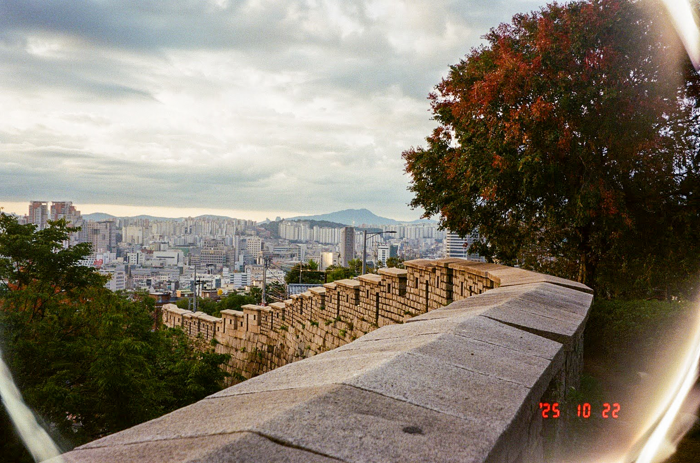

Do others contemplate the sunrise the same as I?

The smartest minds I know claim to be locked in their thoughts. Almost always unable to perceive the world as it's happening, and rather, forced to analyze it critically in hindsight.

But does anyone else think like I? Critically, sure. Abstractly, sure. But almost always tethered to my current experience?

I seem to be generally unable to abstract beyond this. Entering some cognitive state where I'm blissfully ignorant of my senses and the world around me, purely focused on the thought at hand.

Rather, my anstrated thought is almost always one of self-perspection. I think about thinking about the world, if you will. My ability to be purely devoted to any given thought is thus hindered by the perception of myself having that thought in the first place. I'm often so hyperaware of having thoughts, I find it difficult to purely devote myself to the thoughts themselves.

I think some would describe this blissfully ignorant cognitive purity as the flow state (Csikszentmihalyi). The result of slowly stripping away all outer layers is to be left with pure thought. Yet have most of the brightest thinkers actually refined this practice? 

I think not (or at least this would come as a significant surprise). The question remains: does anyone else think like I?

---

I had a moment of clarity after finishing this piece. I wrote this while sitting atop the Seoul Wall and was certainly favoring my blissfully ignorant thoughts rather than my beautiful surroundings. Clearly, I enter this 'flow state' on occasion, and most notably, this seems to be only possible when I'm not trying to. So take this all with a grain of salt.

<figure markdown="1" style="opacity:90%;">

 {width="70%" alt="A Seoul Wall Sunrise"}

</figure>
